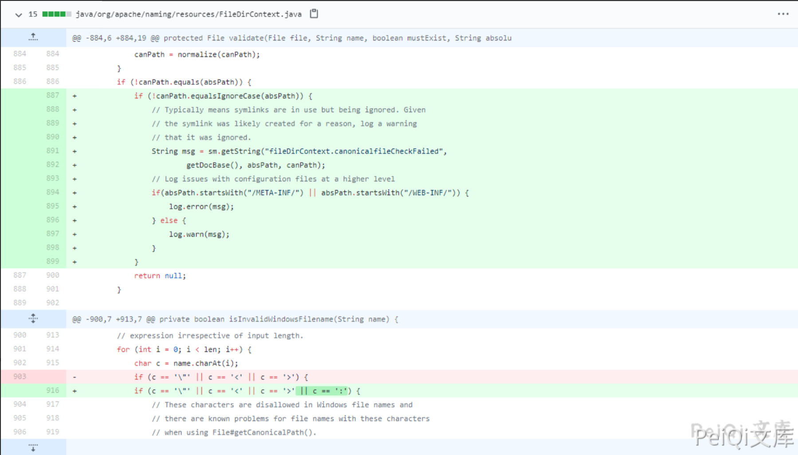

# Apache Tomcat 信息泄露漏洞 CVE-2021-24122

<!-- vulwiki-editorial:start -->
## 校订与适用边界

- 适用前提：Windows NTFS网络位置提供资源、特定配置；列7/8.5/9/10分支范围
- 证据范围：作者明确复现未完善；下半通用canonicalPath文档不能独立说明该漏洞根因。

### 尚未解决的证据缺口

以下限制仍适用于后文历史材料；相关版本、结果或修复结论不能据此视为已验证：

- 开头网络位置条件关键，后文泛化任何NTFS应纠正
- 末句把UNIX软链接解析说成根因，与Windows FindFirstFileW网络位置行为矛盾
- 只有补丁截图和API概念，无实际请求/结果；应标研究未完成
- 缺原始公告/提交及具体修复版本

本页为文本校订，未执行代码、PoC 或目标请求；原图仅保留引用，未据此确认复现成功。
<!-- vulwiki-editorial:end -->

## 技术正文与历史材料

## 漏洞描述

使用NTFS文件系统从网络位置提供资源时，Apache Tomcat版本10.0.0-M1至10.0.0-M9、9.0.0.0.M1至9.0.39、8.5.0至8.5.59和7.0.0至7.0.106在某些配置中容易受到JSP源代码公开的影响。根本原因是JRE API File.getCanonicalPath（）的意外行为，这又是由Windows API（FindFirstFileW）在某些情况下的不一致行为引起的。

## 漏洞影响

```
Apache Tomcat 10.0.0-M1-10.0.0-M9
Apache Tomcat 9.0.0.M1-9.0.39
Apache Tomcat 8.5.0-8.5.59
Apache Tomcat 7.0.0-7.0.106
```

## 漏洞复现

**目前漏洞复现暂未完善**

更新补丁如下



据官方描述，该漏洞由于Windows API（FindFirstFileW）与JRE API File.getCanonicalPath的一些意外行为所导致。当使用NTFS文件系统时，可以绕过一些安全限制，最终可导致如查看某些配置中JSP的源代码等危害。

而补丁修复了 出现  **:**  的部分

```plain
getCanonicalPath()

此路径方法返回绝对唯一的标准规范路径名。此方法首先将此路径名转换为绝对形式，就像调用getAbsolutePath方法一样，然后以系统相关的方式将其映射到其唯一路径上。
也就是说如果路径中包含“.”或“..”等当前路径及上层路径表示法，则会从路径名中删除“.”和“..”使用真实路径代替。另外比较重点的是 它还会解析软链接（在UNIX平台上）以及将驱动器号（在Microsoft Windows平台上），将它们转换为标准实际路径。
```

而 **getCanonicalPath()** 解析了软链接转换为实际路径导致漏洞的产生


---

> 来源：Threekiii/Awesome-POC
