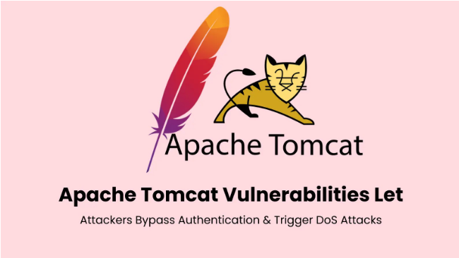

# Apache Tomcat 漏洞允许绕过身份验证和 DoS 攻击

<!-- vulwiki-editorial:start -->
## 校订与适用边界

- 适用前提：两DoS需multipart处理；49124需本地可写搜索路径并运行Windows安装器；49125非根Web挂载资源/约束路径
- 证据范围：四种条件不同，不应统一说所有Tomcat实例任意远程利用；限制参数和首次修复版本是历史公告摘要。

### 已有来源支持的更正

- 官方逐项核对9.x范围、报告/公开日期、49124 Low和非根挂载边界

### 尚未解决的证据缺口

以下限制仍适用于后文历史材料；相关版本、结果或修复结论不能据此视为已验证：

- 四个主CVE均漏frontmatter，0796无关
- Mark Thomas于6月16日报告所有问题不准确，官方报告日期分别5月16/30，6月16为公开日期
- 49124官方Low且9.x从9.0.23起，不能与其余版本统一；是本地安装旁加载不是远程认证绕过
- 49125为挂载点非Web根目录，不等于资源物理文件必然在Web应用根之外
- 百万应用受影响无测量来源；每部分内存估算只是示意而非测得漏洞效果
- maxPartCount10与512字节为当次默认，非当前所有版本固定默认；需标日期

### 核验来源

- https://tomcat.apache.org/security-9.html?force_isolation=true

### 操作风险与资料使用

- 含资源消耗、延时或崩溃验证：可能影响服务可用性；限制请求次数、并发与超时，保留无攻击负载的对照结果。

本页为文本校订，未执行代码、PoC 或目标请求；原图仅保留引用，未据此确认复现成功。
<!-- vulwiki-editorial:end -->

## 技术正文与历史材料

邑安科技  邑安全   2025-06-17 09:20  
  
更多全球网络安全资讯尽在邑安全  
  
  
  
影响 Apache Tomcat Web 服务器的多个严重安全漏洞，包括两个支持拒绝服务 （DoS） 攻击的高严重性漏洞和一个允许绕过身份验证的中等严重性漏洞。  
  
这些漏洞被确定为 CVE-2025-48976、CVE-2025-48988、CVE-2025-49124 和 CVE-2025-49125，影响了全球数百万个在受影响的 Tomcat 版本（从 9.0.x 到 11.0.x 系列）上运行的 Web 应用程序。  
  
安全研究员 Mark Thomas 于 2025 年 6 月 16 日报告了这些漏洞，并立即在所有受影响的版本分支中提供补丁。  
  
CVE-2025-48976：通过多部分标头利用导致内存耗尽  
  
CVE-2025-48976 漏洞源于 Apache Commons FileUpload 中修复的内存分配限制，这是 Tomcat 分段请求处理不可或缺的组件。  
  
在修补之前，该库对多部分请求中的单个部分标头强制实施了 10kB 的硬编码限制。攻击者可以制作包含大量 Headers 接近此限制的 Chunk 的请求，迫使 Tomcat 分配与Portion 数量成正比的过多内存。  
  
例如，包含 1000 个部分的请求将消耗大约 10MB 的内存，仅用于标头，这可能会触发内存不足错误和服务中断。  
  
受影响的版本包括 Tomcat 9.0.0.M1–9.0.105、10.1.0-M1–10.1.41 和 11.0.0-M1–11.0.7。  
  
CVE-2025-48988：分段上传资源耗尽  
  
CVE-2025-48988 利用了 Tomcat 在实施大小限制时未能区分请求参数和多部分部分的问题。  
  
与标准参数不同，multipart 部分包括在整个请求处理过程中保留在内存中的标头。  
  
攻击者可以发送具有高部分数（例如 10,000 个部分）的请求，每个请求具有最少的有效负载，但标头消耗 ~500 字节。这将为每个请求分配 ~5MB，从而实现快速内存耗尽。  
  
Tomcat 对并发连接的默认处理使漏洞的严重性更加复杂，允许攻击者通过并行请求放大影响。  
  
CVE-2025-49124：Windows 安装程序旁加载风险  
  
CVE-2025-49124 针对 Tomcat Windows 安装程序对 icacls.exe 的不安全调用， 是一个用于修改访问控制列表 （ACL） 的实用程序。  
  
通过省略 C：\Windows\System32\icacls.exe 的完整路径，安装程序将容易受到 PATH 环境变量作的攻击。对 PATH 中较早的目录具有写入权限的攻击者可以放置恶意icacls.exe，安装程序将在 Tomcat 安装期间执行该。  
  
此权限提升向量可能启用未经授权的服务配置更改或持久性机制。  
  
CVE-2025-49125：资源挂载中的安全约束绕过  
  
CVE-2025-49125 漏洞允许攻击者绕过对在 Web 应用程序根目录之外配置的 PreResources 和 PostResources 的身份验证和授权控制。  
  
此问题的源于 Tomcat 在应用安全策略之前未能规范化资源路径，从而启用了 URL纵攻击。  
  
需要立即修补  
  
组织必须优先考虑立即更新以解决这些漏洞。Apache Software Foundation 已在所有受影响的版本分支中发布了补丁：Apache Tomcat 11.0.8、Apache Tomcat 10.1.42 和 Apache Tomcat 9.0.106。  
  
这些更新引入了可配置的限制，包括 Connector 配置上的 maxPartHeaderSize（默认 512 字节）和 maxPartCount（默认 10 个部分）参数。  
  
系统管理员应验证其 Tomcat 安装并对 server.xml 文件实施配置更改，特别是调整 Connector 参数以防止资源耗尽攻击，同时保持应用程序功能。  
  
原文来自: cybersecuritynews.com  
  
原文链接:   
https://cybersecuritynews.com/apache-tomcat-vulnerabilities/  
  
欢迎收藏并分享朋友圈，让五邑人网络更安全  
  
  
  
欢迎扫描关注我们，及时了解最新安全动态、学习最潮流的安全姿势！  
  
推荐文章  
  
1  
  
[新永恒之蓝？微软SMBv3高危漏洞（CVE-2020-0796）分析复现](http://mp.weixin.qq.com/s?__biz=MzUyMzczNzUyNQ==&mid=2247488913&idx=1&sn=acbf595a4a80dcaba647c7a32fe5e06b&chksm=fa39554bcd4edc5dc90019f33746404ab7593dd9d90109b1076a4a73f2be0cb6fa90e8743b50&scene=21#wechat_redirect)  
  
  
2  
  
[重大漏洞预警：ubuntu最新版本存在本地提权漏洞（已有EXP）　](http://mp.weixin.qq.com/s?__biz=MzUyMzczNzUyNQ==&mid=2247483652&idx=1&sn=b2f2ec90db499e23cfa252e9ee743265&chksm=fa3941decd4ec8c83a268c3480c354a621d515262bcbb5f35e1a2dde8c828bdc7b9011cb5072&scene=21#wechat_redirect)  
  
  
  
  
  

---

> 来源：gelusus/wxvl（微信公众号漏洞文章自动归档，原文见文首链接）
