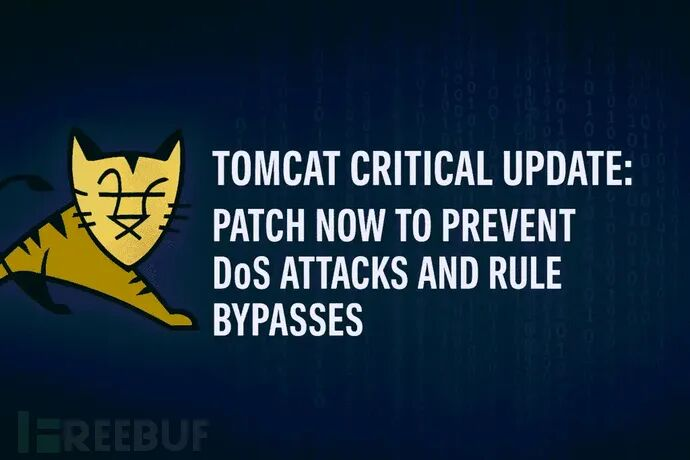
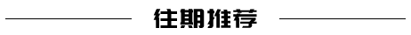
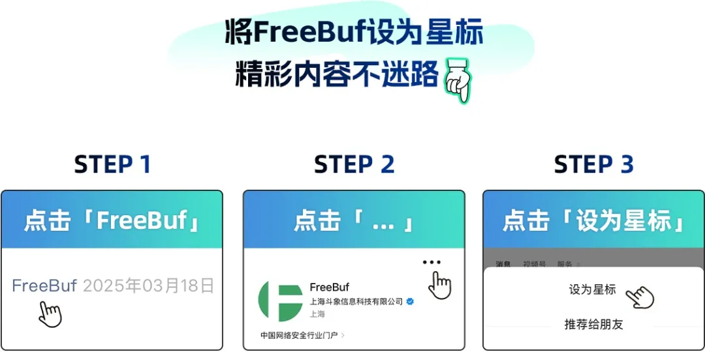

# Apache Tomcat安全更新：修复拒绝服务与重写规则绕过漏洞

<!-- vulwiki-editorial:start -->
## 校订与适用边界

- 适用前提：31650特定HTTP优先级处理路径；31651不常见重写配置且用于安全约束，两者范围不同
- 证据范围：分别列分支范围和修复、9.0.103未发布需9.0.104的细节值得保留，无复现。

### 尚未解决的证据缺口

以下限制仍适用于后文历史材料；相关版本、结果或修复结论不能据此视为已验证：

- 两个主CVE漏frontmatter
- HTTP优先级具体协议/HTTP2配置应补，不能当任意HTTP头均受影响
- Java内存错误通常OutOfMemoryError，文中OutOfMemoryException需核实精确名称
- 缺官方公告/提交及特殊rewrite规则边界，不能声称普遍鉴权绕过
- 历史最低修复版本应有发布日期，不称当前最新；推广与空行可清理

### 操作风险与资料使用

- 含资源消耗、延时或崩溃验证：可能影响服务可用性；限制请求次数、并发与超时，保留无攻击负载的对照结果。

本页为文本校订，未执行代码、PoC 或目标请求；原图仅保留引用，未据此确认复现成功。
<!-- vulwiki-editorial:end -->

## 技术正文与历史材料

 FreeBuf   2025-04-29 10:09  
  
  
  
  
Apache 软件基金会发布了重要安全更新，修复了广泛使用的开源 Java Servlet 容器 Apache Tomcat 多个版本中存在的两个漏洞。这两个漏洞编号为 CVE-2025-31650 和 CVE-2025-31651，若不及时修补，可能导致拒绝服务状态和安全规则绕过。  
  
  
  
  
  
**01**  
  
  
  
**CVE-2025-31650**  
  
  
被评定为高危级别的 CVE-2025-31650 涉及处理无效 HTTP 优先级标头时的错误处理不当问题。根据安全公告，"某些无效 HTTP 优先级标头的错误处理导致失败请求的清理不完整，从而造成内存泄漏"。随着时间的推移，大量此类畸形请求**可能触发OutOfMemoryException**，最终导致**拒绝服务(DoS)。**  
  
  
受影响版本包括：  
- Apache Tomcat 11.0.0-M2 至 11.0.5  
  
- Apache Tomcat 10.1.10 至 10.1.39  
  
- Apache Tomcat 9.0.76 至 9.0.102  
  
建议用户升级至以下版本以降低风险：  
- Apache Tomcat 11.0.6 或更高版本  
  
- Apache Tomcat 10.1.40 或更高版本  
  
- Apache Tomcat 9.0.104 或更高版本  
  
值得注意的是，修复最初包含在 Apache Tomcat 9.0.103 中，但公告指出"9.0.103 候选版本的发布投票未通过"。因此，用户必须直接升级到 9.0.104 或更高版本才能获得官方修复。  
  
  
**02**  
  
  
  
**CVE-2025-31651**  
  
  
第二个漏洞 CVE-2025-31651 被评定为低危级别，但在特定配置下仍存在安全风险。该漏洞影响部分不太可能的重写规则设置，其中"精心构造的请求可能绕过某些重写规则"。如果这些重写规则对强制执行安全约束至关重要，此漏洞可能允许攻击者绕过这些保护措施。  
  
  
受影响版本包括：  
- Apache Tomcat 11.0.0-M1 至 11.0.5  
  
- Apache Tomcat 10.1.0-M1 至 10.1.39  
  
- Apache Tomcat 9.0.0.M1 至 9.0.102  
  
与 CVE-2025-31650 类似，用户应升级至：  
- Apache Tomcat 11.0.6 或更高版本  
  
- Apache Tomcat 10.1.40 或更高版本  
  
- Apache Tomcat 9.0.104 或更高版本  
  
公告同样指出，虽然 9.0.103 版本中实现了修复，但"9.0.103 候选版本的发布投票未通过"。用户必须直接升级到 9.0.104 或更高版本。  
  
  
  
  
  
  
  
  
  
  
  
  
  
  
  
  
  
  
  
  
  
  
  
  
  
  
  
  
  
  
  
  
  
  
  
  
  
  
  
  

---

> 来源：gelusus/wxvl（微信公众号漏洞文章自动归档，原文见文首链接）
