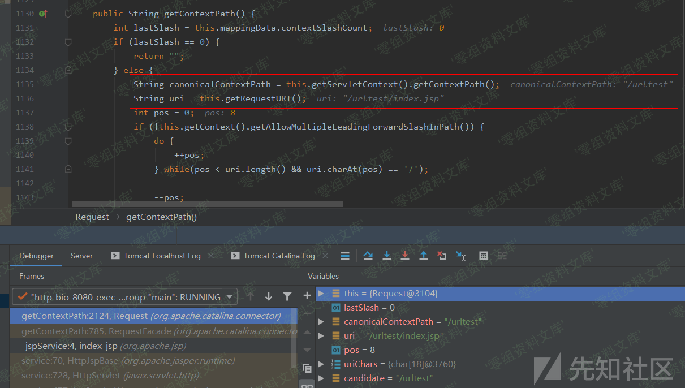
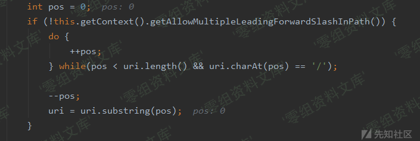
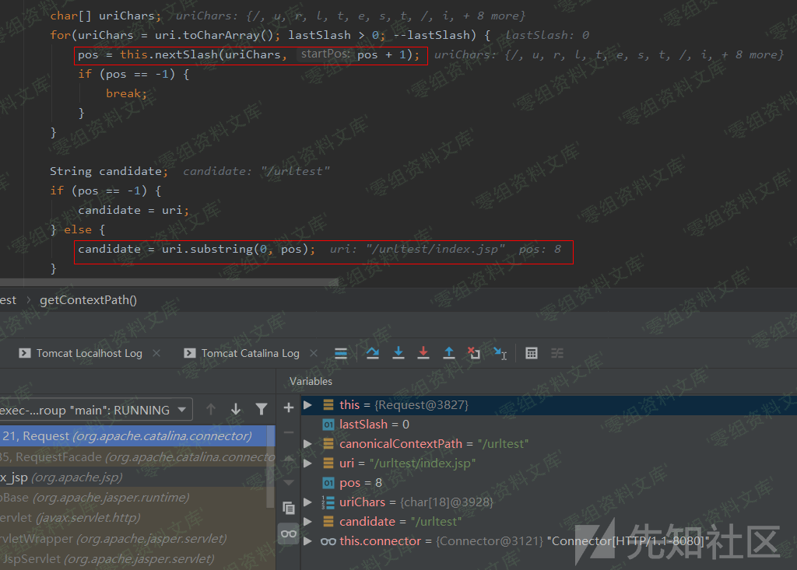
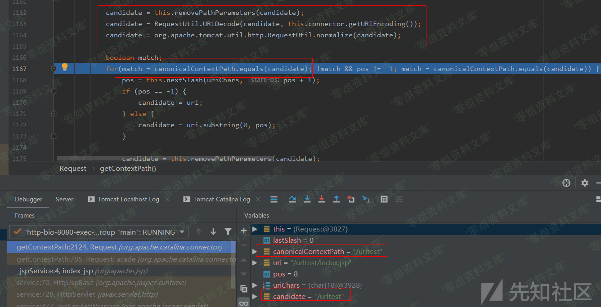
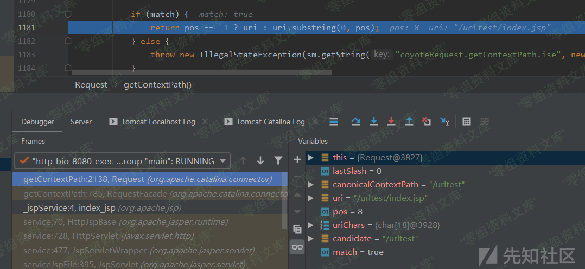

# Tomcat getContextPath()的处理

<!-- vulwiki-editorial:start -->
## 校订与适用边界

- 证据范围：讲getContextPath结合规范context与原始URI计算返回位置，是315的机制配套，不独立漏洞。

### 尚未解决的证据缺口

以下限制仍适用于后文历史材料；相关版本、结果或修复结论不能据此视为已验证：

- 全部截图引用后残留重复的处理/media/rIdXX.png)字符串
- removePathParameters处理分号参数与后续normalize处理点段的作用混写为前者处理分号和点，源码只在图片中，需核对
- 缺代码文本、具体Tomcat版本、原文与上下文

本页为文本校订，未执行代码、PoC 或目标请求；原图仅保留引用，未据此确认复现成功。
<!-- vulwiki-editorial:end -->

## 技术正文与历史材料

### Tomcat getContextPath()的处理

在getContextPath()函数中，调用了Request.getContextPath()函数：

的处理/media/rId21.png)

跟进该函数，先是调用getServletContext().getContextPath()来获取当前Servlet上下文路径以及调用getRequestURI()函数获取当前请求的目录路径：

的处理/media/rId22.png)

往下的这段循环是处理uri变量值中如果存在多个连续的`/`则删除掉：

的处理/media/rId23.png)

再往下，获取下一个`/`符号的位置，然后根据该位置索引对uri变量值进行工程名的切分提取：

的处理/media/rId24.png)

接着，就是对刚刚切分得到的candidate变量进行和Tomcat一样的特殊字符处理过程，先调用removePathParameters()处理`;`和`.`，然后进行URL解码，再调用normalize()函数进行标准化处理，处理过后比较处理完的candidate变量值和之前获取的规范上下文路径是否一致，不一致的话就循环继续前面的操作直至一致为止：

的处理/media/rId25.png)

最后，直接返回按pos索引切分的uri变量值：

的处理/media/rId26.png)
