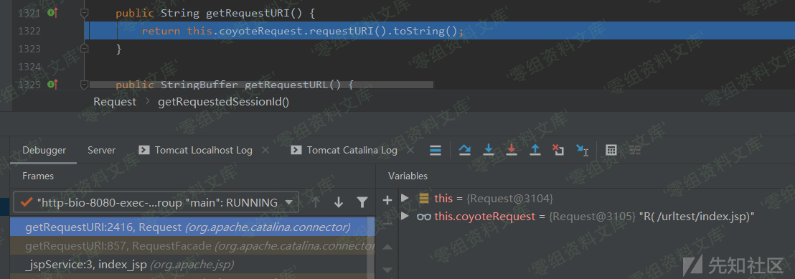
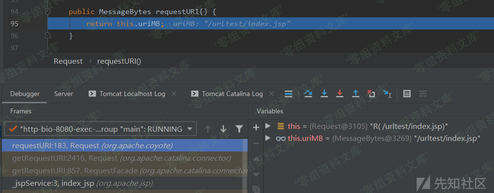

# Tomcat getRequestURI()的处理

<!-- vulwiki-editorial:start -->
## 校订与适用边界

- 证据范围：getRequestURI返回路径而非整个URL，原文末句URL内容术语过宽；没有独立漏洞。

### 尚未解决的证据缺口

以下限制仍适用于后文历史材料；相关版本、结果或修复结论不能据此视为已验证：

- 源码仅图片，未视检
- 重复图片路径尾巴及孤立Tomcat残字
- 缺版本、示例index.jsp上下文和出处

本页为文本校订，未执行代码、PoC 或目标请求；原图仅保留引用，未据此确认复现成功。
<!-- vulwiki-editorial:end -->

## 技术正文与历史材料

### Tomcat getRequestURI()的处理

我们直接在index.jsp中调用getRequestURI()函数的地方打上断点调试即可。

这里是直接调用Request.requestURI()函数然后直接返回其字符串值：

的处理/media/rId21.png)

跟进Request.requestURI()函数，这里是直接返回请求的URL内容，没有做任何处理以及URL解码：

的处理/media/rId22.png)Tomcat
