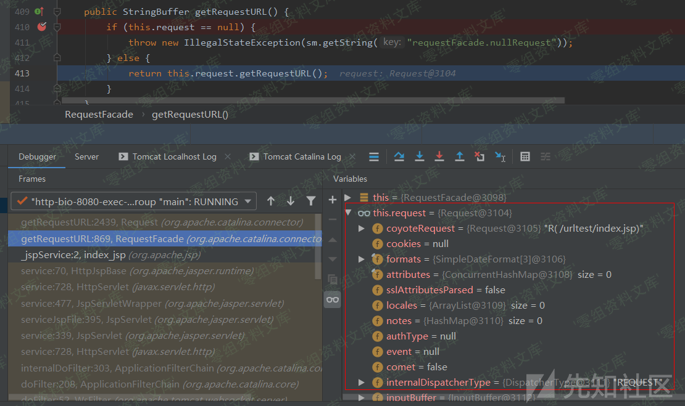
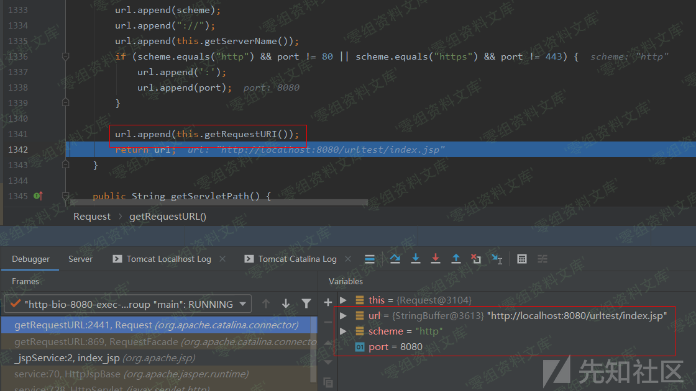

# Tomcat getRequestURL()的处理

<!-- vulwiki-editorial:start -->
## 校订与适用边界

- 证据范围：getRequestURL拼接scheme/host/port和requestURI的说明，宜与相邻API及规范化文章合并。

### 尚未解决的证据缺口

以下限制仍适用于后文历史材料；相关版本、结果或修复结论不能据此视为已验证：

- 重复图片路径尾巴
- 源码仅图片，版本与出处缺失
- 不能将未经URL解码直接等同于已存在漏洞

本页为文本校订，未执行代码、PoC 或目标请求；原图仅保留引用，未据此确认复现成功。
<!-- vulwiki-editorial:end -->

## 技术正文与历史材料

### Tomcat getRequestURL()的处理

在getRequestURL()函数中是调用了Request.getRequestURL()函数的：

的处理/media/rId21.png)

跟进该函数，在提取了协议类型、host和port之后，调用了getRequestURI()函数获取URL请求的路径，然后直接拼接进URL直接返回而不做包括URL解码的任何处理：

的处理/media/rId22.png)
