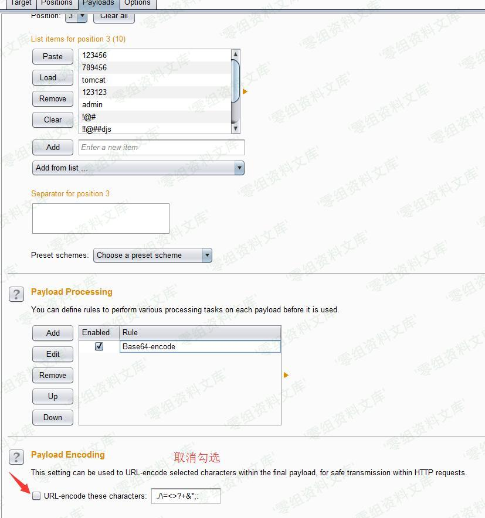
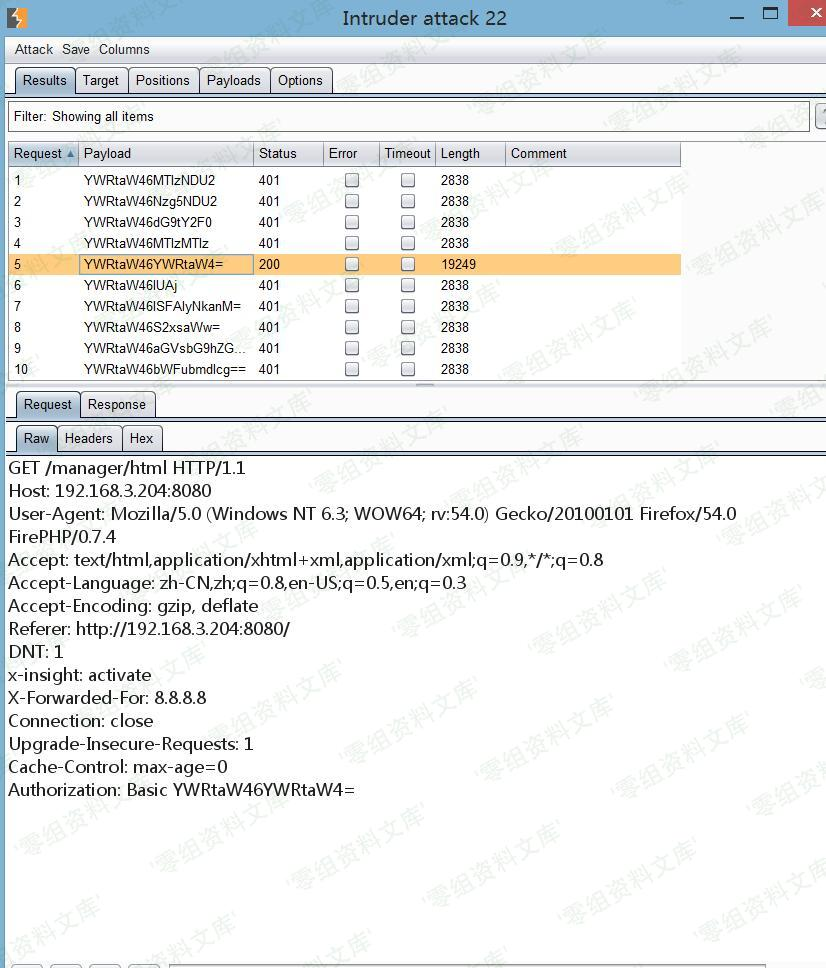

# Tomcat 后台爆破

<!-- vulwiki-editorial:start -->
## 校订与适用边界

- 适用前提：管理入口可达且人为配置了弱密码用户；需正确管理角色
- 证据范围：Basic认证编码教学，不是无条件Tomcat代码漏洞；host-manager与部署应用的manager入口不应混为一谈。

### 尚未解决的证据缺口

以下限制仍适用于后文历史材料；相关版本、结果或修复结论不能据此视为已验证：

- 两次将Base64编码称作加密/密文，错误
- 简介和影响章节为空
- 没有默认无用户/本地访问限制等配置前提
- 只有爆破截图，无版本及锁定/清理/缓解说明

本页为文本校订，未执行代码、PoC 或目标请求；原图仅保留引用，未据此确认复现成功。
<!-- vulwiki-editorial:end -->

## 技术正文与历史材料

一、漏洞简介
------------

二、漏洞影响
------------

三、复现过程
------------

在渗透测试中，我们经常遇到tomcat后台被默认部署在外部的情况，类似于`http://192.168.3.204:8080/host-manager/html`

在这种情况下，我们都会选择去爆破来进入后台部署shell。

先抓取一下我们的登录包：

    GET /host-manager/html HTTP/1.1
    Host: 192.168.3.204:8080
    User-Agent: Mozilla/5.0 (Windows NT 6.3; WOW64; rv:54.0) Gecko/20100101 Firefox/54.0 FirePHP/0.7.4
    Accept: text/html,application/xhtml+xml,application/xml;q=0.9,*/*;q=0.8
    Accept-Language: zh-CN,zh;q=0.8,en-US;q=0.5,en;q=0.3
    Accept-Encoding: gzip, deflate
    DNT: 1
    x-insight: activate
    Connection: keep-alive
    Upgrade-Insecure-Requests: 1
    Authorization: Basic YWRtaW46MTIzNDU2

在Tomcat后台登录的数据包中我们发现它会将输入的账号和密码都编码成Base64密文。

格式：`用户名:密码` =\> `admin:123456` =\> `YWRtaW46MTIzNDU2`

这里我们可以采用Metasploit中的tomcat爆破辅助模块，当然也可以用BurpSuite来爆破：

将数据包发送到Intruder模块，添加一个变量：

在设置Payload的时候要使用自定义迭代器：

由于登录令牌都是`base64`加密的，我们需要
`[用户名]:[密码]`这样的格式进行`base64encde`才可以发送出去，我们设置三个迭代payload分别代表：用户名、:、密码、。

第一位设置用户名这类的字典，可以多个。

第二位设置`:`，只需要一个即可。

第三位设置密码，可以多个。

然后设置一个编码器，选择`base64`这个函数：

接下来再将url编码去掉，因为在base64密文里`=`会被编码成`%3d`。

设置完毕后，我们可以爆破了：

参考链接
--------

> https://payloads.online/archivers/2017-08-17/2\#tomcat-%E7%88%86%E7%A0%B4
