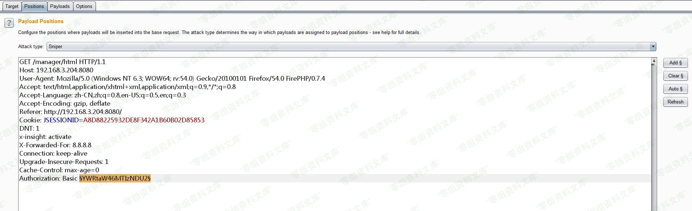
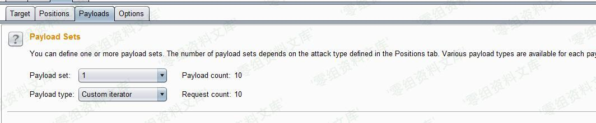
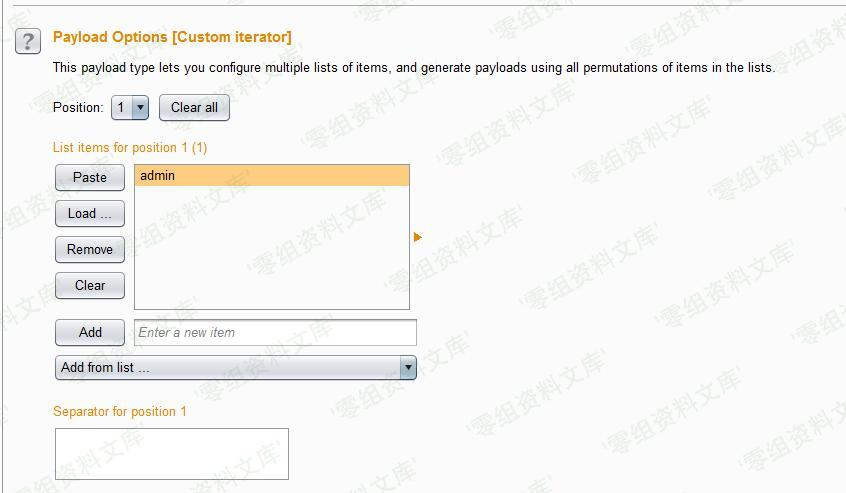
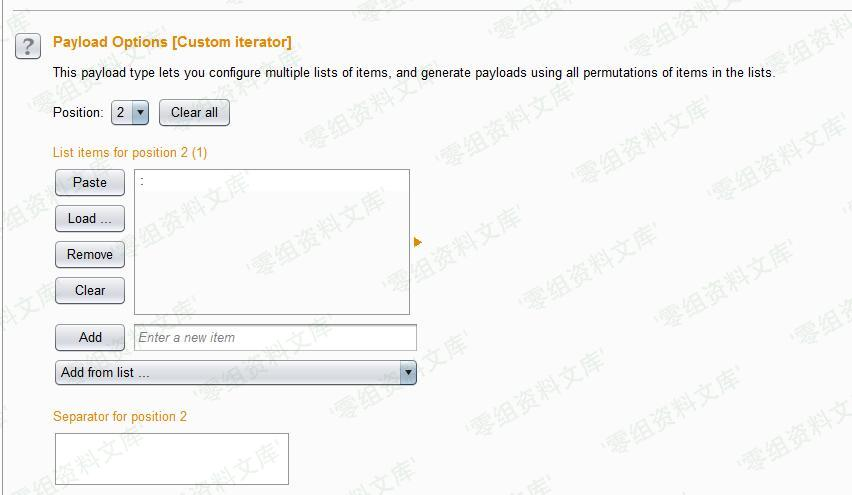
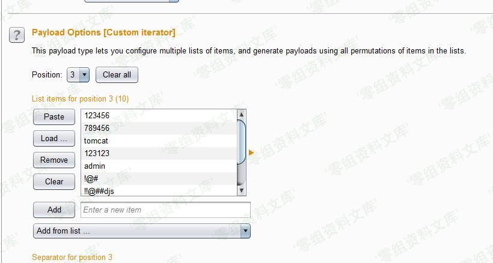
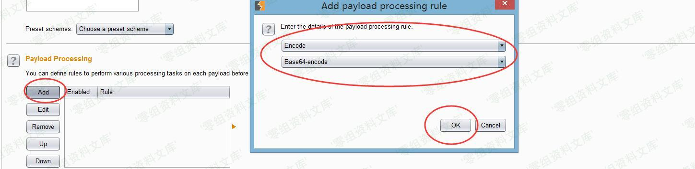

# Tomcat 后台部署war木马getshell

<!-- vulwiki-editorial:start -->
## 校订与适用边界

- 适用前提：持有具部署权限的管理凭据；不是单凭任何登录令牌就能部署
- 证据范围：同321来源的后续章节应合并；前篇host-manager路径与本篇manager应用部署功能混写。

### 尚未解决的证据缺口

以下限制仍适用于后文历史材料；相关版本、结果或修复结论不能据此视为已验证：

- 所有图片错误复用Tomcat后台爆破资源rId24–29，需视觉核对是否内容错位，非资源不存在
- 简介/影响为空，参考链接标题转义损坏
- 缺权限条件、工具版本、部署卸载与恢复说明

本页为文本校订，未执行代码、PoC 或目标请求；原图仅保留引用，未据此确认复现成功。
<!-- vulwiki-editorial:end -->

## 技术正文与历史材料

一、漏洞简介
------------

二、漏洞影响
------------

三、复现过程
------------

在获取到令牌后，我们可以进入Tomcat后台了：

在这个后台，我们可以操作每个应用的状态......以及读取每个应用下的Session。

但是这都不是最大的安全隐患 :)

下面来讲一下如何制作war包。

> war包：Java
> web工程，都是打成war包，进行发布，如果我们的服务器选择TOMCAT等轻量级服务器，一般就打出WAR包进行发布

先准备了一个JSP的一句话木马，安装好JDK环境，我的目录是在`C:\Program Files (x86)\Java\jdk1.8.0_131\bin`,这个目录下又个文件叫`jar.exe`。

执行:`jar -cvf [war包名称].war 打包目录`

我们现在已经打包好了一个WAR包。

找到Tomcat管理页面中的`WAR file to deploy`进行上传就可以部署了。

应用列表已经出现了我们的目录：

访问文件名即可：

\#\#参考链接

> https://payloads.online/archivers/2017-08-17/2\#tomcat-%E7%88%86%E7%A0%B4
