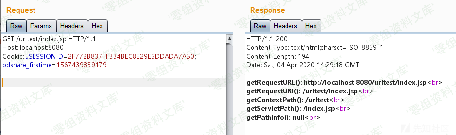
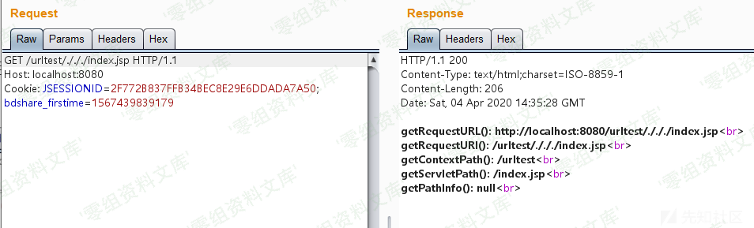
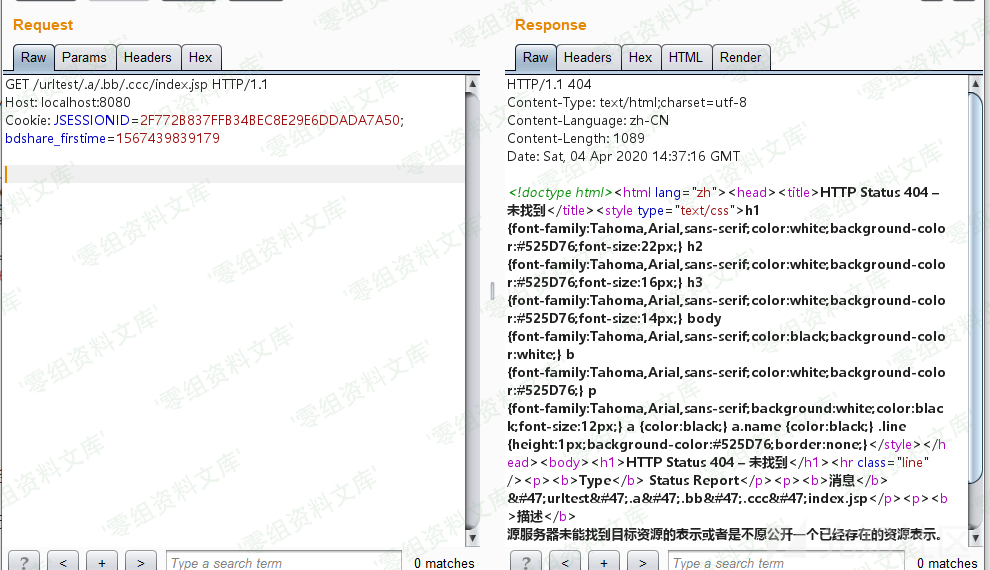
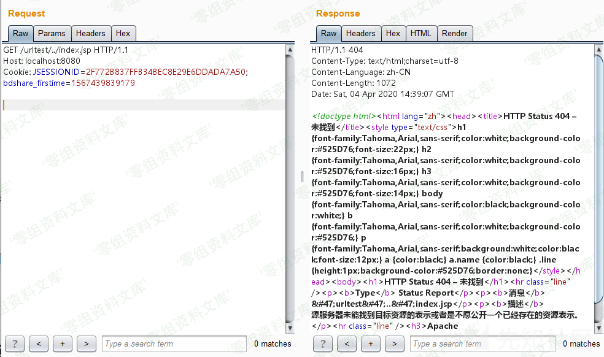
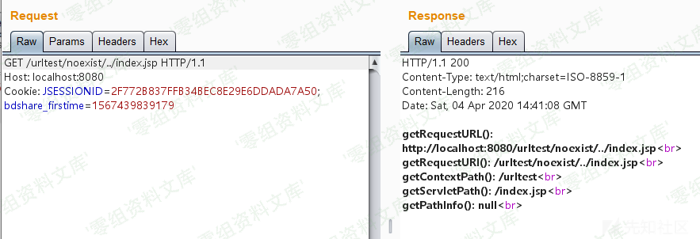
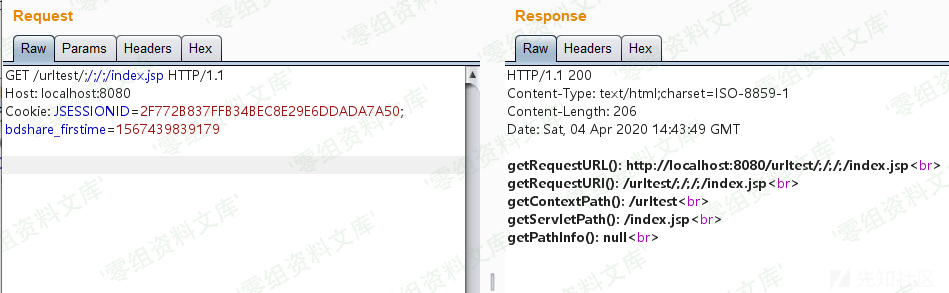
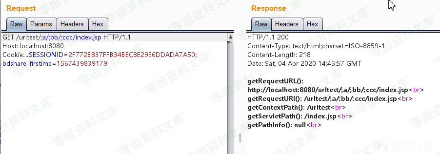

# Tomcat 特殊字符的URL解析

<!-- vulwiki-editorial:start -->
## 校订与适用边界

- 证据范围：315–320/326的原始实验上下文，无独立漏洞。

### 尚未解决的证据缺口

以下限制仍适用于后文历史材料；相关版本、结果或修复结论不能据此视为已验证：

- 版本缺失，输出全部截图，未视检
- 声称其他所有特殊字符都400/404过度概括，#是客户端fragment、?是query分隔，需区分实际送达的请求目标
- 省略代理/浏览器路径归一化条件，无法仅凭地址栏说明容器收到的原始URL

本页为文本校订，未执行代码、PoC 或目标请求；原图仅保留引用，未据此确认复现成功。
<!-- vulwiki-editorial:end -->

## 技术正文与历史材料

### Tomcat 特殊字符的URL解析

新建一个Java Web项目，index.jsp如下：

    <%
    out.println("getRequestURL(): " + request.getRequestURL() + " ");
    out.println("getRequestURI(): " + request.getRequestURI() + " ");
    out.println("getContextPath(): " + request.getContextPath() + " ");
    out.println("getServletPath(): " + request.getServletPath() + " ");
    out.println("getPathInfo(): " + request.getPathInfo() + " ");
    %>

#### 正常访问

Tomcat运行之后，正常访问`http://localhost:8080/urltest/index.jsp`，页面输出如下：

#### 插入 ./ 访问

尝试插入多个`./`访问即`http://localhost:8080/urltest/./././index.jsp`，页面输出如下：

可以看到，插入多个`./`也能正常访问。

接着尝试这种形式`http://localhost:8080/urltest/.a/.bb/.ccc/index.jsp`，发现是返回404，未找到该资源访问：

#### 插入 ../ 访问

尝试插入`../`访问即`http://localhost:8080/urltest/../index.jsp`，页面输出如下：

可以是返回的404，这是因为实际访问的是`http://localhost:8080/index.jsp`，这个目录文件当然不存在。

换种跨目录的形式就OK了`http://localhost:8080/urltest/noexist/../index.jsp`：

#### 插入 ;/ 访问

尝试插入多个`;/`访问即`http://localhost:8080/urltest/;/;/;/index.jsp`，页面输出如下：

可以看到，插入多个`;`也能正常访问。

在`;`号后面加上字符串也是能正常访问的，如`http://localhost:8080/urltest/;a/;bb/;ccc/index.jsp`：

#### 插入其他特殊字符访问

尝试插入如下这些特殊字符进行访问，页面均返回400或404，无法访问：

    ` ~ ! @ # $ % ^ & * ( ) - _ = + [ ] { } \ | : ' " < > ?

#### 小结

由前面的尝试知道，Tomcat中的URL解析是支持嵌入`./`、`../`、`;xx/`等特殊字符的。此外，getRequestURL()和getRequestURI()这两个函数解析提取的URL内容是包含我们嵌入的特殊字符的，当使用不当时会存在安全问题如绕过认证。
