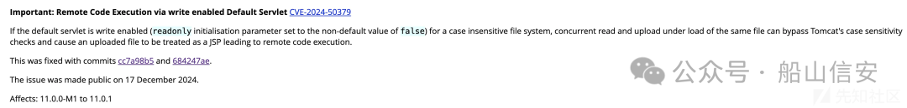
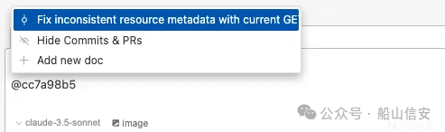
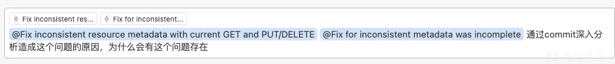
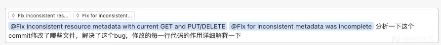

# Tomcat 条件竞争导致 RCE 分析（CVE-2024-50379）

<!-- vulwiki-editorial:start -->
## 校订与适用边界

原题名年份为转录错误，正文所讨论的 Tomcat 条件竞争问题对应 CVE-2024-50379。保留历史路径和图片，主标识不再沿用错年编号。

- 证据范围：标题/frontmatter误写2025-50379，正文2024年Tomcat写入竞争对应2024-50379。AI问答不能替代被丢失的补丁证据。

### 已有来源支持的更正

- 官方2024-50379条目确认非默认write-enabled DefaultServlet、大小写不敏感文件系统及并发读写相同文件条件

### 本次正文校订

- 修正题名；原文件路径保持不变，以保留已有链接和资源定位。
- 移除 12 组不含任何正文的空代码围栏；保留全部非空代码。

### 尚未解决的证据缺口

以下限制仍适用于后文历史材料；相关版本、结果或修复结论不能据此视为已验证：

- CVE年份错误，必须改为2024
- 所有关键代码块为空，commit号只图片，无补丁直链
- 缺精确受影响/修复版本与readonly=false、大小写不敏感文件系统条件；Windows仅一类平台
- 最后将根因说成频繁PUT使f.exists跳过检查，未由现有文本证明，实为并发同文件读写导致大小写检查绕过
- 大量重复泛化审计建议，PoC/自用规则均丢失
- 原始来源只到xz首页，无法追溯

### 核验来源

- https://tomcat.apache.org/security-9.html

### 操作风险与资料使用

- 含落盘脚本或账户创建：会留下持久状态。记录本次生成的路径或账户，测试后清理这些对象并撤销关联令牌；不要删除既有业务对象。
- 含资源消耗、延时或崩溃验证：可能影响服务可用性；限制请求次数、并发与超时，保留无攻击负载的对照结果。

本页为文本校订，未执行代码、PoC 或目标请求；原图仅保留引用，未据此确认复现成功。
<!-- vulwiki-editorial:end -->

## 技术正文与历史材料

 船山信安   2024-12-23 01:14  
  
POC，大家都有了。  
在windows系统下，如果tomcat开启了put协议，可以通过同一时间内多次发送大小写混淆的数据包利用条件竞争绕过tomcat的防护，从而造成rce  
  
在官方的漏洞公告中找到对应的commit  
  
  
  
用过cursor的都知道cursor有个@git 命令，只要把commit id给到cursor，cursor便可以通过review这段代码，分析补丁内容，从而挖掘漏洞点  
  
  
# 利用cursor分析该漏洞的成因：  
## 提问一：  
  
  
  
让我深入分析这个问题的根本原因：  
1、 问题的本质：  
- 资源元数据不一致问题发生在并发的GET和PUT/DELETE操作时  
  
- FileResource对象的状态出现了混乱，部分字段显示文件存在，部分字段显示文件不存在  
  
2、问题产生的具体场景：  
  
当并发请求发生时：  
时间点1: GET请求检查文件存在  
时间点2: DELETE请求删除文件  
时间点3: GET请求继续构造FileResource对象  
  
这会导致：  
1. FileResource对象的部分字段基于文件存在时的状态  
  
1. 而另一部分字段基于文件已被删除的状态  
  
1. 最终导致FileResource内部状态不一致  
  
3、 问题的根本原因：  
- 缺乏原子性：检查文件存在性到创建FileResource对象这个过程不是原子的  
  
- 缺乏同步机制：并发的读写操作没有适当的同步控制  
  
- 状态不一致：FileResource对象的构造过程可能跨越文件状态的变化点  
  
4、修复方案：  
  
主要改进：  
1. 引入读写锁机制保护资源访问  
  
1. 确保资源状态检查和对象创建的原子性  
  
1. 写操作时使用排他锁防止并发读取  
  
1. 读操作时使用共享锁允许并发读取  
  
1. 安全建议：  
代码审计角度：  
  
1. 检查所有涉及文件操作的代码路径  
  
1. 确保锁的正确获取和释放  
  
1. 检查是否存在死锁风险  
  
1. 验证错误处理和异常情况  
漏洞防范：  
  
1. 防止条件竞争(Race Condition)  
  
1. 防止TOCTOU(Time-of-check to time-of-use)漏洞  
  
1. 防止资源泄露  
  
1. 防止拒绝服务攻击  
监控建议：  
  
1. 监控锁的获取和释放情况  
  
1. 监控资源访问模式  
  
1. 监控并发操作的性能影响  
  
1. 记录异常和错误情况  
这个问题本质上是一个并发安全问题，涉及到共享资源的并发访问控制。通过适当的同步机制可以确保资源状态的一致性，但同时也需要注意性能和死锁等潜在问题。  
  
## 提问二：  
  
  
  
这个bug修复主要涉及以下文件的修改：  
1. 新增文件 WebResourceLockSet.java  
:  
  
1. DirResourceSet.java  
 的主要修改：  
  
1. FileResource.java  
 的修改：  
  
关键改进点：  
1. 锁的粒度控制：  
  
1. 使用路径作为锁的标识符  
  
1. 支持大小写敏感/不敏感的文件系统  
  
1. 锁的生命周期管理：  
  
1. 使用计数器追踪锁的使用情况  
  
1. 自动清理不再使用的锁  
  
1. 并发控制：  
  
1. 读操作使用共享锁  
  
1. 写操作使用排他锁  
  
1. 保护锁集合的并发访问  
  
1. 错误处理：  
  
1. 使用try-finally确保锁的释放  
  
1. 支持空检查和异常处理  
安全建议：  
  
1. 代码审计重点：  
  
1. 检查所有资源访问路径是否都有适当的锁保护  
  
1. 验证锁的获取和释放是否配对  
  
1. 检查是否存在死锁风险  
  
1. 性能优化：  
  
1. 监控锁的争用情况  
  
1. 评估锁的粒度是否合适  
  
1. 考虑使用锁分段等技术  
  
1. 安全加固：  
  
1. 实现锁超时机制  
  
1. 添加资源访问审计日志  
  
1. 防范可能的拒绝服务攻击  
  
这个修复通过完善的锁机制解决了并发访问导致的资源元数据不一致问题，同时保持了良好的性能和可维护性。  
## 提问三：  
  
  
  
让我分析一下原来代码中出现条件竞争的根本原因：  
  
1、 问题的核心场景  
  
2、 条件竞争的具体表现：  
当并发GET和PUT/DELETE请求同时发生时,会出现以下时序问题:  
时间点1: GET请求检查文件存在 (f.exists() 返回 true)  
时间点2: DELETE请求删除文件成功  
时间点3: GET请求继续执行,创建FileResource对象  
  
这导致:  
1. FileResource对象的部分字段基于文件存在时的状态初始化  
  
1. 而另一部分字段基于文件已被删除后的状态初始化  
  
1. 最终FileResource对象内部状态不一致  
  
3、代码中的漏洞点：  
  
a. TOCTOU(Time-of-check to time-of-use)漏洞：  
  
b. 缺乏原子性保证：  
  
c. 状态不一致：  
  
4、安全影响：  
1. 数据一致性问题：  
  
1. 资源状态不一致可能导致应用程序行为异常  
  
1. 可能造成缓存污染  
  
1. 可能导致错误的访问控制决策  
  
1. 潜在的安全漏洞：  
  
1. 可能被利用来绕过访问控制  
  
1. 可能导致信息泄露  
  
1. 可能被用于拒绝服务攻击  
  
1. 业务影响：  
  
1. 文件操作结果不可预测  
  
1. 可能导致数据损坏  
  
1. 影响系统可靠性  
  
1. 漏洞利用场景：  
// 攻击者可能通过以下方式利用：  
  
1. 发送大量并发的GET/DELETE请求  
  
1. 在文件检查和使用之间的时间窗口操作文件  
  
1. 利用状态不一致构造特殊的请求序列  
  
1. 代码审计建议：  
  
1. 检查所有涉及文件操作的代码：  
// 重点关注：  
  
1. 文件存在性检查  
  
1. 文件读写操作  
  
1. 文件元数据访问  
  
1. 同步机制审查：  
// 确保：  
  
1. 关键操作的原子性  
  
1. 锁的正确使用  
  
1. 避免死锁风险  
  
1. 错误处理检查：  
// 验证：  
  
1. 异常处理的完整性  
  
1. 资源清理的可靠性  
  
1. 错误状态的一致性  
  
这个问题本质上是由于缺乏适当的同步机制导致的条件竞争，需要通过完善的锁机制来确保资源访问的原子性和一致性。同时也需要注意性能和死锁等相关问题。  
解读：  
通过cursor的分析，已经能很清楚的知道，该漏洞的成因是由于tomcat缺乏文件锁的，如果频繁发送put请求，在getResource函数，f.exists函数会跳过检查，从而逃逸了EmptyResource。导致webshell上传成功。  
  
后续：  
以往分析漏洞，我们需要去解读补丁内容，然后逐步调试。这整个过程就需要花费半天甚至一天的时间。而通过ai工具我们能更加轻易的分析漏洞，整个分析过程仅仅花了不到10分钟就将原理分析出来的，大大提高了代码审计的效率。  
最后附上我自用的cursorrules：  
  
来源：https://xz.aliyun.com/  感谢【  
151****8729  
   
】  
  

---

> 来源：gelusus/wxvl（微信公众号漏洞文章自动归档，原文见文首链接）
