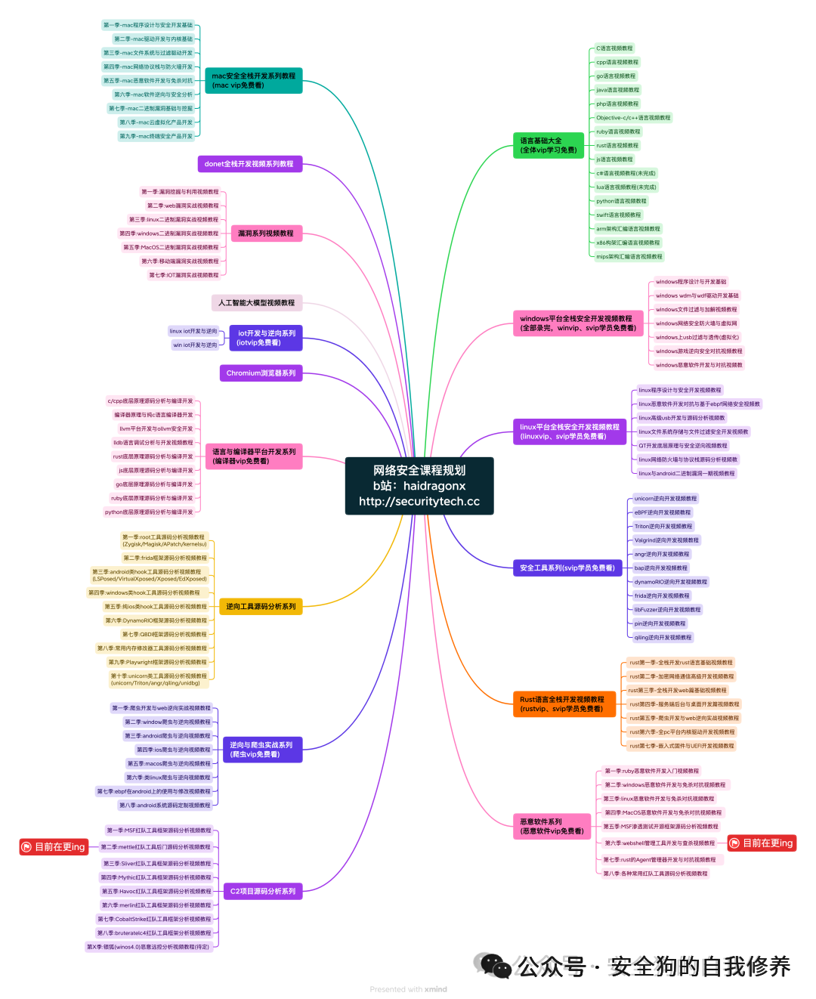
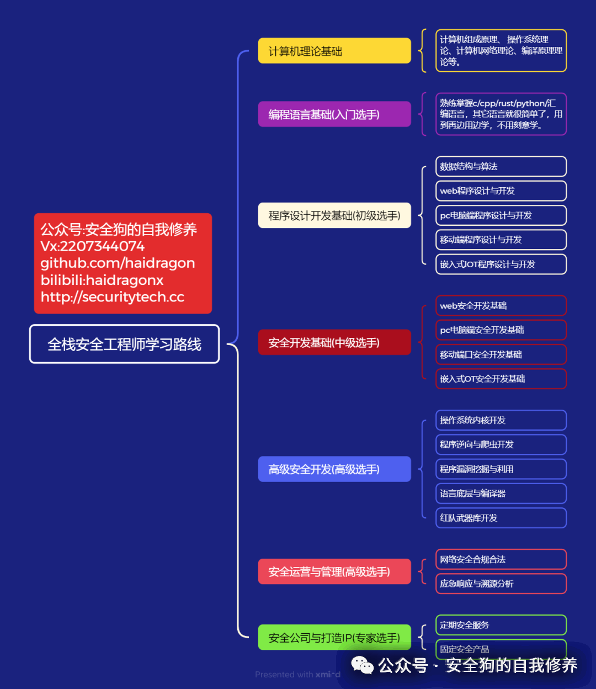

# 绕过 Tomcat 证书吊销：CVE-2026-24734 详解（含实战 PoC）

<!-- vulwiki-editorial:start -->
## 校订与适用边界

- 适用前提：采用受影响OpenSSL集成并启用OCSP客户端证书验证；攻击还需使不可信/过期响应进入检查流程
- 证据范围：标题含实战PoC，但全部配置、证书命令、请求/响应代码块为空，不能作为可复现文章。开头承认FFM而后声称仅Native/APR、自相矛盾。

### 已有来源支持的更正

- 官方确认FFM集成受影响9.0.83–9.0.114、9.0.115修复；该机制并非仅TC-Native/APR

### 本次正文校订

- 移除 16 组不含任何正文的空代码围栏；保留全部非空代码。

### 尚未解决的证据缺口

以下限制仍适用于后文历史材料；相关版本、结果或修复结论不能据此视为已验证：

- 错误将安装TC-Native和APR connector列为所有场景必要条件，遗漏Tomcat FFM集成
- 每个X509证书都有AIA错误，扩展非必需
- 只说正常吊销后请求成功，没有呈现攻击者操纵/重放OCSP响应过程，不能据此证明该CVE
- 测试版本为OpenLogic商业分支，需区分Apache上游；无完整影响/修复版本
- 所有参考资料仅名称无链接，广告噪声多

### 核验来源

- https://tomcat.apache.org/security-9.html

本页为文本校订，未执行代码、PoC 或目标请求；原图仅保留引用，未据此确认复现成功。
<!-- vulwiki-editorial:end -->

## 技术正文与历史材料

haidragon
                    haidragon  安全狗的自我修养   2026-03-23 04:18  
  
  
# 官网：http://securitytech.cc  
##   
## 一、介绍（Introduction）  
  
我们先来看   
NVD  
（美国国家漏洞数据库）对该漏洞的描述：  
> “Apache Tomcat Native 和 Apache Tomcat 中存在不正确的输入验证漏洞。在使用 OCSP 响应器时，Tomcat Native（以及 Tomcat 中 FFM 端口的相关实现）没有完成对 OCSP 响应的验证或新鲜度检查，这可能导致证书吊销机制被绕过。”  
  
## 二、背景（Background）  
  
**OCSP（Online Certificate Status Protocol，在线证书状态协议）**  
 是一种互联网协议，用于由证书颁发机构（CA）查询 SSL/TLS 证书（通常是 X.509 证书）的状态。  
  
CVE-2026-24734 主要出现在 **客户端证书验证阶段**  
，即在 **双向 TLS（mTLS）**  
 场景中，Tomcat 会对客户端证书执行 OCSP 检查。  
### 🔍 问题核心  
  
问题的本质是：  
- Tomcat 在校验证书时，会向 OCSP 服务器发起查询  
  
- OCSP 返回证书状态（有效 / 吊销）  
  
- **但 Tomcat 没有完整验证 OCSP 响应**  
- ❌ 未验证响应完整性  
  
- ❌ 未检查响应是否“新鲜”（freshness）  
  
👉 导致攻击者可以绕过证书吊销检测  
### 📜 X.509 证书中的 OCSP 信息  
  
每个 X.509 证书中都有一个 **AIA（Authority Information Access）扩展字段**  
，用于指定 OCSP 地址：  
## 三、Tomcat Native 组件说明  
  
Apache Tomcat  
 的 Native 库（TC-Native）是一个**可选组件**  
：  
- 作用：使用 **OpenSSL 替代 Java 默认的 JSSE**  
  
- 用于增强 TLS 支持  
  
- 不默认包含在 Tomcat 中  
  
👉 关键点：  
- 该漏洞 **仅在使用 OpenSSL（通过 Tomcat Native / APR）时可利用**  
  
- 默认 Java TLS（JSSE）不受影响  
  
## 四、漏洞触发条件（Prerequisite）  
  
一个 Tomcat 实例存在漏洞，需要满足：  
1. 安装了 Tomcat Native（TC-Native）  
  
1. TLS 使用 OpenSSL（APR connector）  
  
### 📄 示例配置（server.xml）  
## 五、PoC 演示（实战复现）  
### 🧱 环境说明  
- Tomcat：OpenLogic 8.5.121-OL  
  
- TC-Native：1.2.39  
  
- 使用 Docker 部署  
  
### 🐳 Dockerfile（核心步骤）  
## 六、OCSP 实验环境搭建  
  
目标：  
1. 创建带 OCSP URL 的证书  
  
1. 吊销该证书  
  
1. 启动 OCSP 服务器供 Tomcat 查询  
  
### 🔐 创建服务器证书  
### 🏗️ 初始化 CA 目录  
### 🏛️ 创建 CA  
### 👤 创建客户端证书  
### ⚙️ 配置 OCSP 地址  
### ✍️ 签发证书  
### 🚀 启动 OCSP 服务  
### ✅ 测试 OCSP  
  
👉 正常输出：  
## 七、验证漏洞  
### 🔗 正常请求（证书未吊销）  
  
👉 返回：  
### ❌ 吊销证书  
### ⚠️ 再次请求（关键点）  
  
如果存在漏洞：  
  
👉 **请求仍然成功（漏洞触发）**  
  
如果修复：  
## 八、漏洞总结  
### 🎯 漏洞本质  
- OCSP 响应未完整验证  
  
- 未检查响应时间有效性  
  
- 导致吊销证书仍被信任  
  
### ⚠️ 影响范围  
  
仅影响：  
- 使用 **Tomcat Native（APR）**  
  
- 使用 **OpenSSL TLS**  
  
不影响：  
- 默认 Java TLS（JSSE）  
  
## 九、参考资料  
- NVD  
 官方漏洞库  
  
- Apache Tomcat  
 安全文档  
  
- OCSP 协议说明文档  
  
## 👍 一句话总结  
  
👉 **这是一个典型的“证书吊销绕过”漏洞，本质是 OCSP 校验不完整，在 mTLS 场景下风险很高。**  
- 公众号:安全狗的自我修养  
  
- vx:2207344074  
  
- http://  
gitee.com/haidragon  
  
- http://  
github.com/haidragon  
  
- bilibili:haidragonx  
  
-   
  
##   
  
  
  
  
  
  
****-   
  

---

> 来源：gelusus/wxvl（微信公众号漏洞文章自动归档，原文见文首链接）
