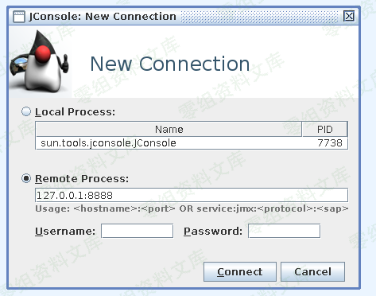
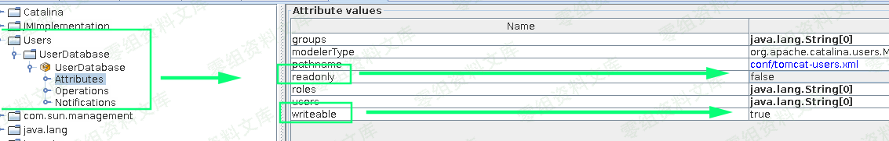
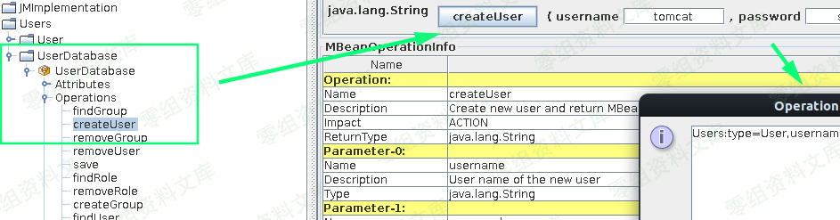
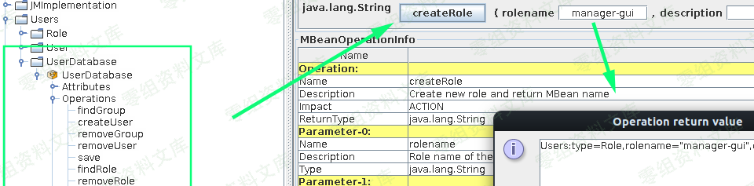
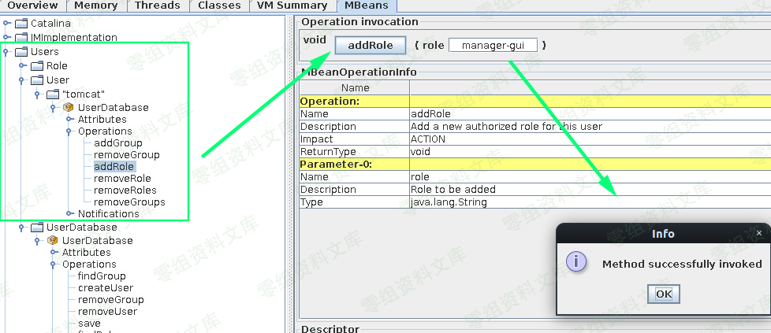
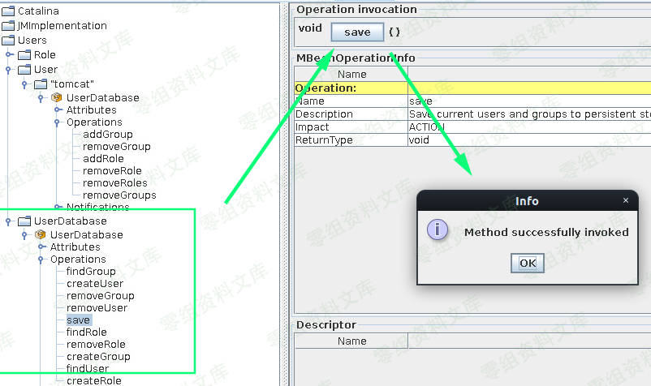
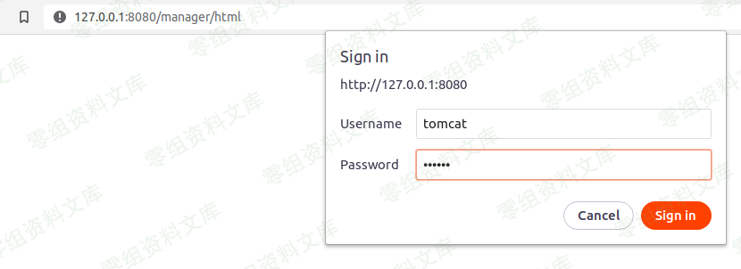
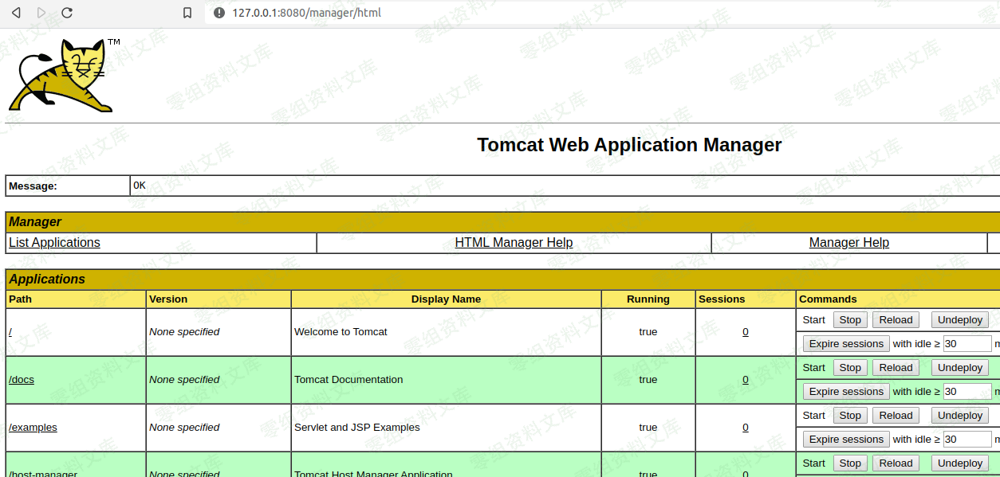

# 通过jmx攻击Tomcat

<!-- vulwiki-editorial:start -->
## 校订与适用边界

- 适用前提：无认证JMX可达、UserDatabase可写、Manager远程可达，正文已列
- 证据范围：管理能力滥用，非独立Tomcat实现漏洞；版本无意义但配置必须完整。

### 尚未解决的证据缺口

以下限制仍适用于后文历史材料；相关版本、结果或修复结论不能据此视为已验证：

- 所有关键JMX操作参数在图片中未视检
- 影响与来源缺失，无安全JMX/最小权限/账户清理说明
- manager-gui是部署管理权限而非全局完全授权，应准确描述

### 操作风险与资料使用

- 含落盘脚本或账户创建：会留下持久状态。记录本次生成的路径或账户，测试后清理这些对象并撤销关联令牌；不要删除既有业务对象。

本页为文本校订，未执行代码、PoC 或目标请求；原图仅保留引用，未据此确认复现成功。
<!-- vulwiki-editorial:end -->

## 技术正文与历史材料

一、漏洞简介
------------

### 利用条件

-   `/manager`应用程序不限于本地主机
-   jmx可访问（没有身份验证）
-   tomcat用户数据库可写

二、漏洞影响
------------

三、复现过程
------------

我们通过`jconsole`连接到服务器，可以执行一些特定于Tomcat的方法让我们进入。

如果UserDatabase标记为`writable = true`，则`readonly = false`：

在UserDatabase节点下，我们可以创建新用户。我们将用户名密码新建为`tomcat`：

确保我们也在服务器上创建了manager-gui角色，因此我们得到了完全授权：

移动到`Users` 树中的节点，我们可以将创建的用户与创建的角色相关联：

保存配置后：

我们可以在`/manager/html`端点上输入我们的凭据：

成功登陆进去！

