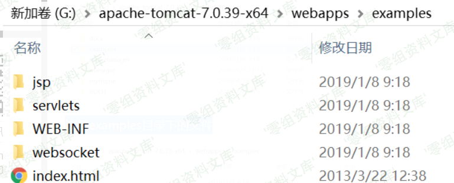
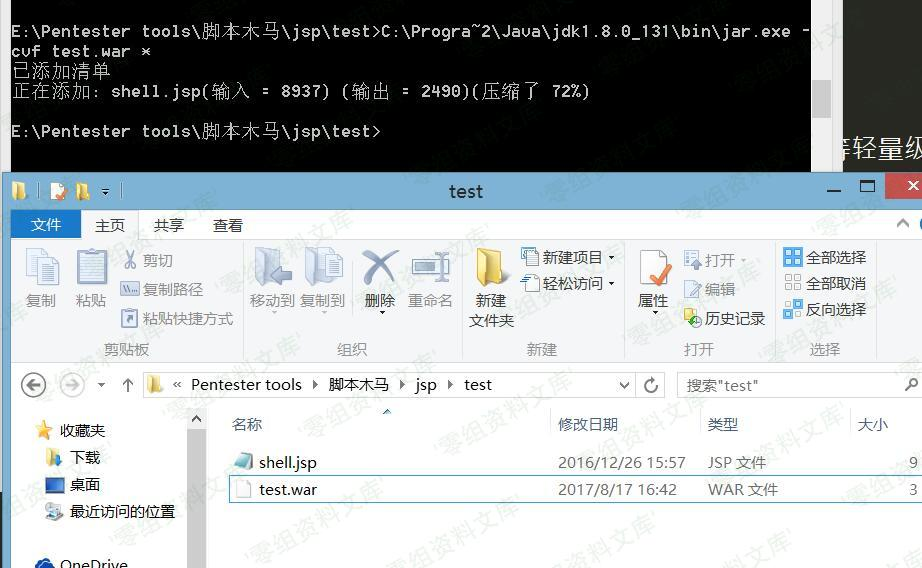
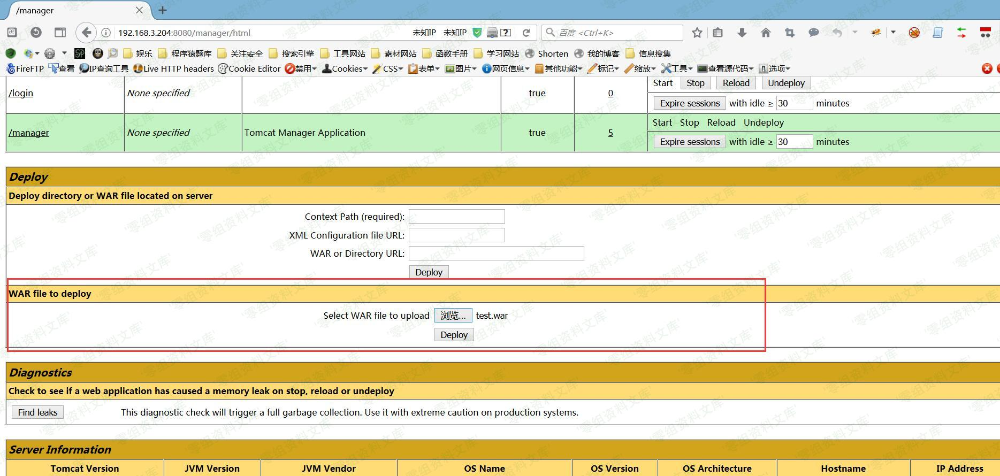

# （CVE-2017-12616）Tomcat 信息泄露

<!-- vulwiki-editorial:start -->
## 校订与适用边界

- 适用前提：Windows，非默认VirtualDirContext映射含JSP源文件
- 证据范围：给出DefaultServlet对末尾/返回404的独立分析，宜保留并与PUT文件写入区分。

### 本次正文校订

- 修正正文中的 DefaultServelt → DefaultServlet 转录错误，资源路径保持原样。
- 只修正缺字母的类名，不改动已经正确的类名或资源路径。

### 尚未解决的证据缺口

以下限制仍适用于后文历史材料；相关版本、结果或修复结论不能据此视为已验证：

- extraResourcePaths本地路径混入https://wiki.0-sec.org，配置已损坏
- 应插入的server.xml父标签丢失，D/F盘路径混用需说明
- 图片误指SessionExample及WAR部署资源，需视觉核对内容错位，不是缺图
- 末句说这就是为什么可通过jsp/取源码，与全文证明不能相反，缺不能二字
- VirtualDirContex/DefaultServelt等拼写错误，12617斜杠混入12615历史叙述
- 无明确7.0.81修复说明，待官方版本核实

### 操作风险与资料使用

- 含落盘脚本或账户创建：会留下持久状态。记录本次生成的路径或账户，测试后清理这些对象并撤销关联令牌；不要删除既有业务对象。

本页为文本校订，未执行代码、PoC 或目标请求；原图仅保留引用，未据此确认复现成功。
<!-- vulwiki-editorial:end -->

## 技术正文与历史材料

一、漏洞简介
------------

CVE-2017-12616(信息泄露):允许未经身份验证的远程攻击者查看敏感信息。如果tomcat开启VirtualDirContext有可能绕过安全限制访问服务器上的JSP文件源码。漏洞触发的先决条件是需要在conf/server.xml配置VirtualDirContext参数，默认情况下tomcat7并不会对该参数进行配置。

那么为什么要配置一个这样的虚拟目录呢？

通过`VirtualDirContext`,允许在单独的一个webapp应用下对外暴露出多个文件系统的目录。在实际开发中，为了避免拷贝静态资源文件如(images等)至webapp目录下，tomcat推荐的做法是在server.xml配置文件中建立虚拟子目录。

在开启了这个配置之后，可以通过windows目录下的文件的解析问题，从而暴露在在目录中的源码。

二、漏洞影响
------------

Apache Tomcat 7.0.0 - 7.0.80

三、复现过程
------------

### 漏洞调试

在本地搭建一个系统环境，目录结果如下：在`D:\testtomcat2`的目录下面的文件结构如下:

    D:.
    ├─img
    │      1.jpg
    │
    ├─src
    │      HelloWorld.java
    │
    ├─target
    └─web
        │  index.jsp
        │
        └─WEB-INF
                web.xml

在tomcat中的`conf/server.xml`下的\`\`标签下面增加如下的配置:

    <Context path='/site' docBase="D:\testtomcat2\web" reloadable="true">
        
        <Resources className="org.apache.naming.resources.VirtualDirContext" extraResourcePaths="/WEB-INF/classes=F:/testtomcat2/target/classes,/images=D:/testtomcat2https://wiki.0-sec.org/img,/tmp=D:/testtomcat2/web" />
        
        <Loader className="org.apache.catalina.loader.VirtualWebappLoader" virtualClasspath="/WEB-INF/classes=F:/testtomcat2/target/classes" />
        
        <JarScanner scanAllDirectories="true" />
    </Context>

从配置可以发现，我创建了2个虚拟目录。分别为`images`和`tmp`，分别映射到本地的`D:/testtomcat2https://wiki.0-sec.org/img`和`D:/testtomcat2/web`。大家在进行测试的时候，可以根据自己的目录自行参照修改。

部署完毕之后，在浏览器中访问`localhost:8080/site/images/1.jpg`

Tomcat信息泄露/media/rId25.png)

顺利地出现了`1.jpg`，说明部署正确。

这个漏洞的触发，同样会使用到tomcat中因为文件后缀的解析的问题。和12615是一样的，只有后缀是`jsp`和`jspx`由`JSPservlet`处理，其他都是由`DefaultServlet`处理。在`12615`中配合`PUT`方法，可以通过上传`test.jsp%20`、`test.jsp/`、`test.jsp::$DATA`的方式上传任意的问价，包括webshell。但是在本例中，只能通过`test.jsp%20`和`test.jsp::$DATA`获得源代码，无法通过`test.jsp/`获取源代码。以下就是演示的结果:

Tomcat信息泄露/media/rId26.jpg)

而访问`http://localhost:8080/site/tmp/index.jsp/`会显示404,

Tomcat信息泄露/media/rId27.jpg)

整个漏洞的分析过程和12615是一样的，下面就为什么无法使用`test.jsp/`无法获取源代码进行说明。当访问`http://localhost:8080/site/tmp/index.jsp/`时，是由`Tomcat`中的`DefaultServlet::doGet`来处理。

    @Override
    protected void doGet(HttpServletRequest request,HttpServletResponse response) throws IOException, ServletException {
        // Serve the requested resource, including the data content
        serveResource(request, response, true);
    }

追踪进入到`serveResource`，其中的关键代码如下：

    protected void serveResource(HttpServletRequest request,HttpServletResponse response,boolean content) throws IOException, ServletException {
        boolean serveContent = content;
        // Identify the requested resource path
        String path = getRelativePath(request, true);
        CacheEntry cacheEntry = resources.lookupCache(path);
        // If the resource is not a collection, and the resource path
        // ends with "/" or "\", return NOT FOUND
        if (cacheEntry.context == null) {
            if (path.endsWith("/") || (path.endsWith("\\"))) {
                // Check if we're included so we can return the appropriate
                // missing resource name in the error
                String requestUri = (String) request.getAttribute(
                        RequestDispatcher.INCLUDE_REQUEST_URI);
                if (requestUri == null) {
                    requestUri = request.getRequestURI();
                }
                response.sendError(HttpServletResponse.SC_NOT_FOUND,
                                    requestUri);
                return;
            }
        }
    }

所以当`cacheEntry.context == null`而且`path.endsWith("/") || (path.endsWith("\\"))`，则直接向客户端返回404,所以采用`test.jsp/`方式并不能够成功触发获取服务端漏洞的JSP代码。

所以这也就是为什么通过`test.jsp/`获取源代码的原因了。

参考链接
--------

> https://blog.spoock.com/2017/09/25/tomcat-cve-2017-12615-12616/
