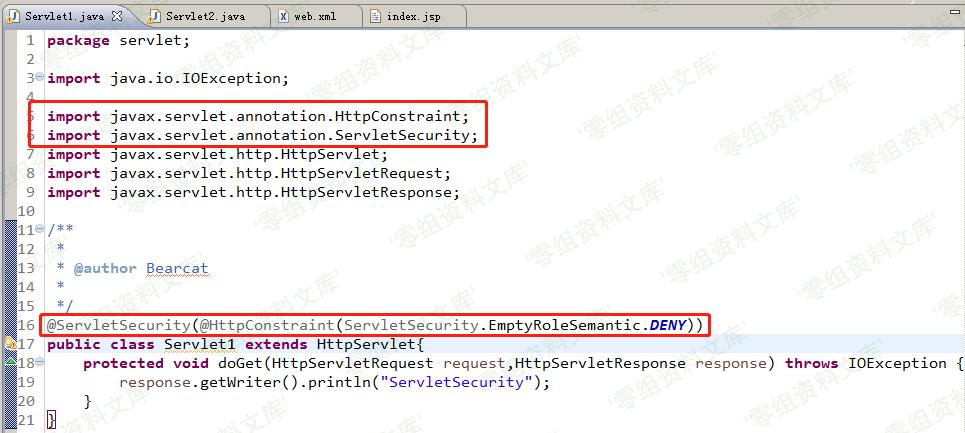
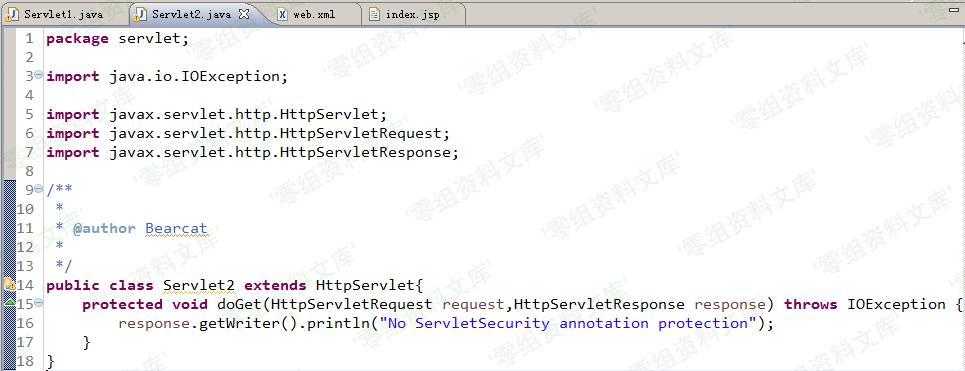
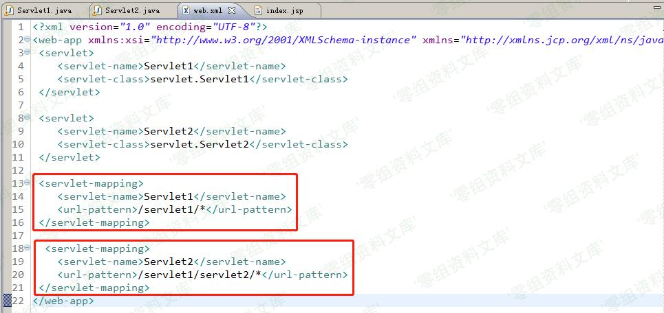
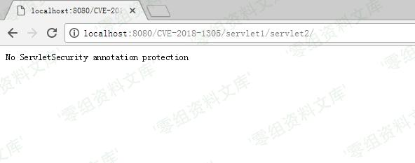
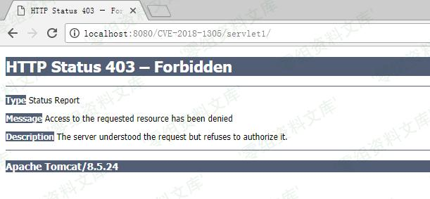
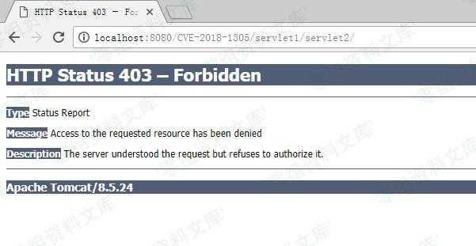
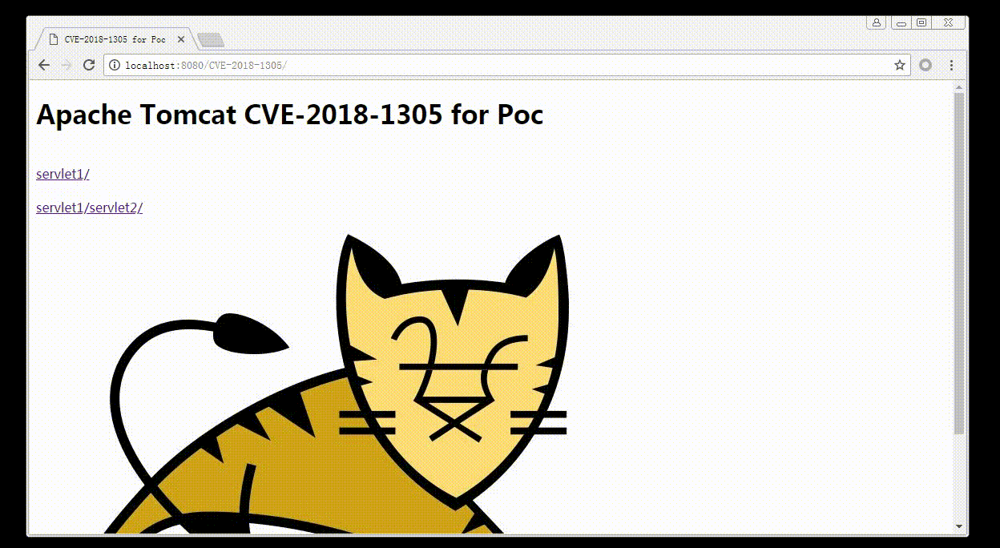

# （CVE-2018-1305）Tomcat 安全绕过漏洞

<!-- vulwiki-editorial:start -->
## 校订与适用边界

- 适用前提：两个Servlet URL模式重叠、外层注解安全约束尚未因加载生效，访问顺序关键
- 证据范围：前后对照和启动时序叙述明确，独立教学证据应保留。

### 尚未解决的证据缺口

以下限制仍适用于后文历史材料；相关版本、结果或修复结论不能据此视为已验证：

- 安全注释应译注解，完整Servlet和web.xml仅截图，未视检
- 四条<版本缺各分支下界，可能误包含不适用分支
- 结论称影响范围并不大缺数据支持，不能仅由利用时序推导
- 缺官方修复/加载策略说明，图片路径残渣

本页为文本校订，未执行代码、PoC 或目标请求；原图仅保留引用，未据此确认复现成功。
<!-- vulwiki-editorial:end -->

## 技术正文与历史材料

一、漏洞简介
------------

近日，Apache发布安全公告称Apache Tomcat
7、8、9多个版本存在安全绕过漏洞。攻击者可以利用这个问题，绕过某些安全限制来执行未经授权的操作，这可能有助于进一步攻击。

Apache Tomcat servlet
注释定义的安全约束，只在servlet加载后才应用一次。由于以这种方式定义的安全约束，应用于URL模式及该点下任何URL，很可能取决于servlet加载的次序，这可能会将资源暴露给未经授权访问它们的用户。

二、漏洞影响
------------

Apache Tomcat \< 9.0.5

Apache Tomcat \< 8.5.28

Apache Tomcat \< 8.0.50

Apache Tomcat \< 7.0.85

三、复现过程
------------

Java EE 提供了类似 ACL
权限检查的ServletSecurity注解，可以用于修饰Servlet对其进行保护，如果有两个servlet，Servlet1，访问路径为"/servlet1/*"并且添加了ServletSecurity注解，Servlet2，访问路径为"/servlet1/servlet2/*"但没有ServletSecurity注解，首次访问servlet1/servlet2，servlet1的ServletSecurity注解并不会生效，无法保护"/servlet1/servlet2"路径，因此可能会导致未授权访问。

如果在访问"/servlet1/servlet2"之前先访问过"/servlet1"，Tomcat会加载ACL并启动对"/servlet1/servlet2"的保护，则漏洞不会触发。

Tomcat安全绕过漏洞/media/rId24.jpg)

在Servlet1前加上ServletSecurity注解，Servlet2无此注解。

Tomcat安全绕过漏洞/media/rId25.jpg)

将web.xml文件中servlet相对应的url-pattern修改为如下图所示后。

Tomcat安全绕过漏洞/media/rId26.jpg)

运行该项目。首次访问servlet2的URL，发现可以未授权访问，针对servlet1的ACL并未生效。

<http://localhost:8080/CVE-2018-1305/servlet1/servlet2/>

Tomcat安全绕过漏洞/media/rId28.jpg)

第二次访问servlet1的URL，访问被禁止，此时ACL生效。

<http://localhost:8080/CVE-2018-1305/servlet1/>

Tomcat安全绕过漏洞/media/rId30.jpg)

再次访问servlet2的URL，发现访问被禁止，如果ACL对servlet2生效，必须建立在servlet1被访问过的前提下。

<http://localhost:8080/CVE-2018-1305/servlet1/servlet2/>

Tomcat安全绕过漏洞/media/rId31.jpg)

### 漏洞演示

Tomcat安全绕过漏洞/media/rId33.gif)

因此漏洞的复现仅限于Tomcat启动后，在访问"/servlet1/*"之前先访问了"/servlet1/servlet2/*"页面，若之前存在任何人访问"/servlet1/\*"页面，则漏洞不会触发。漏洞危害较高，但是利用条件困难，因此影响范围并不大。

参考链接
--------

> <http://cve.mitre.org/cgi-bin/cvename.cgi?name=CVE-2018-1305>
>
> <http://blog.nsfocus.net/cve-2018-130-handling/>
>
> <https://www.anquanke.com/post/id/99213>
