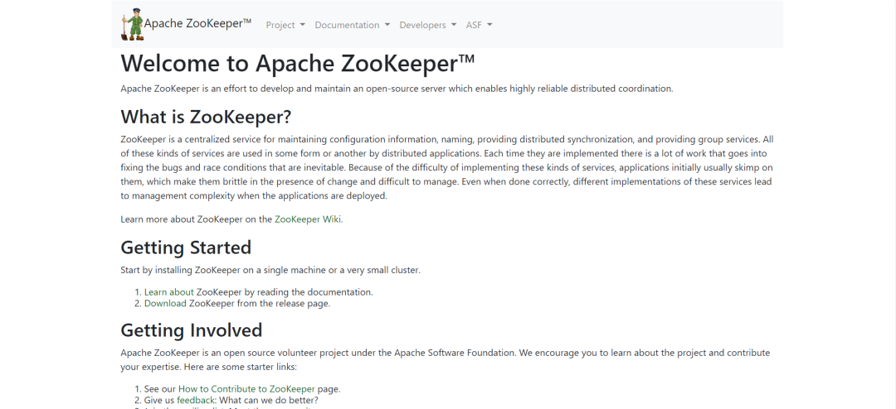

# 漏洞预警 | Apache ZooKeeper身份验证绕过漏洞

<!-- vulwiki-editorial:start -->
## 校订与适用边界

- 适用前提：AdminServer使用IPAuthenticationProvider并按默认X-Forwarded-For取客户端IP
- 证据范围：非Quorum漏洞，与349不同实体，不能按相似标题合并；管理命令包括snapshot/restore，并非OS命令执行。

### 已有来源支持的更正

- 官方确认3.9.0–3.9.2、3.9.3修复、X-Forwarded-For与IPAuthenticationProvider条件

### 尚未解决的证据缺口

以下限制仍适用于后文历史材料；相关版本、结果或修复结论不能据此视为已验证：

- 正文不说明可伪造的是X-Forwarded-For，缺具体修复3.9.3
- POC未公开为2024-11-16当时状态，不是当前状态
- 缺官方公告直链，空标题/粗体噪声

### 核验来源

- https://zookeeper.apache.org/security/

本页为文本校订，未执行代码、PoC 或目标请求；原图仅保留引用，未据此确认复现成功。
<!-- vulwiki-editorial:end -->

## 技术正文与历史材料

浅安  浅安安全   2024-11-16 00:01  
  
**0x00 漏洞编号**  
- # CVE-2024-51504  
  
**0x01 危险等级**  
- 高危  
  
**0x02 漏洞概述**  
  
Apache ZooKeeper是由集群使用的一种服务，用于在自身之间协调，并通过稳健的同步技术维护共享数据。  
  
  
  
**0x03 漏洞详情**  
###   
###   
  
**CVE-2024-51504**  
  
**漏洞类型：**  
身份验证绕过  
  
**影响：**  
获取  
敏感信息  
  
**简述：**  
Apache ZooKeeper存在身份验证绕过漏洞，当ZooKeeper Admin Server使用基于IP的身份验证时，由于默认配置下使用了可被轻易伪造的HTTP请求头来检测客户端IP地址，攻击者可通过伪造请求头中的IP地址来绕过身份验证，进而实现未授权访问管理服务器功能并任意执行管理服务器命令，从而可能导致信息泄露或服务可用性问题。  
###   
  
**0x04 影响版本**  
- 3.9.0 <= Apache ZooKeeper < 3.9.3  
  
**0x05****POC状态**  
- 未公开  
  
**0x06****修复建议**  
  
******目前官方已发布漏洞修复版本，建议用户升级到安全版本****：******  
  
https://zookeeper.apache.org/  
  
  
  

---

> 来源：gelusus/wxvl（微信公众号漏洞文章自动归档，原文见文首链接）
