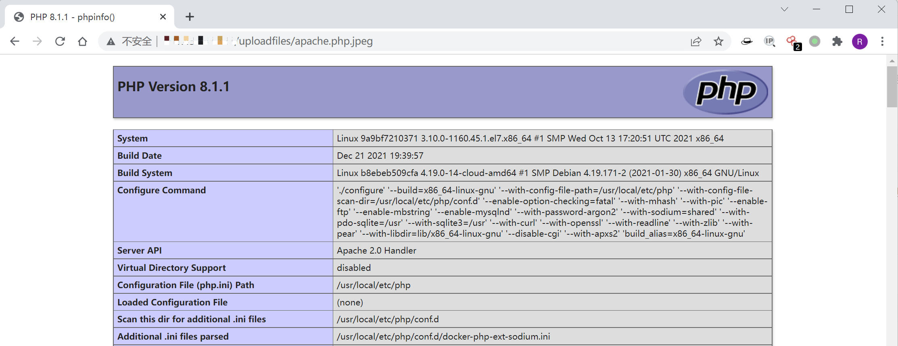

# Apache HTTPd 多后缀解析漏洞

<!-- vulwiki-editorial:start -->
## 校订与适用边界

- 适用前提：AddHandler .php、上传校验只查最后后缀且不重命名、目录允许执行PHP
- 证据范围：准确说明正常多扩展名特性结合上传弱校验，不应建成所有HTTPd版本统一CVE

### 本次正文校订

- 按实际内容修正 1 处代码围栏语言标记，保留其中方法与请求内容。

### 尚未解决的证据缺口

以下限制仍适用于后文历史材料；相关版本、结果或修复结论不能据此视为已验证：

- 稳定版未固定具体镜像版本/配置目录
- 应补不执行上传目录或严格FilesMatch等防护及配置差异
- 上传phpinfo执行证据依赖图片，不能泛化其他PHP部署方式

### 操作风险与资料使用

- 含落盘脚本或账户创建：会留下持久状态。记录本次生成的路径或账户，测试后清理这些对象并撤销关联令牌；不要删除既有业务对象。

本页为文本校订，未执行代码、PoC 或目标请求；原图仅保留引用，未据此确认复现成功。
<!-- vulwiki-editorial:end -->

## 技术正文与历史材料

## 漏洞描述

Apache HTTPD 支持一个文件拥有多个后缀，并为不同后缀执行不同的指令。比如，如下配置文件：

```
AddType text/html .html
AddLanguage zh-CN .cn
```

其给`.html`后缀增加了media-type，值为`text/html`；给`.cn`后缀增加了语言，值为`zh-CN`。此时，如果用户请求文件`index.cn.html`，他将返回一个中文的html页面。

以上就是Apache多后缀的特性。如果运维人员给`.php`后缀增加了处理器：

```
AddHandler application/x-httpd-php .php
```

那么，在有多个后缀的情况下，只要一个文件含有`.php`后缀的文件即将被识别成PHP文件，没必要是最后一个后缀。利用这个特性，将会造成一个可以绕过上传白名单的解析漏洞。

## 环境搭建

Vulhub运行如下命令启动一个稳定版Apache，并附带PHP 7.3环境：

```shell
docker-compose up -d
```

## 漏洞复现

环境运行后，访问`http://your-ip/uploadfiles/apache.php.jpeg`即可发现，phpinfo被执行了，该文件被解析为php脚本。



`http://your-ip/index.php`中是一个白名单检查文件后缀的上传组件，上传完成后并未重命名。我们可以通过上传文件名为`xxx.php.jpg`或`xxx.php.jpeg`的文件，利用Apache解析漏洞进行getshell。


---

> 来源：Threekiii/Awesome-POC
