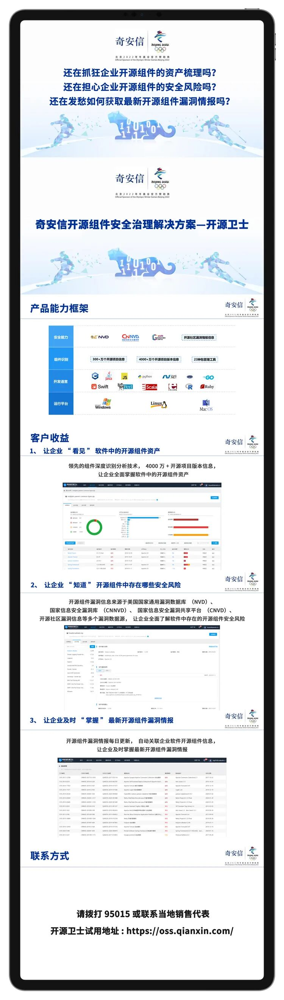

# Apache 项目中存在依赖混淆漏洞

<!-- vulwiki-editorial:start -->
## 校订与适用边界

- 适用前提：继续安装/构建归档项目、包解析会从公有源获取冲突包并运行代码
- 证据范围：下载超100次不等于100台被攻陷或生产执行，研究者占位包应区别真实恶意软件

### 尚未解决的证据缺口

以下限制仍适用于后文历史材料；相关版本、结果或修复结论不能据此视为已验证：

- 标题Apache项目过宽，应定位Cordova App Harness/供应链
- 缺包名、package配置及Legit原文/修复证据
- 不可避免地从公有源取包过度绝对化；推荐编号非主漏洞

本页为文本校订，未执行代码、PoC 或目标请求；原图仅保留引用，未据此确认复现成功。
<!-- vulwiki-editorial:end -->

## 技术正文与历史材料

 代码卫士   2024-04-23 15:16  
  
  
  
   
聚焦源代码安全，网罗国内外最新资讯！  
  
**作者：**  
**Alessandro Mascel**  
**lino**  
  
**编译：代码卫士**  
  
**已归档的一个 Apache 项目中存在一个依赖混淆漏洞。**  
  
  
  
Legit Security 公司发现了该漏洞，并表示这说明有必要审计第三方项目和依赖，尤其是被归档且有可能忽视了更新和安全补丁的第三方项目和依赖。该公司发布技术文章提到，尽管一般做法都是按照‘’如果没崩就不修”的心态将归档项目置之不理，但这些项目通常会含有未被修复的漏洞。  
  
依赖混淆也被称为“依赖劫持”或“替换攻击”，可使攻击者通过渗透开源软件中易受攻击依赖的方式，发动软件供应链攻击。当引用私有/本地程序包时，不可避免地会因为包管理器配置不当而从公开注册表中提取命名类似的恶意包，从而导致利用发生。  
  
Legit 安全团队通过利用归档 Apache 项目 Cordova App Harness“中的配置不当问题，展示了该漏洞的情况。研究人员以相同的名称上传了恶意包，成功劫持了该漏洞，三天内的下载量超过100次，这说明了归档项目仍在被继续使用以及它们所造成的潜在安全风险。利用该漏洞后，攻击者可在主机机器上执行任意代码，可能导致在生产环境中造成RCE后果。  
  
安全研究人员在3月24日将该问题告知 Apache。后者在24小时内证实了该漏洞的存在并接受了 Legit 公司提供的解决方案，即持有该私有包的公开版本以阻止遭利用。  
  
研究人员强调称，正确配置包管理器对于缓解依赖混淆风险至关重要。研究人员强调了采取主动安全措施和最佳实践的重要性，包括常规安全扫描、替换已降级项目、加固依赖配置安全、加强开发人员教育以及获悉最新威胁和最佳实践等。组织机构可借此加固其安全态势并保护软件生态系统免受潜在的攻陷和漏洞困扰。  
  
  
  
  
代码卫士试用地址：  
https://codesafe.qianxin.com  
  
开源卫士试用地址：https://oss.qianxin.com  
  
  
  
  
  
  
  
  
  
  
  
  
**推荐阅读**  
  
[【已复现】Apache OFBiz 远程代码执行漏洞(CVE-2023-51467)安全风险通告](http://mp.weixin.qq.com/s?__biz=MzI2NTg4OTc5Nw==&mid=2247518558&idx=1&sn=f0c9d4e2fed90fb991a8eb33bf83c83d&chksm=ea94b834dde331220ccaaf9b38a24400569f89b94484b4d335ad53352d52be4580d114ba1276&scene=21#wechat_redirect)  
  
  
[Apache OfBiz ERP 系统中存在严重 0day，可导致企业易受攻击](http://mp.weixin.qq.com/s?__biz=MzI2NTg4OTc5Nw==&mid=2247518521&idx=1&sn=1981e731d1738fca24d6f23367a2309a&chksm=ea94b853dde3314523bf4530e8e7dd8433fca5300463e3b5be814ffb24e432974a29cde2e393&scene=21#wechat_redirect)  
  
  
[【已复现】Apache Struts 文件上传漏洞(CVE-2023-50164)安全风险通告第二次更新](http://mp.weixin.qq.com/s?__biz=MzI2NTg4OTc5Nw==&mid=2247518338&idx=1&sn=689982ebdcb501d2d9f18440472dfa24&chksm=ea94b9e8dde330fe6d2c5cfd834fb076101c90adb766f55b6d2e4934ea3733a0860595c6b235&scene=21#wechat_redirect)  
  
  
[Apache Superset 漏洞导致服务器易遭RCE攻击](http://mp.weixin.qq.com/s?__biz=MzI2NTg4OTc5Nw==&mid=2247517599&idx=3&sn=f9b4133a88826774ba2370f315ddb483&chksm=ea94b4f5dde33de31fafd6622cb2b37398ceb935de72fe956bfdb5dc3d1b4a4ae61195437351&scene=21#wechat_redirect)  
  
  
[Apache Ivy 注入漏洞可导致攻击者提取敏感数据](http://mp.weixin.qq.com/s?__biz=MzI2NTg4OTc5Nw==&mid=2247517437&idx=2&sn=b43eb67509ce31f1726c7bb953adb331&chksm=ea94b597dde33c816cc6b6b60429447908b3cbafd3b5194aa4e547412a0c05805aa001546707&scene=21#wechat_redirect)  
  
  
  
  
**原文链接**  
  
  
https://www.infosecurity-magazine.com/news/dependency-confusion-flaw-found/  
  
  
题图：  
Pixabay  
 License  
  
****  
**本文由奇安信编译，不代表奇安信观点。转载请注明“转自奇安信代码卫士 https://codesafe.qianxin.com”。**  
  
  
  
  
  
  
  
  
**奇安信代码卫士 (codesafe)**  
  
国内首个专注于软件开发安全的产品线。  
  
     
  
   
觉得不错，就点个 “  
在看  
” 或 "  
赞  
” 吧~  
  

---

> 来源：gelusus/wxvl（微信公众号漏洞文章自动归档，原文见文首链接）
