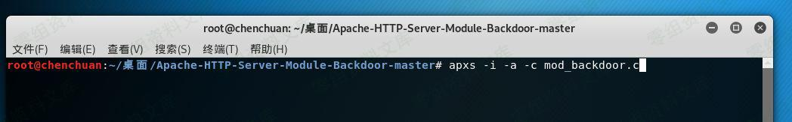

# Apache后门维持

<!-- vulwiki-editorial:start -->
## 校订与适用边界

- 适用前提：已有服务器写入/编译/安装模块并重启Apache的高权限
- 证据范围：不是漏洞条目，是已有权限后部署后门；外部工具源链接不完整，源码未提供

### 尚未解决的证据缺口

以下限制仍适用于后文历史材料；相关版本、结果或修复结论不能据此视为已验证：

- 漏洞影响空白，末尾image为失落内容占位
- 不应算新增漏洞或RCE未授权发现
- 可单独归工具/持久化技巧参考，明确安装权限和服务重启影响

本页为文本校订，未执行代码、PoC 或目标请求；原图仅保留引用，未据此确认复现成功。
<!-- vulwiki-editorial:end -->

## 技术正文与历史材料

一、漏洞简介
------------

通过运行第三方脚本，实现维持后门的方法

二、漏洞影响
------------

三、复现过程
------------

https://github.com/ianxtianxt/apache-

### 1、上传 mod\_backdoor.c到服务器，并执行命令

    apxs -i -a -c mod_backdoor.c && service apache2 restart

### 2、控制端执行方法

    python exploit.py 127.0.0.1 80

image
