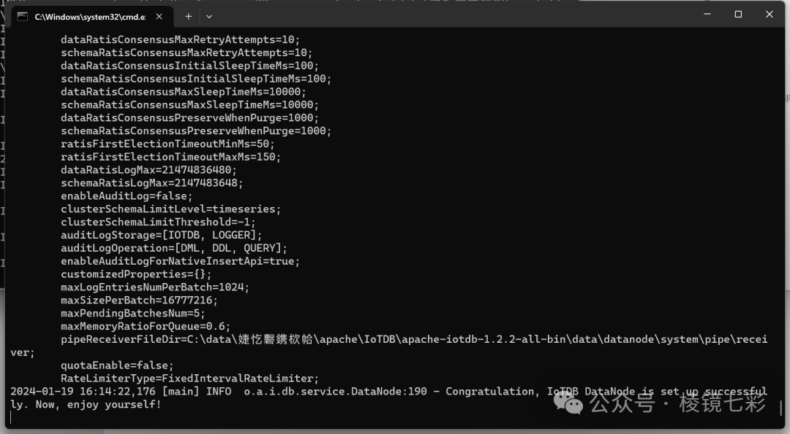
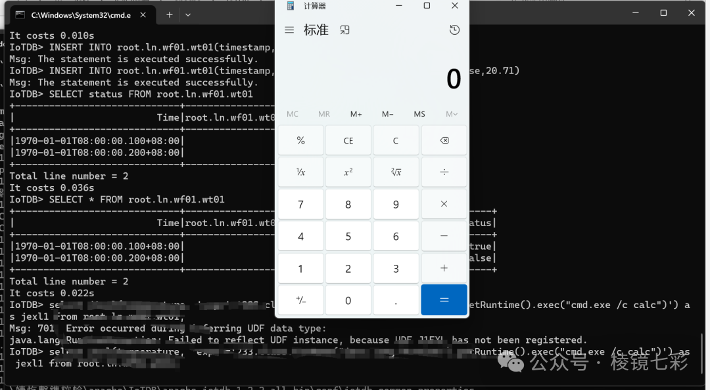
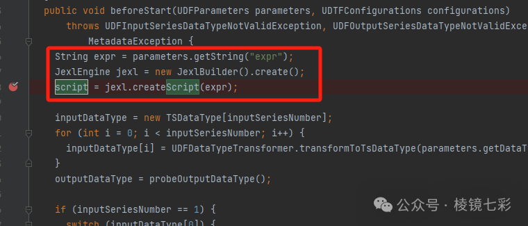
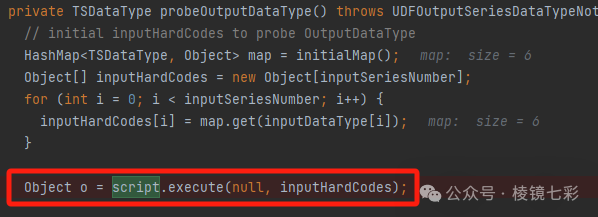
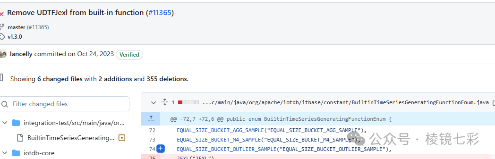

# CVE-2023-46226 Apache iotdb远程代码执行漏洞

<!-- vulwiki-editorial:start -->
## 校订与适用边界

- 适用前提：文列<=1.2.2、用户能执行相应SQL/UDF，默认root口令只额外配置风险
- 证据范围：说明expr经jexl3到probeOutputDataType，独立于24780远程JAR加载；具体载荷与补丁代码仅截图

### 尚未解决的证据缺口

以下限制仍适用于后文历史材料；相关版本、结果或修复结论不能据此视为已验证：

- 修复方式标题空白，缺正式安全版本及最早影响范围
- 开头配置UDF与后文内置UDF无需注册应区别
- 数据库分类应与IoTDB其他条目关联，但不得与24780合成同一CVE
- 大量推广图片/推荐可删，主技术证据需文字化

本页为文本校订，未执行代码、PoC 或目标请求；原图仅保留引用，未据此确认复现成功。
<!-- vulwiki-editorial:end -->

## 技术正文与历史材料

七彩安全研究院  WIN哥学安全   2024-01-20 22:19  
  
## 免责声明：  
  
由于传播、利用本公众号所提供的信息而造成的任何直接或者间接的后果及损失，均由使用者本人负责，公众号及作者不为此承担任何责任，一旦造成后果请自行承担！如有侵权烦请告知，我们会立即删除并致歉。谢谢！  
  
  
  
**项目地址**  
  
  
https://iotdb.apache.org/  
  
  
  
  
**项目介绍**  
  
  
Apache IoTDB 是针对时间序列数据收集、存储与分析一体化的数据管理引擎。它具有体量轻、性能高、易使用的特点，完美对接 Hadoop 与 Spark 生态，适用于工业物联网应用中海量时间序列数据高速写入和复杂分析查询的需求。  
  
  
  
**漏洞概述**  
  
  
JEXL是一个表达式语言引擎，全称是Java表达式语言(Java Expression Language)，可以在 java 程序中动态地运算一些表达式。  
  
在受影响版本中，由于IoTDB通过UDTFJexl.java实现 JEXL 表达式支持。攻击者可以通过配置 UDF，调用 JEXL表达式来执行 JAVA命令，导致存在远程代码执行漏洞。  
  
  
  
  
**影响版本**  
  
  
Apache IoTDB<= 1.2.2  
  
  
  
  
**环境搭建**  
  
  
  
1）下载1.2.2版本的IotDB  
  
https://archive.apache.org/dist/iotdb/1.2.2/  
  
2）启动IotDB  
  
sbin\start-standalone.bat  
  
  
  
  
  
  
**漏洞复现**  
  
  
  
  
  
  
**漏洞分析**  
  
  
Java Expression Language (JEXL) 是一个表达式语言引擎。Apache IoTdb使用JEXL 来扩展 UDF。具体解析位置如下：  
  
获取了sql中的expr参数值，然后调用jexl3库构建script  
  
  
  
在probeOutputDataType中最终执行  
  
  
  
分析发现，IoTdb没有对该参数进行任何过滤，由于该udf是内置udf，当攻击者具备权限执行sql语句时，可以直接调用，而IoTdb的默认账号密码是root、root，如果未修改账号密码，攻击者将直接控制服务器。  
  
官方直接通过删除了相关udf来修复了该漏洞。  
  
  
  
  
  
**修复方式**  
  
## 参考链接  
  
- https://iotdb.apache.org/zh/UserGuide/latest/stage/Operators-Functions/Lambda.html  
  
- https://github.com/apache/iotdb/commit/96f2164fe03c07055a42d92049f61adb1cecd3cb  
棱镜七彩  
  
  
  
  
往期推荐  
  
[【渗透实战】记一次针对某高校的渗透测试](https://mp.weixin.qq.com/s?__biz=MzkwODM3NjIxOQ==&mid=2247496571&idx=1&sn=f805b03a741f8e42718281a787539449&chksm=c0c8528ff7bfdb9980ef84d849a5912ede5f0d2bb424e563960d5811b65556231f6b44a54034&scene=21#wechat_redirect)  
  
  
[【漏洞复现】GitLab 任意用户密码重置漏洞（CVE-2023-7028）](https://mp.weixin.qq.com/s?__biz=MzkwODM3NjIxOQ==&mid=2247496563&idx=1&sn=abe28349e078915cb76ff878436e5513&chksm=c0c85287f7bfdb915effc064f5bc85a2797270866eaa4c85d4279674474c51aa8e5ad842906e&scene=21#wechat_redirect)  
  
  
[【攻防实战】地市红队攻防演练经验总结](https://mp.weixin.qq.com/s?__biz=MzkwODM3NjIxOQ==&mid=2247496557&idx=1&sn=a550d9da526dd0d390b882bb10e249e4&chksm=c0c85299f7bfdb8f158a8905a46217c7913718167e91358a0c3d830b5368c0fa7266c973e80c&scene=21#wechat_redirect)  
  
  
[如何随时随地体验AWD比赛（一键启动靶机版）](https://mp.weixin.qq.com/s?__biz=MzkwODM3NjIxOQ==&mid=2247496465&idx=1&sn=e72a117e4d831d71041ef76a90e6f25a&chksm=c0c852e5f7bfdbf3b5a4ed366e7e2badbe6b3aad58a03df619d89f41e4fd17ff0261c85d77fa&scene=21#wechat_redirect)  
  
  
[【渗透实战】手把手教你WIFI渗透](https://mp.weixin.qq.com/s?__biz=MzkwODM3NjIxOQ==&mid=2247496431&idx=1&sn=23fd8ddbf19bf68f39d8e06b21a68c09&chksm=c0c8531bf7bfda0db58084a2f47edb398d66e05d6caac2bea490fba8a265b2be97b9ffe03cb0&scene=21#wechat_redirect)  
  
  
[【建议收藏】网络安全红队常用的攻击方法及路径](https://mp.weixin.qq.com/s?__biz=MzkwODM3NjIxOQ==&mid=2247496396&idx=1&sn=1ee96d86aba3ad0c70baa6fea81f6c97&chksm=c0c85338f7bfda2ebb919ec5cc3cec14acb9fe9405fa849f749a0c51caacea193d441232b9e0&scene=21#wechat_redirect)  
  
  
[【红队】一款高效的企业资产收集工具](https://mp.weixin.qq.com/s?__biz=MzkwODM3NjIxOQ==&mid=2247495909&idx=1&sn=989840c2dbf9fe8ed7a1d44028de93c8&chksm=c0c85111f7bfd807a136299c79013d3bf51eb9f5c17e664f4f8649ab5cc02be0246ecefbf6b1&scene=21#wechat_redirect)  
  
  
[记两次内网入侵溯源](https://mp.weixin.qq.com/s?__biz=MzkwODM3NjIxOQ==&mid=2247495867&idx=1&sn=71b6524e6da6843e72dd98842fb26371&chksm=c0c8514ff7bfd8590e38649313852e7365e3d3f4f5235d615d4fb2561475ea8a9c6303d714be&scene=21#wechat_redirect)  
  
  
[【等保工具】等级保护现场测评工具](https://mp.weixin.qq.com/s?__biz=MzkwODM3NjIxOQ==&mid=2247495848&idx=1&sn=acb6c8c401efe43fb368168f8272777f&chksm=c0c8515cf7bfd84a295c2b14a59f0edf93b094e458f122926303bba1865395bc2763fec04878&scene=21#wechat_redirect)  
  
  
  
  

---

> 来源：gelusus/wxvl（微信公众号漏洞文章自动归档，原文见文首链接）
