# Web 中间件常见漏洞总结

<!-- vulwiki-editorial:start -->
## 校订与适用边界

- 适用前提：每节版本/权限/配置不同，多数为危险部署或已有管理权限；不能整篇归Apache单一漏洞
- 证据范围：全文22985字符分两段读完，原理/步骤/修复存在，主要PoC和截图未文字化；多处把页面状态当漏洞证据

### 本次正文校订

- 按实际内容修正 2 处代码围栏语言标记，保留其中方法与请求内容。

### 尚未解决的证据缺口

以下限制仍适用于后文历史材料；相关版本、结果或修复结论不能据此视为已验证：

- JBoss /invoker/readonly返回500不等于存在可利用反序列化
- Nginx autoindex是目录列举非路径穿越，PHP解析须FPM配置；.gif.2.php与pathinfo示例矛盾
- HTTPd不一定从右向左直到未知后缀，是多扩展处理器/配置语义；Options指令缺空格
- PHP-FPM仅更改端口不是有效修复，应限制监听/访问控制
- PHP5.3.12安全结论遗漏后续绕过/分支修复；WebLogic把.jsp改.jspx未证能消除功能，可能仍被映射
- IIS短文件名禁新建不移除既存短名；跨盘重命名步骤不成立
- Tomcat不是HTTPd扩展，manager-gui等是角色不是目录；多段命令黏连、参数拼错
- 多项固定漏洞无编号/版本，管理war部署需与代码缺陷分开

### 操作风险与资料使用

- 含落盘脚本或账户创建：会留下持久状态。记录本次生成的路径或账户，测试后清理这些对象并撤销关联令牌；不要删除既有业务对象。

本页为文本校订，未执行代码、PoC 或目标请求；原图仅保留引用，未据此确认复现成功。
<!-- vulwiki-editorial:end -->

## 技术正文与历史材料

<meta name="referrer" content="no-referrer"/>

> 本文由 [简悦 SimpRead](http://ksria.com/simpread/) 转码， 原文地址 [mp.weixin.qq.com](https://mp.weixin.qq.com/s/WKHi90lOtubwMc28fNwVCw)

一、 常见 web 中间件及其漏洞概述
-------------------

### （一） IIS

1、PUT 漏洞

2、短文件名猜解

3、远程代码执行

4、解析漏洞

### （二） Apache

1、解析漏洞

2、目录遍历

### （三） Nginx

1、文件解析

2、目录遍历

3、CRLF 注入

4、目录穿越

### （四）Tomcat

1、远程代码执行

2、war 后门文件部署

### （五）jBoss

1、反序列化漏洞

2、war 后门文件部署

### （六）WebLogic

1、反序列化漏洞

2、SSRF

3、任意文件上传

4、war 后门文件部署

### （七）其它中间件相关漏洞

1、FastCGI 未授权访问、任意命令执行

2、PHPCGI 远程代码执行

二、 IIS 漏洞分析
-----------

### （一） IIS 简介

IIS 是 Internet Information Services 的缩写，意为互联网信息服务，是由微软公司提供的基于运行 Microsoft Windows 的互联网基本服务。最初是 Windows NT 版本的可选包，随后内置在 Windows 2000、Windows XP Professional 和 Windows Server 2003 一起发行，但在 Windows XP Home 版本上并没有 IIS。IIS 是一种 Web（网页）服务组件，其中包括 Web 服务器、FTP 服务器、NNTP 服务器和 SMTP 服务器，分别用于网页浏览、文件传输、新闻服务和邮件发送等方面，它使得在网络（包括互联网和局域网）上发布信息成了一件很容易的事。

IIS 的安全脆弱性曾长时间被业内诟病，一旦 IIS 出现远程执行漏洞威胁将会非常严重。远程执行代码漏洞存在于 HTTP 协议堆栈 (HTTP.sys) 中，当 HTTP.sys 未正确分析经特殊设计的 HTTP 请求时会导致此漏洞。成功利用此漏洞的攻击者可以在系统帐户的上下文中执行任意代码，可以导致 IIS 服务器所在机器蓝屏或读取其内存中的机密数据

### （二） PUT 漏洞

**1、漏洞介绍及成因**

IIS Server 在 Web 服务扩展中开启了 WebDAV ，配置了可以写入的权限，造成任意文件上传。

版本：IIS6.0

**2、漏洞复现**

1） 开启 WebDAV 和写权限

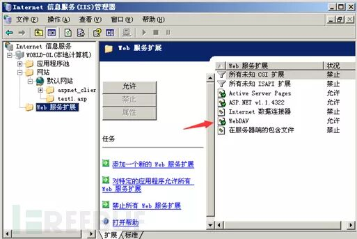

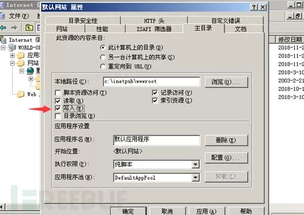

2） 利用 burp 测试

抓包，将 GET 请求改为 OPTIONS

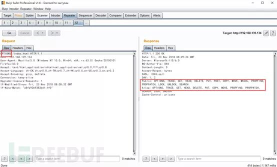

3）利用工具进行测试

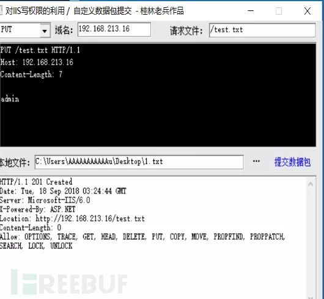

成功上传，再上传一句话木马，然后用菜刀连接，getshell

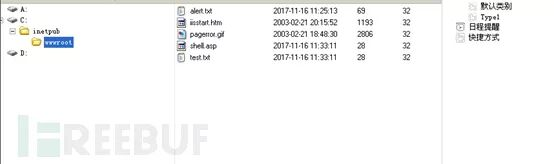

**3、漏洞修复**

关闭 WebDAV 和写权限

### （二）短文件名猜解

**1、漏洞介绍及成因**

IIS 的短文件名机制，可以暴力猜解短文件名，访问构造的某个存在的短文件名，会返回 404，访问构造的某个不存在的短文件名，返回 400。

**2、漏洞复现**

1）、在网站根目录下添加 aaaaaaaaaa.html 文件

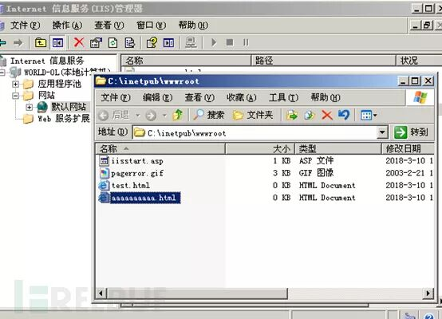

3） 进行猜解

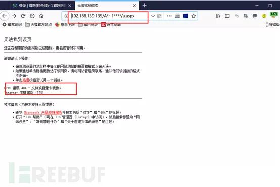

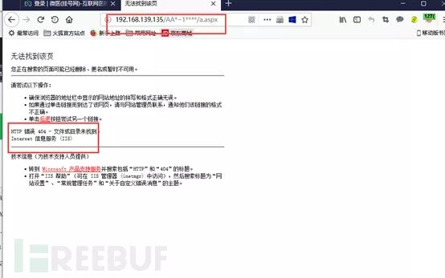

**3、漏洞修复**

修复方法：

1）升级. net framework

2）修改注册表禁用短文件名功能

快捷键 Win+R 打开命令窗口，输入 regedit 打开注册表窗口，找到路径：

HKEY\_LOCAL\_MACHINE\\SYSTEM\\CurrentControlSet\\Control\\FileSystem，将其中的 NtfsDisable8dot3NameCreation 这一项的值设为 1，1 代表不创建短文件名格式，修改完成后，需要重启系统生效

3）CMD 关闭 NTFS 8.3 文件格式的支持

4）将 web 文件夹的内容拷贝到另一个位置，如 c:\\www 到 d:\\w, 然后删除原文件夹，再重命名 d:\\w 到 c:\\www。

修复后：

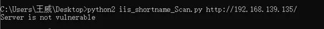

**4、局限性**

1) 此漏洞只能确定前 6 个字符，如果后面的字符太长、包含特殊字符，很难猜解；

2) 如果文件名本身太短（无短文件名）也是无法猜解的；

3) 如果文件名前 6 位带空格，8.3 格式的短文件名会补进，和真实文件名不匹配；

### （三） 远程代码执行

**1、 漏洞介绍及成因**

在 IIS6.0 处理 PROPFIND 指令的时候，由于对 url 的长度没有进行有效的长度控制和检查，导致执行 memcpy 对虚拟路径进行构造的时候，引发栈溢出，从而导致远程代码执行。

**2、 漏洞复现**

1）漏洞环境搭建

在 windows server 2003 r2 32 位上安装 iis6.0

2） 触发漏洞

在本地执行 exp，exp 如下

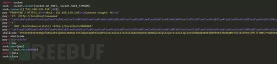

执行成功后，服务器端弹出计算器：

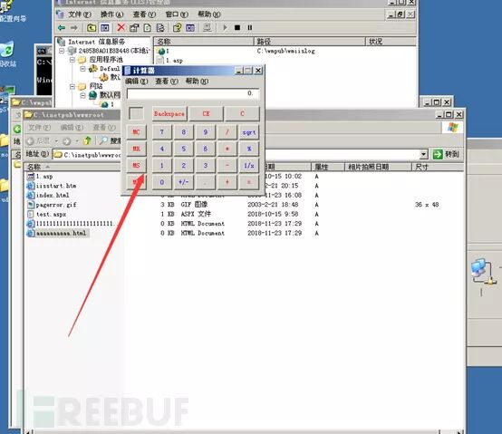

**3、 漏洞修复**

1）关闭 WebDAV 服务

2） 使用相关防护设备

### （四） 解析漏洞

**1、 漏洞介绍及成因**

IIS 6.0 在处理含有特殊符号的文件路径时会出现逻辑错误，从而造成文件解析漏洞。这一漏洞有两种完全不同的利用方式：

```
/test.asp/test.jpgtest.asp;.jpg
```

**2、漏洞复现**

利用方式 1

第一种是新建一个名为 “test.asp” 的目录，该目录中的任何文件都被 IIS 当作 asp 程序执行（特殊符号是 “/” ）


利用方式 2

第二种是上传名为 “test.asp;.jpg” 的文件，虽然该文件真正的后缀名是 “.jpg”, 但由于含有特殊符号 “;” ，仍会被 IIS 当做 asp 程序执行


IIS7.5 文件解析漏洞

```
test.jpg/.php
```

URL 中文件后缀是 .php ，便无论该文件是否存在，都直接交给 php 处理，而 php 又默认开启 “cgi.fix\_pathinfo”, 会对文件进行 “ 修理 ” ，可谓 “ 修理 ” ？举个例子，当 php 遇到路径 “/aaa.xxx/bbb.yyy” 时，若 “/aaa.xxx/bbb.yyy” 不存在，则会去掉最后的 “bbb.yyy” ，然后判断 “/aaa.xxx” 是否存在，若存在，则把 “/aaa.xxx” 当作文件。

若有文件 test.jpg ，访问时在其后加 /.php ，便可以把 “test.jpg/.php” 交给 php ， php 修理文件路径 “test.jpg/.php” 得到 ”test.jpg” ，该文件存在，便把该文件作为 php 程序执行了。

**3、 漏洞修复**

1）对新建目录文件名进行过滤，不允许新建包含‘.’的文件

2）曲线网站后台新建目录的功能，不允许新建目录

3）限制上传的脚本执行权限，不允许执行脚本

4）过滤. asp/xm.jpg，通过 ISApi 组件过滤

三、 Apache 漏洞分析
--------------

### （一） Apache 简介

Apache 是世界使用排名第一的 Web 服务器软件。它可以运行在几乎所有广泛使用的 计算机平台上，由于其 跨平台 和安全性被广泛使用，是最流行的 Web 服务器端软件之一。它快速、可靠并且可通过简单的 API 扩充，将 Perl/ Python 等 解释器编译到服务器中。

### （二） 解析漏洞

**1、 漏洞介绍及成因**

Apache 文件解析漏洞与用户的配置有密切关系，严格来说属于用户配置问题。

Apache 文件解析漏洞涉及到一个解析文件的特性：

Apache 默认一个文件可以有多个以点分隔的后缀，当右边的后缀无法识别（不在 mime.tyoes 内），则继续向左识别，当我们请求这样一个文件：shell.xxx.yyy

```
yyy->无法识别，向左xxx->无法识别，向左
```

php-> 发现后缀是 php，交给 php 处理这个文件

**2、 漏洞复现**

上传一个后缀名为 360 的 php 文件

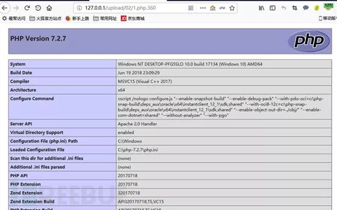

**3、 漏洞修复**

将 AddHandler application/x-httpd-php .php 的配置文件删除。

### （三） 目录遍历

**1、 漏洞介绍及成因**

由于配置错误导致的目录遍历

**2、 漏洞复现**

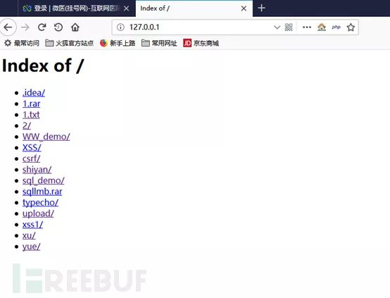

**3、 漏洞修复**

修改 apache 配置文件 httpd.conf

找到 Options+Indexes+FollowSymLinks +ExecCGI 并修改成 Options-Indexes+FollowSymLinks +ExecCGI 并保存；

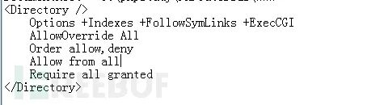


四、 Nginx 漏洞分析
-------------

### （一） Nginx 简介

Nginx 是一款 轻量级的 Web 服务器、 反向代理 服务器及 电子邮件（IMAP/POP3）代理服务器，并在一个 BSD-like 协议下发行。其特点是占有内存少， 并发能力强，事实上 nginx 的并发能力确实在同类型的网页服务器中表现较好

### （二）文件解析

**1、 漏洞介绍及成因**

对任意文件名，在后面添加 / 任意文件名. php 的解析漏洞，比如原本文件名是 test.jpg，可以添加 test.jpg/x.php 进行解析攻击。

**2、 漏洞复现**

在网站根目录下新建一个 i.gif 的文件，在里面写入 phpinfo()

在浏览器中打开

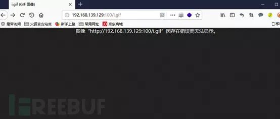

利用文件解析漏洞，输入 192.168.139.129:100/i.gif.2.php, 发现无法解析

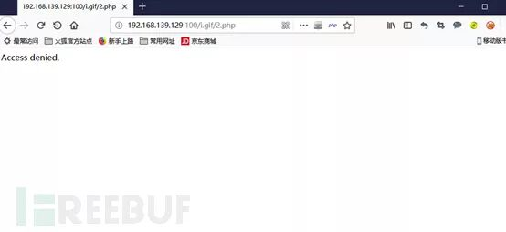

将 / etc/php5/fpm/pool.d/www.conf 中 security.limit\_extensions = .php 中的. php 删除

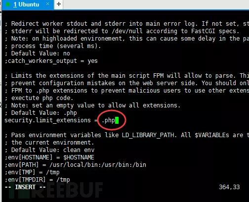

再次在浏览器中打开，成功解析

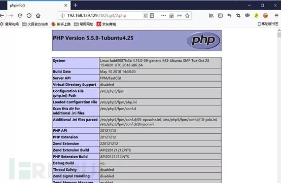

**3、 漏洞修复**

1） 将 php.ini 文件中的 cgi.fix\_pathinfo 的值设为 0. 这样 php 在解析 1.php/1.jpg 这样的目录时，只要 1.jpg 不存在就会显示 404；

2） 将 / etc/php5/fpm/pool.d/www.conf 中 security.limit\_ectensions 后面的值设为. php

### （三）目录遍历

**1、 漏洞简介及成因**

Nginx 的目录遍历与 Apache 一样，属于配置方面的问题，错误的配置可到导致目录遍历与源码泄露。

**2、 漏洞复现**

打开 test 目录，发现无法打开

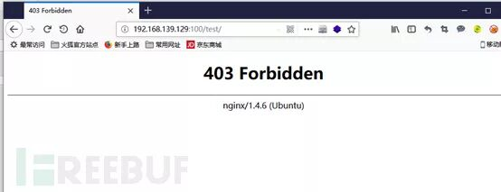

修改 / etc/nginx/sites-avaliable/default，在如下图所示的位置添加 autoindex on。

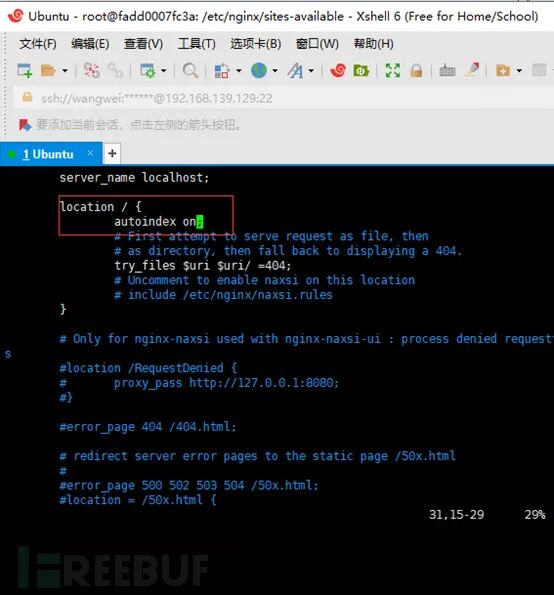

再次访问

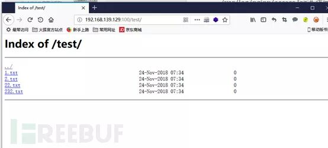

**3、 漏洞修复**

将 / etc/nginx/sites-avaliable/default 里的 autoindex on 改为 autoindex off

### （四） CRLF 注入

**1、 漏洞简介及成因**

CRLF 时 “回车 + 换行”（\\r\\n）的简称。

HTTP Header 与 HTTP Body 时用两个 CRLF 分隔的，浏览器根据两个 CRLF 来取出 HTTP 内容并显示出来。

通过控制 HTTP 消息头中的字符，注入一些恶意的换行，就能注入一些会话 cookie 或者 html 代码，由于 Nginx 配置不正确，导致注入的代码会被执行。

**2、 漏洞复现**

访问页面，抓包

请求加上 /%0d%0a%0d%0

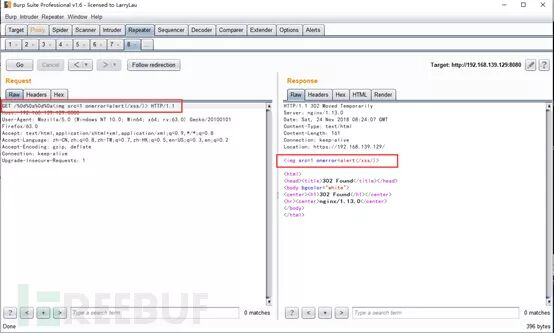

由于页面重定向，并没有弹窗。

**3、 漏洞修复**

Nginx 的配置文件 / etc/nginx/conf.d/error1.conf 修改为使用不解码的 url 跳转。

### （五） 目录穿越

**1、 漏洞简介及成因**

Nginx 反向代理，静态文件存储在 / home / 下，而访问时需要在 url 中输入 files，配置文件中 / files 没有用 / 闭合，导致可以穿越至上层目录。

**2、 漏洞复现**

访问：http://192.168.139.128:8081/files/

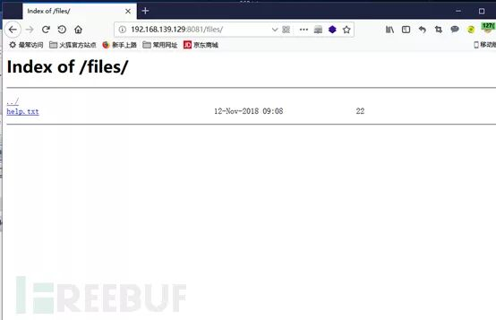

访问：http://192.168.139.128:8081/files../

成功实现目录穿越：

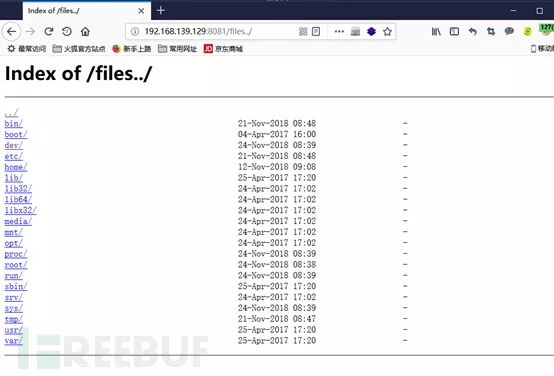

**3、 漏洞修复**

Nginx 的配置文件 / etc/nginx/conf.d/error2.conf 的 / files 使用 / 闭合。

五、 Tomcat 漏洞分析
--------------

### （一） Tomcat 简介

Tomcat 服务器是一个免费的开放源代码的 Web 应用服务器，属于轻量级应用 服务器，在中小型系统和并发访问用户不是很多的场合下被普遍使用，是开发和调试 JSP 程序的首选。对于一个初学者来说，可以这样认为，当在一台机器上配置好 Apache 服务器，可利用它响应 HTML （ 标准通用标记语言下的一个应用）页面的访问请求。实际上 Tomcat 是 Apache 服务器的扩展，但运行时它是独立运行的，所以当运行 tomcat 时，它实际上作为一个与 Apache 独立的进程单独运行的。

### （二） 远程代码执行

**1、 漏洞简介及成因**

Tomcat 运行在 Windows 主机上，且启用了 HTTP PUT 请求方法，可通过构造的攻击请求向服务器上传包含任意代码的 JSP 文件，造成任意代码执行。

影响版本：Apache Tomcat 7.0.0 – 7.0.81

**2、 漏洞复现**

配置漏洞，开启 put 方法可上传文件功能。

tomcat 文件夹下的 / conf/web.xml 文件插入：

```
    <init-param>           <param-name>readonly</param-name>           <param-value>false</param-value>     </init-param>
```

重启 tomcat 服务。

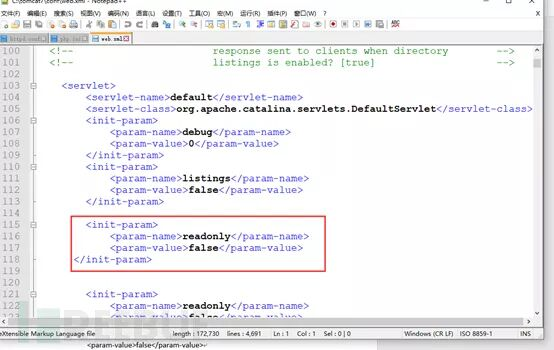

访问 127.0.0.1：8080，burp 抓包，send to Repeater，将请求方式改为 PUT，创建一个 122.jsp，并用 %20 转义空格字符。123.jsp 内容为：

```
<%Runtime.getRuntime().exec(request.getParameter("cmd"));%>
```

返回 201，说明创建成功。

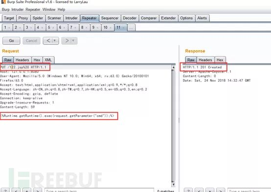

访问 127.0.0.1：8080/122.jsp?cmd=calc。

弹出计算器：

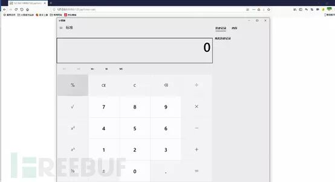

**3、 漏洞修复**

1）检测当前版本是否在影响范围内，并禁用 PUT 方法。

2）更新并升级至最新版。

### （三）war 后门文件部署

**1、漏洞简介及成因**

Tomcat 支持在后台部署 war 文件，可以直接将 webshell 部署到 web 目录下。

若后台管理页面存在弱口令，则可以通过爆破获取密码。

**2、漏洞复现**

Tomcat 安装目录下 conf 里的 tomcat-users.xml 配置如下：

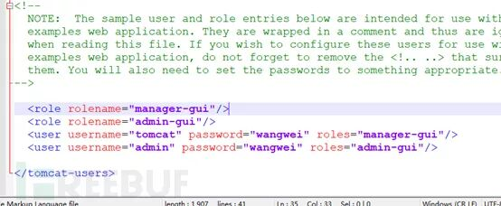

访问后台，登陆：

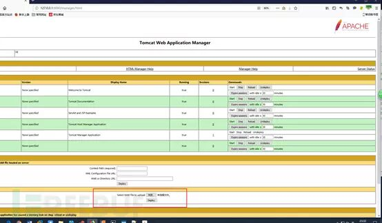

上传一个 war 包，里面是 jsp 后门：

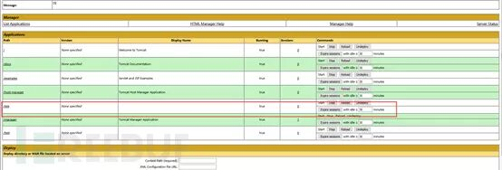

成功上传并解析，打开：

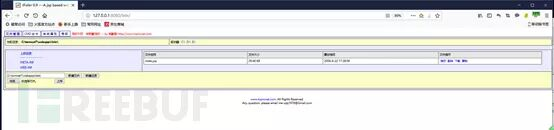

可执行系统命令：

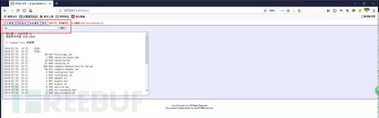

也可进行文件管理，任意查看、删除、上传文件：

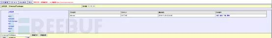

**3、漏洞修复**

1）在系统上以低权限运行 Tomcat 应用程序。创建一个专门的 Tomcat 服务用户，该用户只能拥有一组最小权限（例如不允许远程登录）。

2）增加对于本地和基于证书的身份验证，部署账户锁定机制（对于集中式认证，目录服务也要做相应配置）。在 CATALINA\_HOME/conf/web.xml 文件设置锁定机制和时间超时限制。

3）以及针对 manager-gui/manager-status/manager-script 等目录页面设置最小权限访问限制。

4）后台管理避免弱口令。

六、 jBoss 漏洞分析
-------------

### （一） jBoss 简介

jBoss 是一个基于 J2EE 的开发源代码的应用服务器。JBoss 代码遵循 LGPL 许可，可以在任何商业应用中免费使用。JBoss 是一个管理 EJB 的容器和服务器，支持 EJB1.1、EJB 2.0 和 EJB3 的规范。但 JBoss 核心服务不包括支持 servlet/JSP 的 WEB 容器，一般与 Tomcat 或 Jetty 绑定使用。

### （二） 反序列化漏洞

**1、 漏洞介绍及成因**

Java 序列化，简而言之就是把 java 对象转化为字节序列的过程。而反序列话则是再把字节序列恢复为 java 对象的过程，然而就在这一转一变得过程中，程序员的过滤不严格，就可以导致恶意构造的代码的实现。

**2、 漏洞复现**

靶机启动 jboss。

攻击机访问靶机服务：

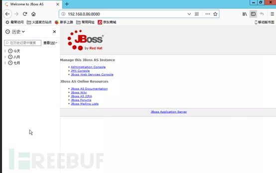

访问 / invoker/readonly。

返回 500，说明页面存在，此页面有反序列化漏洞：

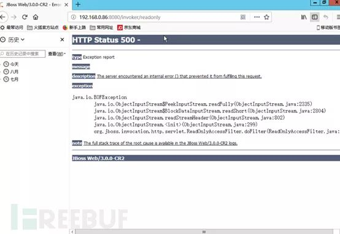

抓包：

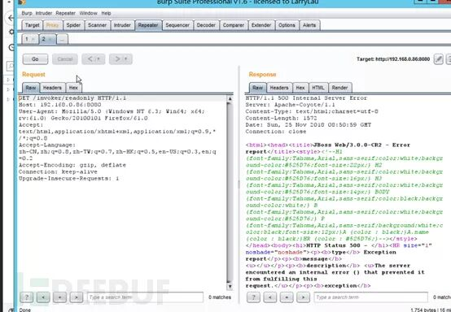

改包。

POST payload.bin 中数据。

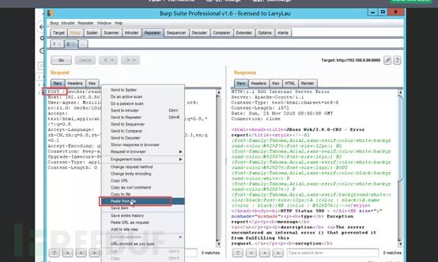

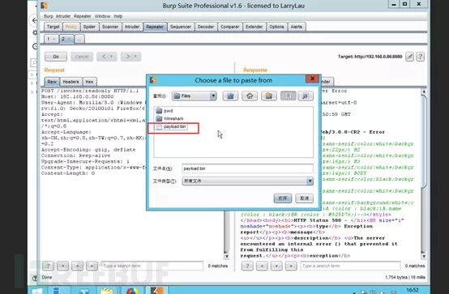

查看靶机，弹出计算器。

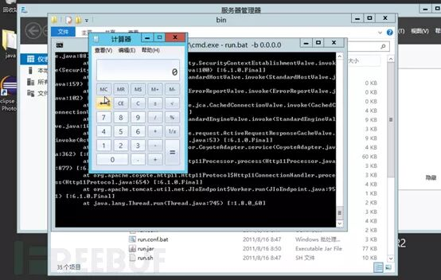

**3、 漏洞修复**

有效解决方案：升级到 JBOSS AS7 版本临时解决方案：

1）不需要 http-invoker.sar 组件的用户可直接删除此组件；

2）用于对 httpinvoker 组件进行访问控制。

### （三） war 后门文件部署

**1、 漏洞介绍及成因**

jBoss 后台管理页面存在弱口令，通过爆破获得账号密码。登陆后台上传包含后门的 war 包。

**2、 漏洞复现**

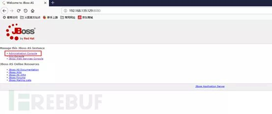

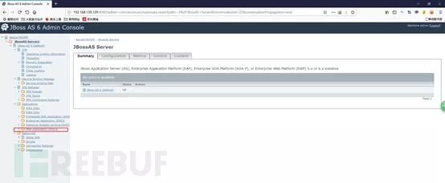

点击 Web Application(war)s。

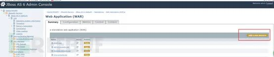

点击 add a new resource。

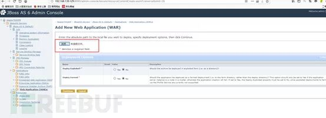

选择一个 war 包上传，上传后，进入该 war 包，点击 start。

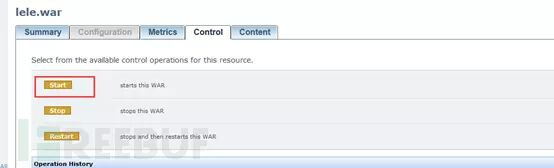

查看 status 为 sucessful。

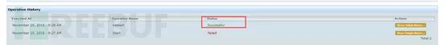

访问该 war 包页面，进入后门。

可进行文件管理和系统命令执行。

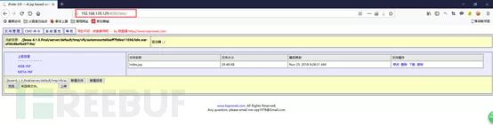

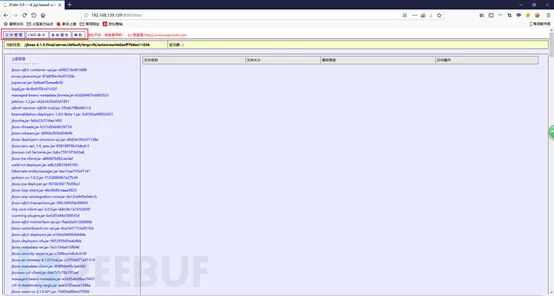

七、 WebLogic 漏洞分析
----------------

### （一） WebLogic 简介

WebLogic 是美国 Oracle 公司出品的一个 applicationserver，确切的说是一个基于 JAVAEE 架构的中间件，WebLogic 是用于开发、集成、部署和管理大型分布式 Web 应用、网络应用和数据库应用的 Java 应用服务器。将 Java 的动态功能和 Java Enterprise 标准的安全性引入大型网络应用的开发、集成、部署和管理之中。

### （二） 反序列化漏洞

**1、 漏洞简介及成因**

Java 序列化，简而言之就是把 java 对象转化为字节序列的过程。而反序列话则是再把字节序列恢复为 java 对象的过程，然而就在这一转一变得过程中，程序员的过滤不严格，就可以导致恶意构造的代码的实现。

**2、漏洞复现**

使用 vulhub 实验环境，启动实验环境，访问靶机，抓包，修改数据包。

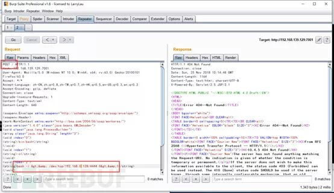

Kali 启动监听。

发送数据包成功后，拿到 shell。

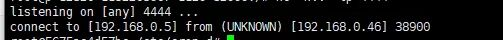

**3、漏洞修复**

1）升级 Oracle 10 月份补丁。

2）对访问 wls-wsat 的资源进行访问控制。

### （三） SSRF

**1、 漏洞简介及成因**

Weblogic 中存在一个 SSRF 漏洞，利用该漏洞可以发送任意 HTTP 请求，进而攻击内网中 redis、fastcgi 等脆弱组件。

**2、 漏洞复现**

使用 vulhub 实验环境，启动环境。

访问 http://192.168.139.129:7001/uddiexplorer/SearchPublicRegistries.jsp。

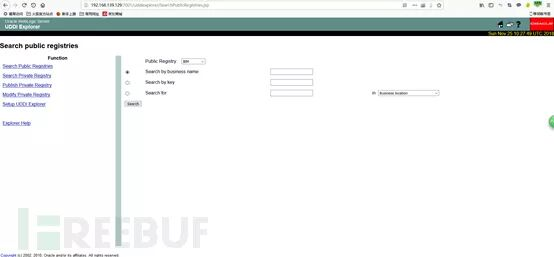

用 burp 抓包，修改请求。


启动 nc 监听 2222 端口。


拿到 shell。

**3、 漏洞修复**

方法一：

以修复的直接方法是将 SearchPublicRegistries.jsp 直接删除就好了；

方法二：

1）删除 uddiexplorer 文件夹

2）限制 uddiexplorer 应用只能内网访问

方法三：（常用）

Weblogic 服务端请求伪造漏洞出现在 uddi 组件（所以安装 Weblogic 时如果没有选择 uddi 组件那么就不会有该漏洞），更准确地说是 uudi 包实现包 uddiexplorer.war 下的 SearchPublicRegistries.jsp。方法二采用的是改后辍的方式，修复步骤如下：

1）将 weblogic 安装目录下的 wlserver\_10.3/server/lib/uddiexplorer.war 做好备份

2）将 weblogic 安装目录下的 server/lib/uddiexplorer.war 下载

3）用 winrar 等工具打开 uddiexplorer.war

4) 将其下的 SearchPublicRegistries.jsp 重命名为 SearchPublicRegistries.jspx

5）保存后上传回服务端替换原先的 uddiexplorer.war

6）对于多台主机组成的集群，针对每台主机都要做这样的操作

7）由于每个 server 的 tmp 目录下都有缓存所以修改后要彻底重启 weblogic（即停应用—停 server—停控制台—启控制台—启 server—启应用）

### （四） 任意文件上传

**1、 漏洞简介及成因**

通过访问 config.do 配置页面，先更改 Work Home 工作目录，用有效的已部署的 Web 应用目录替换默认的存储 JKS Keystores 文件的目录，之后使用” 添加 Keystore 设置” 的功能，可上传恶意的 JSP 脚本文件。

**2、 漏洞复现**

访问 http://192.168.139.129:7001/ws\_utc/config.do。


设置 Work Home Dir 为`/u01/oracle/user_projects/domains/base_domain/servers/AdminServer/tmp/_WL_internal/com.oracle.webservices.wls.ws-testclient-app-wls/4mcj4y/war/css`。

然后点击安全 -> 增加，然后上传 webshell ，这里我上传一个 jsp 大马。


上传后，查看返回的数据包，其中有时间戳：


可以看到时间戳为 1543145154632。

访问 http://192.168.139.129:7001/ws\_utc/css/config/keystore/1543145154632\_lele.jsp。

可以进行文件管理、文件上传、系统命令执行等。


尝试以下执行系统命令。


命令执行成功。

**3、 漏洞修复**

方案 1：

使用 Oracle 官方通告中的补丁链接：

http://www.oracle.com/technetwork/security-advisory/cpujul2018-4258247.html

https://support.oracle.com/rs?type=doc&id=2394520.1

方案 2:

1）进入 Weblogic Server 管理控制台；

2）domain 设置中，启用” 生产模式”。

### （五） war 后门文件部署

**1、 漏洞简介及成因**

由于 WebLogic 后台存在弱口令，可直接登陆后台上传包含后门的 war 包。

**2、 漏洞复现**

访问 http://192.168.139.129:7001/console


使用弱口令登陆至后台。

点击锁定并编辑。


选择部署，进一步点击右边的安装。


点击上传文件 — 进入文件上传界面，选择要上传的 war 包。


进入下一步，选择对应的 war 包进行部署，下一步下一步直至完成。


点击激活更改。


启动上传的 war 包所生成的服务。


拿到 webshell。


**3、 漏洞修复**

防火墙设置端口过滤，也可以设置只允许访问后台的 IP 列表，避免后台弱口令。

八、 其它中间件相关漏洞
------------

### （一） FastCGI 未授权访问、任意命令执行

**1、 漏洞简介及成因**

服务端使用 fastcgi 协议并对外网开放 9000 端口，可以构造 fastcgi 协议包内容，实现未授权访问服务端. php 文件以及执行任意命令。

**2、 漏洞复现**

使用 vulhub 实验环境，启动实验环境。

在攻击机使用命令 python fpm.py 192.168.237.136 /etc/passwd，观察返回结果。


由于访问非 \*.PHP 文件，所以返回结果 403。

使用命令执行一个默认存在的 php 文件。

```shell
python fpm.py 192.168.237.136 /usr/local/lib/php/PEAR.php
```


利用命令进行任意命令执行复现。

```shell
python fpm.py 192.168.139.129 /usr/local/lib/php/PEAR.php-c '<?php echo \`pwd\`; ?>'python fpm.py 192.168.139.129 /usr/local/lib/php/PEAR.php-c '<?php echo \`ifconfig\`; ?>'python fpm.py 192.168.139.129 /usr/local/lib/php/PEAR.php-c '<?php echo \`ls\`; ?>'
```


**3、 漏洞修复**

更改默认端口

### （二） PHPCGI 远程代码执行

**1、 漏洞简介及成因**

在 apache 调用 php 解释器解释. php 文件时，会将 url 参数传我给 php 解释器，如果在 url 后加传命令行开关（例如 - s、-d 、-c 或 - dauto\_prepend\_file%3d/etc/passwd+-n）等参数时，会导致源代码泄露和任意代码执行。

此漏洞影响 php-5.3.12 以前的版本，mod 方式、fpm 方式不受影响。

**2、 漏洞复现**

使用 vulhub 实验环境，启动环境。

访问 http://192.168.139.129:8080/index.php。


抓包，修改包。


命令成功执行。

**3、 漏洞修复**

三种方法：

1）升级 php 版本；（php-5.3.12 以上版本）;

2）在 apache 上做文章，开启 url 过滤，把危险的命令行参数给过滤掉，由于这种方法修补比较简单，采用比较多吧。

具体做法：

修改 http.conf 文件，找到增加以下三行

RewriteEngine on

RewriteCond %{QUERY\_STRING} ^(%2d|-)\[^=\]+$ \[NC\]

RewriteRule ^(.\*) $1? \[L\]

重启一下 apache 即可，但是要考虑到，相当于每次 request 就要进行一次 url 过滤，如果访问量大的话，可能会增加 apache 的负担。

3）打上 php 补丁。

补丁下载地址: https://eindbazen.net/2012/05/php-cgi-advisory-cve-2012-1823/

**\* 本文作者：ningjing，本文属 FreeBuf 原创奖励计划，未经许可禁止转载。**

****扫描关注乌云安全****


---

> 来源：MrWQ/vulnerability-paper（https://github.com/MrWQ/vulnerability-paper）
