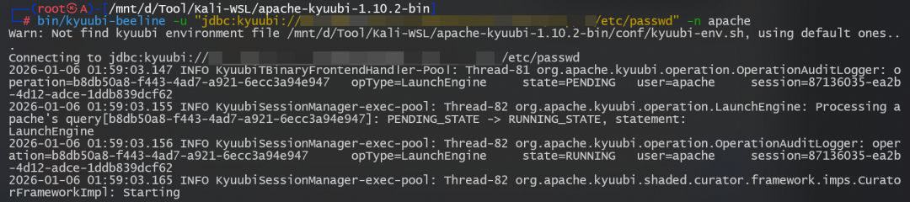
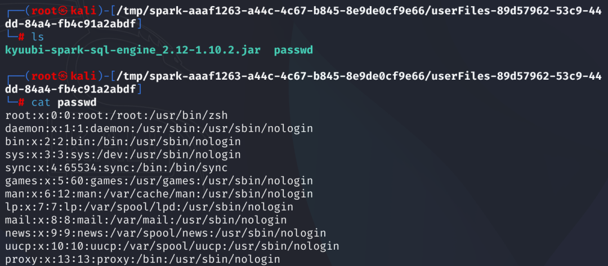

# 【已复现】Apache Kyuubi存在目录遍历漏洞（CVE-2025-66518）

<!-- vulwiki-editorial:start -->
## 校订与适用边界

- 适用前提：能经Kyuubi前端协议访问服务的低权限客户端、kyuubi.session.local.dir.allow.list安全边界；服务账户文件权限仍适用
- 证据范围：范围1.6.0–<1.10.3、固定1.10.3、CVSS8.3向量自洽；复现只有研究者截图，不能自行确认成功

### 尚未解决的证据缺口

以下限制仍适用于后文历史材料；相关版本、结果或修复结论不能据此视为已验证：

- 任何客户端表述需保留PR:L，非任意未认证网络用户
- 大量样式HTML可规范成普通表，重复参考资料标题后一节其实厂商产品规则
- 厂商GoldenEye策略包不是Kyuubi软件补丁
- 缺请求/响应/具体路径条件文字化

本页为文本校订，未执行代码、PoC 或目标请求；原图仅保留引用，未据此确认复现成功。
<!-- vulwiki-editorial:end -->

## 技术正文与历史材料

安恒研究院  安恒信息CERT   2026-01-06 10:08  
  
  
  
<table><tbody><tr style="-webkit-tap-highlight-color:transparent;"><td colspan="4" data-colwidth="100.0000%" width="100.0000%" style="-webkit-tap-highlight-color:transparent;word-break:break-all;hyphens:auto;border-color:#4577da;background-color:#4577da;"><section style="-webkit-tap-highlight-color:transparent;margin:5px 0px;"><section style="-webkit-tap-highlight-color:transparent;margin-top:0px;margin-right:0px;margin-bottom:unset;margin-left:0px;padding:0px 5px;font-size:14px;color:rgb(255, 255, 255);box-sizing:border-box;">
<strong style="-webkit-tap-highlight-color:transparent;">漏洞概述</strong>
</section></section></td></tr><tr style="-webkit-tap-highlight-color:transparent;"><td data-colwidth="25.0000%" width="25.0000%" style="-webkit-tap-highlight-color:transparent;word-break:break-all;hyphens:auto;border-color:#4577da;"><section style="-webkit-tap-highlight-color:transparent;margin:5px 0px;"><section style="-webkit-tap-highlight-color:transparent;margin-top:0px;margin-right:0px;margin-bottom:unset;margin-left:0px;padding:0px 5px;font-size:14px;box-sizing:border-box;">
<strong style="-webkit-tap-highlight-color:transparent;">漏洞名称</strong>
</section></section></td><td colspan="3" data-colwidth="75.0000%" width="75.0000%" style="-webkit-tap-highlight-color:transparent;word-break:break-all;hyphens:auto;border-color:#4577da;"><section style="-webkit-tap-highlight-color:transparent;margin:5px 0px;"><section style="-webkit-tap-highlight-color:transparent;margin-top:0px;margin-right:0px;margin-bottom:unset;margin-left:0px;padding:0px 5px;font-size:14px;box-sizing:border-box;">
Apache Kyuubi存在目录遍历漏洞（CVE-2025-66518）
</section></section></td></tr><tr><td data-colwidth="25.0000%" width="25.0000%" style="-webkit-tap-highlight-color:transparent;word-break:break-all;hyphens:auto;border-color:#4577da;"><section style="-webkit-tap-highlight-color:transparent;margin:5px 0px;"><section style="-webkit-tap-highlight-color:transparent;margin-top:0px;margin-right:0px;margin-bottom:unset;margin-left:0px;padding:0px 5px;font-size:14px;box-sizing:border-box;">
<b>安恒CERT评级</b>
</section></section></td><td data-colwidth="25.0000%" width="25.0000%" style="-webkit-tap-highlight-color:transparent;word-break:break-all;hyphens:auto;border-color:#4577da;"><section style="-webkit-tap-highlight-color:transparent;margin:5px 0px;">
2级
<section style="-webkit-tap-highlight-color:transparent;margin-top:0px;margin-right:0px;margin-bottom:unset;margin-left:0px;padding:0px 5px;font-size:14px;overflow:hidden;line-height:0;box-sizing:border-box;"> </section></section></td><td data-colwidth="25.0000%" width="25.0000%" style="-webkit-tap-highlight-color:transparent;word-break:break-all;hyphens:auto;border-color:#4577da;"><section style="-webkit-tap-highlight-color:transparent;margin:5px 0px;"><section style="-webkit-tap-highlight-color:transparent;margin-top:0px;margin-right:0px;margin-bottom:unset;margin-left:0px;padding:0px 5px;font-size:14px;box-sizing:border-box;">
<strong style="-webkit-tap-highlight-color:transparent;">CVSS3.1评分</strong>
</section></section></td><td data-colwidth="25.0000%" width="25.0000%" style="-webkit-tap-highlight-color:transparent;word-break:break-all;hyphens:auto;border-color:#4577da;"><section style="-webkit-tap-highlight-color:transparent;margin:5px 0px;"><section style="-webkit-tap-highlight-color:transparent;margin-top:0px;margin-right:0px;margin-bottom:unset;margin-left:0px;padding:0px 5px;font-size:14px;box-sizing:border-box;">
8.3
</section></section></td></tr><tr style="-webkit-tap-highlight-color:transparent;"><td data-colwidth="25.0000%" width="25.0000%" style="-webkit-tap-highlight-color:transparent;word-break:break-all;hyphens:auto;border-color:#4577da;"><section style="-webkit-tap-highlight-color:transparent;margin:5px 0px;"><section style="-webkit-tap-highlight-color:transparent;margin-top:0px;margin-right:0px;margin-bottom:unset;margin-left:0px;padding:0px 5px;font-size:14px;box-sizing:border-box;">
<strong style="-webkit-tap-highlight-color:transparent;">CVE编号</strong>
</section></section></td><td data-colwidth="25.0000%" width="25.0000%" style="-webkit-tap-highlight-color:transparent;word-break:break-all;hyphens:auto;border-color:#4577da;"><section style="-webkit-tap-highlight-color:transparent;margin:5px 0px;">
CVE-2025-66518
<section style="-webkit-tap-highlight-color:transparent;margin-top:0px;margin-right:0px;margin-bottom:unset;margin-left:0px;padding:0px 5px;font-size:14px;overflow:hidden;line-height:0;box-sizing:border-box;"> </section></section></td><td data-colwidth="25.0000%" width="25.0000%" style="-webkit-tap-highlight-color:transparent;word-break:break-all;hyphens:auto;border-color:#4577da;"><section style="-webkit-tap-highlight-color:transparent;margin:5px 0px;"><section style="-webkit-tap-highlight-color:transparent;margin-top:0px;margin-right:0px;margin-bottom:unset;margin-left:0px;padding:0px 5px;font-size:14px;box-sizing:border-box;">
<strong style="-webkit-tap-highlight-color:transparent;">CNVD编号</strong>
</section></section></td><td data-colwidth="25.0000%" width="25.0000%" style="-webkit-tap-highlight-color:transparent;word-break:break-all;hyphens:auto;border-color:#4577da;"><section style="-webkit-tap-highlight-color:transparent;margin:5px 0px;"><section style="-webkit-tap-highlight-color:transparent;margin-top:0px;margin-right:0px;margin-bottom:unset;margin-left:0px;padding:0px 5px;font-size:14px;box-sizing:border-box;">
未分配
</section></section></td></tr><tr style="-webkit-tap-highlight-color:transparent;"><td data-colwidth="25.0000%" width="25.0000%" style="-webkit-tap-highlight-color:transparent;word-break:break-all;hyphens:auto;border-color:#4577da;"><section style="-webkit-tap-highlight-color:transparent;margin:5px 0px;"><section style="-webkit-tap-highlight-color:transparent;margin-top:0px;margin-right:0px;margin-bottom:unset;margin-left:0px;padding:0px 5px;font-size:14px;box-sizing:border-box;">
<strong style="-webkit-tap-highlight-color:transparent;">CNNVD编号</strong>
</section></section></td><td data-colwidth="25.0000%" width="25.0000%" style="-webkit-tap-highlight-color:transparent;word-break:break-all;hyphens:auto;border-color:#4577da;"><section style="-webkit-tap-highlight-color:transparent;margin:5px 0px;"><section style="-webkit-tap-highlight-color:transparent;margin-top:0px;margin-right:0px;margin-bottom:unset;margin-left:0px;padding:0px 5px;font-size:14px;box-sizing:border-box;">
未分配
</section></section></td><td data-colwidth="25.0000%" width="25.0000%" style="-webkit-tap-highlight-color:transparent;word-break:break-all;hyphens:auto;border-color:#4577da;"><section style="-webkit-tap-highlight-color:transparent;margin:5px 0px;"><section style="-webkit-tap-highlight-color:transparent;margin-top:0px;margin-right:0px;margin-bottom:unset;margin-left:0px;padding:0px 5px;font-size:14px;box-sizing:border-box;">
<strong style="-webkit-tap-highlight-color:transparent;">安恒CERT编号</strong>
</section></section></td><td data-colwidth="25.0000%" width="25.0000%" style="-webkit-tap-highlight-color:transparent;word-break:break-all;hyphens:auto;border-color:#4577da;"><section style="-webkit-tap-highlight-color:transparent;margin:5px 0px;"><section style="-webkit-tap-highlight-color:transparent;margin-top:0px;margin-right:0px;margin-bottom:unset;margin-left:0px;padding:0px 5px;font-size:14px;box-sizing:border-box;">
DM-202601-000900
</section></section></td></tr><tr style="-webkit-tap-highlight-color:transparent;"><td data-colwidth="25.0000%" width="25.0000%" style="-webkit-tap-highlight-color:transparent;word-break:break-all;hyphens:auto;border-color:#4577da;"><section style="-webkit-tap-highlight-color:transparent;margin:5px 0px;"><section style="-webkit-tap-highlight-color:transparent;margin-top:0px;margin-right:0px;margin-bottom:unset;margin-left:0px;padding:0px 5px;font-size:14px;box-sizing:border-box;">
<strong style="-webkit-tap-highlight-color:transparent;">POC情况</strong>
</section></section></td><td data-colwidth="25.0000%" width="25.0000%" style="-webkit-tap-highlight-color:transparent;word-break:break-all;hyphens:auto;border-color:#4577da;"><section style="-webkit-tap-highlight-color:transparent;margin:5px 0px;"><section style="-webkit-tap-highlight-color:transparent;margin-top:0px;margin-right:0px;margin-bottom:unset;margin-left:0px;padding:0px 5px;font-size:14px;box-sizing:border-box;">
已发现
</section></section></td><td data-colwidth="25.0000%" width="25.0000%" style="-webkit-tap-highlight-color:transparent;word-break:break-all;hyphens:auto;border-color:#4577da;"><section style="-webkit-tap-highlight-color:transparent;margin:5px 0px;"><section style="-webkit-tap-highlight-color:transparent;margin-top:0px;margin-right:0px;margin-bottom:unset;margin-left:0px;padding:0px 5px;font-size:14px;box-sizing:border-box;">
<strong style="-webkit-tap-highlight-color:transparent;">EXP情况</strong>
</section></section></td><td data-colwidth="25.0000%" width="25.0000%" style="-webkit-tap-highlight-color:transparent;word-break:break-all;hyphens:auto;border-color:#4577da;"><section style="-webkit-tap-highlight-color:transparent;margin:5px 0px;"><section style="-webkit-tap-highlight-color:transparent;margin-top:0px;margin-right:0px;margin-bottom:unset;margin-left:0px;padding:0px 5px;font-size:14px;box-sizing:border-box;">
未发现
</section></section></td></tr><tr style="-webkit-tap-highlight-color:transparent;"><td data-colwidth="25.0000%" width="25.0000%" style="-webkit-tap-highlight-color:transparent;word-break:break-all;hyphens:auto;border-color:#4577da;"><section style="-webkit-tap-highlight-color:transparent;margin:5px 0px;"><section style="-webkit-tap-highlight-color:transparent;margin-top:0px;margin-right:0px;margin-bottom:unset;margin-left:0px;padding:0px 5px;font-size:14px;box-sizing:border-box;">
<strong style="-webkit-tap-highlight-color:transparent;">在野利用</strong>
</section></section></td><td data-colwidth="25.0000%" width="25.0000%" style="-webkit-tap-highlight-color:transparent;word-break:break-all;hyphens:auto;border-color:#4577da;"><section style="-webkit-tap-highlight-color:transparent;margin:5px 0px;"><section style="-webkit-tap-highlight-color:transparent;margin-top:0px;margin-right:0px;margin-bottom:unset;margin-left:0px;padding:0px 5px;font-size:14px;box-sizing:border-box;">
未发现
</section></section></td><td data-colwidth="25.0000%" width="25.0000%" style="-webkit-tap-highlight-color:transparent;word-break:break-all;hyphens:auto;border-color:#4577da;"><section style="-webkit-tap-highlight-color:transparent;margin:5px 0px;"><section style="-webkit-tap-highlight-color:transparent;margin-top:0px;margin-right:0px;margin-bottom:unset;margin-left:0px;padding:0px 5px;font-size:14px;box-sizing:border-box;">
<strong style="-webkit-tap-highlight-color:transparent;">研究情况</strong>
</section></section></td><td data-colwidth="25.0000%" width="25.0000%" style="-webkit-tap-highlight-color:transparent;word-break:break-all;hyphens:auto;border-color:#4577da;"><section style="-webkit-tap-highlight-color:transparent;margin:5px 0px;"><section style="-webkit-tap-highlight-color:transparent;margin-top:0px;margin-right:0px;margin-bottom:unset;margin-left:0px;padding:0px 5px;font-size:14px;box-sizing:border-box;">
已复现
</section></section></td></tr><tr style="-webkit-tap-highlight-color:transparent;"><td data-colwidth="25.0000%" width="25.0000%" style="-webkit-tap-highlight-color:transparent;word-break:break-all;hyphens:auto;border-color:#4577da;"><section style="-webkit-tap-highlight-color:transparent;margin:5px 0px;"><section style="-webkit-tap-highlight-color:transparent;margin-top:0px;margin-right:0px;margin-bottom:unset;margin-left:0px;padding:0px 5px;font-size:14px;box-sizing:border-box;">
<strong style="-webkit-tap-highlight-color:transparent;">危害描述</strong>
</section></section></td><td colspan="3" data-colwidth="75.0000%" width="75.0000%" style="-webkit-tap-highlight-color:transparent;word-break:break-all;hyphens:auto;border-color:#4577da;"><section style="-webkit-tap-highlight-color:transparent;margin:5px 0px;"><section style="-webkit-tap-highlight-color:transparent;margin-top:0px;margin-right:0px;margin-bottom:unset;margin-left:0px;padding:0px 5px;font-size:14px;overflow:hidden;line-height:0;box-sizing:border-box;"> </section>
Apache Kyuubi存在目录遍历漏洞（CVE-2025-66518），任何可以通过Kyuubi前端协议访问Apache Kyuubi Server的客户端，都可以绕过服务器端配置kyuubi.session.local.dir.allow.list，并使用未在该配置中列出的本地文件。
<section style="-webkit-tap-highlight-color:transparent;margin-top:0px;margin-right:0px;margin-bottom:unset;margin-left:0px;padding:0px 5px;font-size:14px;overflow:hidden;line-height:0;box-sizing:border-box;"> </section></section></td></tr></tbody></table>  
  
安恒研究院卫兵实验室已复现此漏洞。  
  
  
  
  
  
复现截图  
  
  
  
**漏洞信息**  
  
  
  
  
Apache Kyuubi是一个高性能的通用JDBC和ODBC服务，旨在为数据仓库、数据处理和机器学习工作负载提供高效的多租户服务。  
  
  
**漏洞描述**  
  
**漏洞危害等级：**  
高危  
  
**漏洞类型：**  
目录遍历  
  
  
**影响范围**  
  
**影响版本：**  
  
1.6.0 <= Apache Kyuubi < 1.10.3  
  
**安全版本：**  
  
Apache Kyuubi 1.10.3  
  
**CVSS向量**  
  
访问途径（AV）：网络  
  
攻击复杂度（AC）：低  
  
所需权限（PR）：低  
  
用户交互（UI）：无  
  
影响范围 （S）：不变  
  
机密性影响 （C）：高  
  
完整性影响 （l）：高  
  
可用性影响 （A）：低  
  
  
  
  
**修复方案**  
  
  
  
  
**官方修复方案：**  
  
官方已发布修复方案，受影响的用户建议更新至安全版本。  
  
https://kyuubi.apache.org/releases.html  
  
**参考资料**  
  
  
  
  
  
https://lists.apache.org/thread/xp460bwbyzdhho34ljd4nchyt2fmhodl  
  
http://www.openwall.com/lists/oss-security/2026/01/05/1  
  
  
**参考资料**  
  
  
  
  
<table><tbody><tr style="-webkit-tap-highlight-color:transparent;"><td data-colwidth="33.0000%" width="33.0000%" style="-webkit-tap-highlight-color:transparent;word-break:break-all;hyphens:auto;border-color:#4577da;background-color:#4577da;"><section style="-webkit-tap-highlight-color:transparent;margin:5px 0px;"><section style="-webkit-tap-highlight-color:transparent;margin-top:0px;margin-right:0px;margin-bottom:unset;margin-left:0px;padding:0px 5px;text-align:left;font-size:14px;color:rgb(255, 255, 255);box-sizing:border-box;">
<strong style="-webkit-tap-highlight-color:transparent;">产品名称</strong>
</section></section></td><td data-colwidth="67.0000%" width="67.0000%" style="-webkit-tap-highlight-color:transparent;word-break:break-all;hyphens:auto;border-color:#4577da;background-color:#4577da;"><section style="-webkit-tap-highlight-color:transparent;margin:5px 0px;"><section style="-webkit-tap-highlight-color:transparent;margin-top:0px;margin-right:0px;margin-bottom:unset;margin-left:0px;padding:0px 5px;text-align:left;font-size:14px;color:rgb(255, 255, 255);box-sizing:border-box;">
<strong style="-webkit-tap-highlight-color:transparent;">覆盖补丁包</strong>
</section></section></td></tr><tr style="-webkit-tap-highlight-color:transparent;"><td data-colwidth="33.0000%" width="33.0000%" style="-webkit-tap-highlight-color:transparent;word-break:break-all;hyphens:auto;border-color:#4577da;"><section style="-webkit-tap-highlight-color:transparent;margin:5px 0px;"><section style="-webkit-tap-highlight-color:transparent;margin-top:0px;margin-right:0px;margin-bottom:unset;margin-left:0px;padding:0px 5px;text-align:left;font-size:14px;box-sizing:border-box;">
AiLPHA大数据平台
</section></section></td><td data-colwidth="67.0000%" width="67.0000%" style="-webkit-tap-highlight-color:transparent;word-break:break-all;hyphens:auto;border-color:#4577da;"><section style="-webkit-tap-highlight-color:transparent;margin:5px 0px;"><section style="-webkit-tap-highlight-color:transparent;margin-top:0px;margin-right:0px;margin-bottom:unset;margin-left:0px;padding:0px 5px;text-align:left;font-size:14px;box-sizing:border-box;">
GoldenEyeIPv6_XXXXX_strategy2.0.XXXXX.260106.1及以上版本
</section></section></td></tr><tr style="-webkit-tap-highlight-color:transparent;"><td data-colwidth="33.0000%" width="33.0000%" style="-webkit-tap-highlight-color:transparent;word-break:break-all;hyphens:auto;border-color:#4577da;"><section style="-webkit-tap-highlight-color:transparent;margin:5px 0px;"><section style="-webkit-tap-highlight-color:transparent;margin-top:0px;margin-right:0px;margin-bottom:unset;margin-left:0px;padding:0px 5px;text-align:left;font-size:14px;box-sizing:border-box;">
APT攻击预警平台
</section></section></td><td data-colwidth="67.0000%" width="67.0000%" style="-webkit-tap-highlight-color:transparent;word-break:break-all;hyphens:auto;border-color:#4577da;"><section style="-webkit-tap-highlight-color:transparent;margin:5px 0px;"><section style="-webkit-tap-highlight-color:transparent;margin-top:0px;margin-right:0px;margin-bottom:unset;margin-left:0px;padding:0px 5px;text-align:left;font-size:14px;box-sizing:border-box;">
GoldenEyeIPv6_XXXXX_strategy2.0.XXXXX.260106.1及以上版本
</section></section></td></tr></tbody></table>  
  
  
  
  
**技术支持**  
  
  
  
  
如有漏洞相关需求支持请联系400-6059-110获取相关能力支撑。  
  
  

---

> 来源：gelusus/wxvl（微信公众号漏洞文章自动归档，原文见文首链接）
