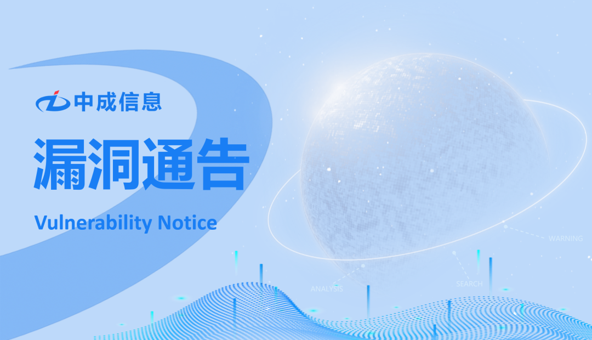
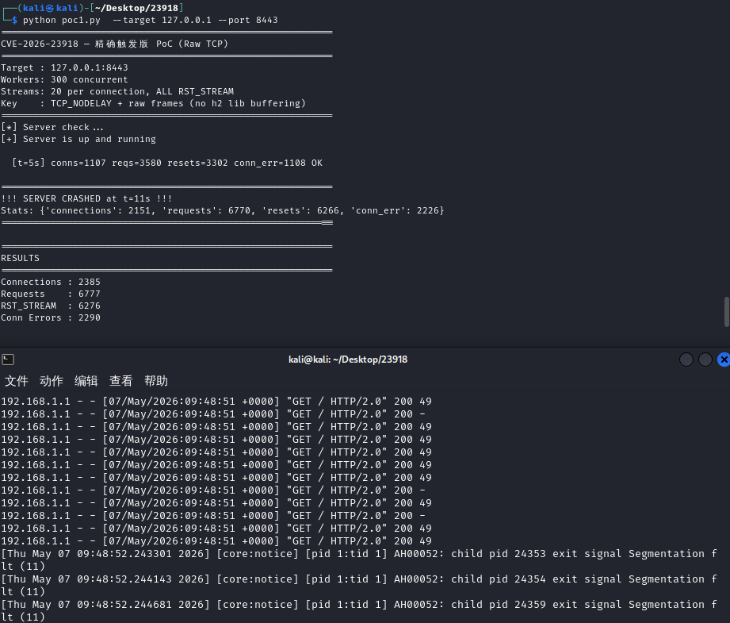

# 【已复现】漏洞通告 | Apache HTTP Server 双重释放漏洞(CVE-2026-23918)

<!-- vulwiki-editorial:start -->
## 校订与适用边界

- 适用前提：文列2.4.66且mod_http2启用/HTTP2帧可达；RCE依分配器/平台，非所有DoS均可RCE
- 证据范围：文字保留DoS与特定环境潜在RCE区别；已复现仅作者截图，没有帧序列/崩溃堆栈文本

### 尚未解决的证据缺口

以下限制仍适用于后文历史材料；相关版本、结果或修复结论不能据此视为已验证：

- CVSS8.8无向量及来源，mmap分配器Debian条件需要官方/研究原文核对
- 安全公告链接不是直接补丁下载；文称固定2.4.67需验证
- 大段HTML样式与公司介绍可精简，保留发布日期及研究者声明边界

### 操作风险与资料使用

- 含资源消耗、延时或崩溃验证：可能影响服务可用性；限制请求次数、并发与超时，保留无攻击负载的对照结果。

本页为文本校订，未执行代码、PoC 或目标请求；原图仅保留引用，未据此确认复现成功。
<!-- vulwiki-editorial:end -->

## 技术正文与历史材料

安全实验室
                    安全实验室  中成信息   2026-05-08 00:41  
  
  
  
**1**  
  
  
**漏洞描述**  
  
Apache HTTP Server 双重释放漏洞（CVE-2026-23918）是Apache HTTP 2.4.66版本中的高危漏洞，由mod_http2模块处理HTTP/2帧时存在内存管理缺陷导致。攻击者可通过构造特定HTTP/2帧序列远程触发双重释放错误，造成服务器拒绝服务（DoS），特定条件下（如使用mmap分配器的Debian系统）可能进一步执行远程代码（RCE）。  
  
2  
  
  
**影响范围**  
  
Apache HTTP Server 2.4.66  
   
  
3  
  
  
**漏洞详情**  
<table><tbody><tr><td colspan="4" data-colwidth="143,144,143,143"><section style="text-align: center;">漏洞详情</section></td></tr><tr><td data-colwidth="143"><section style="text-align: center;">漏洞名称</section></td><td colspan="3" data-colwidth="144,143,143"><section style="text-align: center;">Apache HTTP Server 双重释放漏洞</section></td></tr><tr><td data-colwidth="143"><section style="text-align: center;">漏洞编号</section></td><td colspan="3" data-colwidth="144,143,143"><section style="text-align: center;">CVE-2026-23918</section></td></tr><tr><td data-colwidth="143"><section style="text-align: center;">评级</section></td><td data-colwidth="144"><section style="text-align: center;">高危</section></td><td data-colwidth="143"><section style="text-align: center;">CVSS 3.1分数</section></td><td data-colwidth="143"><section style="text-align: center;">8.8</section></td></tr><tr><td data-colwidth="143"><section style="text-align: center;">威胁类型</section></td><td data-colwidth="144"><section style="text-align: center;">拒绝服务、代码执行</section></td><td data-colwidth="143"><section style="text-align: center;">利用情况</section></td><td data-colwidth="143"><section style="text-align: center;">更可能被利用</section></td></tr><tr><td data-colwidth="143"><section style="text-align: center;">公开状态</section></td><td data-colwidth="144"><section style="text-align: center;">POC、EXP已公开</section></td><td data-colwidth="143"><section style="text-align: center;">在野利用</section></td><td data-colwidth="143"><section style="text-align: center;">未发现</section></td></tr><tr><td colspan="4" data-colwidth="143,144,143,143"><section>危害描述：攻击者可通过发送特制的HTTP/2帧请求触发服务崩溃（拒绝服务），在特定系统环境下甚至可实现远程代码执行并接管服务器。</section></td></tr><tr><td colspan="4" data-colwidth="143,144,143,143"><section>参考链接: https://httpd.apache.org/security/vulnerabilities_24.html</section></td></tr></tbody></table>  
  
4  
  
  
**漏洞复现**  
  
中成信息安全实验室已复现Apache HTTP Server 双重释放漏  
洞，验证如下。  
  
  
  
5  
  
  
**修复建议**  
  
官方已发布安全补丁，请及时更新至最新版本：  
  
Apache HTTP Server >= 2.4.67  
  
下载地址：  
  
https://httpd.apache.org/security/vulnerabilities_24.html  
  
  
  
  
  
  
  
  
关于我们  
  
  
漳州中成信息科技有限公司是一家专注于网络安全实战防护的创新型服务提供商。我们深刻理解网络安全的核心在于攻防对抗的持续较量，并以此独特视角为基石，致力于为客户构建动态、主动、智能化的纵深防御体系。区别于传统的被动防御，我们坚信“未知攻，焉知防”。公司汇聚了顶尖的渗透测试专家（红队）、应急处置精英（蓝队）及经验丰富的安全服务工程师，形成了一支具备完整攻防对抗能力的专业团队。我们的渗透测试团队模拟真实攻击者的思维与手段，深入挖掘系统、应用及网络中的深层次漏洞与风险点；应急处置团队则能在安全事件发生时快速响应、精准定位、有效遏制损失并溯源根因；安服工程师团队则致力于将攻防对抗中获得的宝贵经验转化为常态化的安全策略、加固措施与运营流程。  
  
  
  
  
  
  
**点击名片**  
  
  
  
**关注我们**  
  
  
  
**扫描官网二维码**  
  
  
**了解更多**  
  
  
  
  
  
  
  
  
  
  
  

---

> 来源：gelusus/wxvl（微信公众号漏洞文章自动归档，原文见文首链接）
