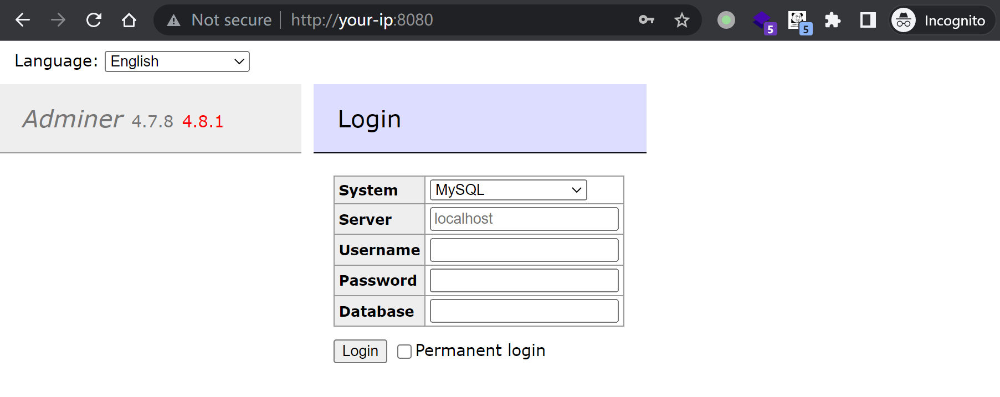
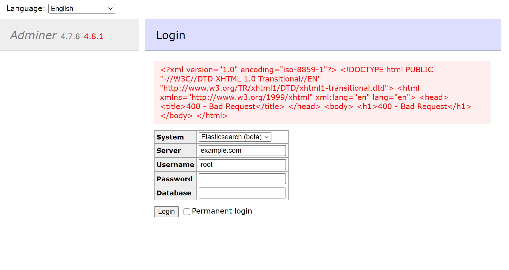

# Adminer ElasticSearch 和 ClickHouse 错误页面SSRF漏洞 CVE-2021-21311

<!-- vulwiki-editorial:start -->
## 校订与适用边界

受影响入口属于 Adminer 的数据库驱动错误页面处理。Elasticsearch 和 ClickHouse 在这里是连接的数据库类型，不是该 CVE 的受影响产品主体。

- 适用前提：Adminer登录页的Elasticsearch/ClickHouse驱动连接攻击者控制地址，错误响应暴露
- 证据范围：产品为Adminer，Elasticsearch仅连接驱动，目录错误。与数据库/Adminer同CVE文章交叉关联再择内容合并。

### 本次正文校订

- 按实际内容修正 1 处代码围栏语言标记，保留其中方法与请求内容。

### 尚未解决的证据缺口

以下限制仍适用于后文历史材料；相关版本、结果或修复结论不能据此视为已验证：

- 只有example.com外部请求/400返回，未展示内部目标或完整重定向链边界
- 缺修复4.8.0与限制连接目的地的具体说明
- 4.0–4.7.9版本需区分驱动引入时间，原始公告待复核

本页为文本校订，未执行代码、PoC 或目标请求；原图仅保留引用，未据此确认复现成功。
<!-- vulwiki-editorial:end -->

## 技术正文与历史材料

## 漏洞描述

Adminer是一个PHP编写的开源数据库管理工具，支持MySQL、MariaDB、PostgreSQL、SQLite、MS SQL、Oracle、Elasticsearch、MongoDB等数据库。

在其4.0.0到4.7.9版本之间，连接 ElasticSearch 和 ClickHouse 数据库时存在一处服务端请求伪造漏洞（SSRF）。

参考连接：

- https://github.com/vrana/adminer/security/advisories/GHSA-x5r2-hj5c-8jx6
- https://github.com/vrana/adminer/files/5957311/Adminer.SSRF.pdf
- https://github.com/projectdiscovery/nuclei-templates/blob/main/http/cves/2021/CVE-2021-21311.yaml

## 漏洞环境

Vulhub 执行如下命令启动一个安装了Adminer 4.7.8的PHP服务：

```shell
docker compose up -d
```

服务启动后，在`http://your-ip:8080`即可查看到Adminer的登录页面。




## 漏洞复现

在Adminer登录页面，选择ElasticSearch作为系统目标，并在server字段填写`example.com`，点击登录即可看到`example.com`返回的400错误页面展示在页面中：




---

> 来源：Threekiii/Vulnerability-Wiki（https://github.com/Threekiii/Vulnerability-Wiki）
