# 首发【1day】GeoServer 任意文件上传详解（附 poc）

<!-- vulwiki-editorial:start -->
## 校订与适用边界

- 适用前提：管理员或具相应REST上传权限；StructuredGridCoverage2DReader类型coverage store，绝对路径触发ResourceAdaptor分支；RCE还需可写可执行Web目录
- 证据范围：详细解释FileSystemResource与ResourceAdaptor验证差异有独立价值；标题附PoC但作者明确最后不公布，需标部分机制分析非完整复现。

### 本次正文校订

- 按实际内容修正 3 处代码围栏语言标记，保留其中方法与请求内容。

### 尚未解决的证据缺口

以下限制仍适用于后文历史材料；相关版本、结果或修复结论不能据此视为已验证：

- 标题未披露认证后；示例admin:geoserver是测试凭据不应作默认普适前提
- 两个curlURL均未闭合引号、首个截在?file，且展示失败请求而非完整成功PoC
- 2.22.x浮动镜像不能固定漏洞实验版本，应pin tag/digest
- 关键成功配置/数据样例/源码多在图片，未视检
- 缺修复章节与上传恢复，付费圈广告占后部

本页为文本校订，未执行代码、PoC 或目标请求；原图仅保留引用，未据此确认复现成功。
<!-- vulwiki-editorial:end -->

## 技术正文与历史材料

<meta name="referrer" content="no-referrer"/>

> 本文由 [简悦 SimpRead](http://ksria.com/simpread/) 转码， 原文地址 [mp.weixin.qq.com](https://mp.weixin.qq.com/s/tLXlemWT1Suius0necplEw)

_**免责声明：**_

_本公众号致力于安全研究和红队攻防技术分享等内容，本文中所有涉及的内容均不针对任何厂商或个人，同时由于传播、利用本公众号所发布的技术或工具造成的任何直接或者间接的后果及损失，均由使用者本人承担。请遵守中华人民共和国相关法律法规，切勿利用本公众号发布的技术或工具从事违法犯罪活动。最后，文中提及的图文若无意间导致了侵权问题，请在公众号后台私信联系作者，进行删除操作。_

**0x01 前言**

前几天各个公众号发了一堆 GeoServer 的新漏洞威胁公告，也就是这个 CVE-2023-51444，碰巧之前 hvv 也碰到过 N 多 GeoServer 系统，但是一般都是弱口令或者其他敏感信息之类的拿 shell 的 poc 不多，google 一搜真有 poc，相信大家都搜到了，就是 github 的这个东西

https://github.com/geoserver/geoserver/security/advisories/GHSA-9v5q-2gwq-q9hq

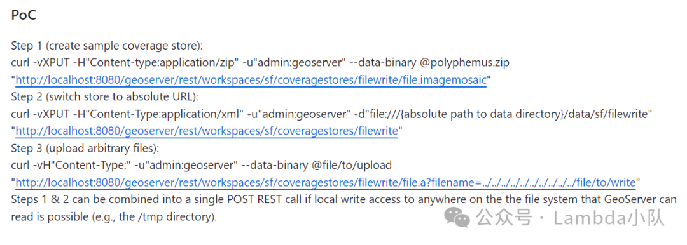

本来以为当个伸手党随意复现一下得了，没想到这给的什么鬼 poc，能复现才怪。翻了半天安全厂商的复现公告，给的一张 POC 截图还打了厚码，捏马的，这我能忍吗，自己动手吧。

**0x02 环境搭建**

本身这个系统的专业性比较强属于专业的地图管理之类的，具体应用场景咱也不用搞懂，由于本次受影响的版本如下

GeoServer < 2.23.4

2.24.0 <= GeoServer < 2.24.1

随意搜了一下，官网正好有一个符合影响范围的 docker 版本 2.22.X，链接如下  

https://docs.geoserver.org/2.22.x/en/user/installation/docker.html

直接拿来用

```shell
docker pull docker.osgeo.org/geoserver:2.22.x
docker run --mount type=bind,src=/MY/DATADIRECTORY,target=/opt/geoserver_data -it -p8080:8080 docker.osgeo.org/geoserver:2.22.x

```

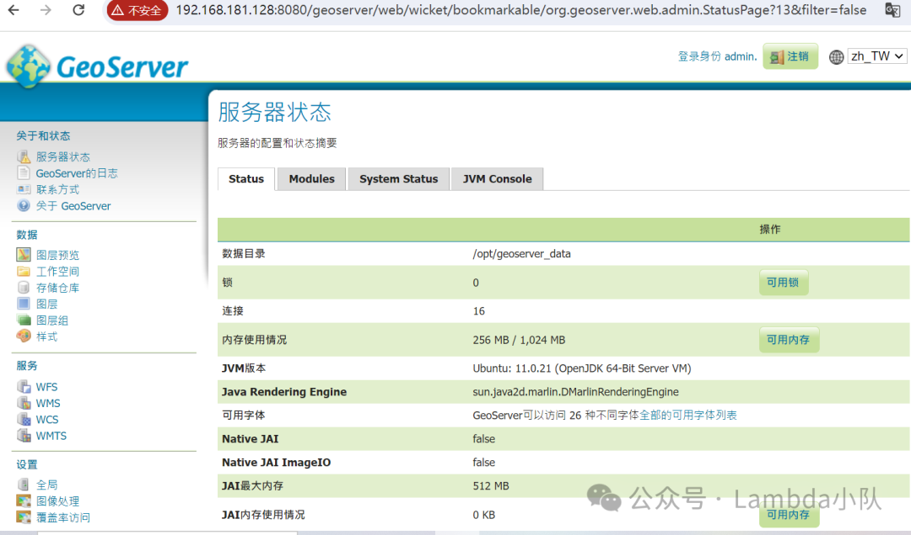

**0x03 审计过程**

首先跟了一下 github 的补丁提交记录看看漏洞触发点在哪里，乍一看非常的 easy 嘛，不就是文件处理函数没有对路径进行校验和过滤嘛。  

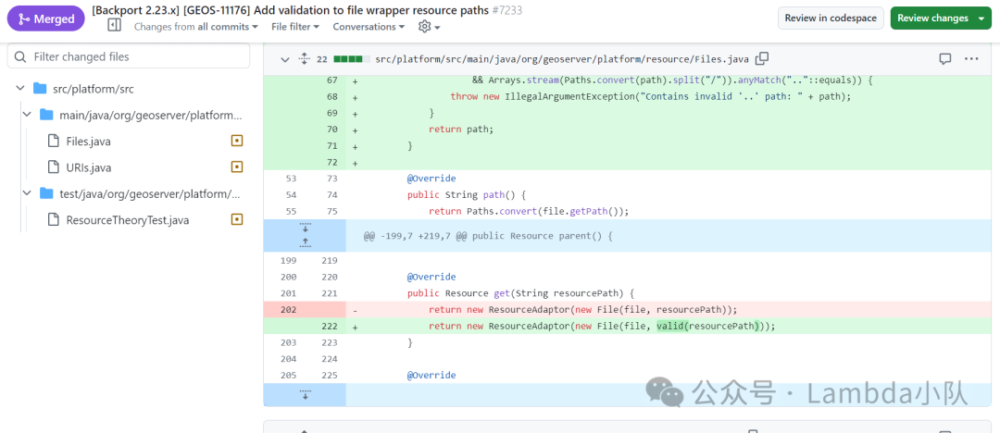

根据官方给的 poc 提示，该漏洞最后一步应该是发了一个二进制的 post 包触发的

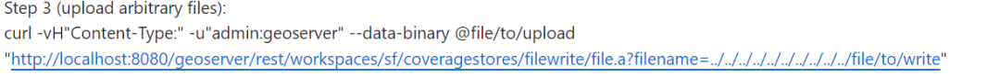

回到代码中来，如下图，代码中的该接口与 poc 的 URL 接近

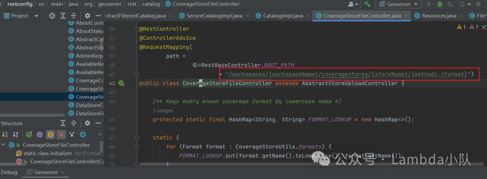

负责处理该接口的 controller 是下面的函数

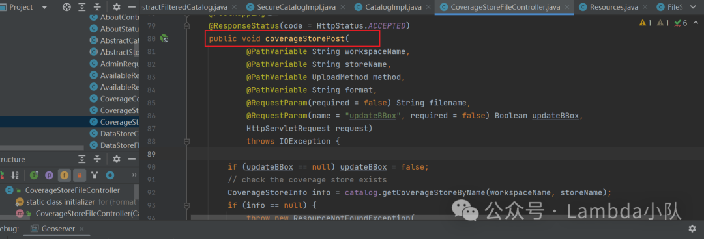

既然找到了接口函数，接下来直接构造一个请求即可了

```shell
curl -v -H"Content-Type:" -u "admin:geoserver" --data-binary @1.zip "http://localhost:8080/geoserver/rest/workspaces/xxx/coveragestores/xtest/file.a?file

```

然而并没有这么简单，碰到了第一个坑，后台日志报错，且服务器响应 405

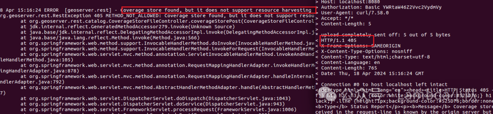

代码中对应的异常在这里，根据上下文发现，其实提交的 workspaceName 和 storeName 他们必须能创建的是一个 StructuredGridCoverage2DReader 类型的实体。

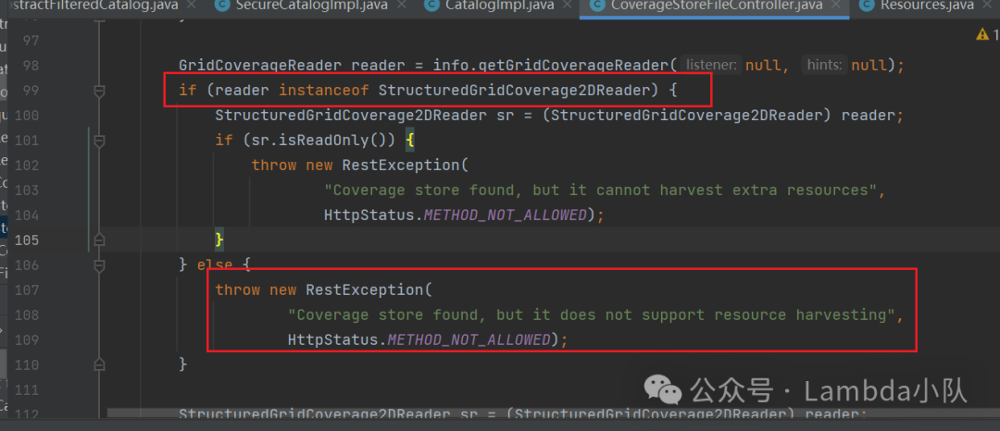

好了，到了神坑的第一步了，对于这种专业系统，到底什么样的数据格式才能符合这个要求。抓耳挠腮的查阅了大半天资料，终于在官网接口找到了下面这句话。

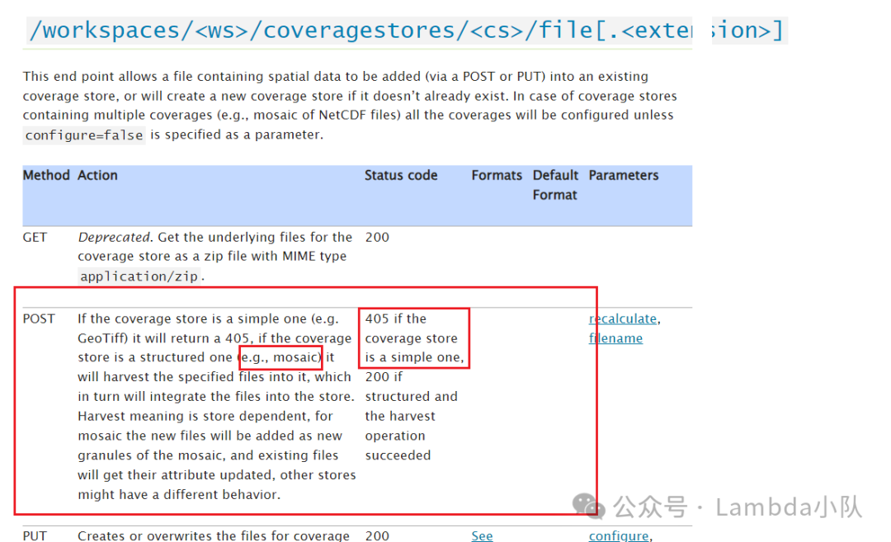

也就是说，如果想 post 成功，所谓的 “coverage store is a structured ”，注意后面的 e.g 提到了一个类型 “mosaic”，不管他是什么找一个这个类型的提交试试。在翻了半天 Demo 后，终于找到一个符合要求的。接下来碰到第二个神坑。

用下面命令发送上传请求后  

```shell
curl -v -XPOST -H "Content-type: multipart/form-data" -F "file=@2.jsp" -u "admin:geoserver" "http://localhost:8080/geoserver/rest/workspaces/xxx/coveragestores/xtest/file.a?filename=../../../2.jsp

```

后台报了如下错误

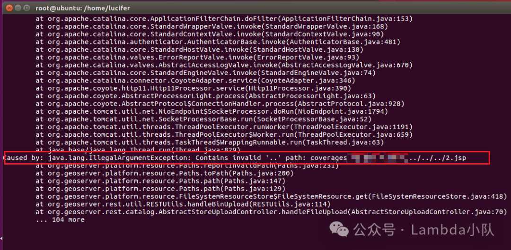

代码中原来是有跨目录路径检查的

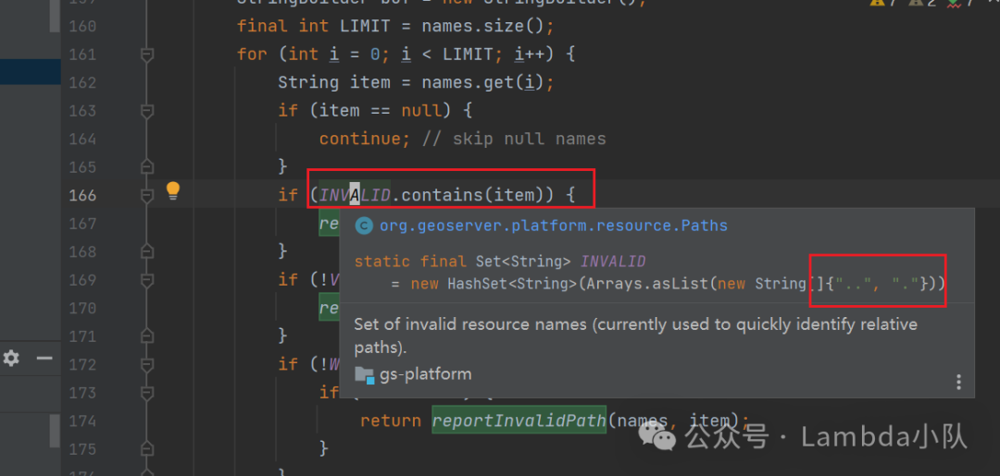

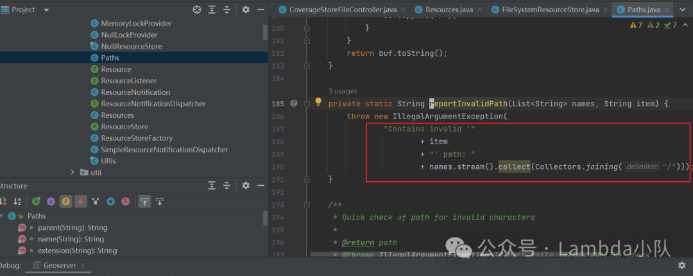

这一度让我认为该跨路径的 poc 不是通杀 poc，仅在部分低版本中可以使用，既然有路径检查怎么可能上传成功呢，或者是有其他绕过该路径检查的方法。

本来想偷懒不开调试模式，直接硬怼能把 poc 怼出来，但是卡在这里半天还是无奈开调试模式审查代码。本身偷懒的原因也是 docker 容器中启动 java 调试是非常麻烦的事情，这里不赘述（想学习方法的同学，我会放一个详细的过程到小密圈关于 docker 启动 java 调试）  

前置代码流程很简单，直接讲重点，其实关键点在于文件 org/geoserver/rest/util/RESTUtils.java 中对于 directory 的处理，如果 directory 最后处理完的类型是 FileSystemResource

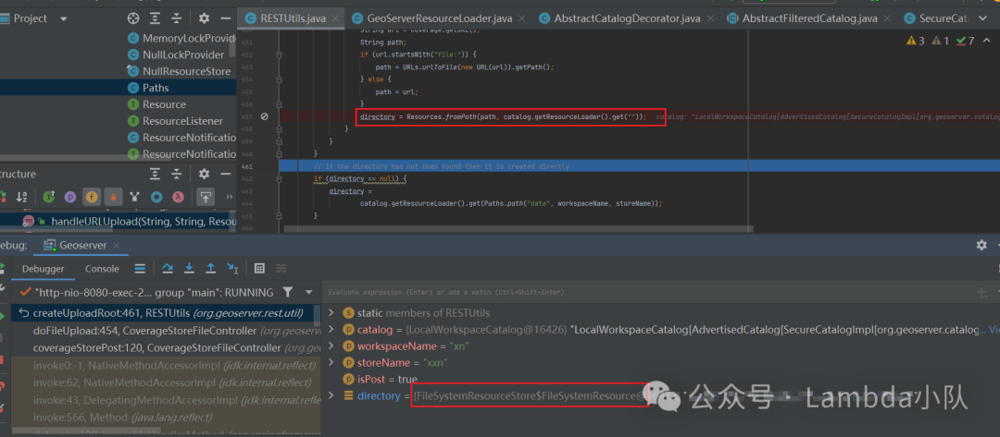

那么在 handleBinUpload 函数中处理 directory.get 调用即是触发 FileSystemResource 中的 get 方法，如下图，这将直接导致会调用 Paths.valid 检查，即如果想通过../ 进行目录穿越就会失败。

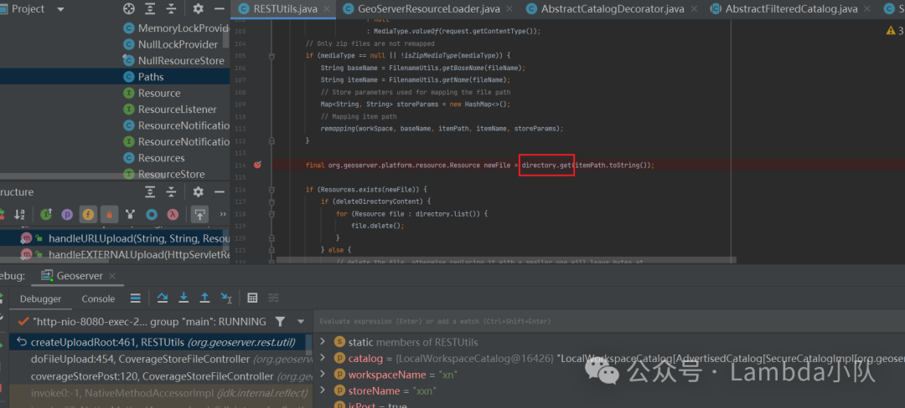

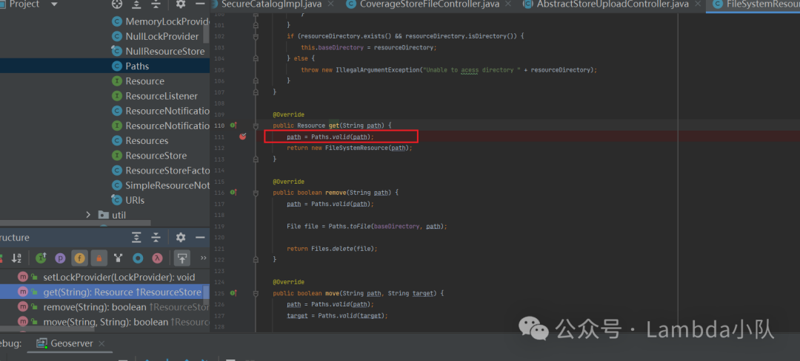

那么有没有办法绕过呢，答案当然是有的，关键在于计算上传的 root 路径函数 createUploadRoot 时，path 参数非常重要

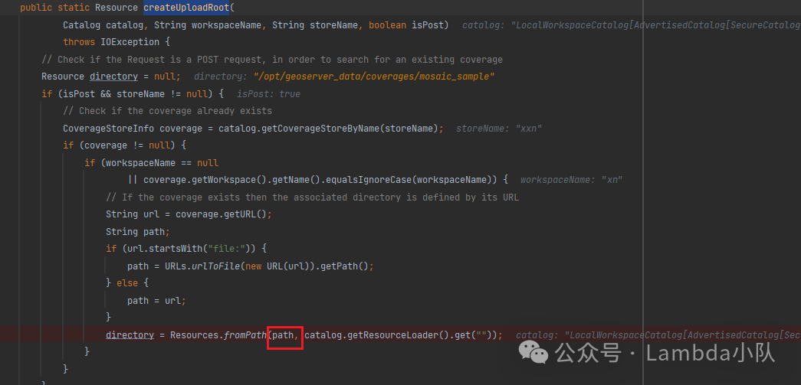

如果 path 是一个绝对路径时，那么 return 的将不是一个 FileSystemResource 类型的 Directory，而是一个 ResourceAdaptor，而该类型的 get 函数将不再有路径检查，故可以直接跨目录上传文件。

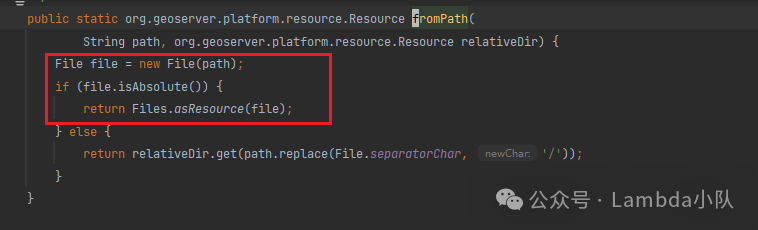

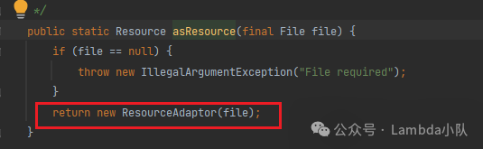

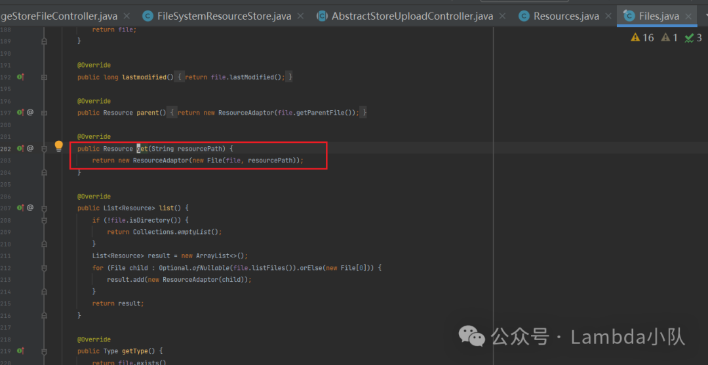

最后调用栈

```
handleBinUpload:131, RESTUtils (org.geoserver.rest.util)
handleFileUpload:70, AbstractStoreUploadController (org.geoserver.rest.catalog)
doFileUpload:457, CoverageStoreFileController (org.geoserver.rest.catalog)
coverageStorePost:120, CoverageStoreFileController (org.geoserver.rest.catalog)

```

**0x04 复现**

我知道有些伸手党肯定直接滑到这里了，介于该 poc 还没完全公开，我也不直接发 poc，有兴趣的同学看了上面的分析肯定能复现出来的。更详细的过程和 poc 发在小密圈，小白和伸手党进圈查看吧。

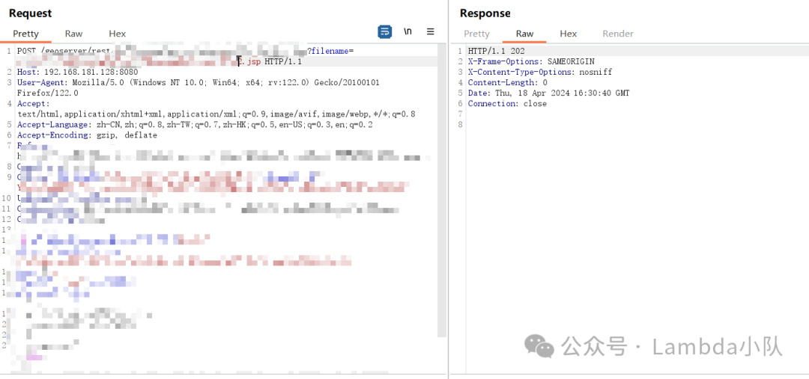

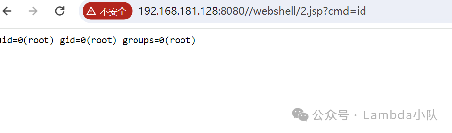

**0x05 总结**

这种专业的系统审计还是有些费劲，因为某些代码的业务逻辑并非纯 Java 技术所能理解的，例如上述的 StructuredGridCoverage2DReader 问题，查阅了很久的资料，有一定的学习成本。然后就是本身调用栈非常简单，但是在代码阅读水平差的情况下，不开调试模式真的看不懂 trick 在哪里。最后希望复现出来的小伙伴也不要乱打哦。  

**0x06 加入我们  
**

  

后台回复 “加群” 或“小助手”，或扫描下方二维码加入我们的付费圈子，一起进步吧


---

> 来源：MrWQ/vulnerability-paper（https://github.com/MrWQ/vulnerability-paper）
