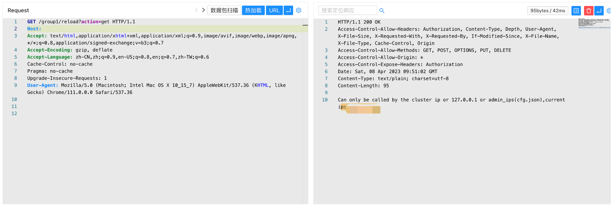
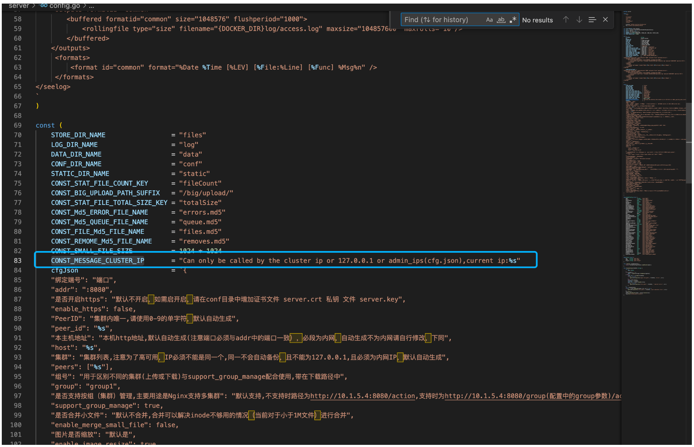
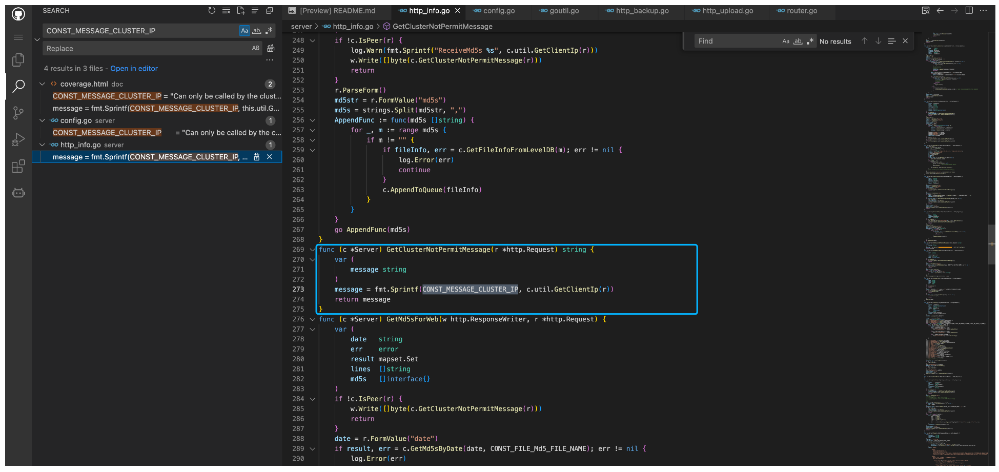
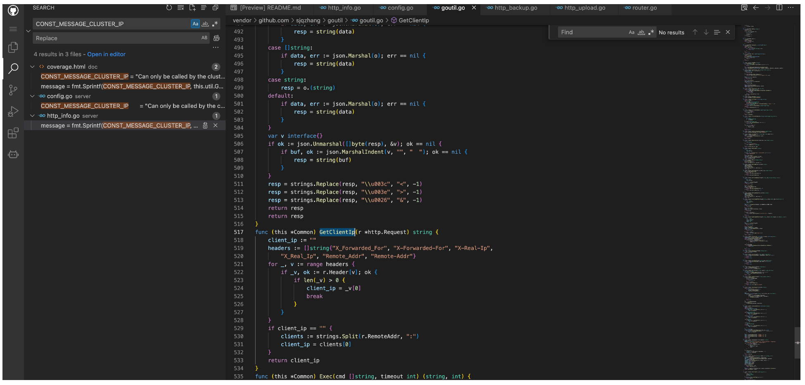
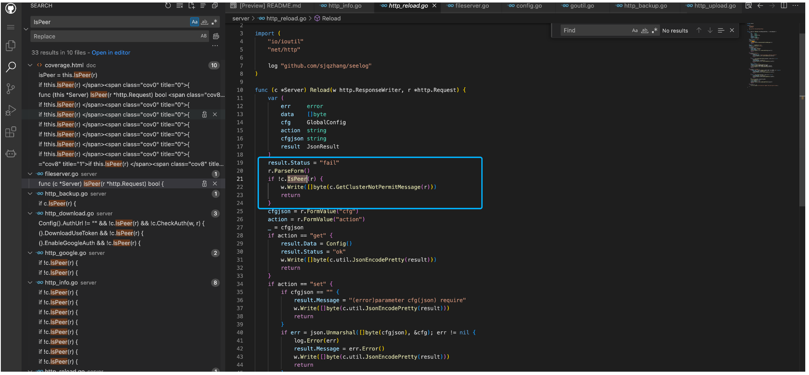
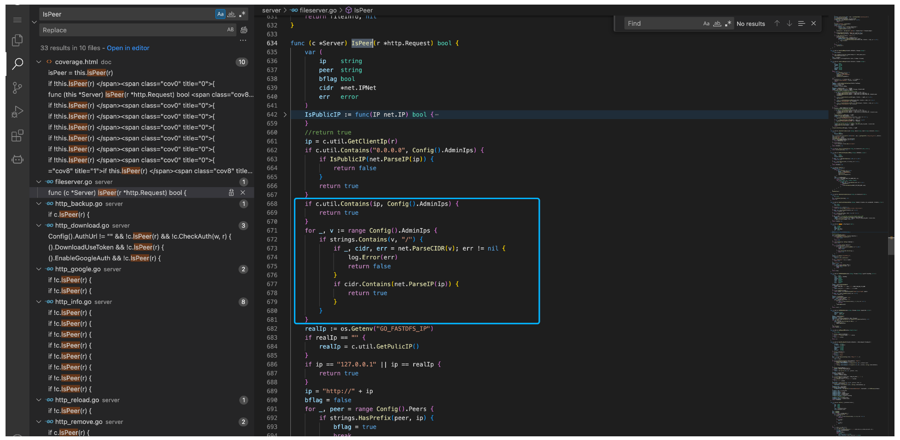
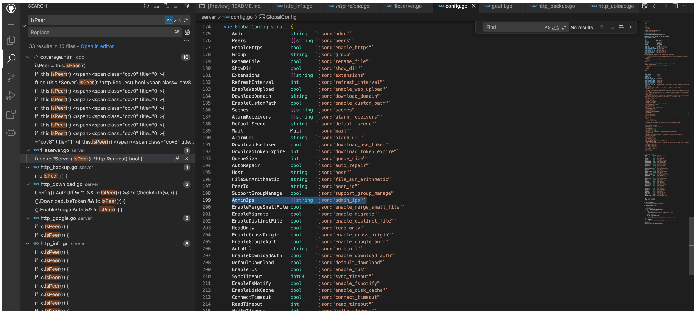
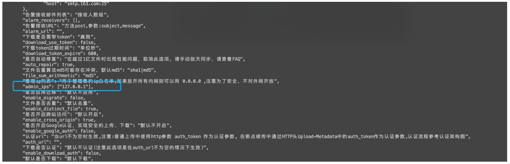
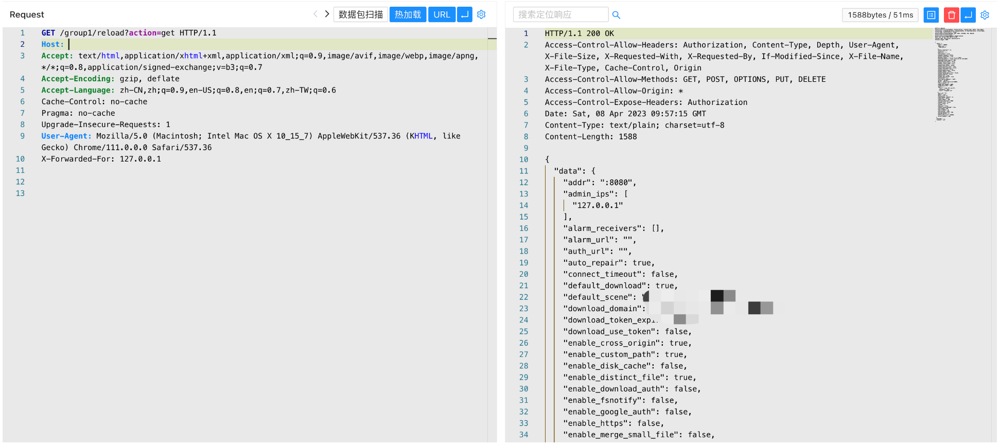

# Go-fastdfs GetClientIp 未授权访问漏洞

<!-- vulwiki-editorial:start -->
## 校订与适用边界

- 适用前提：管理路由可达且代理未可信重写XFF；目标AdminIps与伪造值匹配
- 证据范围：有正常拒绝和伪造头后读取配置的对照结构；修改配置属于推断扩展，本文实际展示action=get读取。

### 尚未解决的证据缺口

以下限制仍适用于后文历史材料；相关版本、结果或修复结论不能据此视为已验证：

- version字段仅产品名，缺测试版本/源码tag/修复
- GetClientIp/IsPeer源码全部截图未视检
- 示例group1是部署组名不是固定路由；默认127.0.0.1需版本证据
- 无原始漏洞出处或修复建议

本页为文本校订，未执行代码、PoC 或目标请求；原图仅保留引用，未据此确认复现成功。
<!-- vulwiki-editorial:end -->

## 技术正文与历史材料

## 漏洞描述

Go-fastdfs GetClientIp方法存在XFF头绕过漏洞，攻击者通过漏洞可以未授权调用接口，获取配置文件等敏感信息

## 漏洞影响

```
Go-fastdfs
```

## 网络测绘

```
"go-fastdfs"
```

## 漏洞复现

主页面


调用读取配置接口，返回 ip 不允许访问

```
/group1/reload?action=get
```



追踪错误信息代码





跟一下 GetClientIp方法，这里会从 X-Forwarded-For 等参数获取值



回到调用的起点，验证方法为调用 IsPeer 参数





这里主要是验证获取到的值是否为配置中的 AdminIps



在配置文件 cfg.json 中 admin_ips 默认为 127.0.0.1 (可被爆破)



所以通过设置 X-Forwarded-For 就可以绕过接口调用限制，执行修改配置文件等操作，验证POC

```
/group1/reload?action=get

X-Forwarded-For: 127.0.0.1
```



---

> 来源：Threekiii/Vulnerability-Wiki（https://github.com/Threekiii/Vulnerability-Wiki）
